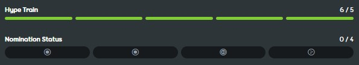

---
tags:
  - qualification
  - nomination
  - nominations
  - nom
  - ranking
  - ranked
---

# Beatmap ranking procedure

*See also: [Rank (disambiguation)](/wiki/Disambiguation/Rank) and [Ranking queue](Ranking_queue)*
*For beatmap categories mentioned below, see: [Beatmap Category](/wiki/Beatmap/Category)*

[Beatmaps](/wiki/Beatmap) can be promoted to the community by following the beatmap ranking procedure and entering the [Ranked](/wiki/Beatmap/Category#ranked) category.

## Feedback

A beatmap's creator can mark their submissions as `Work in Progress` or `Pending`. Beatmaps in both of these categories are intended to receive feedback from the osu! community.

[Modding](/wiki/Modding) is the process of receiving constructive criticism on a beatmap and is beneficial to improving its quality. Users ordinarily post feedback on a beatmap's [discussion page](/wiki/Beatmap_discussion) or discuss issues with the beatmap's creator directly.

Newer beatmappers usually need extensive modding to create beatmaps that meet the Ranked category's quality standards, and often they're required to recreate their beatmaps from scratch.

Before being nominated for ranking, a beatmap needs to receive [hype](/wiki/Beatmap/Hype) posts from at least five different users.

## Nominations {id=nominations}

::: Infobox

:::

A **nomination** is a vote of approval, which indicates a beatmap's readiness to become [ranked](/wiki/Beatmap/Category#ranked). It is given to completed beatmaps of sufficient quality, as judged by the nominating user. As a minimum requirement, these beatmaps must follow the [ranking criteria](/wiki/Ranking_criteria) and have 5 or more [hypes](/wiki/Beatmap/Hype).

Nominations are given by [Beatmap Nominators](/wiki/People/Beatmap_Nominators) (*BN*), a group of experienced modders. Members of the [Nomination Assessment Team](/wiki/People/Nomination_Assessment_Team) (*NAT*) may also nominate beatmaps, however that is not their primary role.

It is recommended to receive mods before requesting nominations from BNs, however five hypes are the only pre-requisite.

## Qualification

Qualification is a process where beatmaps that receive enough nominations are moved to the [Qualified](/wiki/Beatmap/Category#qualified) beatmap category. Beatmaps with only one primary [game mode](/wiki/Game_mode) among all [difficulties](/wiki/Beatmap#difficulty) only need two nominations, while hybrid sets[^hybrid-sets] need two nominations for the [main game mode](#main-mode) and one for each subsidiary one.

Qualified beatmaps receive wider exposure to the osu! community as a final **quality assurance** step before becoming permanently [Ranked](/wiki/Beatmap/Category#ranked). This is the most common stage for beatmaps to receive wide support, feedback, and undergo improvements if issues are found. During this period:

- Community members can test or mod a beatmap, and then provide feedback and report issues[^report-correctly] through the beatmap's discussion page.
- The BN and NAT teams are automatically notified of all suggestions and problems. Users who have enabled notification for new problems on qualified beatmaps will also be notified.
- Suggestions and problems can be discussed and resolved collaboratively between the community and the beatmap's creator.
- Qualified beatmaps cannot be directly updated by its creators.

When issues are identified that require changes, the beatmap may undergo a [nomination reset](#nomination-resets), allowing the creator to address feedback while maintaining the integrity of the ranking procedure.

### Determining the main game mode {id=main-mode}

For hybrid sets[^hybrid-sets], the main game mode is determined by the following order of priority:

1. The game mode containing the most difficulties in the beatmapset.
2. If two or more modes have the same amount of difficulties, the main game mode is instead the game mode which the beatmapset host mapped the most difficulties of.
3. If the previous two rules do not produce a result, the main game mode will be the one that gets nominated first.

### Nomination resets

Nominations can be reset when a beatmap is updated by its creator, or when a member of the BN or NAT finds a problem in a nominated beatmap. They can also be reset by members of the [Global Moderation Team](/wiki/People/Global_Moderation_Team) for moderation purposes. If the nomination is reset while a beatmap is Qualified, it will be *disqualified* (commonly abbreviated as *DQ*) and removed from the [ranking queue](Ranking_queue) back to Pending. All nominations from the beatmap will also be removed. Only BN, NAT, and GMT members are allowed to disqualify Qualified beatmaps.

Nomination resets allow the host to make changes to the beatmap before requesting a re-nomination. It also helps to ensure that modders, BNs, and NAT members check over the most up-to-date version of a beatmap before it enters the [ranking queue](Ranking_queue).

### Vetoes

A [beatmap veto](/wiki/People/Beatmap_Nominators/Beatmap_Veto) allows a BN or NAT member to withhold a beatmap from the [Ranked](/wiki/Beatmap/Category#ranked) section if they feel there are significant issues with its quality. It allows seeking further discussion or clarification over any kind of subjective issues which need to be addressed before the map can proceed with [qualification](#qualification).

## Rank

When a beatmap stays in Qualified for at least 7 days without any open [problems or suggestions](/wiki/Modding#types-of-mod-posts), the [ranking queue](Ranking_queue) is able to move it to [Ranked](/wiki/Beatmap/Category#ranked). If it has been re-qualified after a disqualification, the time for it to move from Qualified to Ranked may be [recalculated](Ranking_queue#dq-and-re-qualification). Ranked beatmaps have [score leaderboards](/wiki/Ranking) and reward players with [performance points](/wiki/Performance_points).

Ranked beatmaps are only unranked under exceptional circumstances when issues are found shortly after they reach Ranked status.

## Notes

[^hybrid-sets]: Hybrid sets are beatmaps with difficulties across multiple game modes.
[^report-correctly]: About how to report issues correctly, see: [Behaviour and conduct](/wiki/Rules/Code_of_conduct_for_modding_and_mapping#behaviour-and-conduct) along with [Beatmap discussion - Submission field](/wiki/Beatmap_discussion#submission-field)
