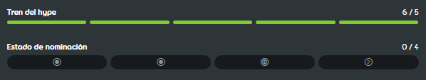

---
tags:
  - qualification
  - nomination
  - nominations
  - nom
  - ranking
  - ranked
  - calificación
  - nominación
  - nominaciones
  - clasificación
  - clasificado
---

# Procedimiento de clasificación de beatmaps

*Véase también: [Rango (desambiguación)](/wiki/Disambiguation/Rank) y [Cola de clasificación de beatmaps](Ranking_queue)*
*Para las categorías de beatmaps mencionadas a continuación, véase: [Categorías de beatmaps](/wiki/Beatmap/Category)*

Los [beatmaps](/wiki/Beatmap) se pueden promocionar en la comunidad siguiendo el procedimiento de clasificación de beatmaps e ingresando a la categoría [clasificados](/wiki/Beatmap/Category#ranked).

## Comentarios

El creador de un beatmap puede marcar sus envíos como `Trabajo en progreso` o `Pendientes`. Los beatmaps en estas dos categorías están destinados a recibir comentarios de la comunidad de osu!.

El [modding](/wiki/Modding) es el proceso de recibir críticas constructivas en un beatmap y mejorar su calidad. Los usuarios suelen publicar sus comentarios en la [página de discusión](/wiki/Beatmap_discussion) de un beatmap o chatear directamente con el creador del beatmap.

Los nuevos creadores de beatmaps suelen necesitar una gran cantidad de modding para crear beatmaps que cumplan con los estándares de calidad de la categoría clasificados y, a menudo, se les pide que recreen sus beatmaps desde cero.

Antes de enviarse para la clasificación, los beatmaps deben recibir mensajes de [hype](/wiki/Beatmap/Hype) de al menos cinco usuarios diferentes.

## Nominaciones {id=nominations}

::: Infobox

:::

Una **nominación** es un voto de aprobación, lo que indica que un beatmap está listo para [clasificarse](/wiki/Beatmap/Category#ranked). Se otorga a los beatmaps completos de calidad suficiente, a juicio del usuario nominador. Como requisito mínimo, estos beatmaps deben seguir los [criterios de clasificación](/wiki/Ranking_criteria) y tener 5 o más [hypes](/wiki/Beatmap/Hype).

Las nominaciones las dan los [Beatmap Nominators](/wiki/People/Beatmap_Nominators) (*BN*), un grupo de modders experimentados. Los miembros del [Nomination Assessment Team](/wiki/People/Nomination_Assessment_Team) (*NAT*) también pueden nominar beatmaps, pero esta no es su función principal.

Se recomienda recibir mods antes de solicitar nominaciones de BN, pero el único requisito previo son cinco hypes.

## Calificación

La calificación es un proceso mediante el cual los beatmaps que reciben suficientes nominaciones se trasladan a la categoría [calificados](/wiki/Beatmap/Category#qualified). Los beatmaps con un solo [modo de juego](/wiki/Game_mode) principal entre todas las [dificultades](/wiki/Beatmap#dificultad) solo necesitan dos nominaciones, mientras que los beatmaps híbridos[^hybrid-sets] necesitan dos nominaciones para el [modo de juego principal](#main-mode) y una para cada modo secundario.

Los beatmaps calificados reciben una mayor exposición ante la comunidad de osu! como paso final del **control de calidad** antes de pasar a ser [clasificados](/wiki/Beatmap/Category#ranked) de forma permanente. Esta es la etapa más habitual en la que los beatmaps reciben un amplio seguimiento, opiniones y mejoras si se detectan problemas. Durante este periodo:

- Los miembros de la comunidad pueden probar o modear un beatmap, y luego proporcionar su opinión e informar de problemas[^report-correctly] a través de la página de discusión del beatmap.
- Los BN y el NAT reciben automáticamente notificaciones de todas las sugerencias y problemas. Los usuarios que hayan habilitado las notificaciones para nuevos problemas en los beatmaps calificados también recibirán una notificación.
- Las sugerencias y los problemas pueden discutirse y resolverse de forma colaborativa entre la comunidad y el creador del beatmap.
- Los beatmaps calificados no pueden ser actualizados directamente por sus creadores.

Cuando se identifican problemas que requieren cambios, el beatmap puede someterse a un [restablecimiento de nominaciones](#restablecimiento-de-nominaciones), lo que le permite al creador atender los comentarios y mantener la integridad del procedimiento de clasificación.

### Determinar el modo de juego principal {id=main-mode}

En el caso de los beatmaps híbridos[^hybrid-sets], el modo de juego principal se determina según el siguiente orden de prioridad:

1. El modo de juego que contiene más dificultades en el beatmap.
2. Si dos o más modos tienen la misma cantidad de dificultades, el modo de juego principal es aquel en el que el anfitrión del beatmap ha mapeado la mayor cantidad de dificultades.
3. Si las dos reglas anteriores no producen ningún resultado, el modo de juego principal será el primero que se haya nominado.

### Restablecimiento de nominaciones

Las nominaciones pueden restablecerse cuando el creador actualiza su beatmap o cuando un miembro de los BN o el NAT detecta un problema en un beatmap nominado. También pueden ser restablecidas por los miembros del [Global Moderation Team](/wiki/People/Global_Moderation_Team) con fines de moderación. Si la nominación se restablece mientras un beatmap está calificado, será *descalificado* (comúnmente abreviado como *DQ*) y eliminado de la [cola de clasificación](Ranking_queue) para volver a la categoría pendiente. Todas las nominaciones del beatmap también serán eliminadas. Solo los miembros de los BN, NAT y GMT pueden descalificar beatmaps calificados.

Los restablecimientos de las nominaciones permiten al anfitrión realizar cambios en el beatmap antes de solicitar una nueva nominación. También ayuda a garantizar que los modders, BN y miembros del NAT comprueben la versión más actualizada de un beatmap antes de que entre en la [cola de clasificación](Ranking_queue).

### Vetos

Un [veto a un beatmap](/wiki/People/Beatmap_Nominators/Beatmap_Veto) es una medida que le permite a un miembro de los BN o NAT no dejar que un beatmap entre en la sección de [clasificados](/wiki/Beatmap/Category#ranked) si creen que tiene problemas importantes de calidad. Esto permite buscar una mayor discusión o aclaración sobre cualquier tipo de problemas subjetivos que deban abordarse antes de que el mapa pueda continuar con la [calificación](#calificación).

## Clasificación

Cuando un beatmap permanece calificado durante al menos 7 días sin ningún [problema o sugerencia](/wiki/Modding#tipos-de-publicaciones-de-mods) abierta, la [cola de clasificación](Ranking_queue) puede moverlo a la categoría [clasificado](/wiki/Beatmap/Category#ranked). Si ha sido recalificado tras una descalificación, el tiempo que tarda en pasar de la calificación a la clasificación puede [recalcularse](Ranking_queue#dq-and-re-qualification). Los beatmaps clasificados tienen [tablas de clasificación por puntuación](/wiki/Ranking) y recompensan a los jugadores con [puntos de rendimiento](/wiki/Performance_points).

Los beatmaps clasificados solo se desclasifican en circunstancias excepcionales, cuando se descubren problemas poco después de haber alcanzado el estado Clasificado.

## Notas

[^hybrid-sets]: Los beatmaps híbridos son beatmaps con dificultades en múltiples modos de juego.
[^report-correctly]: Para saber cómo reportar correctamente algún problema, véase: [Comportamiento y conducta](/wiki/Rules/Code_of_conduct_for_modding_and_mapping#comportamiento-y-conducta) junto con [Discusión de beatmaps - Campo de envío](/wiki/Beatmap_discussion#campo-de-envío)
