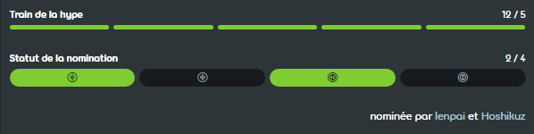

---
tags:
  - qualification
  - nomination
  - nominations
  - nom
  - ranking
  - ranked
  - classement
  - classé
  - classée
---

# Procédure de classement des beatmaps

*Voir aussi : [Rank (désambiguïsation)](/wiki/Disambiguation/Rank)*

Les [beatmaps](/wiki/Beatmap) peuvent être promues dans la communauté en suivant la procédure de classement des beatmaps et en entrant dans la catégorie [classée](/wiki/Beatmap/Category#ranked).

## Commentaires

Le créateur d'une beatmap peut marquer ses soumissions comme `Work in Progress` ou `En attente`. Les beatmaps de ces deux catégories sont destinées à recevoir les commentaires de la communauté d'osu!

Le [modding](/wiki/Modding) est le processus qui consiste à recevoir des critiques constructives sur une beatmap et qui permet d'en améliorer la qualité. Les utilisateurs publient généralement leurs commentaires sur la [page de discussion](/wiki/Beatmap_discussion) d'une beatmap ou discutent directement avec le créateur de la beatmap.

Les nouveaux beatmappers ont généralement besoin d'un important travail de modding pour créer des beatmaps qui répondent aux normes de qualité de la catégorie classée, et il leur est souvent demandé de recréer leurs beatmaps à partir de zéro.

Avant d'être proposées au classement, les beatmaps doivent recevoir des messages de [hype](/wiki/Beatmap/Hype) d'au moins cinq utilisateurs différents.

## Nominations {id=nominations}

::: Infobox

:::

Une **nomination** est un vote d'approbation, qui indique l'éligibilité d'une beatmap pour devenir [classée](/wiki/Beatmap/Category#ranked). Elle est attribuée aux beatmaps terminées, jugées de qualité suffisante selon le nominateur. Ces beatmaps doivent au moins suivre les [critères de classement](/wiki/Ranking_criteria) et avoir 5 [hypes](/wiki/Beatmap/Hype) ou plus.

Les nominations sont données par les [Beatmap Nominators](/wiki/People/Beatmap_Nominators) (*BN*), un groupe de moddeurs expérimentés. Les membres de la [Nomination Assessment Team](/wiki/People/Nomination_Assessment_Team) (*NAT*) peuvent également nominer des beatmaps, bien que ce ne soit pas leur rôle principal.

Il est recommandé de recevoir des mods avant de demander des nominations aux BN, mais cinq hypes sont le seul pré-requis.

## Qualification

Les beatmaps qui reçoivent deux nominations pour chaque mode de jeu disponible dans la beatmap sont déplacées dans la catégorie des beatmaps [qualifiées](/wiki/Beatmap/Category#qualified). Les beatmaps qualifiées disposent d'un classement des scores, mais ne récompensent pas les joueurs avec des [points de performance](/wiki/Performance_points). Lorsqu'une beatmap reste dans la catégorie qualifiée pendant au moins 7 jours, la [file d'attente de classement](Ranking_queue) peut la faire passer dans la catégorie [classée](#classée).

Cette catégorie de beatmap existe pour offrir aux beatmaps une plus grande exposition à la communauté d'osu! dans l'espoir de découvrir des problèmes potentiels. Les problèmes peuvent être signalés aux BN et aux membres de la NAT à partir de la page de discussion d'une beatmap. Contrairement aux beatmaps en attente, les beatmaps qualifiées ne peuvent pas être mises à jour par leurs créateurs. Les commentaires ne peuvent donc être appliqués qu'après avoir demandé une [réinitialisation de la nomination](#réinitialisation-de-la-nomination).

## Réinitialisation de la nomination

Les réinitialisations des nominations permettent de s'assurer que les modérateurs, les BN et les membres de la NAT vérifient la version la plus récente d'une beatmap avant qu'elle n'entre dans la file d'attente de classement.

Les nominations peuvent être réinitialisées lorsque le créateur met à jour sa beatmap ou lorsqu'un BN ou un membre de la NAT trouve un problème dans une difficulté nommée. Elles peuvent également être réinitialisées par les membres de la [Global Moderation Team](/wiki/People/Global_Moderation_Team) lorsque la raison est un contenu inapproprié. Si une difficulté est qualifiée lorsque ses nominations sont réinitialisées, elle sera disqualifiée, ce qui la supprimera de la file d'attente de classement.

Les BN et les membres de la NAT opposent parfois leur [veto](/wiki/People/Beatmap_Nominators/Beatmap_Veto) aux difficultés qui, selon eux, présentent des problèmes de qualité sans rapport avec les critères de classement.

## Classée

Les beatmaps qui ont franchi l'étape de qualification ont terminé la procédure de classement. Elles disposent de [classements de scores](/wiki/Ranking) et récompensent les joueurs par des points de performance.

Les beatmaps classées ne sont déclassées que dans des circonstances exceptionnelles, lorsque des problèmes sont découverts peu après qu'elles aient atteint le statut classé.
