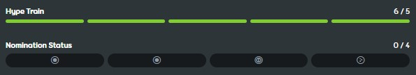

---
tags:
  - qualification
  - nomination
  - nominations
  - nom
  - ranking
  - ranked
  - kwalifikacja
  - zakwalifikowanie
  - nominacja
  - nominacje
  - nomy
  - rankingowanie
  - rankowanie
---

# Proces rankingowania beatmap

::: alert-note
**Zobacz także:** [Rank (strona ujednoznaczniająca)](/wiki/Disambiguation/Rank) oraz [Kolejka rankingowa](Ranking_queue)
:::
::: alert-note
Aby dowiedzieć się więcej o wymienionych niżej statusach beatmap, zobacz [Kategorie beatmap](/wiki/Beatmap/Category)
:::

[Beatmapa](/wiki/Beatmap) może trafić do szerszego grona odbiorców poprzez przejście przez proces rankingowania i uzyskanie statusu [rankingowej](/wiki/Beatmap/Category#ranked).

## Ulepszanie beatmapy

Twórca beatmapy może ustawić jej status jako `obecnie rozwijana` lub `oczekująca`. Obydwa statusy służą ulepszaniu beatmapy na podstawie opinii innych użytkowników osu!.

[Modowanie](/wiki/Modding) to proces polegający na otrzymywaniu konstruktywnych uwag dotyczącej beatmapy w celu jej ulepszenia. Użytkownicy zazwyczaj zamieszczają swoje uwagi w [dyskusji beatmapy](/wiki/Beatmap_discussion) lub omawiają je bezpośrednio z twórcą.

Początkujący twórcy zwykle potrzebują bardzo wiele modów, zanim ich mapa spełni kryteria jakości sekcji rankingowej. W procesie tym często muszą stworzyć swoją beatmapę od podstaw.

Aby beatmapa mogła zostać nominowana, przynajmniej pięciu różnych użytkowników musi ją [nagłośnić](/wiki/Beatmap/Hype).

## Nominacje {id=nominations}

::: Infobox

:::

**Nominacja** jest potwierdzeniem tego, że beatmapa jest gotowa do uzyskania statusu [rankingowej](/wiki/Beatmap/Category#ranked). Jest dawana ukończonym beatmapom, które zdaniem osoby nominującej są wystarczająco wysokiej jakości. Beatmapa musi spełniać [kryteria rankingowe](/wiki/Ranking_criteria) oraz posiadać pięć lub więcej [nagłośnień](/wiki/Beatmap/Hype).

Beatmapy są nominowane przez [nominatorów beatmap](/wiki/People/Beatmap_Nominators) (*BN-ów*), grupę składającą się z doświadczonych modderów. Członkowie [zespołu oceny nominacji](/wiki/People/Nomination_Assessment_Team) (*NAT*) również mogą nominować beatmapy, jednak nie należy to do ich głównych zadań.

Zaleca się, aby otrzymać mody od innych użytkowników przed pytaniem BN-ów o nominację, jednak pięć nagłośnień to jedyny wymóg.

## Kwalifikacja

Beatmapa, która uzyskała wystarczającą liczbę nominacji staje się [zakwalifikowana](/wiki/Beatmap/Category#qualified). Beatmapy składające się z [poziomów trudności](/wiki/Beatmap#poziom-trudności) dla tylko jednego [trybu gry](/wiki/Game_mode) potrzebują jedynie dwóch nominacji. Zestawy hybrydowe[^hybrid-sets] z kolei wymagają dwóch nominacji dla [głównego trybu gry](#main-mode) oraz po jednej dla każdego kolejnego.

Celem kwalifikacji jest pokazanie beatmapy szerszemu gronu użytkowników, aby wyłapać ewentualne błędy i przeoczenia zanim stanie się na stałe [rankingowa](/wiki/Beatmap/Category#ranked). W czasie, gdy beatmapa jest zakwalifikowana:

- Członkowie społeczności mogą ją przetestować lub zmodować, a także zgłosić problemy[^report-correctly] w dyskusji beatmapy.
- Nominatorzy oraz członkowie NAT są automatycznie powiadamiani o wszystkich sugestiach i problemach. Użytkownicy, którzy włączyli otrzymywanie powiadomień o nowych problemach z zakwalifikowanymi beatmapami również zostaną powiadomieni.
- Twórcy beatmap nie mogą samodzielnie zaktualizować zakwalifikowanej mapy.

W przypadku wykrycia problemów wymagających zmian nominacje beatmapy mogą zostać [zresetowane](#reset-nominacji). Pozwala to twórcy się do nich odnieść przy jednoczesnym zachowaniu integralności procesu rankingowego.

### Określanie głównego trybu gry {id=main-mode}

Dla zestawów hybrydowych[^hybrid-sets], główny tryb gry jest określany na podstawie poniższych kryteriów, uporządkowanych według malejącego priorytetu:

1. Tryb gry, który ma największą liczbę poziomów trudności.
2. Jeżeli dwa lub więcej trybów gry mają tę samą liczbę poziomów trudności, głównym trybem jest ten, który zawiera większą liczbę poziomów trudności stworzonych przez hosta beatmapy.
3. Jeżeli nie zostanie to rozstrzygnięte przez poprzednie kryteria, głównym trybem gry będzie ten, który jako pierwszy otrzyma nominację.

### Reset nominacji

Nominacje mogą zostać zresetowane przez jego twórcę poprzez zaktualizowanie beatmapy, albo przez nominatora beatmap lub członka NAT, jeżeli znajdą oni problemy w nominowanej beatmapie. Reset nominacji mogą wykonać również [moderatorzy globalni](/wiki/People/Global_Moderation_Team) w celach moderacyjnych. Jeżeli reset nominacji nastąpi, gdy beatmapa jest zakwalifikowana, zostanie *zdyskwalifikowana* (często nazywane *DQ*, od angielskiego *disqualified*) i usunięta z [kolejki rankingowej](Ranking_queue), a jej status zmieni się na oczekującą. Beatmapa zostanie pozbawiona wszystkich nominacji. Jedynie nominatorzy beatmap, członkowie NAT oraz moderatorzy globalni mogą dyskwalifikować beatmapy.

Reset nominacji pozwala twórcy wprowadzić zmiany, zanim poprosi nominatorów o ponowną nominację. Dzięki niemu modderzy, nominatorzy oraz członkowie NAT również mają szansę sprawdzić najnowszą wersję beatmapy, zanim ponownie wejdzie do [kolejki rankingowej](Ranking_queue).

### Weta

[Weto](/wiki/People/Beatmap_Nominators/Beatmap_Veto) umożliwia nominatorowi beatmap lub członkowi NAT zablokować beatmapie możliwość uzyskania statusu [rankingowej](/wiki/Beatmap/Category#ranked), jeżeli ich zdaniem posiada znaczące problemy dotyczące jakości. Pozwala to na przeprowadzenie dalszej dyskusji oraz uściślenie problemów, zanim beatmapa będzie mogła ponownie stać się [zakwalifikowana](#kwalifikacja).

## Rankingowanie

Jeżeli beatmapa jest zakwalifikowana przez przynajmniej 7 dni oraz nie będzie miała żadnych otwartych [problemów lub sugestii](/wiki/Modding#rodzaje-postów), [kolejka rankingowa](Ranking_queue) może ją przenieść do [sekcji rankingowej](/wiki/Beatmap/Category#ranked). Jeśli po dyskwalifikacji nastąpiła ponowna kwalifikacja, minimalny czas potrzebny na przeniesienie do sekcji rankingowej może zostać [obliczony ponownie](Ranking_queue#dq-and-re-qualification). Beatmapy rankingowe posiadają [tabele wyników](/wiki/Ranking), a gracze mogą otrzymywać [pp](/wiki/Performance_points) za osiągnięte na nich wyniki.

Beatmapy rankingowe mogą utracić swój status jedynie w bardzo wyjątkowych sytuacjach, jeżeli problemy zostaną znalezione krótko po uzyskaniu statusu rankingowej.

## Przypisy

[^hybrid-sets]: Zestawy hybrydowe posiadają poziomy trudności dla przynajmniej dwóch różnych trybów gry.
[^report-correctly]: Zobacz [Zachowanie i postępowanie](/wiki/Rules/Code_of_conduct_for_modding_and_mapping#zachowanie-i-postępowanie) oraz [Tworzenie postów w dyskusji beatmapy](/wiki/Beatmap_discussion#tworzenie-postów) aby dowiedzieć się, jak prawidłowo zgłaszać problemy.
