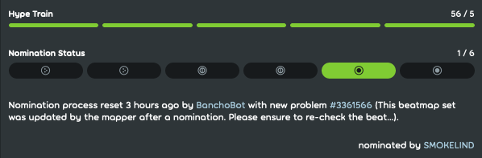

---
tags:
  - qualification
  - nomination
  - nominations
  - nom
  - ranking
  - ranked
  - квалификация
  - квалифайд
  - номинация
  - ном
  - ранкинг
  - ранг
  - ранк
  - рейтинг
---

# Процедура ранкинга

*См. также: [Ранк (значения)](/wiki/Disambiguation/Rank)*

[Карты](/wiki/Beatmap) в osu! можно сделать более популярными и известными сообществу, если ранкнуть их — выполнить ряд действий, после которых карта может попасть в специальную категорию [Ranked](/wiki/Beatmap/Category#ranked) и получить таблицу рекордов.

## Обратная связь

Маппер может пометить свою карту как `WIP` (в разработке) или `Pending` (готова для ранка). Подразумевается, что другие мапперы и игроки будут комментировать, тестировать и модить карты, находящиеся в этих двух категориях.

[Моддинг](/wiki/Modding) — это процесс получения конструктивных замечаний касательно карты, направленных на улучшение её качества. Игроки публикуют свои предложения на [странице обсуждения](/wiki/Beatmap_discussion) карты, либо передают их напрямую создателю карты.

Картам мапперов-новичков зачастую необходим тщательный моддинг для соответствия определённым стандартам качества. В отдельных случаях такие карты переделываются целиком.

Перед тем, как карту можно будет номинировать на ранк, она должна собрать хотя бы 5 [хайпов](/wiki/Beatmap/Hype) от разных пользователей.

## Номинация {id=nominations}

::: Infobox

:::

**Номинация** — отданный в пользу карты голос, означающий её готовность к [ранкингу](/wiki/Beatmap/Category#ranked). Он предназначен для законченных карт, которые, по мнению номинирующих их пользователей, сделаны достаточно качественно. Минимальные требования к карте для её номинации — соблюдение [критериев ранкинга](/wiki/Ranking_criteria), а также получение как минимум 5 [хайпов](/wiki/Beatmap/Hype).

Выдачей номинаций занимается группа [номинаторов](/wiki/People/Beatmap_Nominators) (*БН*, англ. BN*) — опытных моддеров. Представители [команды оценки номинаций](/wiki/People/Nomination_Assessment_Team) (англ. *NAT*) также могут номинировать карты, однако это не является их основной работой.

Несмотря на то, что перед отправкой карты номинатору рекомендуется получить несколько модов от обычных пользователей, единственным обязательным условием для номинации является наличие 5 хайпов.

## Квалификация

Карты, которые получили по две номинации в каждом игровом режиме, имеющемся в мапсете, перемещаются в категорию [Qualified](/wiki/Beatmap/Category#qualified). Такие карты имеют таблицу рекордов, но не дают [очки производительности](/wiki/Performance_points) за прохождение. После пребывания в Qualified в течение хотя бы 7 дней карта переместится в категорию [Ranked](#ранк), если в [очереди ранкинга](Ranking_queue) перед ней нет других карт.

Категория Qualified существует для выявления в карте недочётов, не замеченных моддерами и номинаторами: чем больше людей её сыграют, тем выше шанс нахождения ошибок. Замечания, связанные с картой, можно сообщить номинаторам и NAT через страницу обсуждения карты. В отличие от карт категории Pending, карты в Qualified не могут быть обновлены их создателями, поэтому все замечания могут быть исправлены лишь после [сброса номинации](#сброс-номинации).

## Сброс номинации

С помощью сброса номинаций гарантируется, что моддеры, номинаторы и NAT проверяют самую лучшую и последнюю версию карты до того, как она попадёт в очередь ранкинга.

Номинации сбрасываются при обновлении карты её создателем, или когда номинатор или NAT находят там проблему. Номинации также могут быть сброшены [глобальными модераторами](/wiki/People/Global_Moderation_Team), если в карте присутствует что-то неприемлемое (например, сомнительный фон или текст песни). Если в момент сброса мапсет находился в категории Qualified, он будет дисквалифицирован и убран из очереди ранкинга.

Номинаторы и члены NAT иногда накладывают [вето](/wiki/People/Beatmap_Nominators/Beatmap_Veto) на карты, которые они считают недостаточно качественными, но при этом не нарушающими критерии ранкинга.

## Ранк

Карты, успешно прошедшие через стадию квалификации и очередь ранкинга, попадают в категорию Ranked. В этот момент они получают [таблицу рекордов](/wiki/Ranking) и начинают влиять на статистику игроков.

Такие карты убираются из Ranked только в редких случаях — когда проблемы были найдены вскоре после ранкинга.
