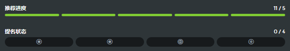

---
tags:
  - qualification
  - nomination
  - nominations
  - nom
  - ranking
  - ranked
  - 上架流程
  - 审核流程
  - 飞图
  - 提名
  - 上架
---

# 谱面上架流程

*参见：[Rank（消歧义页）](/wiki/Disambiguation/Rank) 以及 [上架队列 (Ranking queue)](Ranking_queue)*
*有关下文提及的谱面类别，请参见：[谱面类别](/wiki/Beatmap/Category)*

想要将一张[谱面](/wiki/Beatmap)更好地推向社区，谱面作者（以下简称谱师）需要遵循以下谱面审核流程，并让谱面进入[上架 (Ranked)](/wiki/Beatmap/Category#ranked) 状态。

## 反馈

在提交谱面时，谱师可将谱面标记为 `制作中 (Work in Progress)` 或`待定 (Pending)` 状态。这两种状态都表明谱面开放接受社区的反馈。

[摸图 (Modding)](/wiki/Modding) 指接受与谱面相关的建设性批评的过程，这有助于提高谱面质量。玩家通常在[谱面讨论页](/wiki/Beatmap_discussion)发布反馈，或者直接与谱师私聊讨论谱面中可能存在的问题。

经验不足的新谱师若要制作出达到上架标准的谱面，往往需要进行大量的摸图与修改，有时候甚至需要推倒重来 (Remap)。

在被提名上架之前，谱面通常都需要获取至少来自 5 个不同玩家的[推荐 (hype)](/wiki/Beatmap/Hype)。

## 提名 {id=nominations}

::: Infobox

:::

**提名 (Nomination，俗称 nom 或点图)** 是对谱面质量的认可，表示该谱面已准备好进入[上架](/wiki/Beatmap/Category#ranked)状态。提名者将根据谱面的质量和完成度进行评估，并给出提名。作为最低要求，这些谱面必须符合[上架标准 (Ranking Criteria，简称 RC)](/wiki/Ranking_criteria)，并且获得至少 5 个[推荐](/wiki/Beatmap/Hype)。

提名由一群经验丰富的摸图者——[谱面审核成员](/wiki/People/Beatmap_Nominators) (*BN*) 给予。[审核评估团队](/wiki/People/Nomination_Assessment_Team) (*NAT*) 的成员也可以提名谱面，但这并不是他们的主要职责。

建议在请求 BN 提名之前先进行充分的摸图，但获得 5 个推荐是唯一的前置条件。

## 过审

过审是这样一个流程，即当谱面获得足够的提名后，谱面就会被移动到[过审 (Qualified)](/wiki/Beatmap/Category#qualified) 状态。对于所有[难度](/wiki/Beatmap#难度)仅包含单一[游戏模式](/wiki/Game_mode)的谱面集，只需要两个提名；而混合谱面集[^hybrid-sets]的[主模式](#main-mode)需要获得两个提名，每个附属模式各需获得一个提名。

作为最终的**质量保证**步骤，过审谱面在进入[上架](/wiki/Beatmap/Category#ranked)状态之前会获得更广泛的社区曝光。这是谱面获得广泛支持、反馈以及发现问题并进行改进的最常见阶段。在此期间：

- 社区成员可以测试谱面或进行摸图，然后通过谱面讨论页提供反馈和报告问题[^report-correctly]。
- BN 和 NAT 团队会自动收到所有建议和问题的通知。启用了对新过审谱面问题的通知的用户也会收到通知。
- 建议和问题可以由社区和谱师协作讨论并解决。
- 谱师通常无法自己直接更新过审谱面。

当发现需要更改的问题时，谱面可能会经历[提名重置](#提名重置)，以便允许谱师在保持审核流程完整性的同时解决反馈问题。

### 确定主模式 {id=main-mode}

对于混合谱面集[^hybrid-sets]，主模式的确定依据以下优先顺序：

1. 谱面集中包含的难度数量最多的游戏模式。
2. 如果两个或更多模式的难度数量相同，则主模式将是各模式中由谱面集的创建者 (host) 所创作的难度最多的那个。
3. 如果前两条规则仍然无法确定主模式，则主模式将是第一个获得提名的模式。

### 提名重置

当谱面创建者更新了谱面，或者在 BN 或 NAT 在已被提名的谱面中发现了问题时，提名将被重置。[全局管理团队 (GMT)](/wiki/People/Global_Moderation_Team) 成员也可以为了保证社区内容合适而重置谱面的提名。提名重置会取消谱面的过审状态（俗称 DQ，*disqualify*），并将谱面从[上架队列](Ranking_queue)中移回待定状态。与此同时，谱面的所有提名也会被移除。只有 BN、NAT 和 GMT 成员才有权限 DQ 已过审谱面。

提名重置让谱师可以修改谱面以解决反馈问题，并重新请求提名。提名重置还能确保在进入[上架队列](Ranking_queue) 之前，摸图者、BN 和 NAT 审核的是谱面的最新版本。

### 否决

若 BN 或 NAT 成员认为谱面质量存在严重问题，可能会对某个谱面提出[否决 (veto)](/wiki/People/Beatmap_Nominators/Beatmap_Veto)，阻止其进入[上架](/wiki/Beatmap/Category#ranked) 状态。谱面否决可以保证在继续推进[过审流程](#过审)之前，社区就谱面任何亟需解决的主观问题进行更深入的讨论和明确。

## 上架

谱面在过审状态停留至少 7 天，且没有出现仍未解决的[问题或建议](/wiki/Modding#摸图帖种类)后，[上架队列](Ranking_queue)就能够将其移动到[上架](/wiki/Beatmap/Category#ranked)状态。如果这期间谱面被 DQ 并重新过审，那么其上架所需要花费的时间可能会被[重新计算](Ranking_queue#取消过审-(dq)-与重新过审)。上架后，谱面开放全新的[分数排行榜](/wiki/Ranking)，且玩家也可以从谱面内获取到[表现分 (pp)](/wiki/Performance_Points)。

只有在特殊情况下，在上架后短时间内发现了问题，上架状态的谱面才会被下架 (unrank) 处理。

## 备注

[^hybrid-sets]: 混合谱面集指的是难度跨多个模式的谱面集。
[^report-correctly]: 有关如何正确报告问题，请参见：[行为准则](/wiki/Rules/Code_of_Conduct_for_modding_and_mapping#行为举止), 以及[谱面讨论区 - 发布评论](/wiki/Beatmap_discussion#submission-field)
