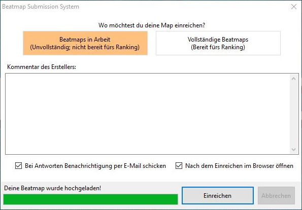

# Beatmaps veröffentlichen

[Beatmaps](/wiki/Beatmap) können über den [Editor im Spiel](/wiki/Client/Beatmap_editor) auf die osu!-Webseite hochgeladen werden. Durch die Veröffentlichung von Beatmaps können andere Nutzer einen Blick auf diese werfen und die Beatmaps möglicherweise in die Kategorien [Ranked](/wiki/Beatmap/Category#ranked) oder [Loved](/wiki/Beatmap/Category#loved) eintreten.

Beim Anwählen von `Beatmap hochladen ...` aus dem Dropdown `Datei` im Editor (Kürzel: `Strg` + `Shift` + `U`) öffnet sich das Fenster für das **Beatmap-Einreichungssystem** (auch **Beatmap Submission System** oder kurz ***BSS*** genannt). Hier werden zu Anfang Informationsquellen aufgelistet, um Nutzern zu helfen, Fragen im Bezug auf Mapping zu stellen, [Feedback](/wiki/Modding) zu ihren Beatmaps einzuholen und sicherzustellen, dass ihre Beatmaps für das Ranking geeignet sind. Solltest du Probleme mit dem BSS haben, dann siehe den Ratgeber über [Probleme mit dem BSS](/wiki/Guides/BSS_issues).

Wenn die Beatmap, die ein Nutzer hochlädt, nicht bereits auf der osu!-Webseite ist, dann wird das BSS-Fenster anzeigen, wie viele Neuveröffentlichungen einem Nutzer noch zustehen. Sofern die Beatmap nominiert ist, warnt das Fenster davor, dass die Nominierung durch das Aktualisieren der Beatmap zurückgesetzt wird. Wenn die Beatmap sich auf dem [Friedhof](/wiki/Beatmap/Category#graveyard) befindet, dann weist das Fenster darauf hin, dass die Beatmap in die Kategorie "Ausstehend" verschoben wird.

## Einreichungsoptionen

Beim Anklicken des Buttons `NEUE Beatmap hochladen!` oder `Beatmap aktualisieren!` hat ein Nutzer die Wahl, seine Beatmap in die Kategorien `Beatmaps in Arbeit` oder `Vollständige Beatmaps` hochzuladen. WIP-Beatmaps können nicht für das Ranking nominiert werden, während ausstehende Beatmaps es können.

Der Abschnitt `Kommentar des Erstellers` ermöglicht Benutzereingaben, die entlang der Auflistungsseite einer Beatmap erscheinen. Das Eingabefeld unterstützt [BBCode](/wiki/BBCode)-Formatierung.

Am unteren Ende des Fensters sind zwei Checkboxen erkennbar. Die erste trägt den Text `Bei Antworten Benachrichtigung per E-Mail schicken`, wodurch die Beatmap zur [Modding-Beobachtungsliste](https://osu.ppy.sh/beatmapsets/watches) des Nutzers hinzugefügt wird. Die zweite ist mit `Nach dem Einreichen im Browser öffnen` beschriftet, wodurch die Auflistungsseite der Beatmap in deinem Standardbrowser geladen wird.

## Limitierungen

Beatmaps werden nicht eingereicht, wenn sie das Online-Dateigrößen- oder Schwierigkeitslimit überschreiten. Die Beschränkung der Dateigröße liegt bei 5 MB sowie zusätzliche 10 MB für jede Minute an Beatmap-Länge. Das Maximum beträgt 100 MB. Die Schwierigkeitsgrenze ist aktuell 128 Sterne.

Benutzern wird es erlaubt, eine limitierte Anzahl an ausstehenden Beatmaps gleichzeitig auf der Webseite zu haben. Die Beschränkung variiert, abhängig davon, wie viele gerankte Beatmaps ein Nutzer hat und ob er gerade ein [osu!supporter](/wiki/osu!supporter) ist. Benutzer ohne osu!supporter können 4 ausstehende Beatmaps plus 1 pro gerankter Beatmap haben (bis zu 4). Mit osu!supporter wird die Grenze auf 8 ausstehende Beatmaps plus 1 pro gerankter Beatmap erhöht (bis zu 12), also insgesamt 20.

Die Upload-Geschwindigkeit unterscheidet sich abhängig davon, welche Dateien geändert wurden. Sofern nur die [`.osu`](/wiki/Client/File_formats/osu_(file_format))-Dateien verändert wurden, sind sie die einzigen Dateien im Beatmap-Ordner, die verarbeitet und hochgeladen werden. Wenn andere Dateien geändert werden, werden alle Dateien im Beatmap-Ordner verarbeitet und hochgeladen.
