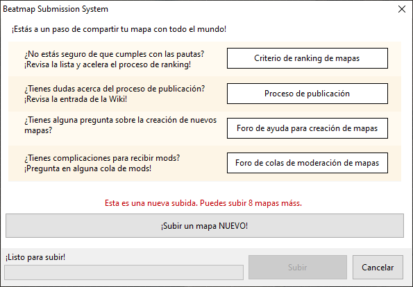
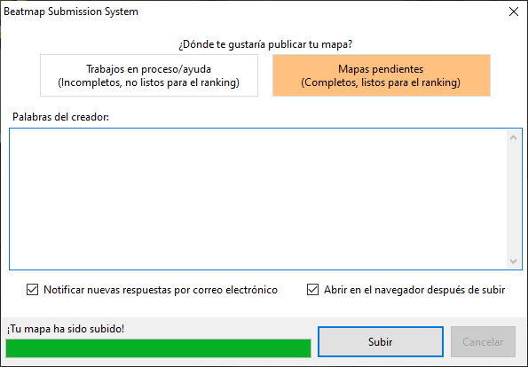

# Envío

Los [beatmaps](/wiki/Beatmap) se pueden enviar al sitio web de osu! a través del [editor dentro del juego](/wiki/Client/Beatmap_editor). Enviar un beatmap te permite recibir atención de otros usuarios y potencialmente ingresar a las categorías [clasificados](/wiki/Beatmap/Category#ranked) o [amados](/wiki/Beatmap/Category#loved).

Al seleccionar `Subir mapa...` del menú desplegable `Archivo` en el editor (atajo: `Ctrl` + `Shift` + `U`) se abrirá la ventana del **sistema de envío de beatmaps** (***BSS***). Inicialmente, esto enumera recursos para ayudar a los usuarios a hacer preguntas relacionadas con el mapping, encontrar [comentarios](/wiki/Modding) para sus beatmaps y garantizar que sus mapas sean adecuados para clasificar. Si tienes problemas al usar el BSS, véase la guía [problemas del BSS](/wiki/Guides/BSS_issues).

Si el beatmap que está subiendo un usuario aún no está en el sitio web de osu!, la ventana del BSS indicará cuántas veces más puede publicar un usuario. Si el beatmap está nominado, la ventana advierte que la nominación se restablecerá por actualizar el beatmap. Si el beatmap está en el [cementerio](/wiki/Beatmap/Category#graveyard), la ventana advierte que el beatmap se elevará a la categoría pendientes.

## Opciones de envío

Al hacer clic en el botón `¡Subir un mapa NUEVO!` o `¡Actualizar mapa!`, al usuario se le presentará la opción de subir su beatmap en las categorías `Trabajos en proceso/ayuda` o `Mapas pendientes`. Los beatmaps WIP no se pueden nominar para la clasificación, mientras que los beatmaps pendientes sí.

La sección `Palabras del creador` permite que el usuario introduzca sus propias palabras, que aparecerán junto a la página web del beatmap. Esto admite el formato [BBCode](/wiki/BBCode).

Aparecen dos casillas de verificación cerca de la parte inferior de la ventana. La primera dice `Notificar nuevas respuestas por correo electrónico`, que agrega al beatmap a la [lista de seguimiento](https://osu.ppy.sh/beatmapsets/watches) del usuario. El segundo dice `Abrir en el navegador después de subir`, que cargará la página del beatmap en tu navegador predeterminado.

## Limitaciones

Los beatmaps no se enviarán si superan el tamaño del archivo en línea o el límite de dificultad. El límite del tamaño del archivo es de 5 MB más 10 MB adicionales por cada minuto de duración del beatmap, y tiene un límite de 100 MB. El límite de dificultad es actualmente 128.

Los usuarios pueden tener un número limitado de beatmaps pendientes a la vez. El límite varía dependiendo de cuántos beatmaps clasificados tiene un usuario y si actualmente es o no un [osu!supporter](/wiki/osu!supporter). Los usuarios sin osu!supporter pueden tener 4 beatmaps pendientes más 1 por beatmap clasificado (hasta 4). Con osu!supporter, esto aumenta a 8 beatmaps pendientes más 1 por beatmap clasificado (hasta 12) para un total de 20.

La velocidad de subida varía según los archivos que se cambien. Si solo se cambian los archivos [`.osu`](/wiki/Client/File_formats/osu_(file_format)), serán los únicos archivos en la carpeta del beatmap que se procesarán y subirán. Si se modifican otros recursos, todos los archivos de la carpeta del beatmap se procesarán y subirán.
