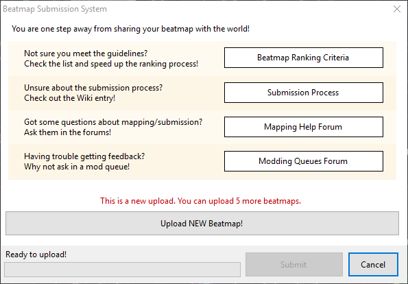
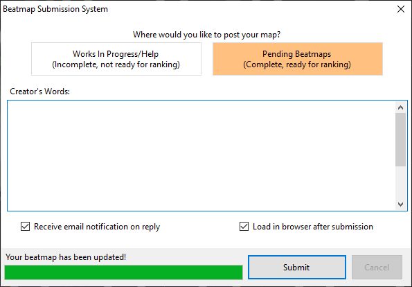

# Inzending

[Beatmaps](/wiki/Beatmap) kunnen ingezonden worden naar de osu! website via de  [in-game editor](/wiki/Client/Beatmap_editor). Door een beatmap in te zenden kan deze aandacht krijgen van andere gebruikers en eventueel de [Ranked](/wiki/Beatmap/Category#ranked)- of [Loved](/wiki/Beatmap/Category#loved)-categorieën betreden.

Door `Upload Beatmap...` vanuit het `Bestand`-uitklapmenu in de editor te selecteren (sneltoetsen: `Ctrl` + `Shift` + `U`), zal het **Beatmap Submission System** (***BSS***)-venster geopend worden. Dit venster geeft in eerste instantie info om gebruikers te helpen bij het stellen van mappen-gerelateerde vragen, het vinden van [feedback](/wiki/Modding) voor hun beatmaps, en om ervoor te zorgen dat hun maps geschikt zijn om Ranked te worden. Als je problemen ondervindt bij het gebruiken van het BSS, bekijk dan de [BSS Problemen](/wiki/Guides/BSS_issues)-gids.

Als de beatmap die een gebruiker wilt uploaden nog niet op de osu! website staat, zal het BSS-venster aangeven hoeveel nieuwe uploads een gebruiker nog kan publiceren. Als een beatmap genomineerd is zal het venster de gebruiker waarschuwen dat de nominatie gereset zal worden door de beatmap te updaten. Als de beatmap [Graveyarded](/wiki/Beatmap/Category#graveyard) (In het kerkhof) is zal het venster de gebruiker waarschuwen dat de beatmap terug naar de Pending (In Afwachting)-categorie zal worden verhoogd door deze te updaten.

## Inzendingsopties

Door op de `Upload NIEUWE Beatmap!` of `Update Beatmap!`-knop te klikken zal een gebruiker de keuze krijgen om de beatmap naar de `Work In Progress (In Uitvoering)/Help` of `Pending (In Afwachting)`-categorie te uploaden. WIP beatmaps (beatmaps in uitvoering) kunnen niet genomineerd worden om Ranked te worden, terwijl Pending beatmaps (beatmaps in afwachting) dat wel kunnen.

De `Woorden van de maker`-sectie laat het toe om een kort bericht van de gebruiker weer te geven naast de beamap listing pagina op de website. [BBCode](/wiki/BBCode)-formatteren wordt hier ondersteund.

Twee keuzevakjes verschijnen aan de onderkant van het venster. Het eerste is `Ontvang email notificatie bij een reactie`, dit voegt de beatmap toe aan de [modden volglijst](https://osu.ppy.sh/beatmapsets/watches) van de gebruiker. Het tweede is `Laad in browser na insturen`, dit zal de beatmap listing pagina openen in jouw standaardbrowser.

## Limitaties

Beatmaps zullen niet ingezonden kunnen worden als ze de online bestandgrootte- of moeilijkheidsgraadlimiet overschrijden. De bestandgroottelimiet is 5MB plus nog eens 10MB voor elke minuut beatmaplengte, tot maximum 100MB. De moeilijkheidsgraadlimiet is momenteel 128.

Gebruikers mogen slechts een beperkt aantal Pending beatmaps (beatmaps in afwachting) hebben. De limiet varieert afhankelijk van hoeveel Ranked beatmaps een gebruiker heeft en of de gebruiker al dan niet een [osu!supporter](/wiki/osu!supporter) is. Gebruikers zonder osu!supporter kunnen 4 Pending beatmaps (beatmaps in afwachting) hebben plus 1 per Ranked beatmap (maximum 4). Met osu!supporter verhoogt deze limiet tot 8 Pending beatmaps (beatmaps in afwachting) plus 1 per Ranked beatmap (maximum 12) voor een totaal van 20.

De uploadsnelheid varieert afhankelijk van welke bestanden veranderd werden. Als enkel de [`.osu`](/wiki/Client/File_formats/osu_(file_format))-bestanden werden veranderd, zijn het enkel die bestanden die verwerkt en geupload moeten worden. Als er eenderwelke ander bestanden werden gewijzigd moeten alle bestanden in de bestandsmap van die beatmap opnieuw verwerkt en geupload worden.
