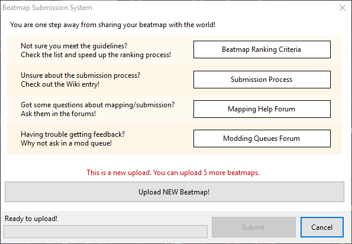
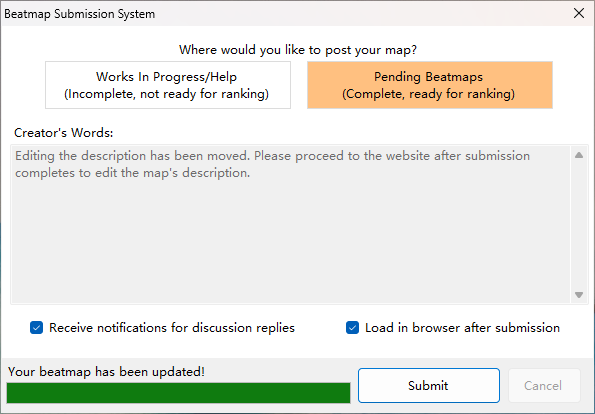

# Публикация карт

::: alert-note
**Примечание:** о том, как это делается в [osu!(lazer)](/wiki/Client/Release_stream/Lazer), см. [Публикация карт (lazer)](/wiki/Beatmapping/Beatmap_submission_(lazer))
:::

[Карты](/wiki/Beatmap) можно публиковать на сайте osu! с помощью [редактора карт](/wiki/Client/Beatmap_editor). После этого их могут скачивать другие игроки, кроме того, публикация открывает для карты возможность стать [ранкнутой](/wiki/Beatmap/Category#ranked) или [«любимой»](/wiki/Beatmap/Category#loved).

Чтобы начать публикацию карты, в верхнем меню необходимо выбрать `Файл` → `Выгрузить на сервер...` (сочетание клавиш: `Ctrl` + `Shift` + `U`). В появившемся окне есть ссылки на справочные материалы, связанные с маппингом, получением [отзывов на карту](/wiki/Modding) и критериями ранкинга. Для решения проблем, связанных с системой публикации карт (англ. **BSS**, **Beatmap Submission System**) см. [Как решить проблемы с BSS?](/wiki/Guides/BSS_issues)

В случае новой карты окно покажет, сколько слотов для публикации вам доступно. Если карта уже номинирована, вы увидите предупреждение о том, что её обновление сбросит статус номинации. Если карта попала на [кладбище](/wiki/Beatmap/Category#graveyard), в окне будет предупреждение о том, что при обновлении карта будет помечена как «В работе».

## Настройки публикации

После нажатия одной из кнопок `Опубликовать новую карту` или `Обновить карту` можно выбрать, какую категорию использовать для публикации: `Незаконченные карты` (не могут быть номинированы), либо `Законченные карты` (позднее могут быть номинированы).

Поле `От автора` предназначалось для правки [описания карты](/wiki/Beatmap/Beatmap_description), но, начиная с релиза [Stable 20251128.1](https://osu.ppy.sh/home/changelog/stable40/20251128.1), оно отключено. Само описание по-прежнему можно поменять на сайте после публикации карты.

В нижней части окна находятся два флажка. Первый из них, `Получать уведомления при ответах`, позволяет подписаться на [отзывы к карте](https://osu.ppy.sh/beatmapsets/watches). Второй флажок, `Открыть в браузере после публикации`, откроет страницу карты на сайте osu!.

## Ограничения

Карту нельзя опубликовать, если её общий размер или число сложностей превышают допустимые значения. Ограничение по размеру — 5 МБ, и по 10 дополнительных МБ за каждую минуту игрового времени, но не более 100 МБ. Максимальное число сложностей карты — 128.

Кроме того, можно опубликовать только ограниченное число незаконченных карт. Конкретное число зависит от количества ранкнутых карт, а также от наличия [osu!supporter](/wiki/osu!supporter). При отсутствии osu!supporter ограничение на число карт — 4, и по 1 за каждую ранкнутую карту (до 4) — в общей сложности до 8. При наличии osu!supporter ограничение на число карт увеличивается до 8, и по 1 за каждую ранкнутую карту (до 12) — в общей сложности до 20.

Скорость выгрузки карты зависит от затронутых файлов. Если поменялись лишь файлы [`.osu`](/wiki/Client/File_formats/osu_(file_format)), то только они и будут выгружены. Если в карте изменились ещё какие-то файлы, то будет выгружена вся её папка целиком.
