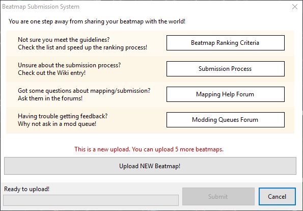
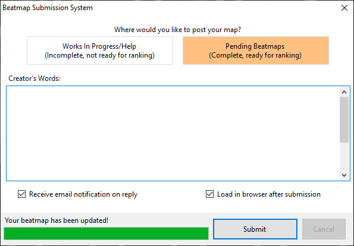

# การส่ง Beatmap (Submission)

[Beatmap](/wiki/Beatmap) สามารถส่งขึ้นสู่เว็บไซต์ osu! ได้ผ่านทาง [ตัวแก้ไขภายในเกม (In-game editor)](/wiki/Client/Beatmap_editor) การส่ง Beatmap จะช่วยให้ผลงานของคุณได้รับความสนใจจากผู้ใช้คนอื่นๆ และมีโอกาสที่จะเข้าสู่หมวด [Ranked](/wiki/Beatmap/Category#ranked) หรือ [Loved](/wiki/Beatmap/Category#loved) ได้ในอนาคต

การเลือก `Upload Beatmap...` จากเมนู `File` ในตัวแก้ไข (หรือกดปุ่มลัด: `Ctrl` + `Shift` + `U`) จะเป็นการเปิดหน้าต่าง **Beatmap Submission System** (***BSS***) ขึ้นมา ในช่วงแรกหน้าต่างนี้จะแสดงรายการแหล่งข้อมูลเพื่อช่วยเหลือผู้ใช้ในการถามคำถามเกี่ยวกับการทำแมพ, การหา [ข้อเสนอแนะ (Feedback)](/wiki/Modding) และการตรวจสอบว่าแมพนั้นเหมาะสมสำหรับการจัดอันดับหรือไม่ หากคุณพบปัญหาในการใช้งาน BSS สามารถอ่านคู่มือ [ปัญหาเกี่ยวกับ BSS](/wiki/Guides/BSS_issues) ได้

หาก Beatmap ที่คุณกำลังอัปโหลดเป็นแมพใหม่ที่ยังไม่อยู่บนเว็บไซต์ หน้าต่าง BSS จะระบุจำนวนครั้งที่คุณยังสามารถอัปโหลดแมพใหม่ได้ หากแมพนั้นได้รับการเสนอชื่อ (Nominated) อยู่ หน้าต่างจะเตือนว่าการอัปโหลดอัปเดตจะทำให้สถานะการเสนอชื่อถูกล้าง (Reset) และหากแมพอยู่ในหมวด [Graveyard](/wiki/Beatmap/Category#graveyard) หน้าต่างจะเตือนว่าแมพจะถูกดึงกลับมาอยู่ในหมวด Pending อีกครั้ง

## ตัวเลือกการส่งผลงาน

เมื่อคลิกปุ่ม `Upload NEW Beatmap!` หรือ `Update Beatmap!` คุณจะมีตัวเลือกว่าจะส่ง Beatmap ไปยังหมวด `Work In Progress/Help` (WIP) หรือ `Pending Beatmaps` โดยแมพในหมวด WIP จะไม่สามารถถูกเสนอชื่อเพื่อจัดอันดับได้ ขณะที่แมพในหมวด Pending สามารถทำได้

ในส่วนของ `Creator's Words` (คำพูดจากผู้สร้าง) คุณสามารถพิมพ์ข้อความที่ต้องการให้ปรากฏในหน้าของ Beatmap บนเว็บไซต์ได้ ซึ่งรองรับการจัดรูปแบบด้วย [BBCode](/wiki/BBCode)

ที่ด้านล่างของหน้าต่างจะมีช่องติ๊ก 2 ช่อง ช่องแรกคือ `Receive email notification on reply` ซึ่งจะเพิ่ม Beatmap นี้ลงใน [รายการติดตามการ Mod (Modding watchlist)](https://osu.ppy.sh/beatmapsets/watches) ของคุณ ส่วนช่องที่สองคือ `Load in browser after submission` ซึ่งจะเปิดหน้าเว็บของ Beatmap นั้นบนเบราว์เซอร์ให้โดยอัตโนมัติหลังจากส่งงานเสร็จสิ้น

## ข้อจำกัด (Limitations)

Beatmap จะไม่สามารถส่งได้หากมีขนาดไฟล์หรือจำนวนระดับความยากเกินกว่าที่กำหนด ขีดจำกัดของขนาดไฟล์คือ 5MB บวกเพิ่มอีก 10MB ต่อความยาวของเพลงทุกๆ 1 นาที และสูงสุดไม่เกิน 100MB ส่วนขีดจำกัดของระดับความยากในปัจจุบันคือ 128 ความยากต่อหนึ่งชุดแมพ

ผู้ใช้แต่ละคนสามารถมีจำนวนแมพในหมวด Pending ได้จำกัด โดยขีดจำกัดจะขึ้นอยู่กับจำนวนแมพที่ได้รับการจัดอันดับ (Ranked) แล้วของคุณ และสถานะ [osu!supporter](/wiki/osu!supporter) ดังนี้:
- ผู้ที่ **ไม่มี** osu!supporter: เริ่มต้นที่ 4 ชุด บวกเพิ่มอีก 1 ชุดต่อแมพ Ranked ทุกๆ 1 แมพ (สูงสุดไม่เกิน 4 ชุด) รวมเป็นสูงสุด 8 ชุด
- ผู้ที่ **มี** osu!supporter: เริ่มต้นที่ 8 ชุด บวกเพิ่มอีก 1 ชุดต่อแมพ Ranked ทุกๆ 1 แมพ (สูงสุดไม่เกิน 12 ชุด) รวมเป็นสูงสุด 20 ชุด

ความเร็วในการอัปโหลดจะขึ้นอยู่กับไฟล์ที่ถูกเปลี่ยนแปลง หากมีการแก้ไขเฉพาะไฟล์ [`.osu`](/wiki/Client/File_formats/osu_(file_format)) ระบบจะประมวลผลและอัปโหลดเฉพาะไฟล์เหล่านั้น แต่หากมีการแก้ไขทรัพยากรอื่นๆ (เช่น ไฟล์ภาพหรือเสียง) ไฟล์ทั้งหมดในโฟลเดอร์จะถูกประมวลผลและอัปโหลดใหม่ทั้งหมด
