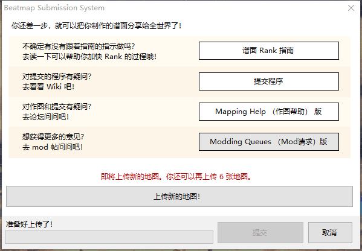
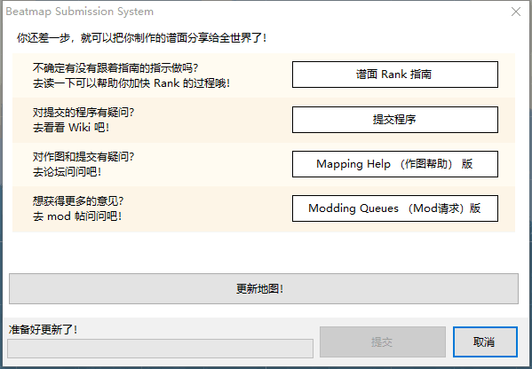

# 提交谱面

制作好的[谱面](/wiki/Beatmap)可以通过[谱面编辑器](/wiki/Client/Beatmap_editor)提交至 osu! 官网上。提交后的谱面就能得到其他玩家的关注，并有机会被标记为 [Ranked](/wiki/Beatmap/Category#ranked) 或 [Loved](/wiki/Beatmap/Category#loved)。

在编辑器内的`文件`下拉列表中选择`上传地图…`（快捷键：`Ctrl` + `Shift` + `U`）会打开**谱面提交系统**（***Beatmap Submission System***，简写为***BSS***）窗口。窗口中首先会列出一些资源，这些资源可以帮助用户解决与制谱有关的问题、寻求谱面的[反馈](/wiki/Modding)，并确保谱面符合 Ranked 谱面的标准。若在使用系统时遇到问题，请参阅指南[如何解决谱面提交系统的问题](/wiki/Guides/BSS_issues)。

如果用户上传的谱面集还尚未提交至 osu! 网站，窗口上会显示出用户还能上传的新谱面集数量。若谱面集已被提名，用户会收到“上传地图会使谱面提名状态重置”的警告；若谱面集已成为[坟图](/wiki/Beatmap/Category#graveyard)，用户会收到“谱面将会变为 Pending 状态”的警告。

## 提交选项

点击`上传新的地图！`或`更新地图！`按钮后，用户可以选择将他们上传的谱面标记为 `Work In Progress(WIP)/Help` 或 `Pending Beatmaps`。标记为 WIP 的谱面不能改变排名（Rank）状态，但 Pending 的谱面可以。

`作者的话`允许谱师编辑显示至谱面信息页中谱面介绍处的内容，并支持使用 [BBCode](/wiki/BBCode) 格式。

窗口底部有两个复选框。第一个是`当有回复的时候，发送邮件通知我`，将其选中会将谱面加入到用户的[谱面关注列表](https://osu.ppy.sh/beatmapsets/watches)。第二个是`提交后从浏览器打开`，其会在上传后使用系统默认浏览器打开谱面介绍页。

## 限制

若谱面超出了线上文件的难度数量限制或文件大小限制，则会无法上传。文件大小限制基础为 5MB ，谱面长度的每分钟会额外增加 10MB ，上限 100MB 。目前，单个谱面集最多允许上传 128 个难度。

用户上传的 Pending 谱面集有数量限制。这个限制受用户拥有 Ranked 谱面集的数量以及当前是否为 [osu!supporter](/wiki/osu!supporter) 影响。非 osu!supporter 用户最多可以上传 4 张待处理谱面集，每拥有 1 张 Ranked 谱面集额外增加 1 张（上限为 4 张），至多 8 张。若是 osu!supporter 则增加至最多可以上传 8 张待处理谱面，每个 Ranked 谱面额外增加 1 张（上限为 12 张），至多 20 张。

上传速度受文件的改动影响。若只有 [`.osu`](/wiki/Client/File_formats/osu_(file_format)) 谱面文件被改动，则只有这一个文件会被处理及上传。若其他文件也被改动，则谱面文件夹中所有文件会被处理及上传。
