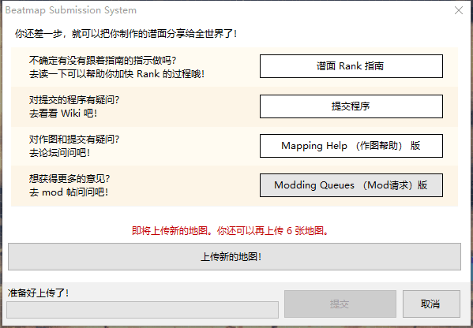
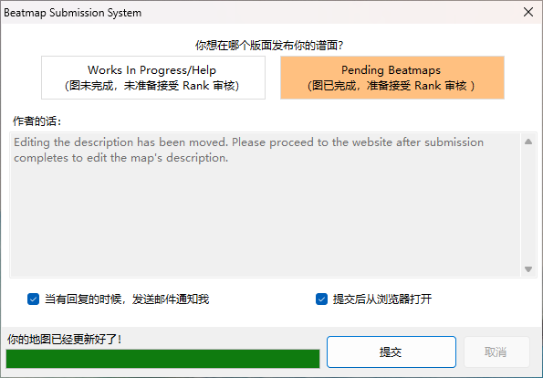

# 提交谱面

::: alert-note
**注:** 对于本文的 [lazer](/wiki/Client/Release_stream/Lazer) 版本，请见：[提交谱面 (lazer)](/wiki/Beatmapping/Beatmap_submission_(lazer))
:::

制作好的[谱面](/wiki/Beatmap)可以通过[谱面编辑器](/wiki/Client/Beatmap_editor)提交至 osu! 官网上。提交后的谱面就能得到其他玩家的关注，并有机会被标记为 [Ranked](/wiki/Beatmap/Category#ranked) 或 [Loved](/wiki/Beatmap/Category#loved)。

在编辑器内的`文件`下拉列表中选择`上传地图…`（快捷键：`Ctrl` + `Shift` + `U`）会打开**谱面提交系统**（***Beatmap Submission System***，简写为***BSS***）窗口。窗口中首先会列出一些资源，这些资源可以帮助用户解决与制谱有关的问题、寻求谱面的[反馈](/wiki/Modding)，并确保谱面符合 Ranked 谱面的标准。若在使用系统时遇到问题，请参阅指南[如何解决谱面提交系统的问题](/wiki/Guides/BSS_issues)。

如果用户上传的谱面集还尚未提交至 osu! 网站，窗口上会显示出用户还能上传的新谱面集数量。若谱面集已被提名，用户会收到“上传地图会使谱面提名状态重置”的警告；若谱面集已成为[坟图](/wiki/Beatmap/Category#graveyard)，用户会收到“谱面将会变为 Pending 状态”的警告。

## 提交选项

点击`上传新的地图！`或`更新地图！`按钮后，用户可以选择将他们上传的谱面标记为 `Work In Progress(WIP)/Help` 或 `Pending Beatmaps`。标记为 WIP 的谱面不能改变排名（Rank）状态，但 Pending 的谱面可以。

`作者的话`原先用于编辑[谱面描述](/wiki/Beatmap/Beatmap_description)，自 [Stable 20251128.1](https://osu.ppy.sh/home/changelog/stable40/20251128.1)起被禁用。谱面描述在提交谱面后可以从网站编辑。

窗口底部有两个复选框。第一个是`当有回复的时候，发送邮件通知我`，将其选中会将谱面加入到用户的[谱面关注列表](https://osu.ppy.sh/beatmapsets/watches)。第二个是`提交后从浏览器打开`，其会在上传后使用系统默认浏览器打开谱面介绍页。

## 限制

若谱面超出了线上文件的难度数量限制或文件大小限制，则会无法上传。文件大小限制基础为 5MB，谱面长度的每分钟会额外增加 10MB，上限 100MB。目前，单个谱面集最多允许上传 128 个难度。

用户上传的待定 (Pending) 谱面有数量限制。这个限制受用户拥有上架 (Ranked) 谱面集的数量以及当前是否为 [osu! 支持者](/wiki/osu!supporter)影响。非支持者，最多可以上传 4 张待定谱面，同时，每拥有 1 张上架谱面，额外增加 1 个待定谱面栏位（额外上限为 4 个），同时最多存在 8 张待定谱面。如果是支持者，则初始的待定谱面栏位上限可以增加至 8 个，每个上架谱面额外增加 1 个待定谱面栏位（额外上限为 12 个），同时最多存在 20 张待定谱面。

上传速度受文件的改动影响。若只有 [`.osu`](/wiki/Client/File_formats/osu_(file_format)) 谱面文件被改动，则只有这一个文件会被处理及上传。若其他文件也被改动，则谱面文件夹中所有文件会被处理及上传。
