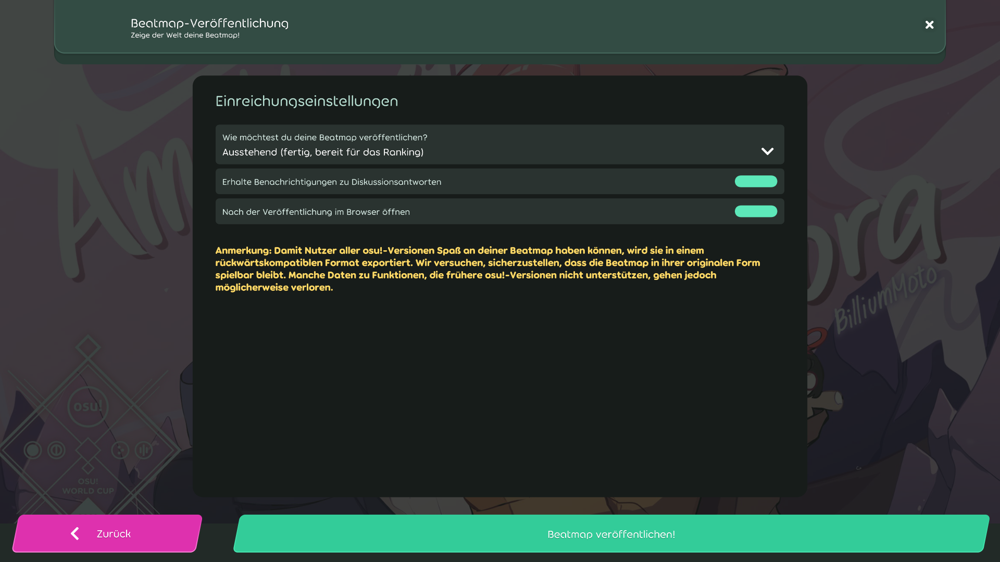

# Beatmaps veröffentlichen (lazer)

::: alert-note
**Anmerkung:** Für die osu!(stable)-Version des Artikels, siehe [Beatmaps veröffentlichen](/wiki/Beatmapping/Beatmap_submission)
:::

[Beatmaps](/wiki/Beatmap) können über den [Editor im Spiel](/wiki/Client/Beatmap_editor) auf die osu!-Webseite hochgeladen werden. Durch die Veröffentlichung von Beatmaps können andere Nutzer einen Blick auf diese werfen und die Beatmaps möglicherweise in die Kategorien [Ranked](/wiki/Beatmap/Category#ranked) oder [Loved](/wiki/Beatmap/Category#loved) eintreten. Die Infrastruktur, die dies ermöglicht, wird gewöhnlich als das **Beatmap-Einreichungssystem** (auch **Beatmap Submission System** oder kurz ***BSS***) bezeichnet.

Beim Auswählen von `Beatmap hochladen` aus dem Dropdown `Datei` im Editor (Kürzel: `Strg` + `Shift` + `U`) öffnet sich das Fenster für die Beatmap-Einreichung. Hier werden Optionen bereitgestellt, in welcher [Beatmap-Kategorie](/wiki/Beatmap/Category) die Beatmap hochgeladen werden soll, ob Benachrichtigungen zu Diskussionsantworten aktiviert werden sollen und ob die Beatmap nach der Veröffentlichung im Browser geöffnet werden soll. Solltest du Probleme mit dem BSS haben, frag bitte im [Help](https://osu.ppy.sh/community/forums/5)-Forum nach.

## Limitierungen

Beatmaps werden nicht eingereicht, wenn sie das Online-Dateigrößen- oder Schwierigkeitslimit überschreiten. Die Beschränkung der Dateigröße liegt bei 5 MB sowie zusätzliche 10 MB für jede Minute an Beatmap-Länge. Das Maximum beträgt 200 MB. Aktuell können einer Beatmap maximal 128 Schwierigkeitsgrade hinzugefügt werden.

Nutzer können nur eine begrenzte Anzahl an ausstehenden Beatmaps gleichzeitig auf der Webseite haben. Das Limit variiert, abhängig davon, wie viele gerankte Beatmaps ein Nutzer hat und ob er gerade ein [osu!supporter](/wiki/osu!supporter) ist. Nutzer ohne osu!supporter können 4 ausstehende Beatmaps plus eine pro gerankter Beatmap haben (bis zu 4). Mit osu!supporter wird die Grenze auf 8 ausstehende Beatmaps plus eine pro gerankter Beatmap erhöht (bis zu 12), also insgesamt 20.
