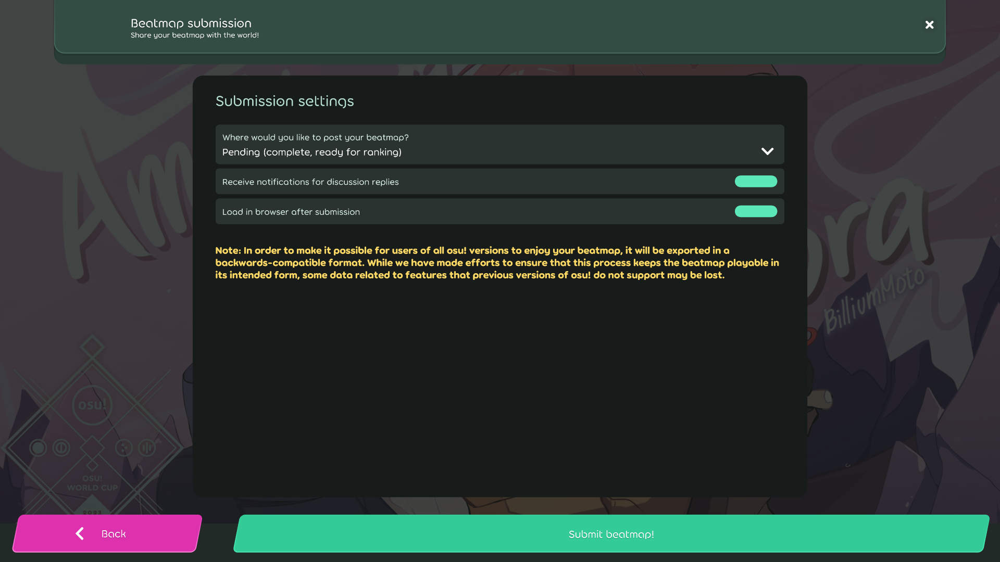

# Beatmap submission (lazer)

*For the osu!(stable) version of this article, see: [Beatmap submission](/wiki/Beatmapping/Beatmap_submission)*

[Beatmaps](/wiki/Beatmap) can be submitted to the osu! website via the [in-game editor](/wiki/Client/Beatmap_editor)<!-- TODO: link lazer editor article when available -->. Submitting a beatmap allows it to receive attention from other users and potentially enter the [Ranked](/wiki/Beatmap/Category#ranked) or [Loved](/wiki/Beatmap/Category#loved) categories. The infrastructure facilitating this is commonly called the **Beatmap Submission System** (***BSS***).

Selecting `Submit beatmap` from the `File` dropdown in the editor (shortcut: `Ctrl` + `Shift` + `U`) will open the beatmap submission screen. This screen provides options for which [beatmap category](/wiki/Beatmap/Category) the map should end up in, whether to enable discussion notifications and whether to open the uploaded map in the browser. If you encounter trouble when using BSS, please ask in the [Help](https://osu.ppy.sh/community/forums/5) subforum.

## Limitations

<!-- reference: https://github.com/ppy/osu-server-beatmap-submission/blob/b52dc670d8361b0f25ec2a2edf016398142cfb21/osu.Server.BeatmapSubmission/BeatmapSubmissionController.cs -->

Beatmaps will fail to submit if they exceed the online file size or difficulty limit. The file size limit is 5 MB plus an additional 10 MB for every minute of beatmap length, and it caps at 200 MB<!-- reference: https://github.com/ppy/osu-server-beatmap-submission/blob/b52dc670d8361b0f25ec2a2edf016398142cfb21/osu.Server.BeatmapSubmission/Program.cs#L21 -->. The difficulty limit is currently 128.

Users are allowed a limited number of pending beatmaps at a time. The limit varies depending on how many ranked beatmaps a user has and whether or not they are currently an [osu!supporter](/wiki/osu!supporter). Users without osu!supporter can have 4 pending beatmaps plus 1 per ranked beatmap (up to 4). With osu!supporter, this increases to 8 pending beatmaps plus 1 per ranked beatmap (up to 12) for a total of 20.
