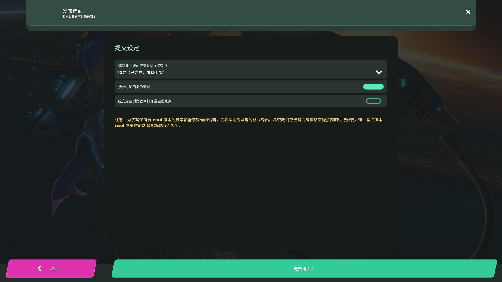

# 提交谱面 (lazer)

::: alert-note
**注:** 对于本文的 osu!(stable) 版本，请见：[提交谱面](/wiki/Beatmapping/Beatmap_submission)
:::

制作好的[谱面](/wiki/Beatmap)可以通过[谱面编辑器](/wiki/Client/Beatmap_editor)提交至 osu! 官网上。提交后的谱面能够得到其他玩家的关注，并有机会进入[上架 (Ranked)](/wiki/Beatmap/Category#ranked) 或[社区喜爱 (Loved)](/wiki/Beatmap/Category#loved) 分类。辅助进行这一过程的基础设施一般被称作**谱面提交系统** (**Beatmap Submission System**, ***BSS***)。

在编辑器内的`文件`下拉菜单中选择`提交谱面`（快捷键：`Ctrl` + `Shift` + `U`）可打开谱面提交界面。该界面会列出一些选项，包括上传后地图应处于的[谱面分类](/wiki/Beatmap/Category)，是否启用谱面讨论，以及是否应在浏览器中打开上传的谱面。若在使用 BSS 时遇到问题，请在 [Help](https://osu.ppy.sh/community/forums/5) 子论坛中寻求帮助。

## 限制

<!-- reference: https://github.com/ppy/osu-server-beatmap-submission/blob/b52dc670d8361b0f25ec2a2edf016398142cfb21/osu.Server.BeatmapSubmission/BeatmapSubmissionController.cs -->

若谱面超出了线上文件的难度数量限制或文件大小限制，则无法上传。文件大小基础限制为 5MB，谱面长度每有一分钟，限制额外提高 10MB，总上限 200MB。目前，单个谱面最多允许上传 128 个难度。

用户上传的待定 (Pending) 谱面有数量限制。这个限制受用户拥有上架 (Ranked) 谱面集的数量以及当前是否为 [osu! 支持者](/wiki/osu!supporter)影响。非支持者，最多可以上传 4 张待定谱面，同时，每拥有 1 张上架谱面，额外增加 1 个待定谱面栏位（额外上限为 4 个），同时最多存在 8 张待定谱面。如果是支持者，则初始的待定谱面栏位上限可以增加至 8 个，每个上架谱面额外增加 1 个待定谱面栏位（额外上限为 12 个），同时最多存在 20 张待定谱面。
