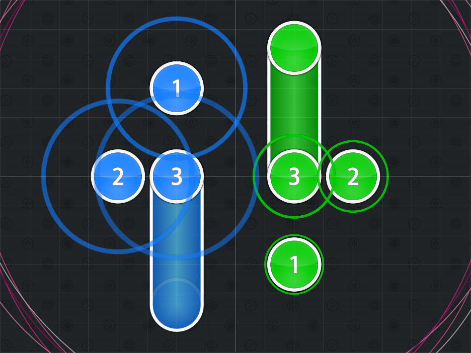

# Técnicas básicas del mapping

## Flow común de los beatmaps

Cuando se empieza con un beatmap, es una buena práctica empezar mapeando el ritmo de la música (o de la voz).
Tendrás que determinar qué será lo mejor para el jugador, ya que seguir uno u otro puede ayudar o perjudicar la experiencia del beatmap.

## Simetría

La **simetría** es cuando el beatmap es simétrico en relación a un eje.
El tipo de simetría más común es la horizontal.
Sin embargo, también existen otros tipos de simetría, como la simetría vertical, la simetría diagonal y la simetría en relación con el origen.
Normalmente diríamos: «Piensa en una función extraña», pero eso probablemente alejaría a una gran parte de la base de jugadores.

Para guiarte en el proceso de comprensión de la simetría, repasaremos varios ejemplos de simetría en un mapa ya clasificado.
Explicar la simetría en forma de texto (como hacemos ahora) no es tan eficaz sin una imagen visual.

### Simetría horizontal

### Simetría vertical

### Simetría en relación con el origen

`-f(x) = f(-x)`

Este tipo de simetría se le llama a veces «simetría rotacional», pero eso sería incorrecto.
Es simplemente simetría en relación con el origen.
Pero es más sencillo de lo que parece.

Este tipo de simetría se consigue copiando y pegando primero un patrón, y luego volteándolo tanto vertical como horizontalmente.
Este tipo de simetría es agradable porque es más sutil que la simetría horizontal o vertical.

### Simetría modificada

La **simetría modificada** es cuando se toma un patrón simétrico y se modifica de varias maneras. 
A veces funciona y a veces no.

00:20:455 (1,2,3) es uno de los ejemplos más acertados de la simetría modificada.
Usa la escala por función para hacer del (3) una versión más corta del (1).
Es acertada porque realmente se nota.
A algunas personas les gusta esto, a otras no, así que depende de ti.

01:08:455 (3,4,5,6,7) es un intento fallido de simetría modificada
Aquí, el slider izquierdo es parte del slider derecho, con el (6) intentando «completar» el slider izquierdo.
En pocas palabras, no funcionó porque poca gente se dio cuenta de ello; muchos modders pensaron que el mapper estaba improvisando aquí.

### Otros ejemplos

Este mapa tiene otros buenos ejemplos para usar; basta con echarle un vistazo.
Sin embargo, si quieres fijarte en otros mapas, los de Krisom son considerados por muchos un ejemplo estelar de buenos patrones y estructura, con algunos buenos ejemplos de simetría de por medio.

## Jumps

Un **jump** es una técnica de mapping avanzada en la que el mapper coloca dos objetos más lejos de lo que permitiría el multiplicador de ajuste de distancia estándar.
Esto suele hacerse cambiando temporalmente el multiplicador de ajuste de distancia o desactivando temporalmente el ajuste de distancia.

Los jumps suelen usarse para representar un mayor énfasis en la música.
Sin embargo, también suelen usarse para dar una buena sensación.
También pueden usarse para separar combos entre sí y evitar el desorden en una zona concreta del beatmap.
Los jumps se suelen usar en las dificultades Hard e Insane.
También se usan ocasionalmente en las dificultades Easy y Normal, pero en estos casos los saltos suelen ser pequeños y normalmente hay una buena cantidad de tiempo entre cada objeto, dando tiempo al jugador para reaccionar.

### Uso incorrecto de los jumps

Un error común de los nuevos mappers es que si ven que los jumps se usan en las dificultades Insane de otros mappers, van y ponen jumps en su mapa sin saber cómo usarlos correctamente, creando a menudo un desastre.
Si quieres usar un jump, hazte una simple pregunta: «¿Hay algo en la música o en el ritmo que sugiera un jump aquí?».

Se recomienda mantenerse alejado de «sentir» los jumps hasta que se tenga más experiencia mapeando y comprender cuándo usarlos correctamente.
Sí, un mapper experimentado que usa jumps porque los «siente» puede hacer un mapa absolutamente brillante.
Sin embargo, para tu primer mapa suele ser una buena idea simplificarlo y trabajar a partir de ahí.

## Streams

Un **stream** es una sucesión de objetos (normalmente círculos) a un ritmo rápido y consistente unos de otros.
Cuando alguien habla de un «stream», suele referirse a un stream de círculos a un cuarto de pulso el uno del otro.
Si un jugador quiere referirse a un stream de objetos con una separación de medio pulso entre sí, lo suele llamar «stream de 1/2».
Los streams se hicieron populares gracias a la música de beatmania IIDX, Eurobeat, (o música de ritmo rápido/BPM) y remezclas que contienen patrones de batería densos para que un stream encaje bien con la música.

### Cuándo usarlos

Los streams se usan mejor en dificultades altas cuando el stream corresponde a sonidos en la música.
En la mayoría de las canciones, esto solo ocurre en ciertas partes de la música, pero ciertos géneros como el Eurobeat tienen muchos lugares donde se pueden poner streams.
Algunos streams contienen solo círculos, pero otros están mezclados con sliders.

Deberías notar que los instrumentos frecuentemente tienen 3 notas separadas a 1/4 una de la otra.
Podrías mapear un stream a cada una de esas instancias, haciendo un mapa con streams frecuentes y cortos.

### Cuándo no usarlos

En osu!, se recomienda poner streams solo donde corresponda a instrumentos en la música.
Hacer lo contrario suele llamarse *[overmapping](/wiki/Beatmapping/Overmapping)*.
Si bien es cierto que se pueden poner streams donde no deberían estar, no es recomendable, sobre todo si eres un mapper novato.
Por otro lado, los mapas de osu!taiko crearán un nuevo patrón que se ajuste a la música (esto es una excepción porque los tambores suelen mantener el ritmo).
Así que, por lo general, se encuentran más streams en los mapas de osu!taiko.
Sin embargo, nunca se recomienda abusar de los streams.
