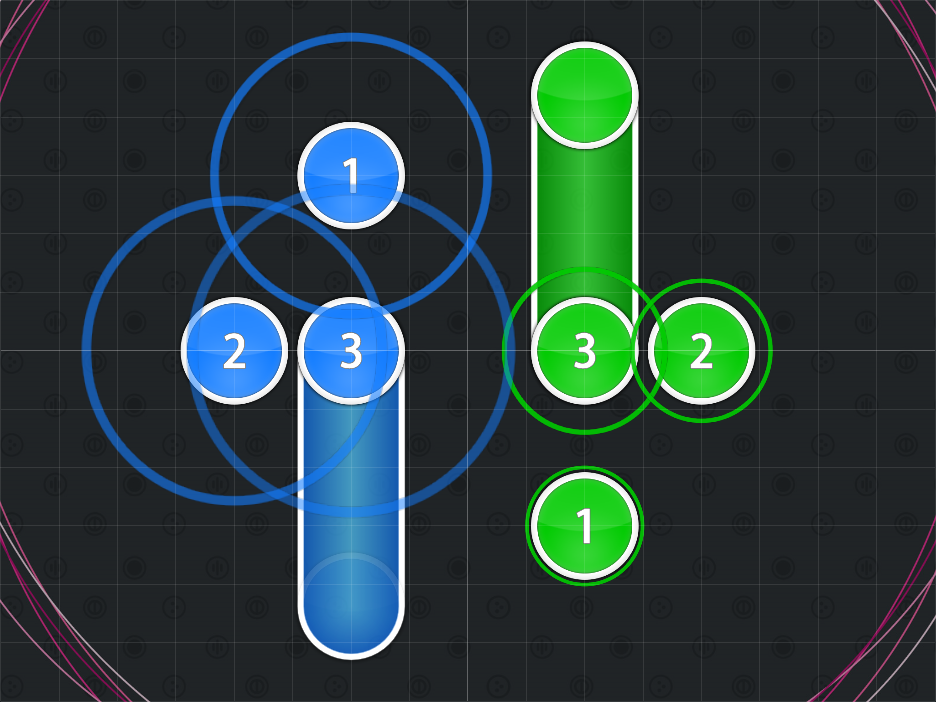

<!-- บทความเหล่านี้ระบุว่าล้าสมัยเนื่องจากถูกสร้างขึ้นนานมากแล้ว ข้อมูลบางส่วนอาจไม่รองรับ/ผิดพลาด และอาจทำให้เกิดความเข้าใจผิดในบริบทการทำแมพสมัยใหม่ - clayton -->

# เทคนิคการสร้างแมพขั้นพื้นฐาน (Basic mapping techniques)

## การไหลลื่นของ Beatmap (Common Beatmap Flow)

เมื่อเริ่มต้นสร้าง Beatmap แนวทางปฏิบัติที่ดีคือการเริ่มจากการวางโน้ตตามจังหวะดนตรี (หรือเสียงร้อง) คุณจะต้องตัดสินใจว่าสิ่งใดจะดีที่สุดสำหรับผู้เล่น เพราะการเลือกตามอย่างใดอย่างหนึ่งอาจส่งผลดีหรือผลเสียต่อประสบการณ์ในการเล่น Beatmap นั้นได้

## ความสมมาตร (Symmetry)

**ความสมมาตร (Symmetry)** คือการที่ส่วนประกอบใน Beatmap มีความสมมาตรกันโดยอ้างอิงตามแกนใดแกนหนึ่ง รูปแบบความสมมาตรที่พบบ่อยที่สุดคือความสมมาตรในแนวนอน นอกจากนี้ยังมีรูปแบบอื่นๆ เช่น ความสมมาตรในแนวตั้ง, แนวทแยง และความสมมาตรโดยอ้างอิงจากจุดศูนย์กลาง (Symmetry with respect to the origin)

เพื่อให้คุณเข้าใจกระบวนการทำความสมมาตรได้ดียิ่งขึ้น เราจะดูตัวอย่างความสมมาตรในแมพที่ได้รับการจัดอันดับ (Ranked) แล้ว การอธิบายความสมมาตรด้วยตัวอักษรเพียงอย่างเดียวอาจไม่เห็นภาพเท่ากับการดูตัวอย่างภาพประกอบ

### ความสมมาตรในแนวนอน (Horizontal Symmetry)

### ความสมมาตรในแนวตั้ง (Vertical Symmetry)

### ความสมมาตรโดยอ้างอิงจากจุดศูนย์กลาง (Symmetry With Respect to the Origin)

`-f(x) = f(-x)`

ความสมมาตรประเภทนี้บางครั้งถูกเรียกว่า "ความสมมาตรแบบหมุน" (Rotational symmetry) แต่นั่นอาจจะไม่ถูกต้องนัก มันคือความสมมาตรโดยอ้างอิงจากจุดศูนย์กลาง ซึ่งทำได้ง่ายกว่าที่คิด

วิธีทำคือการคัดลอกและวางรูปแบบ (Pattern) ที่ต้องการ จากนั้นจึงทำการกลับด้าน (Flip) ทั้งในแนวตั้งและแนวนอน ความสมมาตรแบบนี้จะดูแนบเนียนและสวยงามกว่าความสมมาตรในแนวตั้งหรือแนวนอนแบบตรงๆ

### ความสมมาตรแบบดัดแปลง (Modified Symmetry)

**ความสมมาตรแบบดัดแปลง (Modified Symmetry)** คือการนำรูปแบบที่สมมาตรมาปรับเปลี่ยนในลักษณะต่างๆ ซึ่งบางครั้งก็ได้ผลลัพธ์ที่ดีและบางครั้งก็ไม่

ตัวอย่างที่ประสบความสำเร็จคือช่วงเวลา 00:20:455 (1,2,3) ซึ่งมีการใช้ฟีเจอร์การย่อขยาย (Scale) เพื่อทำให้วัตถุชิ้นที่ (3) เป็นเวอร์ชันที่สั้นกว่าของชิ้นที่ (1) สิ่งนี้ได้ผลเพราะผู้เล่นสามารถสังเกตเห็นความเชื่อมโยงได้ชัดเจน แต่ทั้งนี้ก็ขึ้นอยู่กับความชอบส่วนบุคคล

ตัวอย่างที่ไม่ค่อยประสบความสำเร็จคือช่วง 01:08:455 (3,4,5,6,7) โดย Slider ทางซ้ายเป็นส่วนหนึ่งของ Slider ทางขวา และพยายามจะใช้ชิ้นที่ (6) เพื่อทำให้ Slider ทางซ้ายดู "สมบูรณ์" สาเหตุที่ไม่ค่อยได้ผลเพราะผู้เล่นสังเกตเห็นได้ยาก และ Modder หลายคนมองว่า Mapper เพียงแค่วางโน้ตไปตามใจชอบเท่านั้น

### ตัวอย่างอื่นๆ

แมพที่ยกตัวอย่างมานี้ยังมีจุดอื่นๆ ที่น่าสนใจให้ศึกษา หรือหากคุณต้องการดูแมพอื่น ผลงานของ Krisom มักจะได้รับการยอมรับว่าเป็นตัวอย่างที่ดีเยี่ยมของการวางรูปแบบและโครงสร้างที่สวยงาม รวมถึงมีการใช้ความสมมาตรที่น่าสนใจ

## Jump (การกระโดด)

**Jump** (การกระโดด) คือเทคนิคการสร้างแมพขั้นสูงที่ Mapper วาง Hit objects สองชิ้นให้ห่างกันเกินกว่าที่ค่าตัวคูณ Distance snap ปกติจะกำหนดไว้ มักจะทำได้โดยการเปลี่ยนค่าตัวคูณ Distance snap ชั่วคราว หรือปิดการใช้งาน Distance snap ในช่วงเวลานั้น

โดยทั่วไป Jump มักใช้เพื่อเน้นย้ำช่วงที่ดนตรีมีความเข้มข้นสูง หรือใช้เพื่อสร้างอารมณ์ร่วม นอกจากนี้ยังช่วยในการแยกคอมโบออกจากกันและป้องกันไม่ให้โน้ตวางกองกันหนาแน่นเกินไปในพื้นที่เดียว โดยปกติ Jump จะพบในระดับความยาก Hard และ Insane ส่วนในระดับ Easy และ Normal อาจพบได้บ้างแต่จะเป็น Jump ขนาดเล็กและมีระยะเวลาให้ผู้เล่นตอบสนองได้ทัน

### การใช้ Jump ที่ผิดวิธี

ข้อผิดพลาดที่พบบ่อยของ Mapper มือใหม่คือการเห็นการใช้ Jump ในแมพระดับ Insane ของคนอื่น แล้วนำมาใช้ในแมพของตนเองโดยไม่เข้าใจวิธีการใช้อย่างถูกต้อง จนทำให้แมพดูสะเปะสะปะ หากคุณต้องการใช้ Jump ให้ถามตัวเองว่า "มีส่วนใดในดนตรีหรือจังหวะที่สื่อว่าควรจะมีการกระโดดตรงนี้หรือไม่?"

แนะนำให้หลีกเลี่ยงการใช้ Jump ตามความรู้สึก (Feel jumps) จนกว่าคุณจะมีความเชี่ยวชาญมากขึ้น สำหรับแมพแรกของคุณ การทำสิ่งที่เรียบง่ายและถูกต้องตามจังหวะจะเป็นทางเลือกที่ดีกว่า

## Stream (สตรีม)

**Stream** (สตรีม) คือลำดับของ Hit objects (มักจะเป็น Hit circles) ที่วางเรียงต่อกันอย่างรวดเร็วและสม่ำเสมอ เมื่อพูดถึง "Stream" มักจะหมายถึงการวางโน้ตที่ห่างกัน 1/4 จังหวะ หากต้องการสื่อถึงจังหวะ 1/2 จะเรียกว่า "1/2 stream" รูปแบบ Stream เริ่มเป็นที่นิยมจากเพลงแนว beatmania IIDX, Eurobeat และเพลงที่มีจังหวะกลองที่หนาแน่น

### เมื่อไหร่ที่ควรใช้

Stream เหมาะสำหรับระดับความยากที่สูงขึ้นเมื่อเสียงดนตรีมีความถี่สอดคล้องกัน เพลงบางแนวอย่าง Eurobeat จะมีช่วงที่เหมาะกับการใส่ Stream จำนวนมาก โดย Stream อาจประกอบด้วย Hit circles ล้วนๆ หรือผสมกับ Slider ก็ได้

คุณควรสังเกตว่าเครื่องดนตรีมักจะมีโน้ต 3 ตัวที่ห่างกัน 1/4 จังหวะ คุณสามารถสร้าง Stream สั้นๆ ตามโน้ตเหล่านั้นได้ ซึ่งจะช่วยให้แมพมีความน่าสนใจขึ้น

### เมื่อไหร่ที่ไม่ควรใช้

ในโหมด osu! แนะนำให้ใส่ Stream เฉพาะจุดที่ตรงกับเสียงเครื่องดนตรีเท่านั้น หากทำนอกเหนือจากนี้จะเรียกว่า *[Overmapping](/wiki/Beatmapping/Overmapping)* ซึ่งไม่แนะนำสำหรับมือใหม่ ในทางกลับกัน แมพโหมด osu!taiko มักจะสร้างรูปแบบ Stream เพื่อให้เข้ากับจังหวะกลองซึ่งเป็นหัวใจหลักของเพลง อย่างไรก็ตาม การใช้ Stream มากเกินความจำเป็นก็ไม่เป็นที่แนะนำเช่นกัน
