<!-- บทความเหล่านี้ระบุว่าล้าสมัยเนื่องจากถูกสร้างขึ้นนานมากแล้ว ข้อมูลบางส่วนอาจไม่รองรับ/ผิดพลาด และอาจทำให้เกิดความเข้าใจผิดในบริบทการทำแมพสมัยใหม่ - clayton -->

# การสร้าง Slider ที่ดี (Making good sliders)

บทความนี้จะสอนวิธีการสร้าง Slider ที่มีคุณภาพดี โดยพื้นฐานแล้วสิ่งที่คุณต้องการคือการเข้าใจเรื่อง [เส้นโค้งเบซีเย (Bézier curve)](https://en.wikipedia.org/wiki/B%C3%A9zier_curve)

คำแนะนำจาก [Ephemeral](https://osu.ppy.sh/users/102335):

> ให้พยายามปรับจุดสิ้นสุดของ Slider ให้ตรงกับค่าที่เล็กที่สุดเสมอ (หมายความว่า หากคุณลากมันถอยหลังไปอีกนิด Slider จะสั้นลง) การทำเช่นนี้จะช่วยให้จุดศูนย์กลางอยู่ที่ปลาย Slider พอดี และช่วยให้การทำเส้นโค้งที่สวยงามทำได้ง่ายขึ้นมาก

นอกจากนี้ การทำแบบนี้ยังช่วยให้การใช้คำสั่งกลับด้าน (Reverse selection) บน Slider ไม่ทำให้รูปทรงเพี้ยนไป ซึ่งเป็นเรื่องที่ดี

## เส้นโค้งรูปพัด (Arcs)

ใช้เทคนิคเดียวกันนี้กับ Slider ใดๆ ที่มีความสมมาตรตามแกนเดียว

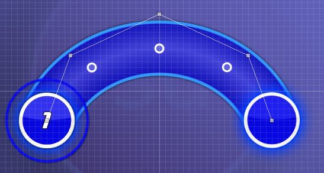

นี่คือรูปทรงที่สร้างได้ง่ายที่สุด วิธีการคือ:
1. วางจุดควบคุมทั้งหมดให้สมมาตรกันตามตาราง (Grid) ตั้งแต่แรก
2. เลือก Slider นั้นแล้วกด `Ctrl` + `H` เพื่อตรวจสอบว่าจุดต่างๆ อยู่ในตำแหน่งที่สมมาตรกันจริงหรือไม่
3. ขยับจุดควบคุมไปรอบๆ จนกว่า Slider จะมีความยาวตามที่ต้องการ โดยให้ปลาย Slider ขาดจากจุดสุดท้ายไปเพียงเล็กน้อย
4. สิ่งสำคัญคือ เมื่อคุณขยับจุดควบคุมหนึ่งจุด คุณต้องขยับจุดที่คู่กันในลักษณะเดียวกันเพื่อให้คงความสมมาตรไว้เสมอ หมั่นกด `Ctrl` + `H` บ่อยๆ เพื่อเช็คความถูกต้อง

วิธีการทำให้ปลาย Slider ตรงกับจุดสุดท้ายพอดี:
ให้กดปุ่ม Shift ค้างไว้เพื่อปิด Grid snap แล้วลากจุดบนสุดลงมาเรื่อยๆ จนกว่าปลาย Slider จะทับกับจุดสุดท้ายพอดี เมื่อคิดว่าเป๊ะแล้ว ให้ลองกด `Ctrl` + `H` สองสามครั้งเพื่อดูว่าจุดสุดท้ายขยับหรือไม่ ถ้าไม่ขยับเลย ยินดีด้วย! คุณได้ Slider ที่สวยงามแล้ว

หากคุณต้องการ Arc ในมุมเฉียง แนะนำให้สร้างแบบแนวตั้งตรงก่อน แล้วค่อยใช้เมนู `Edit` -> `Rotate By...` เพื่อหมุนไปยังมุมที่ต้องการ

## รูปคลื่น (Waves)

ใช้เทคนิคเดียวกันนี้กับ Slider ที่มีความสมมาตรแบบหมุน (Rotationally symmetrical)

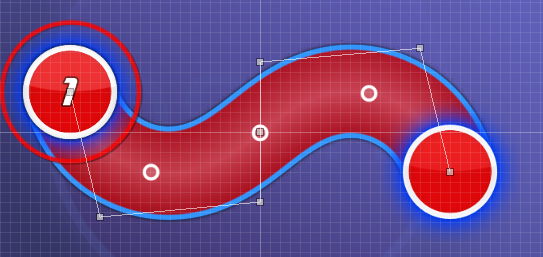

การสร้างรูปคลื่นจะคล้ายกับ Arc มาก เพียงแต่จุดควบคุมของคุณควรจะสมมาตรแบบหมุนซึ่งกันและกัน แทนที่จะเป็นการกลับด้านซ้ายขวา หากคุณกด `Ctrl` + `H` + `J` จะเป็นการหมุน Slider 180 องศา ซึ่งช่วยให้คุณตรวจสอบความสมมาตรของจุดควบคุมได้

ในการทำให้ปลาย Slider ตรงพอดี ให้เลือกจุดสมมาตรสองจุด ปิด Grid snap แล้วค่อยๆ ขยับทั้งสองจุดเข้าหากันทีละนิดจนกว่าปลาย Slider จะทับกับจุดสุดท้ายพอดี

## Beat Blankets

*หน้าหลัก: [Blanket Combos](/wiki/Beatmapping/Mapping_techniques/Formations#blanket-combos)*

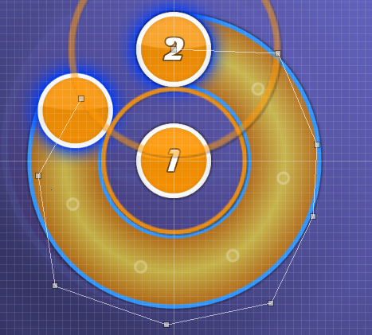

การทำ Blanket จะง่ายที่สุดหากคุณกะระยะด้วยสายตาให้ใกล้เคียงก่อน จากนั้นเลื่อนไทม์ไลน์ไปยังจุดที่วงกลมบอกจังหวะ (Approach circle) ของโน้ตที่ต้องการคลุม วางทับขอบด้านในของหัว Slider พอดี (อาจใช้การ Snap ระดับ 1/8 ช่วย) จากนั้นจึงค่อยๆ ปรับจุดควบคุมจนกว่าตัว Slider ทั้งหมดจะโค้งโอบรอบ Approach circle ได้เป๊ะที่สุดเท่าที่จะทำได้

จำไว้ว่าหากคุณต้องการให้ Slider เป็นทั้งแบบ Blanket และสมมาตรด้วย ให้จัดการเรื่องความสมมาตรก่อน แล้วจึงค่อยปรับจุดควบคุมแบบสมมาตรเพื่อเพิ่มความเป๊ะของ Blanket

---

คำแนะนำจาก [Gonzvlo](https://osu.ppy.sh/users/237733):

> อีกเทคนิคหนึ่งในการทำ Blanket ผมมักจะใช้ Spinner มาช่วยกะระยะเพื่อให้ได้วงกลมที่สวยงาม

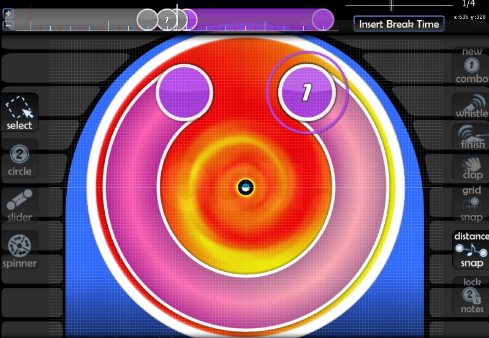

## วงกลม (Circles)

เอื้อเฟื้อข้อมูลโดย mm201

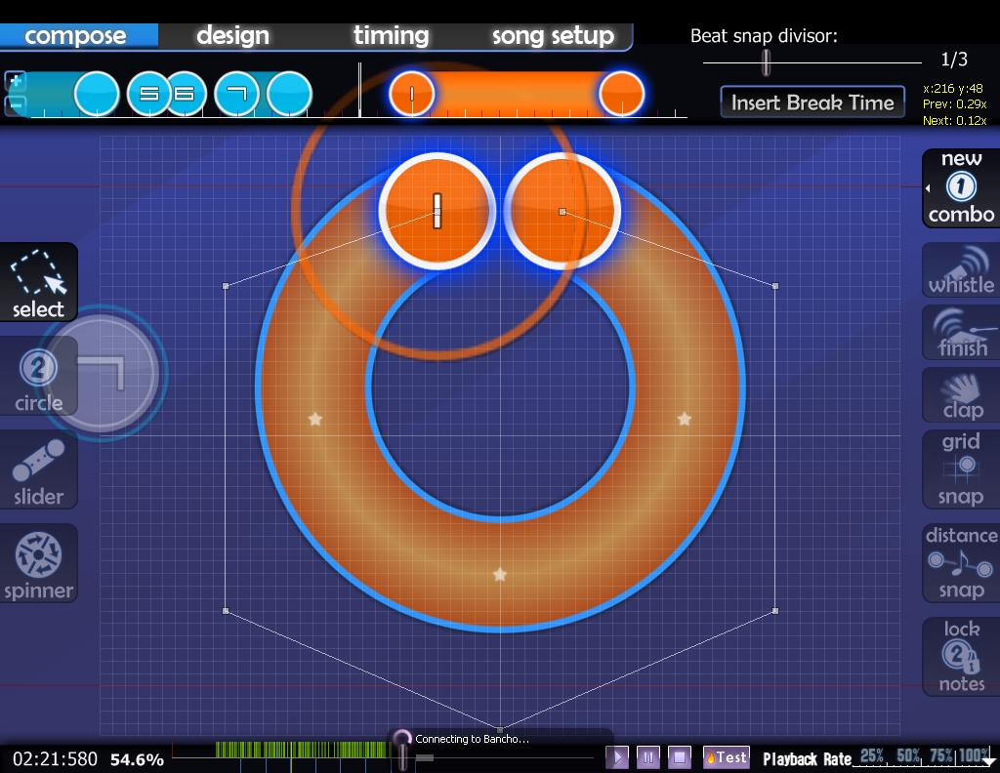

จำนวนจุดควบคุมที่แนะนำขึ้นอยู่กับมุมของส่วนโค้งที่คุณต้องการ:

- 0 องศา: 2 จุด
- 0–20 องศา: 3 จุด
- 20–170 องศา: 4 จุด
- 170–200 องศา: 5 จุด
- 200–300 องศา: 6 จุด
- 300–350 องศา: 7 จุด

ตัวเลขนี้ไม่ใช่ค่าคงที่ที่แน่นอน แต่เป็นเพียงแนวทางคร่าวๆ เช่นเดียวกับรูปคลื่น ยิ่งจุดควบคุมอยู่ห่างจากจุดเริ่ม/จุดจบเท่าไหร่ จุดนั้นก็จะยิ่งส่งผลต่อความกว้างของส่วนโค้งมากเท่านั้น พยายามทำให้เส้นควบคุมแรกและเส้นสุดท้ายชี้ไปยังทิศทางที่คุณต้องการให้วงกลมเริ่มวน ส่วนจุดอื่นๆ ให้ปรับด้วยสายตาจนกว่าจะดูเป็นวงกลมที่มนสวย โดยใช้ Approach circle เป็นไกด์ช่วยกะระยะ

เช่นเดียวกับรูปทรงอื่นๆ ให้เหลือจุดควบคุมไว้หนึ่งหรือสองจุดสำหรับปรับแต่งแบบปิด Grid snap เพื่อให้ปลาย Slider ตรงตำแหน่งพอดี

## ข้อศอก (Elbows)

ใช้เทคนิคนี้กับ Slider ที่มีทั้งส่วนตรงและส่วนโค้งผสมกัน

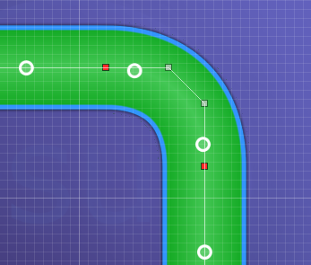

เมื่อต้องการสร้าง Slider ที่เปลี่ยนจากส่วนโค้งเป็นส่วนตรง ให้ใช้ **จุดควบคุมสีแดง** ตรงจุดที่เปลี่ยนทิศทาง สิ่งที่สำคัญที่สุดคือ **ต้องวางจุดควบคุมสีแดงและจุดควบคุมที่อยู่ขนาบข้างทั้งสองด้านให้เป็นเส้นตรงเดียวกันเสมอ** เพื่อไม่ให้เกิดรอยหักที่ดูไม่สวยงาม

## รูปหัวใจ (Hearts)

ใช้เทคนิคเดียวกันกับ Slider ที่มีความสมมาตร โดยมีจุดเริ่มต้นอยู่บนเส้นกึ่งกลาง

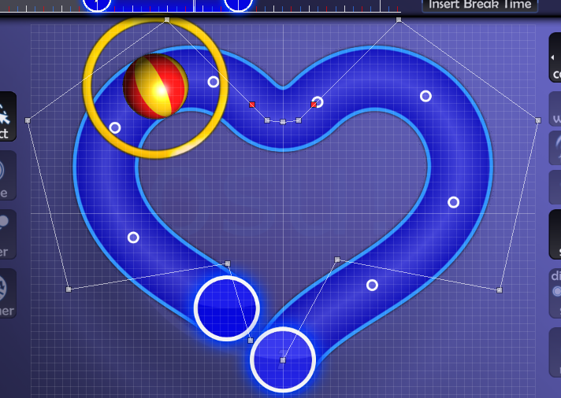

รูปทรงที่สวยงามและนิยมใช้ในบางโอกาส นี่คือขั้นตอนการสร้าง:

### วิธีสร้างรูปหัวใจ

1. สร้างรูปหัวใจพื้นฐานให้ยาวกว่าที่ต้องการเล็กน้อย โดยให้ทั้งจุดเริ่มและจุดจบอยู่ที่ตำแหน่งเดียวกันด้านล่าง
2. พยายามเลียนแบบตำแหน่งจุดตามภาพหากคุณพบปัญหา การใช้จุดสีแดงเพียงจุดเดียวด้านบนก็ได้ผลดี แต่ผมชอบใช้แบบเส้นโค้ง Elbow มากกว่า

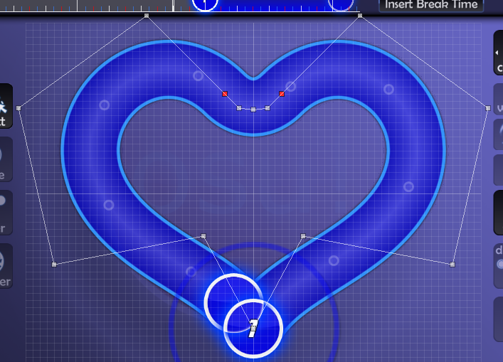

---

3. คัดลอกและวาง Slider นี้ไว้ในขีดจังหวะถัดไปทันที แล้วทำการกลับด้านในแนวนอน (Horizontal flip) ดังภาพ

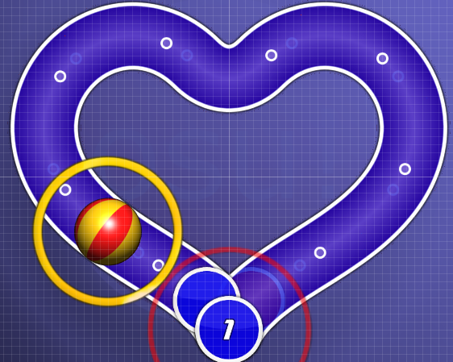

---

4. ลากจุดสุดท้ายของ Slider อันแรกกลับมายังตำแหน่งที่คุณต้องการให้ Slider จริงๆ สิ้นสุด

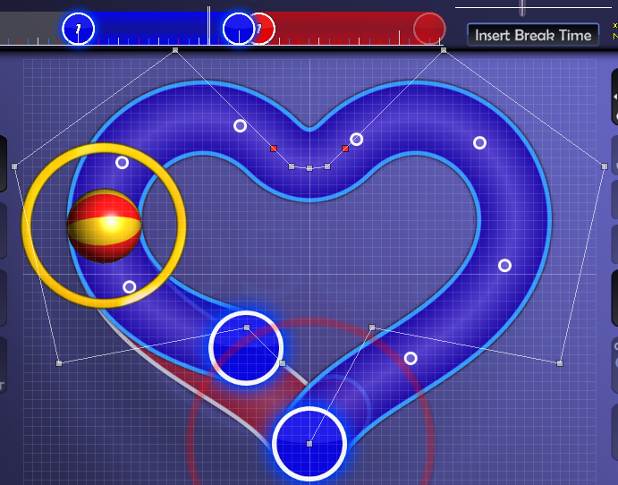

---

5. สังเกตว่ามันดูเบี้ยวและไม่สวยงาม? ให้ลองปรับจุดควบคุมในช่วงครึ่งหลังของ Slider จนกว่าเส้นของมันจะทับกับ Slider อันที่วางซ้อนไว้ด้านหลังพอดี

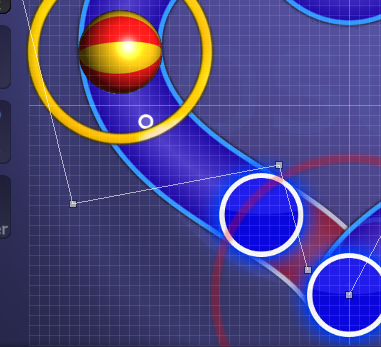

---

6. เมื่อทำเสร็จแล้ว ให้ลบ Slider อันที่วางซ้อนด้านหลังทิ้ง แล้วใช้การย่อขยาย (Scale) เพื่อปรับขนาดให้พอดีกับช่องว่าง

## เส้นหยัก (Wiggles)

มีสองสามวิธีในการทำ ขึ้นอยู่กับว่าคุณต้องการเส้นหยักแบบไหน

### แบบที่ 1

จุดเริ่มและจุดจบชี้ไปทางเดียวกัน

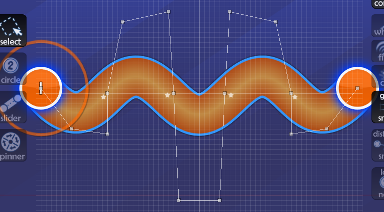

สิ่งสำคัญคือส่วนโค้งแต่ละส่วนที่ประกอบเป็นเส้นหยักจะใช้จุดควบคุม 4 จุด และยิ่งเข้าใกล้จุดศูนย์กลางมากเท่าไหร่ จุดควบคุมทั้ง 4 จุดนั้นจะต้องยิ่งสูงขึ้นเพื่อให้ดูสมดุล เมื่อได้รูปทรงพื้นฐานแล้ว ให้ใช้สายตาปรับจนกว่าจะดูสม่ำเสมอและปลาย Slider ทับจุดสุดท้ายพอดี อย่าลืมใช้ `Ctrl` + `H` ตรวจสอบความสมมาตรตลอดเวลา

### แบบที่ 2

จุดเริ่มและจุดจบชี้ไปคนละทาง

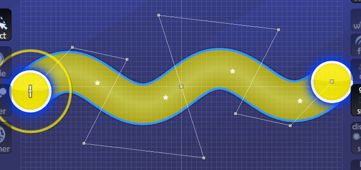

คล้ายกับ [แบบที่ 1](#แบบที่-1) คือส่วนโค้งแต่ละส่วนใช้ 4 จุด แต่ Mapper ที่มีประสบการณ์แนะนำว่าการวางจุดให้ดูบิดเบี้ยวเล็กน้อย (ตามภาพ) จะช่วยให้รูปทรงดูดีขึ้น รูปทรงนี้เป็นแบบสมมาตรแบบหมุน (เหมือน Wave) ดังนั้นให้ใช้ `Ctrl` + `H` + `J` เพื่อตรวจสอบ

### แบบที่ 3

เส้นหยักแบบถี่มาก (Super Tight Wiggles)

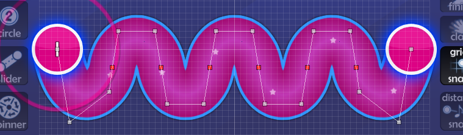

บางครั้งเส้นหยักอาจจะถี่เกินกว่าจะใช้วิธีปกติได้ จึงจำเป็นต้องใช้จุดสีแดง ตรวจสอบให้แน่ใจว่าจุดควบคุมในแต่ละส่วนระหว่างจุดสีแดงแต่ละคู่มีตำแหน่งที่เหมือนกันทุกประการ (ยกเว้นส่วนสุดท้าย) คุณสามารถเช็คได้โดยการคัดลอก Slider มาวางทับเพื่อดูความเป๊ะ และต้องแน่ใจว่าจุดสีแดงและจุดข้างเคียงทั้งสองเป็นเส้นตรงเดียวกันเพื่อเลี่ยงรอยหยักที่ไม่ต้องการ

## วนลูป (Loops)

รูปทรงที่พูดง่ายแต่ทำยาก

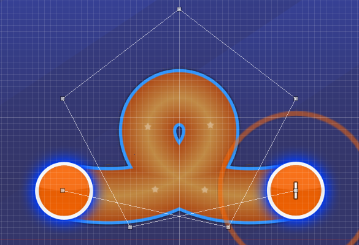

สิ่งที่ต้องจำเมื่อทำรูปทรงลูปคือ จุดควบคุมจะต้องวางสูงกว่าตัวลูปที่ปรากฏจริงค่อนข้างมาก:
- ยิ่งจุดควบคุมอยู่ห่างจากจุดเริ่ม/จบมากเท่าไหร่ จุดนั้นจะต้องยิ่งวางห่างจากตัว Slider มากขึ้นเท่านั้น

ปัญหาที่พบบ่อยที่สุดของลูปคือ "รู" ของลูป คุณควรทำให้รูมีลักษณะมนสวยเหมือนหยดน้ำที่เปิดออก หากรูลูปของคุณดูเหมือนภาพด้านล่างนี้ แสดงว่ามันยังไม่สมบูรณ์แบบพอ:

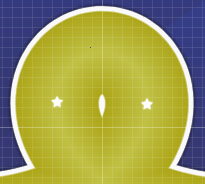

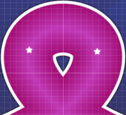

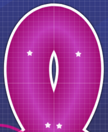
