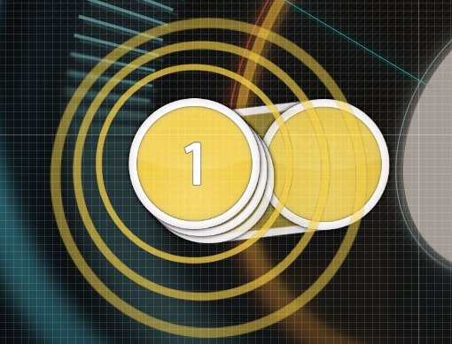

# Stack

Ein **Stack** (zu Dt. *Stapel*) ist eine Gruppe von [Hit-Objekten](/wiki/Gameplay/Hit_object), die auf dem [Spielfeld](/wiki/Client/Playfield) miteinander [überlappen](/wiki/Beatmapping/Mapping_techniques/Overlap). Am häufigsten werden [Hit-Circles](/wiki/Gameplay/Hit_object/Hit_circle) gestapelt.

Sobald Hit-Objekte nahezu perfekt miteinander überlappen, werden Stacks automatisch erstellt. Die [Stackzuordnung](/wiki/Beatmap/Stack_leniency) einer Beatmap bestimmt, wie gering der zeitliche Abstand zwischen Objekten sein muss, damit sich ein Stack bildet.
