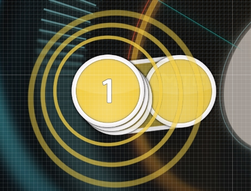

# Stack (การกองซ้อน)

**Stack** (การกองซ้อน) คือกลุ่มของ [Hit objects](/wiki/Gameplay/Hit_object) ที่วาง [ทับซ้อน (Overlap)](/wiki/Beatmapping/Mapping_techniques/Overlap) กันในสนามเล่น วัตถุที่พบบ่อยที่สุดในการทำ Stack คือ [Hit circles](/wiki/Gameplay/Hit_object/Hit_circle)

Stack จะถูกสร้างขึ้นโดยอัตโนมัติเมื่อ Hit objects ถูกวางทับซ้อนกันจนเกือบจะสมบูรณ์แบบ ระยะเวลาที่วัตถุจะเริ่มถูกพิจารณาให้ซ้อนกันนั้นถูกกำหนดโดยค่า [Stack leniency](/wiki/Beatmap/Stack_leniency) ของ Beatmap นั้นๆ
