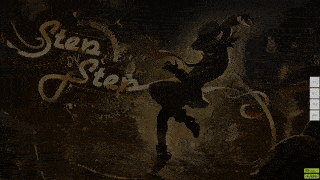
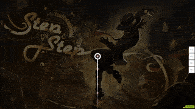

# Overmapping

In beatmapping, **overmapping** is a technique where [hit objects](/wiki/Gameplay/Hit_object) are deliberately placed in a way that creates a higher gameplay intensity compared to what the song (or the rest of the map) conceivably calls for.

This is mainly done by mapping to inaudible or non-existant sounds (e.g. adding notes on blue ticks when the song has sounds only on red ticks). Less frequently, overmapping can also be achieved by adding exorbitantly large [jumps](/wiki/Beatmap/Pattern/osu!/Jump) or sliders with very high [slider velocity](/wiki/Gameplay/Hit_object/Slider/Slider_velocity).

## Examples

While overmapping by itself is generally discouraged, there are contexts where the technique is acceptable, such as when the added rhythm [fits the song and creates emphasis that benefits the map's quality](https://osu.ppy.sh/community/forums/posts/7791118).
