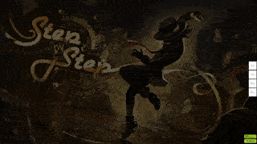
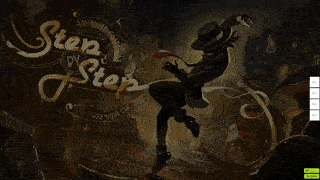

# Овермаппинг

**Овермаппинг** (англ. *overmapping*) — приём, при котором интенсивность карты усиливается за счёт намеренной расстановки [объектов](/wiki/Gameplay/Hit_object) там, где этого не предполагает музыка.

Овермаппинг достигается маппингом тихих или несуществующих, но ритмически подходящих звуков: например, когда в песне есть явственные звуки только на красных тиках, маппер может поставить ноты и на синие тики. Кроме этого, овермаппинг можно получить, добавив в карту чересчур широкие [прыжки](/wiki/Beatmap/Pattern/osu!/Jump) или слайдеры с очень высокой [скоростью](/wiki/Gameplay/Hit_object/Slider/Slider_velocity).

## Примеры

Хотя сам по себе овермаппинг не поощряется, в некоторых ситуациях он может быть уместен — например, если добавленный ритм [подходит песне и улучшает карту за счёт акцента](https://osu.ppy.sh/community/forums/posts/7791118).
