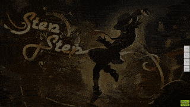
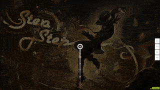

# Overmapping

ในการสร้าง Beatmap **Overmapping** คือเทคนิคการจัดวาง [Hit objects](/wiki/Gameplay/Hit_object) อย่างตั้งใจให้มีความเข้มข้นของเกมเพลย์สูงกว่าที่จังหวะเพลง (หรือส่วนอื่นๆ ของแมพ) ควรจะเป็น

ส่วนใหญ่ทำได้โดยการวางโน้ตตามเสียงที่ไม่ได้ยินหรือไม่มีอยู่จริงในเพลง (เช่น การเพิ่มโน้ตบนขีดสีฟ้า ทั้งที่เพลงมีเสียงแค่บนขีดสีแดง) นอกจากนี้ยังสามารถทำ Overmapping ได้ด้วยการเพิ่ม [Jump (การกระโดด)](/wiki/Beatmap/Pattern/osu!/Jump) ที่มีระยะห่างมากเกินความจำเป็น หรือใช้ Slider ที่มีค่า [Slider velocity](/wiki/Gameplay/Hit_object/Slider/Slider_velocity) สูงมาก

## ตัวอย่าง

แม้ว่าโดยทั่วไปแล้วจะไม่แนะนำให้ทำ Overmapping แต่ก็มีบางบริบทที่เทคนิคนี้เป็นที่ยอมรับได้ เช่น เมื่อจังหวะที่เพิ่มเข้ามานั้น [เข้ากับเพลงและช่วยสร้างการเน้นย้ำที่ส่งผลดีต่อคุณภาพของแมพ](https://osu.ppy.sh/community/forums/posts/7791118)
