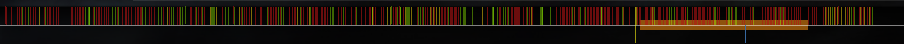

# 测定时间轴 (Timing)

**测定时间轴 (Timing)** 又称为计时、测轴、测时，是通过测定歌曲每段[计时部分](/wiki/Client/Beatmap_editor/Timing)的位置、[每分钟节拍数 (BPM)](/wiki/Music_theory/Tempo)、[拍子记号](/wiki/Music_theory/Time_signature)，来确定歌曲音乐结构的过程。

谱面编辑器提供了[时间轴 (Timing) 设定](/wiki/Client/Beatmap_editor/Timing)，用于放置[打击物件](/wiki/Gameplay/Hit_object)的时间轴也显示为一个[类似标尺的布局](/wiki/Client/Beatmap_editor/Timelines#timing)。当谱师放置物件时，它们会[对齐](/wiki/Beatmapping/Snapping)到时间轴的标线，即[小节](/wiki/Music_theory/Measure)细分线上。这保证物件能轻松地对齐歌曲里存在的音符。

此外，时间轴还能控制以下几点效果：

- 控制在主菜单和[选歌界面](/wiki/Client/Interface#选歌界面)出现的，[osu! 粉饼](/wiki/Client/Interface/Cookie)的心跳效果（以及随着节拍展示的其他主菜单显示效果）
- 控制 [Kiai 时间](/wiki/Gameplay/Kiai_time)内打击物件的闪烁效果
- 使用 [Nightcore](/wiki/Gameplay/Game_modifier/Nightcore) 模组时，给音乐添加鼓轨道音效
- 控制 [osu!taiko](/wiki/Game_mode/osu!taiko) 和 [osu!mania](/wiki/Game_mode/osu!mania) 模式的小节线

时间轴反映了*它所确定的歌曲文件的部分特征*。如果更换或者修改了歌曲文件，影响了波形，此时就可能会影响到原先已经测定好的时间轴。所以，建议先按照[谱面上架标准 (RC)](/wiki/Ranking_criteria#音频) 来处理将用于作图的歌曲文件，再测量歌曲的时间轴。

## 歌曲结构

*主页面：[乐理](/wiki/Music_theory)*

几乎所有歌曲都可以按照不同的节拍来分段。测定时间轴 (Timing) 的目标是将它们划分好，从而为制作谱面创造先决条件。在论述测定时间轴的过程前，先了解音乐理论中的一些概念将会很有帮助。

- [节拍](/wiki/Music_theory/Beat)是节奏的基本单位，通常对应着四分音符。对于其他时值的音符，常用分数和倍数来描述。
- [小节](/wiki/Music_theory/Measure)，一般含有固定数量的节拍，并在歌曲中重复出现。通常地，歌曲的小节第一拍会被强调，称之为[下拍](/wiki/Music_theory/Downbeat)。
- [拍子记号](/wiki/Music_theory/Time_signature)表明了一个小节中含有多少拍（多少个四分音符）。
- [曲速](/wiki/Music_theory/Tempo)即歌曲的速度，通常用每分钟节拍数 (BPM) 来估定。

## 测定流程

*主页面：[如何测定歌曲时间轴 (Timing)](/wiki/Guides/How_to_time_songs)*\
*参见：[谱面编辑器——测定时间轴标签页](/wiki/Client/Beatmap_editor/Timing)*

### 单红线

歌曲文件的开头位置，与歌曲第一个下拍的位置之间的时间，称为偏移量 (offset)。它通常也是第一根红线的位置，osu! 会利用它来推算出其他节拍的位置。使用一根红线通常就能满足无缝衔接或是使用现代数字制作的歌曲。它们没有变奏和变拍，也没有重置重音<!-- TODO: link -->。

在[测定时间轴标签页](/wiki/Client/Beatmap_editor/Timing)，跟着歌曲节拍点击 `T` 键或节拍器按钮，能让 osu! 测定出大致的 BPM。可以手动调整这个值，来确保时间轴完美贴合歌曲。还有几件事需要注意：

- 几乎没有歌曲使用含有小数的 BPM。如果手动测量出过于细化的值，则它很可能不准确。
- 根据[谱面上架标准 (RC)](/wiki/Ranking_criteria#时间轴)，偏移量[必须处于歌曲第一个下拍的位置](/wiki/Guides/Setting_the_offset_on_the_correct_beat)。

### 多红线

部分歌曲的特点是拥有多变的节奏（变奏曲）。使用它们制作的谱面时间轴将含有多个偏移值 (offset)。含有多个 BPM，但是段落分明的歌曲称为**多 BPM 歌曲**，而曲速逐渐变化的歌曲称为**变 BPM 歌曲**。为前者测定时间轴，需要的红线较少，而后者则需要几十上百根红线。

在没有使用节拍器时，混音或演奏的歌曲的时间轴通常会出现曲速差异、随机的节奏变化、音符漂移等情况。这通常是因为艺术家为了表达某些艺术效果刻意为之，或是人为错误导致。当测定这一类歌曲的时间轴时，需要考虑到这一点。然而，这是一项艰巨的任务——除非你有丰富的经验，否则最好不要使用这些歌曲作图。

对于完美契合节拍器的单一或复杂节奏歌曲，如果谱面使用简单的时间轴，仍易于游玩，则可忽略小的时间轴错误（比如某个物件对于它所反映的音符，提前或延后几毫秒出现）。或者，也可以使用 [Audacity](https://www.audacityteam.org/) 等程序直接编辑音频文件，对齐音符来纠正时间轴错误。

有些歌曲在没有变奏或者变拍时，也可能需要添加新红线，来细微调整偏移值 (offset)。这通常是由于混音时未能准确对齐音符，或是在某个小节中增删了节拍导致的。

最后，当歌曲变拍或是重置了重音的位置时，需要添加新红线。比如：歌曲从普通节奏变更为华尔兹舞曲节奏时，通常需要将 4/4 拍调节为 3/4 拍。或者，变为新节奏的小节提前出现，此时需要另一根新红线来重置重音。

## 社区求助

广泛地说，测定时间轴 (Timing) 需要大量的耐心和良好的乐感，是非常难掌握的作图技巧。因此，在公共[聊天](/wiki/Client/Interface/Chat_console)频道或者[论坛](/wiki/Community/Forum)里，向其他谱师或者[摸图员](/wiki/Modding)寻求帮助的情况很常见。有一条专门用于讨论并解决此问题的论坛讨论帖“[测不准时间轴？在这里求助 (Unable to find the BPM/offset of your map? Post here)](https://osu.ppy.sh/community/forums/topics/13795)”——它记录了 13 年以来的 5000 多条求助与解答。

[谱面上架标准 (RC)](/wiki/Ranking_criteria#音频) 包含一段专用于测量时间轴 (Timing)，并在[谱面上架](/wiki/Beatmap_ranking_procedure)时需要遵守的规定。

## 参见

- *[osu! 学院 章节 7-2 - 测定歌曲时间轴 (Timing) 基础](https://www.youtube.com/watch?v=8nsbrOhLE9w)*：[osu! 学院](/wiki/Community/Video_series/osu!academy) YouTube 系列的一集
- *[osu! 作图：测定歌曲时间轴 (Timing)](https://www.youtube.com/watch?v=xauZuMPgiQw)*：[osu! 作图](/wiki/Community/Video_series/osu!mapping) YouTube 系列的一集
