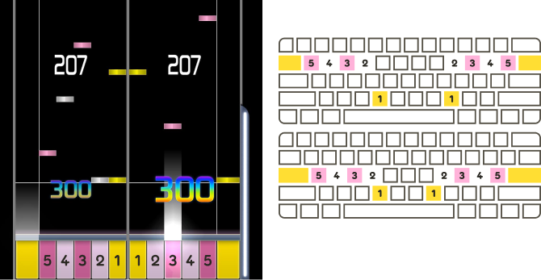
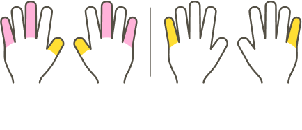
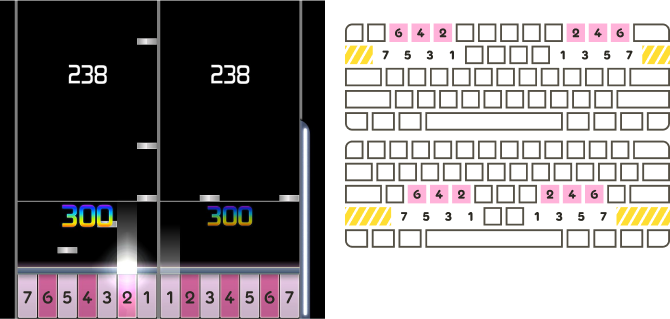
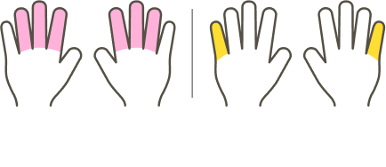
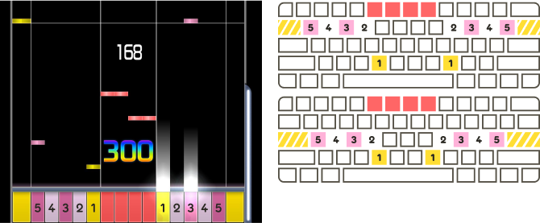
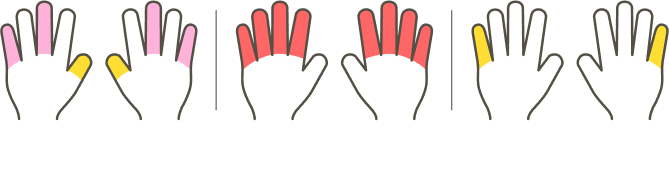
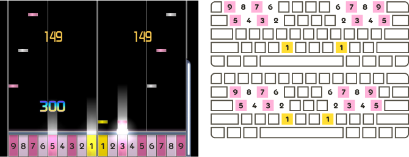
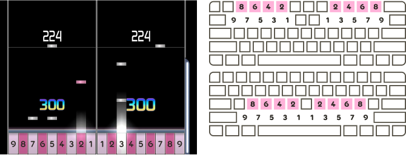
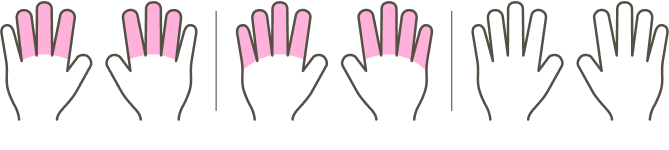

---
tags:
  - 12K+
  - co op
  - co-op
  - column layout
  - column layouts
  - coop
  - key layout
  - key layouts
  - key mode
  - key modes
  - keymode
  - keymodes
  - play style
  - play styles
  - cooperativo
  - disposición de columnas
  - disposiciones de columnas
  - disposición de teclas
  - disposiciones de teclas
  - modo de teclas
  - modos de teclas
  - estilo de juego
  - estilos de juego
---

<!--
Las imágenes traducidas del artículo se pueden encontrar aquí: <https://www.figma.com/file/6Iz6WnqnlEo61kdJHNx2nd>

—Agatem <3
-->

# Estilos de juego 10K+ de osu!mania

Este artículo documenta los estilos de juego comunes usados por los [beatmaps](/wiki/Beatmap) de [osu!mania](/wiki/Game_mode/osu!mania) con 10 o más teclas.

En este contexto, un **estilo de juego** es un conjunto sugerido de [asignaciones de teclas](/wiki/Game_mode/osu!mania#controles) y orden de teclas en el [campo de juego](/wiki/Game_mode/osu!mania#campo-de-juego). La mayoría de los beatmaps de osu!mania con más de 10 teclas se mapean con un estilo de juego en particular; el jugador tiene menos dedos que teclas, por lo que suele ser necesario tener en cuenta dónde se colocarán las manos del jugador en el [teclado](/wiki/Gameplay/Input_device/Keyboard) a lo largo del mapa.

El jugador puede elegir ignorar el estilo de juego previsto, pero se vuelve más difícil hacerlo en [niveles de dificultad](/wiki/Beatmap/Difficulty#niveles-de-dificultad) altos, y puede resultar en [patrones](/wiki/Beatmap/Pattern) que se sienten raros de jugar o son casi imposibles de presionar.

Cada estilo de juego requiere que el jugador ajuste sus [asignaciones de teclas](/wiki/Game_mode/osu!mania#controles) apropiadamente, y fomenta el uso de [skins](/wiki/Skin) personalizadas. En este artículo, las imágenes del juego usarán la skin predeterminada un poco modificada para ayudar a ilustrar varios estilos de juego.

## 10K (10 teclas) {#10K}

**10K** es el estilo de juego donde cada mano es responsable de 5 teclas.

Mientras 10K es tratado por el [cliente del juego](/wiki/Client) como modo «[co-op](/wiki/Game_mode/osu!mania#co-op)», los mappers normalmente lo tratan como un modo de teclas normal. Esto se debe a que cada tecla puede ser presionada por un único dedo, y no es necesario tener en cuenta ninguna colocación especial o asignación de teclas.

## 10K2S (12 teclas) {#10K2S}

**10K2S** es un estilo de juego de 12 teclas parecido a [10K](#10K), pero incluye una tecla ***s**cratch* en cada borde de la pantalla.

Cada mano descansa en el medio de las 10 teclas. Las dos teclas scratch se presionan comúnmente moviendo el dedo meñique hacia fuera.

## DP (14 o 16 teclas) {#DP}

**DP** o **Double Play**, llamado así por el modo de juego en *[beatmania IIDX](https://es.wikipedia.org/wiki/Beatmania_IIDX_(serie) "\"beatmania IIDX\" en Wikipedia")*, es un estilo de juego de 14 teclas o 16 teclas donde cada mano es responsable de 7 teclas, organizadas en filas inferiores de 4 teclas y filas superiores de 3 teclas. Las filas inferiores y superiores están intercaladas de manera que la primera tecla es inferior, la segunda superior, la tercera inferior, y así sucesivamente. Una tecla *scratch* adicional puede incluirse en cada borde exterior del escenario.

Junto a [EZ2AC](#EZ2AC), este estilo de juego se conoce más ampliamente como «14K» o «14K2S».

Cada mano normalmente descansa en las teclas etiquetadas 1, 2, 4, 6 y 7 en los diagramas de arriba. La tecla 5 se puede presionar con el dedo anular, y la tecla 3 se puede presionar con el pulgar o el índice. Las dos teclas scratch, si se incluyen, se presionan comúnmente moviendo el dedo meñique hacia fuera.

## EZ2AC (14 o 16 teclas) {#EZ2AC}

**EZ2AC**, llamado así por las entradas posteriores en la serie *[EZ2DJ](https://es.wikipedia.org/wiki/EZ2DJ "\"EZ2DJ\" en Wikipedia")*, es un estilo de juego de 14 teclas o 16 teclas parecido a [10K](#10K) o [10K2S](#10K2S), pero incluye un conjunto separado de 4 teclas en el medio del escenario.

Este estilo de juego también se conoce como «Space Mix» o «14K MANIAC», ambos son nombres de la serie *EZ2DJ*. Junto a [DP](#DP), se le conoce más ampliamente como «14K» o «14K2S».

Cada mano descansa en las mismas teclas que 10K o 10K2S. Es posible que una o ambas manos tengan que alejarse de sus posiciones habituales para presionar las 4 teclas del medio.

## 10K8K (18 teclas) {#10K8K}

**10K8K** es un estilo de juego de 18 teclas parecido a [10K](#10K), pero incluye 8 teclas adicionales posicionadas encima o debajo de las 4 teclas más externas en cada lado del escenario. Las teclas adicionales no se intercalan; están todas fuera o todas dentro, según el grupo de teclas que se posicionaron arriba o debajo.

Este estilo de juego también se conoce como «4K10K4K» o «8K10K».

Cada mano descansa en las mismas teclas que 10K. Todos los dedos, excepto los pulgares, tienen que moverse arriba o abajo para presionar los conjuntos adicionales de 4 teclas.

## 9K9K (18 teclas) {#9K9K}

**9K9K** es un estilo de juego de 18 teclas similar al [DP](#DP) de 14 teclas, pero las filas inferiores y superiores de cada lado del escenario incluyen 5 y 4 teclas respectivamente, en lugar de 4 y 3. Se parece a un hipotético modo DP para *[pop'n music](https://es.wikipedia.org/wiki/Pop%27n_music_(serie) "\"Pop'n Music\" en Wikipedia")*.

Este estilo de juego tiene muchas posiciones de descanso para las manos. Jugar mapas con este estilo de juego requiere reposicionamientos constantes.
