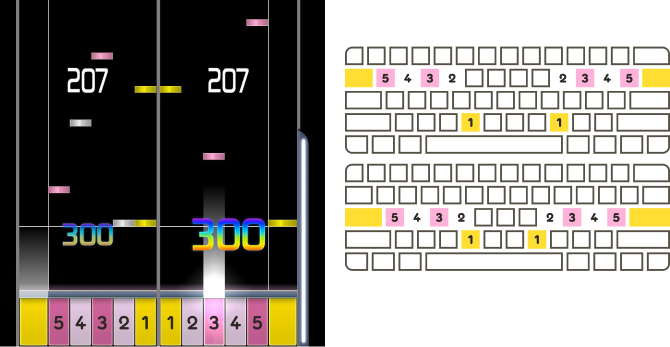
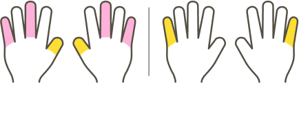
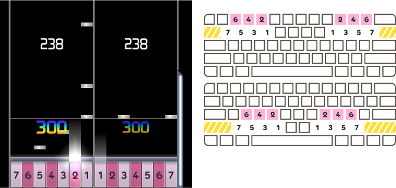
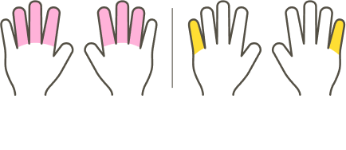
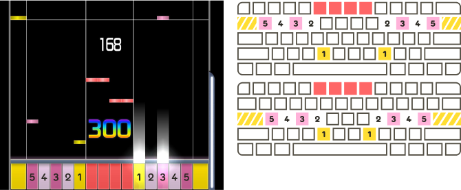
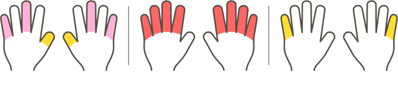
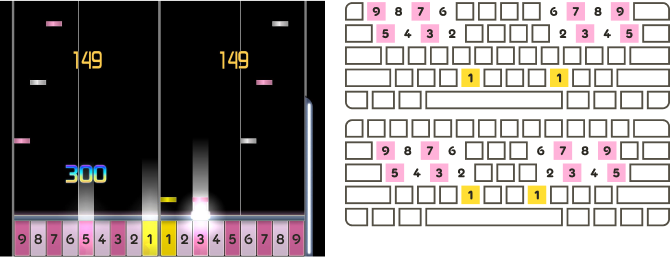
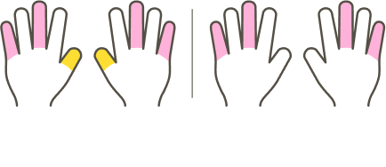
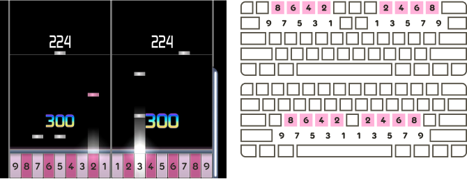

<!--
Les images traduites de l'article ce trouvent ici : <https://www.figma.com/file/RFLmgvUYGXKrllOgO7quXi/osu!mania-playstyles-FR>

Pour les prochains qui voudront modifier les images :

- Connectez vous à figma
- Demandez l'autorisation pour modifier le fichier
- Dans l'arborescence sur le côté gauche, dérouler le fichier qui vous intéresse, jusqu'à trouver une section avec un "T", ce qui voudra dire que c'est du texte
- Modifier le nom du fichier, ensuite cliquez sur "Edit Object" tout en haut (premier bouton à gauche), et modifiez le texte en conséquence
- Une fois que le texte à été modifier, cliquez sur le début de l'arborescence du fichier, et à droite, cliquez sur "export nomdufichier"

Si vous avez besoin d'aide, n'hésitez pas à me contactez sur Discord.

—Doryan

PS: for maintainers, don't delete this, it contains the link to the figma containing the translated images, as well as explanations on how to modify them if necessary. Thanks
-->

# Styles de jeu osu!mania 10K+

Cet article documente les styles de jeu communs utilisés par les [beatmaps](/wiki/Beatmap) [d'osu!mania](/wiki/Game_mode/osu!mania) avec 10 touches ou plus.

Dans ce contexte, un **style de jeu** est un ensemble suggéré de [touches](/wiki/Game_mode/osu!mania#contrôles) et d'ordre des touches sur [l'écran de jeu](/wiki/Game_mode/osu!mania#écran-de-jeu). La plupart des beatmaps d'osu!mania avec plus de 10 touches sont mappées avec un style de jeu particulier à l'esprit - le joueur a moins de doigts qu'il n'y a de touches. Une attention particulière est alors nécessaire concernant l'endroit où les mains du joueur seront positionnées sur le [clavier](/wiki/Gameplay/Input_device/Keyboard) tout au long de la beatmap.

Le joueur peut choisir d'ignorer le style de jeu prévu, mais cela devient de plus en plus gênant à des [niveaux de difficulté](/wiki/Beatmap/Difficulty#niveaux-de-difficulté) plus élevés, et peut donner lieu à des [patterns](/wiki/Beatmap/Pattern) qui semblent maladroits à jouer ou qui sont presque impossibles à frapper.

Chaque style de jeu nécessite que le joueur ajuste ses [raccourcis clavier](/wiki/Game_mode/osu!mania#contrôles) de manière appropriée, et encourage l'utilisation de [skins](/wiki/Skin) personnalisés. Dans cet article, les images de gameplay utilisent un skin par défaut légèrement modifié pour illustrer différents styles de jeu.

## 10K (10 touches) {#10K}

**10K** est le style de jeu où chaque main est responsable de 5 touches.

Bien que le [client](/wiki/Client) considère 10K comme un mode "[co-op](/wiki/Game_mode/osu!mania#co-op)", les mappeurs le traitent généralement comme un mode à touches normal. En effet, chaque touche peut être frappée par un doigt unique, et il n'est pas nécessaire de tenir compte d'une disposition spéciale ou d'une liaison de touches.

## 10K2S (12 touches) {#10K2S}

**10K2S** est un style de jeu à 12 touches similaire à [10K](#10K), mais qui inclut une touche ***s**cratch* sur chaque bord extérieur de la scène.

Chaque main repose sur les 10 touches du milieu. Les deux touches de scratch sont généralement frappées en déplaçant le petit doigt vers l'extérieur.

## DP (14 ou 16 touches) {#DP}

**DP** ou **Double Play**, nommé d'après le mode de jeu de *[beatmania IIDX](https://fr.wikipedia.org/wiki/Beatmania_IIDX "\"beatmania IIDX\" sur Wikipedia")*, est un mode de jeu à 14 ou 16 touches où chaque main est responsable de 7 touches, disposées en rangées inférieures de 4 touches et en rangées supérieures de 3 touches. Les rangées inférieures et supérieures sont entrelacées de telle sorte que la première touche est inférieure, la deuxième supérieure, la troisième inférieure, et ainsi de suite. Une touche supplémentaire *scratch* peut être incluse sur chaque bord extérieur de la scène.

Avec [EZ2AC](#EZ2AC), ce style de jeu est plus généralement appelé "14K" ou "14K2S".

Chaque main s'appuie généralement sur les touches 1, 2, 4, 6 et 7 dans les diagrammes ci-dessus. La touche 5 peut être frappée avec l'annulaire et la touche 3 avec le pouce ou l'index. Les deux touches de scratch, si elles existent, sont généralement frappées en déplaçant le petit doigt vers l'extérieur.

## EZ2AC (14 ou 16 touches) {#EZ2AC}

**EZ2AC**, nommé d'après les dernières entrées de la série *[EZ2DJ](https://en.wikipedia.org/wiki/EZ2DJ "\"EZ2DJ\" sur Wikipedia")*, est un style de jeu à 14 ou 16 touches similaire à [10K](#10K) ou [10K2S](#10K2S), mais qui inclut un jeu séparé de 4 touches au milieu de la scène.

Ce style de jeu est également appelé "Space Mix" ou "14K MANIAC", tous deux issus de la série *EZ2DJ*. Avec [DP](#DP), il est plus généralement appelé "14K" ou "14K2S".

Chaque main repose sur les mêmes touches que 10K ou 10K2S. Il se peut qu'une ou les deux mains doivent s'écarter de leur position habituelle pour frapper les 4 touches du milieu.

## 10K8K (18 touches) {#10K8K}

**10K8K** est un style de jeu à 18 touches similaire à [10K](#10K), mais qui comprend 8 touches supplémentaires placées au-dessus ou au-dessous des 4 touches les plus extérieures de chaque côté de la scène. Les touches supplémentaires ne sont pas entrelacées ; elles sont soit toutes à l'extérieur, soit toutes à l'intérieur, selon le groupe de touches au-dessus ou au-dessous duquel elles ont été placées.

Ce style de jeu est également appelé "4K10K4K" ou "8K10K".

Chaque main repose sur les mêmes touches que le 10K. Tous les doigts, à l'exception des pouces, doivent se déplacer vers le haut ou vers le bas pour atteindre les séries supplémentaires de 4 touches.

## 9K9K (18 touches) {#9K9K}

**9K9K** est un mode de jeu à 18 touches similaire au [DP](#DP) à 14 touches, mais les rangées inférieure et supérieure de chaque côté de la scène comprennent respectivement 5 et 4 touches, au lieu de 4 et 3. Il ressemble à un mode DP hypothétique pour *[pop'n music](https://fr.wikipedia.org/wiki/Pop%27n_Music "\"Pop'n Music\" sur Wikipedia")*.

Ce style de jeu comporte de nombreuses positions de repos communes pour les mains. Les maps de ce style de jeu nécessitent des repositionnements fréquents.
