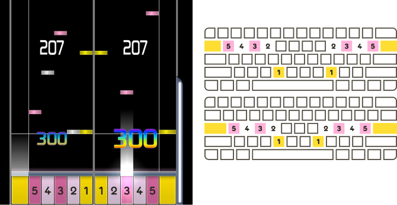
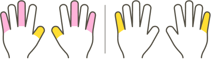
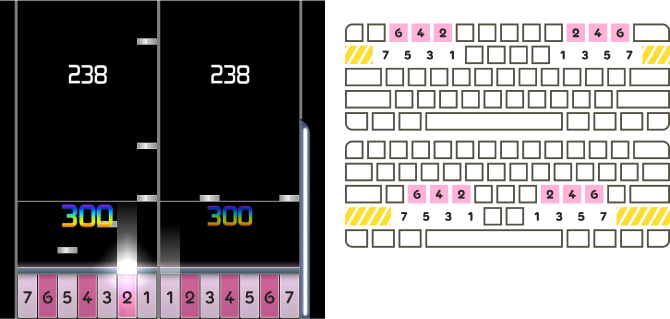
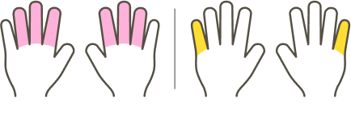
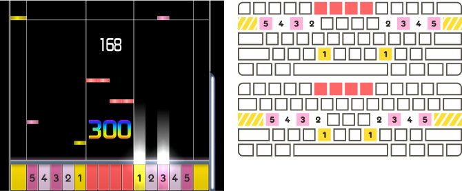
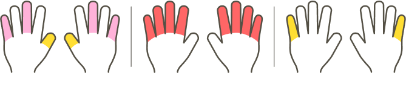
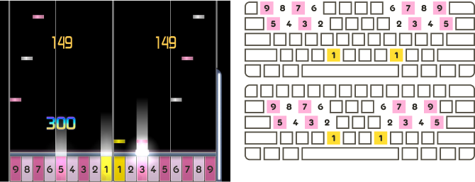
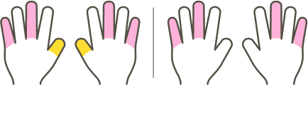
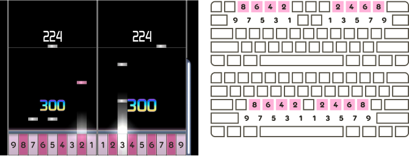
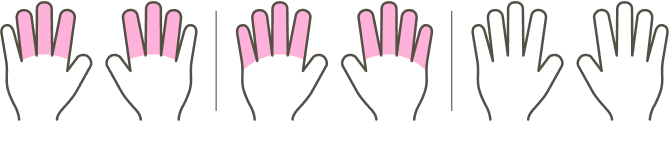

---
tags:
  - 12K+
  - co op
  - co-op
  - column layout
  - column layouts
  - coop
  - key layout
  - key layouts
  - key mode
  - key modes
  - keymode
  - keymodes
  - play style
  - play styles
---

# รูปแบบการเล่น osu!mania 10K+ (osu!mania 10K+ playstyles)

บทความนี้รวบรวมรูปแบบการเล่น (Playstyle) ทั่วไปที่ใช้ใน [Beatmap](/wiki/Beatmap) ของโหมด [osu!mania](/wiki/Game_mode/osu!mania) ที่มีจำนวนปุ่มตั้งแต่ 10 ปุ่มขึ้นไป

ในบริบทนี้ **รูปแบบการเล่น (Playstyle)** คือชุดการ [ตั้งค่าปุ่ม (Key bindings)](/wiki/Game_mode/osu!mania#controls) และลำดับของปุ่มบน [สนามเล่น (Playfield)](/wiki/Game_mode/osu!mania#playfield) ที่แนะนำ เนื่องจากผู้เล่นมีจำนวนนิ้วน้อยกว่าจำนวนปุ่มที่ใช้เล่น ดังนั้น Beatmap ส่วนใหญ่ที่มีมากกว่า 10 ปุ่มจึงถูกสร้างขึ้นโดยคำนึงถึงสไตล์การเล่นเฉพาะอย่างใดอย่างหนึ่ง เพื่อให้เหมาะสมกับการวางตำแหน่งมือบน [คีย์บอร์ด](/wiki/Gameplay/Input_device/Keyboard) ตลอดทั้งแมพ

ผู้เล่นสามารถเลือกที่จะเพิกเฉยต่อสไตล์การเล่นที่ผู้สร้างแมพตั้งใจไว้ได้ แต่การทำเช่นนั้นจะกลายเป็นอุปสรรคมากขึ้นเมื่อเล่นในระดับ [ความยาก](/wiki/Beatmap/Difficulty#ระดับความยาก-(difficulty-levels)) ที่สูงขึ้น และอาจส่งผลให้ [รูปแบบการวางโน้ต (Patterns)](/wiki/Beatmap/Pattern) บางช่วงรู้สึกเล่นยากหรือไม่สะดวก หรือแทบจะเป็นไปไม่ได้เลยที่จะกดให้โดน

แต่ละสไตล์การเล่นต้องการให้ผู้เล่นปรับการตั้งค่าปุ่มให้เหมาะสม และสนับสนุนให้ใช้ [Skin](/wiki/Skin) ที่ปรับแต่งมาโดยเฉพาะ ในบทความนี้ ภาพประกอบเกมเพลย์จะใช้ Skin พื้นฐานที่ถูกดัดแปลงเล็กน้อยเพื่อให้เห็นภาพสไตล์การเล่นต่างๆ ได้ชัดเจนขึ้น

## 10K (10 ปุ่ม) {#10K}

**10K** คือสไตล์การเล่นที่แต่ละมือรับผิดชอบการกด 5 ปุ่ม

แม้ว่าโหมด 10K จะถูกตัวเกมมองว่าเป็นโหมด "[co-op](/wiki/Game_mode/osu!mania#co-op)" แต่ Mapper ส่วนใหญ่มักจะมองว่าเป็นโหมดปุ่มปกติ เนื่องจากแต่ละปุ่มสามารถใช้หนึ่งนิ้วที่แยกจากกันกดได้พอดี และไม่จำเป็นต้องมีการวางเลย์เอาต์หรือการตั้งค่าปุ่มที่ซับซ้อนเป็นพิเศษ

## 10K2S (12 ปุ่ม) {#10K2S}

**10K2S** คือสไตล์การเล่นแบบ 12 ปุ่มที่คล้ายกับ [10K](#10K) แต่มีการเพิ่มปุ่ม ***S**cratch* ไว้ที่ขอบด้านนอกสุดของทั้งสองฝั่ง

มือแต่ละข้างจะวางพักไว้ที่ 10 ปุ่มตรงกลาง ส่วนปุ่ม Scratch ทั้งสองปุ่มมักจะใช้การขยับนิ้วก้อยออกไปด้านข้างเพื่อกด

## DP (14 หรือ 16 ปุ่ม) {#DP}

**DP** หรือ **Double Play** ตั้งชื่อตามโหมดการเล่นในเกม *[beatmania IIDX](https://en.wikipedia.org/wiki/Beatmania_IIDX)* เป็นสไตล์การเล่นแบบ 14 หรือ 16 ปุ่มที่แต่ละมือรับผิดชอบ 7 ปุ่ม โดยจัดเรียงเป็นแถวล่าง 4 ปุ่ม และแถวบน 3 ปุ่ม แถวล่างและแถวบนจะวางสลับฟันปลาเพื่อให้ปุ่มที่หนึ่งอยู่แถวล่าง ปุ่มที่สองอยู่แถวบน ปุ่มที่สามอยู่แถวล่าง สลับกันไปเรื่อยๆ นอกจากนี้อาจมีการเพิ่มปุ่ม *Scratch* ไว้ที่ขอบด้านนอกสุดของแต่ละฝั่งด้วย

รูปแบบการเล่นนี้มักถูกเรียกโดยรวมร่วมกับ [EZ2AC](#EZ2AC) ว่า "14K" หรือ "14K2S"

โดยปกติมือแต่ละข้างจะวางพักไว้ที่ปุ่มหมายเลข 1, 2, 4, 6 และ 7 ตามแผนผังด้านบน ส่วนปุ่มหมายเลข 5 สามารถใช้การเอื้อมนิ้วนางไปกด และปุ่มหมายเลข 3 สามารถใช้นิ้วโป้งหรือนิ้วชี้กดได้ ส่วนปุ่ม Scratch ทั้งสองปุ่ม (หากมี) มักจะใช้นิ้วก้อยเอื้อมไปกด

## EZ2AC (14 หรือ 16 ปุ่ม) {#EZ2AC}

**EZ2AC** ตั้งชื่อตามเกมซีรีส์ *[EZ2DJ](https://en.wikipedia.org/wiki/EZ2DJ)* ในยุคหลัง เป็นสไตล์การเล่นแบบ 14 หรือ 16 ปุ่มที่คล้ายกับ [10K](#10K) หรือ [10K2S](#10K2S) แต่มีการเพิ่มชุดปุ่ม 4 ปุ่มแยกต่างหากไว้ตรงกลางของสนามเล่น

สไตล์การเล่นนี้ยังถูกเรียกว่า "Space Mix" หรือ "14K MANIAC" ซึ่งล้วนเป็นชื่อจากซีรีส์ *EZ2DJ* โดยมักถูกเรียกโดยรวมร่วมกับ [DP](#DP) ว่า "14K" หรือ "14K2S"

มือแต่ละข้างจะวางพักที่ปุ่มเดิมเหมือนกับ 10K หรือ 10K2S แต่มือข้างใดข้างหนึ่งหรือทั้งสองข้างอาจจะต้องขยับออกจากตำแหน่งปกติเพื่อไปกดปุ่ม 4 ปุ่มที่อยู่ตรงกลาง

## 10K8K (18 ปุ่ม) {#10K8K}

**10K8K** คือสไตล์การเล่นแบบ 18 ปุ่มที่คล้ายกับ [10K](#10K) แต่มีการเพิ่มปุ่มอีก 8 ปุ่ม วางไว้ด้านบนหรือด้านล่างของปุ่ม 4 ปุ่มนอกสุดของแต่ละฝั่ง โดยปุ่มที่เพิ่มมานี้จะไม่ได้วางสลับฟันปลา แต่จะวางไว้ด้านนอกทั้งหมดหรือด้านในทั้งหมดเมื่อเทียบกับกลุ่มปุ่มที่พวกมันวางทับอยู่

สไตล์การเล่นนี้ยังถูกเรียกว่า "4K10K4K" หรือ "8K10K"

มือแต่ละข้างจะวางพักที่ปุ่มเดิมเหมือนกับ 10K แต่นิ้วมือทั้งหมด (ยกเว้นนิ้วโป้ง) จะต้องขยับขึ้นหรือลงเพื่อกดชุดปุ่ม 4 ปุ่มที่เพิ่มเข้ามา

## 9K9K (18 ปุ่ม) {#9K9K}

**9K9K** คือสไตล์การเล่นแบบ 18 ปุ่มที่คล้ายกับ [DP](#DP) แบบ 14 ปุ่ม แต่แถวล่างและแถวบนของแต่ละฝั่งจะประกอบด้วยปุ่ม 5 และ 4 ปุ่มตามลำดับ (แทนที่จะเป็น 4 และ 3) ซึ่งรูปแบบนี้จะคล้ายกับโหมด DP ที่อาจมีขึ้นในเกม *[pop'n music](https://en.wikipedia.org/wiki/Pop%27n_Music)*

สไตล์การเล่นนี้มีตำแหน่งการวางมือที่หลากหลาย และการเล่นแมพในสไตล์นี้จำเป็นต้องมีการขยับตำแหน่งมืออยู่บ่อยครั้ง
