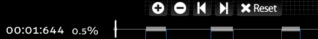
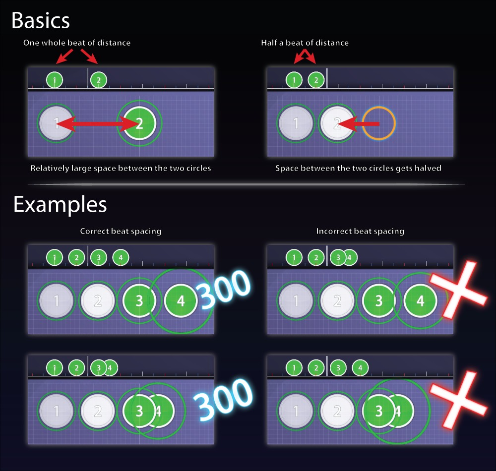

O que é "Beatmapping"?
======================

*'Beatmapping* 'é o processo de criação de mapas no osu! para outros jogadores. Mapear envolve, [timing](PT:Timing "wikilink"), colocação de objetos, e (opcionalmente) [skinning](PT:Skinning "wikilink") e/ou [storyboarding](PT:Storyboarding "wikilink").

Para começar, pressione o botão **Edit**.  Normalmente mappers querem que seus beatmaps sejam [ranked](PT:Ranked_beatmap "wikilink"), que consiste num processo de [beatmap approval](PT:Beatmap_approval "wikilink"), onde quando completados com sucesso, um quadro de pontuações será atribuído ao mapa e será considerado completo, a não ser que o mapper deseje adicionar/mudar algo no mesmo.

As dificuldades mais comuns criadas em Beatmapping são:

-   [Easy](PT:Easy_(Difficulty) "wikilink")
-   [Normal](PT:Normal "wikilink")
-   [Hard](PT:Hard "wikilink")
-   [Insane](PT:Insane "wikilink")

Clicar em cada link vai exibir um conjunto de diretrizes em comum para [mappers](PT:Mappers "wikilink") seguirem e se tornarem aptos a criar um beatmap divertido apropriado para o seu nível de [difficulty](PT:Difficulty "wikilink")

Também não é incomum para [mappers](PT:Mappers "wikilink") usarem uma [dificuldade](PT:Difficulty "wikilink") com nome customizado em vez desses. (Como "Mario", por exemplo)

Adicionalmente você poderá encontrar [Guest Difficulties](PT:Guest_Difficulty "wikilink") que são comummente classificado como dificuldade do mapper em questão (Por exemplo, Larto's Insane).

Com a adição de modos Special, você poderá agora adicionar dificuldades específicas para cada modo no seu beatmap em vez da dificuldade padrão do osu!. É completamente possível encher um beatmap apenas com dificuldades de Taiko/Catch the Beat, se for providenciado também uma dificuldade Easy/Normal no mesmo.

Introdução
==========

Como eu crio um novo beatmap?
-----------------------------

 Assim como osu! é um jogo baseado em ritmo, as músicas que você escolher para mapear devem ter uma batida constante e óbvia. Tente evitar músicas que têm muitas mudanças de tempo(velocidade) ou músicas lentas até você ser mais experiente e acostumado com o mecanismo de beatmapping.

Para começar um novo mapa, siga esses passos:-

-   Arraste e largue o ficheiro de áudio no osu! (Aberto ou não, não é um problema aqui)

Rota alternativa: Coloque o ficheiro de áudio na pasta "Songs".

-   Deverá abrir e redirecionar você para a tela de edit com seu ficheiro de áudio lá.
-   Sua nova música estará no fundo da lista de músicas, destacada em roxo.

-   Clique na música para abrir o Song Setup.
    -   Insira e cheque se o título da música e o artista estão corretos, e adicionar o Source e Tags se necessário, digite então um nome de dificuldade apropriada (Easy, Insane ou Cruisin' são exemplos, você poderá mudar isso mais tarde).
-   Você pode definir as outras opções agora se desejar, mas essas mesmas também poderam ser modificadas mais tarde. Clique OK, e você poderá começar a mapear! O próximo passo é adicionar timing no seu mapa.

Como eu faço o Timing (cronometragem) da música apropriadamente?
----------------------------------------------------------------

'''Timing é vital - mapas incorretamente cronometrados nunca se tornarão Ranked. '''Tenha certeza que seu timing é perfeito antes de colocar quaisquer notas nele. Se estiver com dúvidas sobre o timing, antes de mais contacte um mod, ou faça submit da sua música no [forum de ajuda a Beatmap](https://osu.ppy.sh/forum/10). Isso vai evitar bastantes aborrecimentos mais tarde.

Aqui estão algumas dicas para conseguir apropriadamente fazer o timing da música:-

-   Assista o [video](https://osu.ppy.sh/community/forums/topics/39317) e os [tutoriais](https://osu.ppy.sh/community/forums/topics/3815/) para conhecer os métodos básicos de timing.
-   Tenha certeza que os toques do metronómo coincidem com a batida da música em toda a duração da mesma. Então verifique o timing em 5%, 25%, 50%, 75% e 100% da música, no mínimo.
-   Dê uma olhada na tabela de BPM, se o número estiver perto de um número completo (até .10 de diferença), é provavelmente melhor (a não ser que peçam que não o faça) arredondar para um número total. Se for esse o caso, manualmente insira o BPM correto usando o Timing Setup Panel.
    -   Exemplo: 150.02 deverá ser arredondado para 150.00 a não ser que outro mapper peça que não o faça porque o som poderá ficar errado, por alguma razão.

-   Para ajuste certo no offset, reduza a velocidade da música para metade - 0,5x (ou até 0.25x, se necessário) e ajuste os valores até as batidas coincidirem exatamente com os cliques do metrónomo.
-   Algumas músicas têm múltiplos BPMs. Você poderá resolver isso adicionando uma seção de timing (Timing --&gt; Add Timing Section) no momento em que o tempo muda. O BPM e o offset para a nova seção de timing poderão ser encontrados exactamente como anteriormente. O Timing Setup Panel fornece uma lista de todas as seções de timing existentes na música.

Que informação eu insiro no Song Setup ?
----------------------------------------

Você deverá inserir essa informação antes de criar uma segunda dificuldade, para assegurar que a descrição será consistente em todos os mapas no set. Atualmente você tem a **permissão para usar carateres Unicode.**

<table>
<thead>
<tr class="header">
<th>
Name
</th>
<th>
Description
</th>
</tr>
</thead>
<tbody>
<tr class="odd">
<td>
<strong>Artist</strong>
</td>
<td>
'''<u>A banda, cantor, ou grupo que realizou ou criou a música. </u> ''' O osu! irá extrair o artista do ficheiro mp3, mas por favor verifique de novo para ter certeza que está sendo soletrado e pontuado corretamente. '''Títulos de Anime/Jogos ou companhias não pertencem aqui (eles pertencem a Tags). '''Você poderá normalmente encontrar o compositor para as músicas de anime e jogos na Wikipedia ou outras fontes confiáveis de informação como <a href="http://www.animesnewsnetwork.com/AnimeNewsNetwork">1</a> ou <a href="http://myanimelist.net/MyAnimeList">2</a>. Nomes estrangeiros devem ser apresentados na mesma ordem de nome igual á que aparece na Wikipedia (geralmente, Nome Próprio seguido pelo Nome de Família, a ordem ocidental, por consistência).
</td>
</tr>
<tr class="even">
<td>
<strong>Romanised Artist</strong>
</td>
<td>
'''<u>Os nomes romanizados (Ingleses) do artista ou da música. </u> ''' Deverá ser apresentado na mesma ordem de nome como usado na Wikipédia (geralmente, Nome Próprio seguido pelo Nome de Família, na ordem ocidental, como anteriormente). Este campo ficará ativo se você usar carateres Unicode no campo de &quot;Artista&quot;.
</td>
</tr>
<tr class="odd">
<td>
<strong>Title</strong>
</td>
<td>
<strong><u>O nome da música.</u></strong> Será extraído automaticamente do ficheiro mp3, mas verifique novamente para ter certeza que está sendo soletrado e pontuado corretamente., especialmente se você conseguiu o mp3 online.
</td>
</tr>
<tr class="even">
<td>
<strong>Romanised Title</strong>
</td>
<td>
'''<u>Os nomes romanizados (Ingleses) do título da música. </u> ''' Novamente, este campo ficará ativo se você usar carateres Unicode no campo <em>Title</em>.
</td>
</tr>
<tr class="odd">
<td>
<strong>Beatmap Creator</strong>
</td>
<td>
'''<u>Você. O osu! deverá automaticamente preencher este campo, então você não deve editar ele. </u> ''' Se você vai incluir uma dificuldade guest feita por outro alguém, seu/seus nomes pertencem ao campo de Difficulty abaixo, não aqui.
</td>
</tr>
<tr class="even">
<td>
<strong>Difficulty</strong>
</td>
<td>
'''<u>O nome da dificuldade do mapa.</u> ''' O menu suspenso contém os nomes predefinidos: Easy, Normal, Hard e Insane. Você poderá selecionar um dos nomes predefinidos, ou criar o seu próprio nome. Enquanto que é bom ser criativo, tente deixar claro qual é o mais díficil que os outros, visto que dificuldades ambíguas poderão confundir e aborrecer jogadores. Esse também será o campo onde você irá indicar o mapper da dificuldade guest, se essa for a sua dificuldade (e.g. <em>Larto's Hard</em>).
</td>
</tr>
<tr class="odd">
<td>
<strong>Source</strong>
</td>
<td>
'''<u>Onde a música foi originada. </u> ''' Esse campo deverá geralmente ser incluído apenas caso a música seja de Anime ou videojogo, e ocasionalmente em músicas de Novelty (Filmes, TV ou Internet). Se a música veio de um anime ou videojogo, ou é famosa pelo seu uso na TV ou tema de filme, o título da fonte da música deverá estar aqui. 
Músicas Rock e Pop geralmente deixam esse campo vazio. <strong>Este campo não é usado para coisas como títulos de álbuns.</strong>
</td>
</tr>
<tr class="even">
<td>
<strong>Tags</strong>
</td>
<td>
'''<u>Palavras-chave que ajudam nas pesquisas.</u> ''' Usuários normalmente incluem os nomes dos álbuns, criadores das dificuldades guest, nomes de companhias e outros termos que poderão ser usados por pessoas ao fazerem pesquisas definidas (exemplo disso são eroges ou visual novels, se seu mapa é baseado numa visual novel eroge). Se seu mapa tem elementos de &quot;collab&quot; (colaboração entre mappers), seus nomes poderão ficar aqui. Tags são separadas por espaços. Não é obrigatório encher esse campo, mas é fortemente recomendado ao usar pesquisas da Web ou do osu! in-game. 
<strong>Nota:</strong> Se você possuir uma tag de &quot;qwertyuiop&quot; no seu beatmap, você poderá também encontrar seu mapa in-game ao digitar &quot;qwertyuiop&quot; na tela de seleção de músicas.
</td>
</tr>
</tbody>
</table>

Novamente, para evitar problemas, por favor tenha certeza que tudo (excepto o nome da dificuldade) está preenchido identicamente para cada uma das dificuldades.

Fundamentais de Beatmapping
===========================

Bookmark
--------

|   Comando de atalho  |
|:--------------------:|
|       Ctrl + B       |
|   Ctrl + Shift + B   |
|  Ctrl + Seta Direita |
| Ctrl + Seta Esquerda |

**<u>Bookmark (atalhos na música) é uma ferramenta que marca a timeline.</u>** Isso é util se você está planeando fazer lugares específicos para colocar um ponto de mudança de BPM ou reservar espaço para colocar um design complexo mais tarde. Dependendo da sua preferência, você poderá abusar disto ao ouvir a música enquanto usa o comando, baseado na batida, como um guia de como o mapa ficará.

Adicionando hit-circles normais
-------------------------------

 Isto deverá ser um processo direto e intuitivo. Abaixo algumas dicas uteis para tipos normais de hit-objects:-

-   O nível da grade poderá ser modificado para maior precisão indo a View --&gt; Grid Level. Notas irão automaticamente alinhar com a grade.
    -   Você poderá ignorar o alinhamento e o tempo do mesmo pressionando e mantendo Shift enquanto move/coloca um objeto.
-   Clique com o botão direito do mouse numa nota ou um grupo selecionado de notas para apagar as mesmas. Clicar com botão direito em qualquer outro sítio irá acionar um novo combo.
-   Atalhos comuns do Windows se aplicam também no editor do osu! (ex. Ctrl+A seleciona todas as notas, Ctrl+C/V é copiar/colar e Ctrl+Z é anular).
-   Notas irão alinhar com sliders visíveis - então se você quer colocar um círculo exatamente no fim de um slider, coloque ele enquanto você ainda pode ver o slider e então mova o mesmo para trás/frente na timeline se necessário.

Adicionando Sliders
-------------------

 Antes de aprofundar o assunto, faça as seguintes duas coisas:

-   Tenha certeza que você definiu o Slider Velocity - Velocidade do Slider (abaixo da aba de Timing) para seu valor desejado. Este valor irá ser aplicado para todo o beatmap, então escolha com cuidado! Mudar o Slider Velocity após colocar sliders irá resultar em sliders vacilantes e provavelmente fora do tempo - tente evitar isso!
-   Defina o tipo de slider que quer. Existem dois tipos de slider com curvas - Bezier e Lineares.
    -   Bezier é o recomendado visto que produz as curvas mais suaves.
    -   Linear é útil se você quer aguçar (ex 90 graus) cantos dos seus sliders.

Agora você poderá começar adicionando um slider. Clique com botão esquerdo para começar um slider, adicione waypoints com mais cliques, e termine o mesmo usando o clique direito do mouse para criar um slider do tipo Bezier. Se você deseja criar um slider Linear, faça uma forma de slider Bezier primeiro, então clique com o botão do mouse esquerdo irá fazer com que o vertex existente fique vermelho e cria um novo anchor point (ponto de âncora) que permite então novas curvas fechadas ou aguçadas. É recomendado que tenha certeza que o comprimento do slider está correto antes de ajustar a forma.

Aqui estão algumas outras dicas sobre slider:-

-   Para adicionar repeat (repetições), arraste o fim do slider na timeline após acabar a colocação.
-   Arraste um waypoint individual para o mover. Clique direito remove o ponto, e Ctrl+Clique adiciona um ponto.
-   Da mesma forma que os hit circles, você poderá ignorar qualquer alinhamento ao pressionar e manter Shift. Isto poderá ser útil para alinhamentos de sliders perfeitos.

Tente colocar algum trabalho em fazer com que seus slider fiquem bonitos! Sliders tortos/sobrepostos/instáveis ou apenas planos irão arruinar a aparência de seu beatmap! Adicionalmente, garanta que seus sliders não sobrepõem uns aos outros, que a cauda do slider esteja sempre vísivel, e que o caminho do slider não está escondido de qualquer forma - como uma volta em U ou fazendo a cabeça e a cauda do slider se sobreporem. Essas armadilhas de sliders devem ser evitadas!

Adicionando Spinners
--------------------

 Para adicionar spinners no seu mapa, clique com botão esquerdo para começar. então puxe a timeline até onde você quer que o final seja, e termine o mesmo clicando com o botão direito do seu mouse. Tente deixar seus spinners numa duração razoável - spinners muito longos são cansativos e aborrecidos, spinners ninjas que são demasiado curtos não são legais. **Spinner Spam** (como mais de 5 spinners de uma vez) é definitivamente algo que você não deve fazer.
**Nota sobre Spinner Spam**: Isto porque [Trans-Siberian Orchestra - Wizards In Winter (dificuldade Impossible)](https://osu.ppy.sh/beatmaps/296) tem arduamente 48~51 em ~5 segundos. O mapa em si contêm streams longos de hit-circles que são perfeitamente rankeáveis, excluindo o spam de spinners ninja.

O que são Combos?
-----------------

Combos são grupos de notas, essenciais para o sistema de score no osu!. Diferentes combos possuem diferentes cores. É importante que você use combos nos seus beatmaps que assegurem melhor percepção e compreensão da música. Tipicamente, combos devem ser baseados no som (percussão, streamings de guitarra, vocais) da música de alguma forma, então preste atenção ás informações exibidas no painel de timing se precisar de orientação. Como um guia descritivo, uma boa duração de combo deverá ser entre 5-15 excluindo streams (10-30).

Nota: Combos finais (Geki e Katu, especificamente) irão aumentar a barra de HP num bom valor comparado com os típicos 300. Combos pequenos são mais preferidos que os longos, visto que o slider consumirá mais vida (HP) em comparação com os pequenos, o que poderá fazer com o mapa se torne estranhamento difícil devido ao consumo de HP.

Como eu adiciono Intervalos no meu beatmap?
-------------------------------------------

Para dar aos jogadores um pouco de descanso durante um beatmap longo, você deve incluir um Break (intervalo). Para o fazer, simplesmente deixe uma abertura no mapa onde você quer que o Intervalo fique, e então pressione o botão "Insert Break Time" no editor. Note que você deverá inserir um intervalo entre dois hit-objects, então coloque notas no começo e no fim para "marcar" o intervalo antes de inserir um!

Algumas regras de ouro são:-

-   Geralmente, tente deixar segmentos de jogo inferiores a um minuto. Uma música de dois minutos deve ter no mínimo um intervalo perto do meio, uma música de três minutos deverá ter no mínimo dois intervalos bem espaçados. Isto poderá mudar dependendo da música em questão.
-   Deixe a duração dos intervalos minimamente razoáveis. Intervalos com menos de 1 segundo são inúteis ([a não ser que você deseja intimidar o estilo de jogo invocando a seta de aviso (warning-arrow)](https://osu.ppy.sh/beatmaps/19842)), e intervalos de 30 segundos são raramente usados e não práticos. Tente visar intervalos de 5-15 segundos.

Aqui estão algumas dicas avançadas no planeamento de intervalos usando atalhos na timeline (Bookmarks):-

-   Antes de começar um mapa, ouça toda a música e decida onde você quer os intervalos - tente incluir um em intervalos regulares.
-   Use bookmarks para marcar o principio e o fim de cada intervalo na timeline!
-   Coloque uma "marcação" temporária (poderá usar um hit-circle Normal) em cada bookmark, então pressione o botão "Insert Break Time" enquanto você está entre dois hit-circles para adicionar um intervalo.
-   Um exemplo é mostrado abaixo:-

-   Note como os intervalos são equilibradamente espaçados durante a música, e que não são nem pequenos nem longos demais, assegurando então que o jogador tenha uma recuperação adequada da sua intensa maratona de cliques, sem cair no sono enquanto isso! Intervalos são mostrados como colchetes brancos na timeline no fundo da janela do editor.
-   Repare também no bookmark no começo da música, para marcar a primeira nota. Bookmarks são úteis! Use eles para sua vantagem.

O que é Beat Spacing?
---------------------

 Para jogabilidade intuitiva, seus beatmaps devem ter um bom "Beat Spacing"(Espaçamento de batidas)! Em geral, batidas que estão perto de umas das outras na timeline devem estão perto no beatmap, e vice-versa. Isto serve para assegurar um fluxo da sincronização harmónica da música com o beatmap, fazendo os mapas muito mais agradáveis.

A maneira mais simples de assegurar que o espaçamento de batidas está correto nos seus beatmaps é utilizando a função ping da ferramenta do editor [Distance Snap](PT:Distance_Snap "wikilink"), que poderá ser encontrada no canto superior direito do editor. A distância relativa entre notas pode ser ajustada usando a roda do mouse. Se você se acostumar a usar o Distance Snap para toda a música, é garantido um espaçamento de batida correto!

Como eu adiciono mais níveis de dificuldades na música?
-------------------------------------------------------

Para criar um novo nível de dificuldade, simplesmente abra uma dificuldade existente, escolha "File" --&gt; "Save as New Difficulty..." e mude a entrada na caixa de Dificuldade.

Tenha certeza que adiciona variações entre diferentes níveis de dificuldades. Adicione, remova ou rearranje notas para fazer novos patterns (modelos). Vire ou rode notas existentes. As diferentes dificuldades do mapa devem ser de alguma forma familiares (como a velocidade de BPM, pontos de mudanças de BPM or certos designs do beatmap) enquanto ^*retendo a diferença distinta em acordo com a dificuldade em questão.*

**Nota:** Mudar as configurações de dificuldade (ex. HP drain rate) não é considerado uma nova dificuldade. Isso é chamado pura preguiça, e você provavelmente será solicitado a criar um novo design para a nova dificuldade.

^*retendo a diferença distinta em acordo com a dificuldade em questão.*: Diferenças no design do mapa (como não repetidos designs rodados de Easy para Normal).

Porque a numeração de combo muda enquanto eu jogo a música?
-----------------------------------------------------------

Se você possuir um círculo no seu cursor (ex . quando você está no modo de colocação) o mesmo irá atuar como que você já colocou ele - mudando os números/cores de combos para qualquer círculo que ocorrer depois dele.

Visualização do Beatmap
=======================

Como eu mudo a cor de fundo?
----------------------------

Clique na aba "Design". Lá existe um botão chamado "Set BG Colour''(definir cor de fundo) que permitirá a você escolher sua própria cor de fundo. Teoricamente falando, o mais certo é que seja substituído por uma imagem de fundo/vídeo a não ser que você esteja planeando usar uma storyboard.

Algumas notas:-

-   Imagens podem ser no formato .JPG ou .PNG. É melhor que você mantenha elas abaixo do tamanho 800x600. (Para poupar espaço)
    -   Tente comprimir as imagens se possível. Existem vários programas na internet que poderão te ajudar.
-   Videos devem ser encodados usando DiVX, xvid ou codecs similares. Usar codecs como H.264 não é recomendado.
    -   Remova o áudio do vídeo para diminuir o tamanho do arquivo.
-   Imagens e vídeos podem ser removidos ao deletar os mesmos da pasta da música.

Como eu adiciono imagens e sons customizados no meu beatmap?
------------------------------------------------------------

-   Crie seu ficheiro de imagem/som desejado.
-   Salve ele com um nome apropriado.
    -   Nomes aleatórios: Para storyboard. Não fazem nada enquanto não implementados com o beatmap.
        -   Exemplo: A, Lyric1, 007, etc. (Desde que você saiba qual é um e outro)
    -   Nomes das skins: O beatmap irá usar o ficheiro automaticamente, substituindo um dos elementos da skin do jogador. Você irá reparar nisso.
        -   Exemplo: normal-hitnormal (Este ficheiro de som será escutado em vez do ficheiro de som da skin do jogador)
        -   Em caso de imagem, seria algo como hit-circle.png, que mudaria o hitcircle em questão.
        -   Veja a wiki acerca de skinning para mais informações.
-   Deixe na pasta da sua música.

[Uma lista de nomes de ficheiros de som customizados pode ser encontrada aqui.](https://osu.ppy.sh/community/forums/topics/729/start=0)

Como eu crio uma storyboard para meu beatmap?
---------------------------------------------

Clique na aba "Design" para abrir o SBE ([Storyboard Editor](PT:Storyboard_Editor "wikilink")).

Atalhos de Teclado
==================

Existem alguns Atalhos de Teclado?
----------------------------------

Sim, e aqui está uma lista deles. Será melhor que você imprima eles para referência rápida.

|             Atalhos Gerais             |
|:--------------------------------------:|
|                  **H**                 |
|                  **Z**                 |
|                  **X**                 |
|         **C / Barra de espaço**        |
|         **Esquerda / Direita**         |
|     **Shift + Esquerda / Direita**     |
|              **Ctrl + B**              |
|              **Ctrl + G**              |
|           **Ctrl + Esquerda**          |
|           **Ctrl + Direita**           |
|              **Ctrl + L**              |
|              **Ctrl + S**              |
|              **Ctrl + N**              |
|                 **F1**                 |
|                 **F2**                 |
|                 **F3**                 |
|                 **F4**                 |
|                 **F5**                 |
|                 **F6**                 |
|              Modo Compose              |
|        **Números (1, 2, 3, 4)**        |
|            **Q, W, E, R, L**           |
|               **Delete**               |
|              **Ctrl + Z**              |
|              **Ctrl + Y**              |
|              **Ctrl + A**              |
|              **Ctrl + X**              |
|              **Ctrl + C**              |
|              **Ctrl + V**              |
|              **Ctrl + D**              |
|         **Alt (na colocação)**         |
|        **Shift (na colocação)**        |
|      '''Shift (enquanto modifica)      |
|                  **J**                 |
|                 *' K*'                 |
|                  **G**                 |
|             **Ctrl + 1-4**             |
|             **Ctrl + &lt;**            |
|             **Ctrl + &gt;**            |
|              *' Ctrl + H*'             |
|              *' Ctrl + J*'             |
|               Modo Timing              |
|                  **T**                 |
| **Shift (while adjusting BPM/Offset)** |
|              **Ctrl + B**              |
|              **Ctrl + P**              |

E quanto aos controles do Mouse?
--------------------------------

Aqui tem uma lista deles:

|       Controles do Mouse       |
|:------------------------------:|
|       **Clique Esquerdo**      |
|   **Ctrl + Clique Esquerdo**   |
|       **Clique Direito**       |
|        **Roda do Mouse**       |
| **Ctrl + Alt + Roda do Mouse** |
|    **Ctrl + Roda do Mouse**    |
|     **Alt + Roda do Mouse**    |
|          **Arrastar**          |
