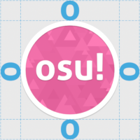
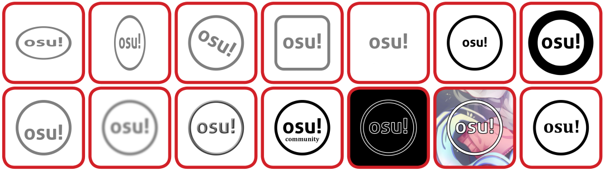
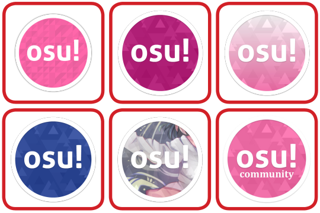

# เกณฑ์การระบุอัตลักษณ์ของแบรนด์ (Brand identity guidelines)

เกณฑ์การระบุอัตลักษณ์ของแบรนด์ คือชุดมาตรฐานสำหรับการสร้างแบรนด์ที่เกี่ยวข้องกับโปรเจกต์ต่างๆ ของ osu! โดยการใช้งานทั้งหมดไม่จำเป็นต้องได้รับการอนุมัติล่วงหน้า

[ดาวน์โหลด Design kit ได้ที่นี่](https://drive.google.com/file/d/1TmUot5nu49p71icz4u3G68njLAQOeQrG/view) หมายเหตุ: ชุดเครื่องมือที่ลิงก์ไว้อาจมีทรัพยากรบางส่วนที่ล้าสมัย รวมถึงไฟล์ PDF ที่แนบมาด้วยนั้นล้าสมัยแล้ว โปรดอ้างอิงข้อมูลจากหน้านี้แทน

## osu!

ชื่อของเกม คือ osu! จะต้องไม่ขึ้นต้นด้วยตัวพิมพ์ใหญ่ (Capitalised) หรือทำเป็นตัวเอียง (Italicised) การสร้างแบรนด์อย่างเป็นทางการของ osu! จะต้องไม่เว้นวรรคในคำดังต่อไปนี้:

- โหมดเกม: `osu!`, `osu!catch`, `osu!taiko`, `osu!mania`
- โปรเจกต์: `osu!academy`, `osu!talk`
- บริการและแอปพลิเคชัน: `osu!direct`, `osu!store`, `osu!stream`, `osu!tourney`
- ผลิตภัณฑ์และสินค้า: `osu!keyboard`, `osu!supporter`, `osu!tablet`

สำหรับคำศัพท์อื่นๆ ทั้งหมด osu! จะต้องถูกปฏิบัติในฐานะ [คำนามขยาย (Qualifying noun)](https://en.wikipedia.org/wiki/Noun_adjunct) ซึ่งหมายความว่าต้องมีการเว้นวรรคระหว่าง osu! และคำนามที่ขยาย ตัวอย่างเช่น:

- `osu! tournaments`
- `osu! community`
- `osu! chat`
- `osu! client`
- `osu! wiki`

## โลโก้ osu! cookie

### ข้อจำกัดการใช้งานคุกกี้ (Cookie usage restrictions)

#### สีเดียว (Single colour)

นี่คือโลโก้ osu! cookie เวอร์ชันสีเดียว โลโก้เวอร์ชันนี้มีความอเนกประสงค์สูงและสามารถปรับให้เข้ากับสไตล์การออกแบบที่หลากหลายได้

โปรดใช้ไฟล์ต้นฉบับเป็นฐานในการออกแบบ และห้ามสร้างโลโก้ขึ้นมาใหม่ด้วยตนเอง

#### สีเต็มรูปแบบ (Full colour)

นี่คือโลโก้ osu! cookie เวอร์ชันสีเต็มรูปแบบ เงาฟุ้ง (Drop shadow) บางๆ เป็นส่วนหนึ่งของโลโก้เวอร์ชันนี้

โปรดใช้โลโก้ตามที่จัดเตรียมไว้ใน Design kit โดยไม่มีการดัดแปลงใดๆ

### พื้นที่ว่างรอบโลโก้ (Clear space area)

โปรดเว้นระยะห่างรอบๆ คุกกี้เพื่อให้ดูไม่แออัด โดยใช้ตัวอักษร "o" ในคำว่า "osu!" เป็นหน่วยวัดระยะห่าง

### ข้อจำกัดการใช้งานคุกกี้แบบสีเดียว

เนื่องจาก osu! ขับเคลื่อนโดยชุมชน โลโก้ osu! cookie จึงถูกออกแบบมาให้เรียบง่ายและอเนกประสงค์ เพื่อให้เข้ากับงานออกแบบที่หลากหลายได้ง่าย จึงไม่มีข้อจำกัดเรื่องสีที่ตายตัวสำหรับคุกกี้แบบสีเดียว

- ตัวคุกกี้ต้องมีความคมชัดอยู่เสมอ
- คุณสามารถใช้สีใดก็ได้สำหรับตัวคุกกี้
- คุณสามารถเพิ่มการไล่สีแบบเส้นตรง (Linear gradient) ให้กับคุกกี้ได้ แต่ไม่แนะนำให้ใช้การไล่สีแบบวงกลม (Radial gradient) เนื่องจากวงแหวนและองค์ประกอบตรงกลางอาจดูเป็นคนละสีกันอย่างชัดเจน
- คุณสามารถใช้ภาพงานศิลปะมาทำเป็นพื้นผิว (Texture) ให้กับคุกกี้ได้ อย่างไรก็ตาม ตัวคุกกี้ต้องมีความคอนทราสต์ที่ชัดเจนกับพื้นหลัง

---

- **ห้าม** เปลี่ยนสัดส่วน (Aspect ratio) ของคุกกี้
- **ห้าม** หมุนคุกกี้ ตัวคุกกี้ต้องวางในแนวเดียวกับการวางแนวของสื่อหรือสายตาของผู้อ่านเสมอ
- **ห้าม** เปลี่ยนองค์ประกอบใดๆ ของคุกกี้เป็นอย่างอื่น
- **ห้าม** ลบองค์ประกอบใดๆ ของคุกกี้ออก
- **ห้าม** ปรับขนาดองค์ประกอบแต่ละส่วนของคุกกี้แยกจากกัน
- **ห้าม** ดัดแปลงองค์ประกอบใดๆ ของคุกกี้
- **ห้าม** จัดเรียงองค์ประกอบของคุกกี้ใหม่
- ตัวคุกกี้ต้องมีความคมชัดสูงสุดตลอดเวลา หากเป็นส่วนหนึ่งของงานศิลปะ โปรดวางโลโก้ที่คมชัดอีกอันไว้ที่ใดที่หนึ่งในงานนั้นด้วย
- **ห้าม** ใส่เอฟเฟกต์ที่ดูเยอะเกินไปหรือดูราคาถูกให้กับคุกกี้
- **ห้าม** วางองค์ประกอบอื่นเพิ่มเติมไว้ภายในคุกกี้
- **ห้าม** ใส่เส้นขอบ (Outline) ให้กับคุกกี้ หากต้องการความชัดเจนให้เปลี่ยนสีคุกกี้แทน
- **ห้าม** แม้แต่จะคิดที่จะเปลี่ยนองค์ประกอบของมัน นี่ไม่ใช่โลโก้ของเราด้วยซ้ำ มันเป็นแค่ตัวอักษรในวงกลมเฉยๆ

### ข้อจำกัดการใช้งานคุกกี้แบบสีเต็มรูปแบบ

เนื่องจาก osu! ขับเคลื่อนโดยชุมชน โลโก้ osu! cookie จึงถูกออกแบบมาให้เรียบง่ายและอเนกประสงค์ โปรดใช้โลโก้ตามต้นฉบับโดยไม่มีการดัดแปลงใดๆ ข้อจำกัดทั้งหมดที่ใช้กับคุกกี้แบบสีเดียวให้ใช้กับคุกกี้แบบสีเต็มรูปแบบด้วยเช่นกัน

- **ห้าม** ใช้คุกกี้แบบเก่า
- **ห้าม** ใช้สีชมพูเฉดอื่นที่ต่างจากต้นฉบับ
- **ห้าม** เพิ่มการไล่สี (Gradient) ให้กับคุกกี้แบบสีเต็มรูปแบบ
- **ห้าม** ใช้สีอื่นๆ
- **ห้าม** เพิ่มสิ่งใดๆ เข้าไปในตัวคุกกี้
- **ห้าม** เปลี่ยนองค์ประกอบใดๆ ของคุกกี้เป็นอย่างอื่น
