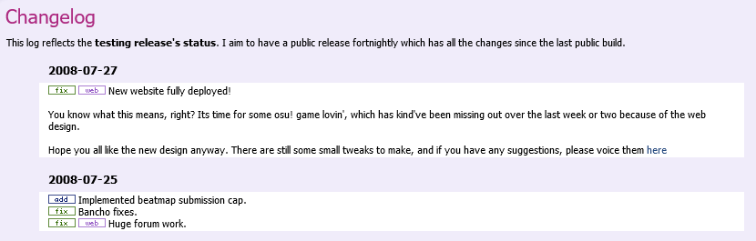

---
tags:
  - change log
  - history
  - Geschichte
---

# Änderungsprotokoll

Das **[Änderungsprotokoll](https://osu.ppy.sh/home/changelog)** ist eine Seite, auf der das [osu!-Entwicklerteam](/wiki/People/Developers) seine täglichen Verbesserungen, Ergänzungen und Fehlerbehebungen des Spiels sowie der Webseite notiert. Alle Änderungen von früheren Versionen werden hier zu Archivierungszwecken aufgezeichnet.

Die Protokolle für die Webseite und [osu!(lazer)](/wiki/Client/Release_stream/Lazer) werden automatisch basierend auf GitHub-Versionen dieser Projekte generiert, während der Rest manuell gepflegt wird.

## Inhalte

Die Hauptseite des Änderungsprotokolls zeigt Updates von allen osu!-Komponenten in absteigender chronologischer Reihenfolge an. Klicke auf eine der Kategorien, um die Auflistung einzugrenzen (Updates des osu!-Wikis sind in `Web` enthalten). Unter der Auswahlliste befindet sich ein Graph, der die Verteilung der Online-Nutzer für jede [Updatequelle](/wiki/Client/Release_stream) des Clients darstellt. Innerhalb einer Kategorie werden Änderungen nach Themengebieten gruppiert und Änderungen, die verhältnismäßig wichtig sind, sind goldfarben.

Die Änderungsliste unterstützt neben Markdown-Formatierung auch Medien wie statische Bilder, animierte GIFs und eingebettete Videos. Während die Änderungen manuell hinzugefügt werden können, werden sie typischerweise von GitHub (wo eine Überprüfung der Änderungen stattfindet) abgerufen und automatisch gruppiert, sobald eine neue Version veröffentlicht wird. Standardmäßig wird alles unter einer horizontalen Linie (`---`) in der Beschreibung eines Änderungsvorschlags (Pull Request) als detaillierte Erklärung für die Änderung verwendet.

Änderungen am Protokoll selbst können [im GitHub-Repository `ppy/osu-web`](https://github.com/ppy/osu-web/pulls?q=is%3Apr+sort%3Aupdated-desc+label%3Aarea%3Achangelog) angesehen werden.

## Geschichte

::: Infobox

:::

Das Änderungsprotokoll wurde von [peppy](/wiki/People/peppy) am 11. September 2007 in einem dafür gedachten Forum-Thread mit dem Titel "[Official Development Changelog](https://osu.ppy.sh/community/forums/topics/15)" gestartet, in dem er wesentliche Änderungen und Fehlerbehebungen auflisten und manchmal Einblicke in anstehende Pläne geben würde.

::: Infobox
")
:::

Im Oktober 2007 wurde eine Webversion des Änderungsprotokolls sowohl über die Webseite als auch über den osu! updater [einsehbar](https://osu.ppy.sh/community/forums/posts/2499).

Am 25. Oktober 2009 wurde die Änderungsliste [über einen RSS-Feed verfügbar](https://osu.ppy.sh/community/forums/topics/19137), der schließlich eingestellt wurde.

::: Infobox
")
:::

Am 28. Oktober 2015 wurde ein Graph mit der Verteilung der osu!-Versionen in der Spielergemeinschaft [zur Änderungsliste hinzugefügt](https://web.archive.org/web/20151103161516/http://osu.ppy.sh:80/p/changelog), der die Statistiken für die Öffentlichkeit zugänglich machte. Zugleich wurde es möglich, das Änderungsprotokoll nach Updatequelle zu filtern.

## Siehe auch

Zusätzlich zu den auf der Website aufgeführten Änderungen kann [peppys Blog](https://blog.ppy.sh/) auch als eine Art Änderungsprotokoll angesehen werden. Über die Jahre hat sich hier eine umfangreiche Sammlung von Beiträgen rund um osu!, seine Entwicklung und sein Ökosystem gebildet, darunter auch kommende Pläne und Notizen von Entwicklertreffen.
