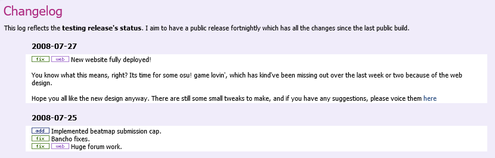

---
tags:
  - change log
  - history
---

# บันทึกการเปลี่ยนแปลง (Changelog)

<!-- เพื่อจุดประสงค์ในการเรียนรู้ประวัติศาสตร์ผ่าน Wayback Machine (https://web.archive.org/) บันทึกการเปลี่ยนแปลงสามารถเข้าถึงได้ผ่าน URL ต่างๆ ดังนี้:
  - http://osu.ppy.sh/?p=changelog
  - http://osu.ppy.sh/p/changelog
--->

**[บันทึกการเปลี่ยนแปลง (Changelog)](https://osu.ppy.sh/home/changelog)** คือหน้าที่ [ทีมพัฒนา osu! (osu! development team)](/wiki/People/Developers) ใช้สำหรับระบุรายละเอียดการปรับปรุง, การเพิ่มสิ่งใหม่ๆ และการแก้ไขบัคในตัวเกมและเว็บไซต์แบบวันต่อวัน การเปลี่ยนแปลงทั้งหมดจากเวอร์ชันก่อนหน้าจะถูกบันทึกไว้ที่นี่เพื่อจุดประสงค์ในการจัดเก็บข้อมูล

บันทึกการเปลี่ยนแปลงสำหรับเว็บไซต์และ [osu!(lazer)](/wiki/Client/Release_stream/Lazer) จะถูกสร้างขึ้นโดยอัตโนมัติตามรายการ Release บน GitHub ของโปรเจกต์นั้นๆ ในขณะที่ส่วนที่เหลือจะได้รับการดูแลและบันทึกด้วยตนเอง

## เนื้อหา (Contents)

หน้าหลักของบันทึกการเปลี่ยนแปลงจะแสดงรายการการแก้ไขที่ปล่อยออกมาในทุกส่วนประกอบของ osu! โดยเรียงลำดับตามเวลาจากล่าสุดลงไป หากต้องการเจาะจงเฉพาะส่วน ให้คลิกที่หนึ่งในหมวดหมู่ที่มีให้ (การอัปเดต osu! wiki จะรวมอยู่ในหมวด `Web`) ใต้ส่วนการเลือกหมวดหมู่จะมีกราฟแสดงการกระจายตัวของผู้ใช้ที่ออนไลน์อยู่ในแต่ละ [สายการพัฒนา (Release stream)](/wiki/Client/Release_stream) ของตัวเกม ภายใต้แต่ละหมวดหมู่ การเปลี่ยนแปลงจะถูกจัดกลุ่มตามพื้นที่ที่ได้รับผลกระทบ และการเปลี่ยนแปลงที่สำคัญเป็นพิเศษจะถูกเน้นด้วยสีทอง

บันทึกการเปลี่ยนแปลงนอกจากจะรองรับการจัดรูปแบบด้วย Markdown แล้ว ยังรองรับสื่อต่างๆ เช่น รูปภาพนิ่ง, ไฟล์ GIF เคลื่อนไหว และวิดีโอที่ฝังไว้ แม้ว่าการเปลี่ยนแปลงบางอย่างอาจถูกเพิ่มด้วยตนเอง แต่โดยปกติแล้วข้อมูลจะถูกดึงและจัดกลุ่มโดยอัตโนมัติจาก GitHub (ซึ่งเป็นที่ที่มีการตรวจสอบการเปลี่ยนแปลง) เมื่อมีการเผยแพร่เวอร์ชันใหม่ โดยพื้นฐานแล้ว ทุกสิ่งที่อยู่ใต้เส้นคั่นแนวนอน (`---`) ในคำอธิบายของ Pull request จะถูกนำมาใช้เป็นคำอธิบายโดยละเอียดสำหรับการเปลี่ยนแปลงนั้นๆ

คุณสามารถดูการเปลี่ยนแปลงของตัวระบบบันทึกการเปลี่ยนแปลงเองได้ [ใน Repository `ppy/osu-web` บน GitHub](https://github.com/ppy/osu-web/pulls?q=is%3Apr+sort%3Aupdated-desc+label%3Aarea%3Achangelog)

## ประวัติความเป็นมา (History)

::: Infobox

:::

บันทึกการเปลี่ยนแปลงเริ่มต้นขึ้นโดย [peppy](/wiki/People/peppy) เมื่อวันที่ 11 กันยายน 2007 ในกระทู้ฟอรัมที่ชื่อว่า "[Official Development Changelog](https://osu.ppy.sh/community/forums/topics/15)" ซึ่งเขาจะระบุการเปลี่ยนแปลงและการแก้ไขบัคที่สำคัญ รวมถึงบางครั้งมีการแบ่งปันข้อมูลเกี่ยวกับแผนการพัฒนาในอนาคต

::: Infobox
")
:::

ในเดือนตุลาคม 2007 บันทึกการเปลี่ยนแปลงเวอร์ชันเว็บไซต์ [ได้เปิดให้ใช้งาน](https://osu.ppy.sh/community/forums/posts/2499) ทั้งผ่านทางหน้าเว็บและผ่านทางโปรแกรมอัปเดตของ osu!

เมื่อวันที่ 25 ตุลาคม 2009 บันทึกการเปลี่ยนแปลง [เริ่มรองรับการติดตามผ่าน RSS feed](https://osu.ppy.sh/community/forums/topics/19137) ซึ่งภายหลังได้ปิดตัวลงไป

::: Infobox
")
:::

เมื่อวันที่ 28 ตุลาคม 2015 กราฟแสดงการกระจายตัวของเวอร์ชันตัวเกม osu! ในหมู่ผู้เล่น [ได้ถูกเพิ่มเข้ามาในหน้าบันทึกการเปลี่ยนแปลง](https://web.archive.org/web/20151103161516/http://osu.ppy.sh:80/p/changelog) ทำให้ข้อมูลสถิติเหล่านี้เปิดเผยต่อสาธารณะทั่วไป ในเวลาเดียวกัน ยังได้เพิ่มความสามารถในการกรองดูบันทึกการเปลี่ยนแปลงตามสายการพัฒนา (Release stream) อีกด้วย

## ดูเพิ่มเติม

นอกเหนือจากการเปลี่ยนแปลงที่ระบุไว้บนเว็บไซต์แล้ว [บล็อกของ peppy](https://blog.ppy.sh/) ยังถือเป็นบันทึกการเปลี่ยนแปลงอีกรูปแบบหนึ่ง ตลอดหลายปีที่ผ่านมา บล็อกนี้ได้รวบรวมโพสต์จำนวนมหาศาลที่เกี่ยวข้องกับ osu!, การพัฒนา และระบบนิเวศของเกม รวมถึงแผนการในอนาคตและบันทึกการประชุมของเหล่านักพัฒนา
