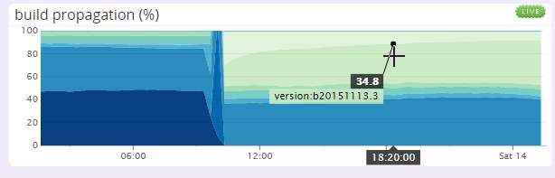

---
tags:
  - change log
  - history
  - 更新日志
  - 更新历史
---

# 更新日志

<!-- for the purpose of learning the history through the Wayback Machine (https://web.archive.org/), the changelog is available at different URLs:
  - http://osu.ppy.sh/?p=changelog
  - http://osu.ppy.sh/p/changelog
--->

**[更新日志 (Changelog)](https://osu.ppy.sh/home/changelog)** 是 [osu! 开发团队](/wiki/People/Developers)详细列出游戏和网站更新的地方，其中包括每天做出的改进、内容更新与问题修复。出于存档的目的，先前所有版本的更改都记录在此处。

网站和 [osu!(lazer)](/wiki/Client/Release_stream/Lazer) 的更新日志基于 GitHub 上的相应发行版自动生成，而其它项目的更新日志则是人为维护的。

## 内容

更新日志的主页展示了所有 osu! 组件的更改，以时间降序排列。要缩小列表范围，请点击其中一个类别（osu! wiki 的更改包含在 `Web` 内）。类别选择栏下方展示了每个客户端[更新通道](/wiki/Client/Release_stream)的在线用户数量。每个分类中，更改根据效果分组，且重要更新将标为金色。

除了 Markdown 格式，更新日志还支持添加静态图片、动态 GIF，以及嵌入视频。在发布新版本时可以手动添加它们，但这些日志通常都取自 GitHub（更改在这里被审查），并自动分组。在拉取请求 (Pull Request) 的描述中，默认会将水平线 (`---`) 下方的内容作为对更改的详细解释使用。

更新日志本身的更改可在 [`ppy/osu-web` GitHub 存储库](https://github.com/ppy/osu-web/pulls?q=is%3Apr+sort%3Aupdated-desc+label%3Aarea%3Achangelog)中找到。

## 历史

::: Infobox

:::

更新日志最初由 [peppy](/wiki/People/peppy) 在 2007 年 9 月 11 日编写，发布在名为[“官方开发更新日志” (Official Development Changelog)](https://osu.ppy.sh/community/forums/topics/15) 的独立论坛帖子中。其中列举了值得关注的更改和问题修复，有时还会简单提一下未来的更新计划。

::: Infobox
（2013年）")
:::

2007 年 10 月，Web 版本的更新日志[上线](https://osu.ppy.sh/community/forums/posts/2499)，在网站和 osu! 更新器中都可以看到。

2009 年 10 月 25 日，更新日志现在[能够通过 RSS 获取](https://osu.ppy.sh/community/forums/topics/19137)，但最终关闭。

::: Infobox

:::

在 2015 年 10 月 28 日，一个展示 osu! 不同版本玩家分布的图表[添加到了更新日志](https://web.archive.org/web/20151103161516/http://osu.ppy.sh:80/p/changelog)，使大众能够看到统计数据。同时，它也能够根据更新通道来筛选更新日志。

## 另请参阅

除了网站上展示的更改，[peppy 的博客](https://blog.ppy.sh/)也被视为另一种更新日志。多年以来，它积累了 osu! 本身，它的开发和生态（包括未来计划和开发者会议的记录）的大量博客文章。
