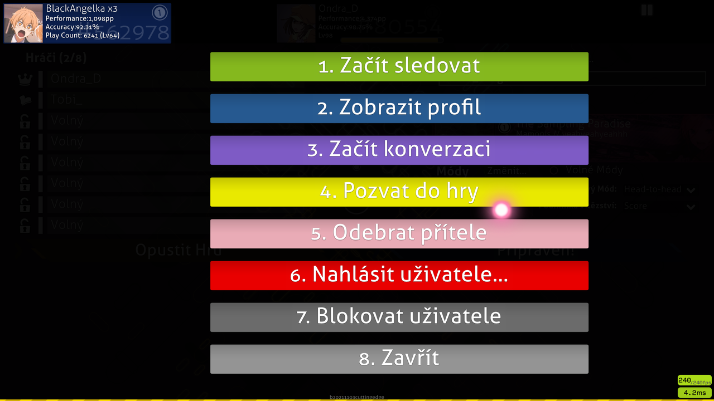

<!-- TODO: dated images and links, formatting problems, writing could be done better instead of all these lists. I removed the `needs_cleanup` tag because this still details the Chat Console pretty well. -->

# Chat konzole

Na většině obrazovek v osu! můžete stisknout `F8` nebo kliknout na tlačítko `Zobrazit chat` v pravém dolním rohu pro překrytí chatovací konzole ve spodní třetině obrazovky.

- Na kartách jsou uvedeny aktuálně dostupné kanály. Jednoduše klikněte na kartu a přesuňte se na daný kanál. Kliknutím na žluté tlačítko plus zobrazíte seznam nových kanálů, ke kterým se můžete připojit.
- Barvy uživatelských jmen znamenají různé věci.

| Barva | Kdo? |
| :-- | :-- |
| **Bílá** | Vy |
| **Bledá** | Nepodporující |
| **Žlutá** | [osu!supporter](/wiki/osu!supporter) |
| **Červená** | Uživatelé z [Globálního moderátorského týmu](/wiki/People/The_Team/Global_Moderation_Team) nebo [Týmu pro hodnocení nominací](/wiki/People/The_Team/Nomination_Assessment_Team ) |
| **Zelená** | Zpráva bude obsahovat buď vaše uživatelské jméno, nebo jedno z vašich „zvýrazněných slov“. Zpráva je také uvedena v kanálu #highlight. |
| **Modrá** | Soukromá zpráva |
| **Tyrkysová** | [peppy](https://osu.ppy.sh/users/2), tvůrce osu! |
| **Růžová** | [BanchoBot](/wiki/BanchoBot) |

- Kliknutím na pole `Show Ticker` zobrazíte nejnovější chatovou zprávu ve spodní části obrazovky, když není chatovací konzole viditelná.
- Kliknutím na políčko „Automaticky skrýt“ automaticky skryjete chat během hraní (kromě úvodu, konce a přestávek beatmapy).
- Chcete-li skrýt chatovací konzoli, klikněte na pole `Skrýt chat` nebo znovu stiskněte `F8`.

## Rozšířená chat konzole

*[osu!academy](/wiki/osu!academy) pokryl toto téma v [Episodě 6 (6:52)](https://www.youtube.com/watch?v=cyYRl-a5xII) taky s [Multiplayer](/wiki/Multi).*

Téměř všude v osu! chat konzoli lze rozbalit stisknutím klávesy F9 nebo kliknutím na kartu Online uživatelé (vpravo dole). Kromě chat konzole se zobrazuje i okno plné panelů přihlášených uživatelů, na kterých je vidět i aktuální aktivita uživatelů.

Každý uživatel přihlášen do osu! má uživatelský panel zobrazený v rozšířeném chatu. Ve výchozím nastavení zobrazuje obecné informace (jméno, celkové hodnocené skóre, pořadí, přesnost, počet přehrání a případný avatar uživatele). Když na něj umístíte kurzor myši, zobrazí se jiná sada informací (jméno, hodnost, avatar, pokud existuje, místní čas, časové pásmo, umístění podle země a pokud to uživatel povolí, město a co dělají).

- Přátelé zobrazí se pouze vaši přátelé.
- Zaškrtávací políčko Zamknout panely umožňuje zamrazit panely. Přihlašování/odhlašování uživatelů a opětovné řazení nebo filtrování jsou pak ignorovány.
- Kliknutím na kartu seřadíte uživatelské panely podle tohoto atributu.
- Kliknutím na mapu světa zobrazíte mapu světa, která ukazuje, kde se všichni nacházejí.
- Kliknutím a tažením na bílé pole můžete rolovat, můžete také použít kolečko myši.
- Uživatelé bez statistik ve svých panelech jsou připojeni k chatu pomocí svých IRC klientů.

| Barva Panelu | Popis |
| :-- | :-- |
|  | Tmavě Modrá - Hráči jsou momentálně nečinní nebo nic nedělají nebo jen chatují. |
|  | Šedá - Hraní beatmap sólo. |
|  | Světle Modrá - Dívat se na záznam nebo někoho spektátovat. |
|  | Červená - Úpravují jejich vlastní beatmapy. |
|  | Fialová - Testujou beatmapu, buď je to jejich beatmapa nebo ne. |
|  | Tyrkysový - Odeslání (buď nahrání nebo aktualizace) beatmapy, kterou vytvořili. |
|  | Zelená - Modifikace nebo úpravy beatmapy někoho jiného. |
|  | Hnědá - Uživatel je v multiplayeru, ale nehraje. |
|  | Žlutá - Aktuálně hraje v multiplayeru. |
|  | Černá - Neaktivní nebo mimo klávesnici (afk). |
|  | Tmavě modrá bez obsahu - Hráč není ve hře, ale přihlášený k IRC klientovi nebo statistiky nejsou k dispozici. |

Kliknutím na libovolný uživatelský panel se zobrazí obrazovka možností.

Stiskněte číslo nebo klikněte na lištu pro aktivaci:

1. `Začít sledovat`: Pokud uživatel hraje beatmapu a vy máte tu beatmapu, můžete je sledovat, když hrají. Vaše jméno bude v jejich seznamu diváků.
2. `Zobrazit profil`: Otevře webovou stránku profilu hráče ve vašem prohlížeči.
3. `Začít konverzaci`: Otevře kartu soukromého chatu s uživatelem.
4. `Pozvat do hry`: (Pokud jste ve multiplayeru) Požádejte uživatele, aby přišel do vašeho lobby.
5. `Přidat (Odebrat) Přítele`: Přidá (Odebere) uživatele z vašeho seznamu přátel.
6. `Nahlásit uživatele`: Nahlaste uživateli nevhodné chování. Jinak by se nikdy neměl používat. Uživatele můžete nahlásit ve hře pro řadu věcí, ale také na webu, jako jsou fóra.
7. `Blokovat uživatele`: Žádný záznam chatu od uživatele se nezobrazí ve vaší chatovací konzoli.
8. `Zavřít`: Zavře panel.

## Seznam příkazů

### /help

| Příkaz | Efekt | Příklad | Odpověd BanchoBota |
| :-- | :-- | :-- | :-- |
| `/addfriend [uživatel]` | Přidá `[uživatele]` do vašeho seznamu přátel. | `/addfriend Ondra_D` | Nyní jste přátelé s Ondra_D. |
| `/delfriend [uživatel]` | Odstraňte `[uživatele]` z vašeho seznamu přátel. | `/delfriend Ondra_D` | S Ondra_D už nejste přátelé. |
| `/away [zpráva]` | Nastaví zprávu pryč (zaslanou uživatelům, kteří vám odešlou PM). Pro zrušení nechte zprávu prázdnou. | `/away Já jsem Ondra_D.` | Byli jste označeni jako pryč: Já jsem prič. Když peppy /msg Ondra_D Kde jsi~? BanchoBot: Jsem Ondra_D. | |
| `/bb` | Odešle zprávu Bancho, aby provedla příkaz jako `!stats [uživatel]` | `/bb !stats Uan` | \[15/11/12\] Statistiky pro [Uan](https://osu.ppy.sh/users/147623): Skóre: 47,323,299,680 (#1) Počet zahrání: 176293 (lv102) Přesnost: 98.95% |
| `/chat [Uživatel]` | Otevřete novou kartu chatu se zadaným uživatelem. | `/chat Ondra_D` | (otevře se karta Ondra_D) |
| `/clear` | Všechny zprávy z aktuálně vybrané karty chatu budou odstraněny. | `/clear` | (Vymaže v podstatě vše na aktuální kartě) |
| `/ignore [uživatel][@chp]` | Ignorovat všechny zprávy od zadaného uživatele pro tuto relaci. Přidáním znaku @ následovaného písmeny c, h a/nebo p je můžete ignorovat v chatu, zvýraznění nebo PM. | `/ignore Ondra_D@chp` | BanchoBot: Už neuslyšíte Ondra_D {chat} {highlights} {PM} (Vaše chat konzole je nastavena na: ignorujte jakýkoli text napsaný Amigem \[c\], jakýkoli text, který vás zvýrazňuje Ondra_D \[h\] jakoukoli soukromou zprávu vám poslal Ondra_D\[p\]) |
| `/j [kanál]` or `/join [kanál]` | Připojí se k určenému kanálu | `/join #czechoslovak` | (#czechoslovak karta je otevřená) |
| `/p` nebo `/part` | Opustí aktuální kanál, který oddělujete nebo opouštíte. | `/part` | n/a |
| `/unignore [uživatel]` | Přestantě ignorovat tohoto uživatele pro tuto relaci. | `/unignore Ondra_D` | Nyní můžete slyšet Ondra_D. (Vaše chatovací konzole umožní, aby byl jakýkoli komentář od Amiga dostupný vaší chatovací konzoli) |
| `/me [akce]` | Proveďte akci třetí osoby. | `/me jsem doma` | * Ondra_D je doma |
| `/msg [uživatel] [zpráva]` | Pošlete soukromou zprávu `[uživateli]`. | `/msg Ondra_D Pojď hrát.` | (Na kartě Ondra_D) peppy: Pojď hrát. |
| `/np` | Napište do chatu aktuální skladbu, kterou posloucháte nebo hrajete. | `/np` | (Pokud hraje) * peppy hraje [Peter Lambert - osu! tutorial \[Gameplay Basics\]](https://osu.ppy.sh/beatmapsets/3756#osu/22538) |
| `/reply` nebo `/r` | Odpovědět na poslední přijatou soukromou zprávu. | `/r Znáš nějakého dobrého lékaře?` | (Na kartě Ondra_D) \[Previous comments\] peppy: Jsem nemocný doma. Ondra_D: Vážně? peppy: Znáš nějakého dobrého lékaře? |
| `/savelog` | Uloží aktuální kartu chatu do textového souboru. | `/savelog` | (V adresáři osu! bude vytvořena složka s názvem „Chat“, která bude obsahovat všechna budoucí uložení na kartě chatu) |
| `/watch [uživatel]` | Začnetě sledovat `[uživatele]`. | `/watch Ondra_D` | * Szačnětě se dívat na Ondra_D. (Když Ondra_D hraje beatmapu, kterou máte, uvidíte jeho hru \[po nějakém buffering\] se svým jménem na levé straně Ondra_D obrazovky) |
| `/nopm` | Přepnutím povolíte soukromé zprávy od všech nebo pouze od přátel | `/nopm` | (Uprostřed se zobrazí vyskakovací banner s podrobnostmi, že povolujete všem/přátelům pouze soukromé zprávy) |
| `/invite [uživatel]` | Pozve `[uživatele]` do místnosti pro více hráčů spolu s odkazem. | `/invite peppy` | * peppy byl pozván do hry |

### /keys

| Klávesy klávesnice | Efekt |
| :-- | :-- |
| `Page Up` / `Page Down` | Posuňte okno chatu. Můžete také použít kolečko myši. |
| `Tab` | Automaticky doplňovat právě píšící přezdívku. |
| `F8` | Přepněte chatovací konzoli. |
| `F9` | Přepněte rozšířenou extended chatovací konzoli. |
| `Ctrl` + `C` / `V` | Kopírovat/vložit. |
| `Alt` + `0` - `9` | Přepněte na příslušnou kartu. |
