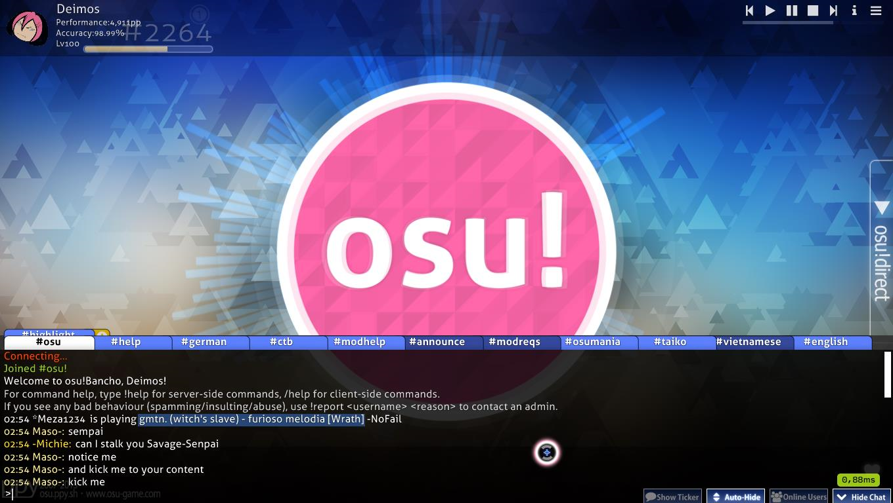
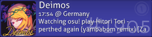
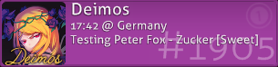
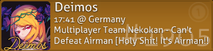
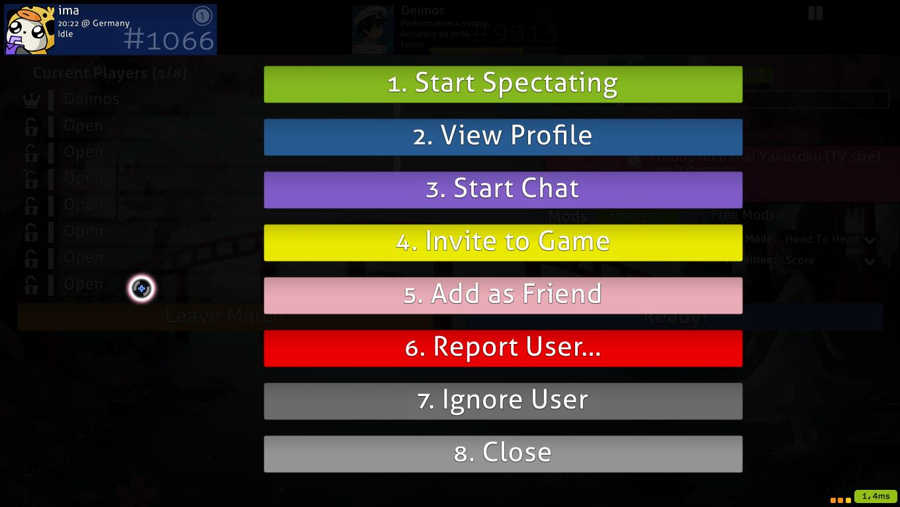

# Consola del Chat

Desde la mayoría de las pantallas en osu! puedes presionar `F8` o hacer clic en el botón `Mostrar chat` en la esquina inferior derecha para superponer la consola de chat en el tercio inferior de la pantalla.

- Las pestañas listan los canales disponibles actualmente. Simplemente haz clic en una pestaña para moverte a ese canal. Haz clic en `Nuevo` para mostrar una lista de canales nuevos para unirte.
- Los colores de los nombres de los usuarios significan cosas diferentes.

| Color | ¿Quien? |
| :-- | :-- |
| **Blanco** | Tú. |
| **Amarillo pastel** | No supporter. |
| **Amarillo** | [osu!supporter](/wiki/osu!supporter). |
| **Rojo** | Miembro del [Global Moderation Team](/wiki/People/The_Team/Global_Moderation_Team) o [Nomination Assessment Team](/wiki/People/The_Team/Nomination_Assessment_Team). |
| **Verde** | La línea contiene su nombre o ciertas palabras clave que ha agregado para activar un "resaltado". También aparecerá una copia del mensaje en un canal dedicado, `#highlight`, que contiene todas estas líneas. |
| **Azul** | Mensaje privado. |
| **Cian** | [peppy](https://osu.ppy.sh/users/2), el creador de osu!. |
| **Rosa** | [BanchoBot](/wiki/BanchoBot). |

- Haz clic en el cuadro `Show Ticker` para mostrar el mensaje de chat más nuevo en la parte inferior de la pantalla cuando la consola de chat no esté visible.
- Haz clic en el cuadro `Auto-Hide` para ocultar automáticamente el chat durante el juego (excluyendo la introducción, el outro y los descansos del beatmap).
- Haz clic en el cuadro `Hide Chat` o presiona F8 nuevamente para ocultar la consola de chat.

## Consola de chat ampliada

*[osu!academy](/wiki/osu!academy) cubrió esta página en el [Episodio 6 (6:52)](https://www.youtube.com/watch?v=cyYRl-a5xII) junto con [Multijugador](/wiki/Multi).*

Desde la mayoría de las pantallas en osu! puedes presionar `F9` o hacer clic en el botón `Online Users` en la parte inferior derecha de la pantalla de introducción para alternar la consola de chat extendida. Además de la Consola de chat, el Chat ampliado superpone una lista de paneles en los dos tercios restantes de la pantalla, mostrando información sobre los usuarios que están actualmente conectados.

Cada usuario conectado en osu! tiene un panel de usuario que se muestra en la Consola de chat ampliada. Por defecto, muestra información general (nombre, puntaje total clasificado, rango, precisión, conteo de jugadas y avatar del usuario, si corresponde). Cuando el cursor del mouse se coloca sobre él, muestra un conjunto diferente de información (nombre, rango, avatar si lo hay, hora local, zona horaria, ubicación por país y, si lo permite el usuario, la ciudad, lo que están haciendo) .

- Solo amigos limita la visualización a tus amigos.
- Bloquear paneles evita que los paneles salten, esto también incluye nuevos usuarios.
- Haz clic en una pestaña para ordenar los paneles de usuario según ese atributo.
- Haz clic en el mapa del mundo para mostrar un mapa que muestra dónde están todos.
- Puede hacer clic y arrastrar en el cuadro blanco para desplazarte, también puede usar la rueda del mouse.
- Los usuarios sin estadísticas en sus paneles están conectados al chat usando sus clientes de IRC.

| Color del panel | Descripción |
| :-- | :-- |
|  | Azul marino - Los jugadores están inactivos, o no están haciendo nada, o simplemente están chateando. |
|  | Gris - Jugando un beatmap solo. |
|  | Celeste - Viendo una repetición o espectando a alguien. |
|  | Rojo - Editando su propio beatmap. |
|  | Purpura - Juego de prueba de un beatmap, ya sea su beatmap o no. |
|  | Turquesa - Enviando (tanto subiendo o actualizando) el beatmap que han hecho. |
|  | Verde - Modificando o editando el beatmap de otra persona. |
|  | Cafe - El usuario está en modo multijugador, pero no está jugando. |
|  | Amarillo - Actualmente jugando en multijugador. |
|  | Negro - Inactivo o fuera del teclado (AFK). |
|  | Azul oscuro sin contenido - El jugador no está dentro del juego, pero ha iniciado sesión desde un cliente de IRC o las estadísticas no están disponibles. |

Al hacer clic en cualquier panel de usuario mostrara una pantalla de opciones.

Presiona el número o haz clic en la barra para activar:

1. `Empezar a espectear`: Si el usuario está jugando un beatmap y tienes el beatmap, puedes observarlos mientras juegan. Tu nombre estará en su lista de Espectadores.
2. `Ver perfil`: Abre la página web del perfil del jugador en su navegador.
3. `Empezar un chat`: Abre una pestaña de chat privado con el usuario.
4. `Invitar al juego`: (Si estás en la sala multijugador) Invita al usuario que se una a tu sala.
5. `Agregar (Eliminar) como Amigo`: Agrega (Elimina) al usuario en tú lista de amigos
6. `Reportar usuario`: Reporta al usuario por mala conducta. Nunca debe usarse a menos que se indique lo contrario. Puedes reportar a un usuario en el juego por varias razones, pero tambien en la web, como en los foros.
7. `Ignorar usuario`: Cualquier entrada de chat por parte del usuario no aparecerá en tu consola de chat.
8. `Cerrar`: Cierra el panel.

## Lista de comandos

### /help

| Comando | Efecto | Ejemplo | Respuesta de BanchoBot |
| :-- | :-- | :-- | :-- |
| `/addfriend [usuario]` | Agrega a `[usuario]` a tu lista de amigos. | `/addfriend Amigo` | You are now friends with Amigo. |
| `/delfriend [usuario]` | Elimina a `[usuario]` de tu lista de amigos. | `/delfriend Amigo` | You are no longer friends with Amigo. |
| `/away [mensaje]` | Establece un mensaje de ausente (enviado a los usuarios enviandote mensajes privados). Deje el mensaje en blanco para cancelar. | `/away Soy John Smith.` | You have been marked as being away: Soy John Smith. Cuando Amigo /msg John ¿Dónde estás~? BanchoBot: Soy John Smith.|
| `/bb` | Envía un mensaje a bancho como rango `[número]` | `/bb rank 1` | [15/11/12] Stats for Uan: Score: 47,323,299,680 (#1) Plays: 176293 (lv102) Accuracy: 98.95% |
| `/chat [usuario]` | Abre una nueva pestaña de chat con el usuario especificado. | `/chat Amigo` | (Se abre la pestaña Amigo) |
| `/clear` | Borra el historial de chat actual. | `/clear` | (Borra básicamente todo en la pestaña actual) |
| `/ignore [usuario][@chp]` | Ignora todos los mensajes del usuario especificado para esta sesión. Al agregar un @ seguido de las letras, c, h, y/o p, puede ignorarlas en el chat, las altas luces o los mensajes privados, respectivamente. | `/ignore Amigo@chp` | BanchoBot: You will no longer hear Amigo {chat} {highlights} {PM} (Tu consola de chat está configurada para: ignorar cualquier texto escrito por Amigo [c], cualquier texto posible que te resalte Amigo [h] cualquier mensaje privado enviado a por Amigo [p]) |
| `/j [canal]` o `/join [canal]` | Se une al canal especificado | `/join #lobby` | (Se abre la pestaña #lobby) |
| `/p` o `/part` | Deja el canal actual del que te estás separando o saliendo. | `/part` | n/a |
| `/unignore [usuario]` |Deja de ignorar a este usuario para esta sesión. | `/unignore Amigo` | You may now hear Amigo. (Su consola de chat permitirá que cualquier comentario hecho por Amigo esté disponible para su consola de chat) |
| `/me [acción]` | Realiza una acción en tercera persona. | `/me está en casa` | * John está en casa |
| `/msg [usuario] [msg]` | Envíe un mensaje privado a `[usuario]`. | `/msg Amigo estoy enfermo en casa` | (En la pestaña Amigo) John: Estoy enfermo en casa. |
|`/np`| muestra en el chat la canción actual que está escuchando o reproduciendo.| `/np`| (En partida) * John is playing [Peter Lambert - osu! tutorial\[Gameplay Basics\]](https://osu.ppy.sh/beatmaps/22538) [Modos de juego](/wiki/FAQ#alternative-game-modes) \~[Relax/Autopilot](/wiki/Game_Modifiers#special-mods)\~ +[Mods para aumentar la dificultad](/wiki/Game_Modifiers#difficulty-increasing-mods) -[Mods para disminuir la dificultad](/wiki/Game_Modifiers#difficulty-reduction-mods)/[SpunOut](/wiki/Game_Modifiers#spun-out) [xK](/wiki/Game_Modifiers#xk) (Si no hace nada, basado en la jukebox) * John is listening to [Peter Lambert - osu! tutorial](https://osu.ppy.sh/beatmaps/22538) (Si está espectando o con Autoplay) * John is watching [Peter Lambert - osu! tutorial\[Gameplay basics\]](https://osu.ppy.sh/beatmaps/22538) [Game Modes](/wiki/FAQ#alternative-game-modes) \~[Relax/Autopilot](/wiki/Game_Modifiers#special-mods)\~ +[Difficulty increasing mod](/wiki/Game_Modifiers#difficulty-increasing-mods) -[Mods para disminuir la dificultad](/wiki/Game_Modifiers#difficulty-reduction-mods)/[SpunOut](/wiki/Game_Modifiers#spun-out) [xK](/wiki/Game_Modifiers#xk) [Autoplay](/wiki/Game_Modifiers#auto)|
| `/reply` o `/r` | Responde al último mensaje privado recibido. | `/r ¿Conoces a algún buen doctor?` | ((En la pestaña Amigo) [Comentarios previos] John: Estoy enfermo en casa. Amigo: ¿De verdad? John: ¿Conoces a algún buen doctor? |
| `/savelog` | Guarda la pestaña de chat actual en un archivo de texto. | `/savelog` | (Se creará una carpeta llamada "Chat" en el directorio osu! que contendrá todas las pestañas de la pestaña de chat futura) |
| `/watch [usuario]` | Comience a observar a `[usuario]`. | `/watch Amigo` | * Started spectating Amigo. (Cuando Amigo juegue un beatmap que tenga, verá su juego [después de un almacenamiento en búfer] con su nombre a la izquierda de la pantalla de Amigo) |
| `/nopm` | Alternar para permitir mensajes privados de todos o solo amigos | `/nopm` | (Aparecerá un banner emergente en el centro que detalla que está permitiendo que todos/amigos solo para mensajes privados) |
| `/invite [usuario]` | Invita a `[usuario]`a la sala multiplayer junto con el enlace. | `/invite Nathanael` | * Nathanael has been invited to the game |

### /keys

| Teclas de teclado | Efecto |
| :-- | :-- |
| `Page Up` / `Page Down` | Desplázarte por la ventana de chat. También puede usar la rueda del mouse. |
| `Tab` | Autocompletar actualmente escribiendo apodo. |
| `F8` | Alternar la consola de chat. |
| `F9` | Alternar la consola de chat extendida. |
| `Ctrl` + `C` / `V` | Copiar/pegar. |
| `Alt` + `0` - `9` | Cambia a la pestaña respectiva. |
