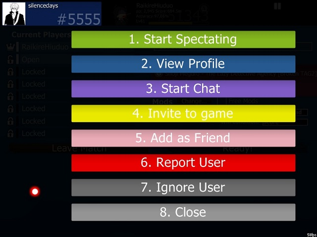

# 기본 채팅 명령어

osu!의 거의 모든 화면에서는 F8키나 우측 하단에 있는 `Show Chat` 클릭을 통해 화면의 하단 3분의1에 채팅창을 열수 있습니다.

-   탭은 현재 사용가능한 채널을 나열합니다. 간단히 탭을 클릭하는 것으로 그 채널로 들어갈 수 있습니다. 들어갈 수 있는 새로운 채널들의 목록을 표시하려면 New를 클릭합니다.
-   유저 이름의 색은 각각 다른 사항을 의미합니다.

| 색깔     | 누구?                                                                                                                                             |
|----------|---------------------------------------------------------------------------------------------------------------------------------------------------|
| **흰색**     | 당신입니다                                                                                                                                        |
| **노랑색**    | 다른 유저입니다                                                                                                                                   |
| **주황색**    | [osu!supporter](/wiki/osu!supporter/ "osu!supporter")                                                                                            |
| **빨간색**    | BAT(뱃) 또는 GMT                                                                                                                                  |
| **초록색**    | 당신의 이름이나 지정된 키워드가 포함된 메세지가 나올 경우, "highlight" 로써 표시됩니다. 그리고 그 메세지의 기록이 `#highlight` 채널에 남게 됩니다. |
| **파란색**    | (PM/Private Messege) 개인 메세지입니다                                                                                                            |
| **청록색**    | [peppy/페피](https://osu.ppy.sh/u/2 "peppy"), osu!의 운영자입니다.                                                                                           |
| **분홍색**    | [BanchoBot/반쵸봇](/wiki/BanchoBot/ "BanchoBot")                                                                                                      |

-   `Show Ticker` 을 누르면 채팅창이 열리지 않았을 때 가장 최근에 출력된 메세지가 하단에 보이게 할수 있습니다.
-   `Auto-Hide` 를 누르면 게임을 플레이 할 때 채팅창을 자동적으로 사라지게 할 수 있습니다. (비트맵의 Intro와 Outro, Break는 제외).
-   채팅창을 닫을 때에는 `Hide Chat` 이나 `F8`을 재차 눌러주세요.

## 확장된 채팅 명령어

osu! 대부분의 화면에서는 F9키나 처음 화면 오른쪽 아래의 `Online Users` 버튼을 이용해 온라인 유저창을 열거나 닫을수 있습니다. 추가적으로, 온라인 유저창에서는 남은 2/3의 화면에서 현재 온라인인 유저의 정보를 확인할 수 있습니다!

osu! 에 로그인한 유저는 Extended Chat에 유저 패널이 생깁니다. 디폴트로 일반 정보 (이름, 총 랭크 점수, 랭크, 정확도, 플레이 카운트 그리고 있을경우 그 유저의 아바타) 가 표시됩니다. 유저 패널에 커서를 올려놓으면 추가적인 정보 (아이디, 랭크, 아바타, 현지 시간, 시간대, 국가 위치와 설정되어 있을 경우 도시, 그리고 현재 하고 있는 행동) 가 표시됩니다.

-   Friends(친구들)은 당신의 친구들에게만 보이게 됩니다.
-   Lock Panels(패널 고정)은 패널들이 이곳저곳으로 날아다니는 것을 막습니다. 새로 추가되는 유저들도 포함됩니다.
-   기준별로 유저패널을 분류하려면 그 기준이 적힌 탭을 클릭하세요.
-   모든 유저가 어디있는지 보시려면 World map(세계 지도)를 클릭하세요.
-   당신은 흰색박스를 클릭하거나 스크롤 할 수 있고, 또한 마우스 휠을 사용할 수 있습니다.

패널의 색은 플레이어의 현재 상태를 나타냅니다:

| Panel colour                                                                                          | Description                                                                                                    |
|-------------------------------------------------------------------------------------------------------|----------------------------------------------------------------------------------------------------------------|
|                                              | **검은파란색:** 위의 상태에 해당되지 않는 상태입니다.                                 |
|                                     | **회색:** 비트맵을 플레이중인 상태입니다.                                                                            |
|                                  | **연파랑색:** 타인의 플레이, 또는 리플레이를 관전하는 상태입니다.                                                          |
|                 | **빨간색:** 자신의 비트맵을 Edit 하고 있는 상태입니다.                                                                               |
|                 | **초록색:** 타인의 비트맵을 Edit하고 있는 상태입니다.                                              |
|        |  **연녹색:** 비트맵을 업로드중인 상태입니다.                       |
|                 | Green - Modding or editing someone else's beatmap.                                                             |
|                         | **갈색:** 멀티플레이에 들어와 있으나 대기중인 상태입니다.                                                     |
|  | **노란색:** 멀티플레이중인 상태입니다.                                                     |
|                                                 | **검은색:** 2분 30초 이상 아무것도 하지 않고있는 상태입니다.                                                                 |
|                     | Dark Blue without content - Player is not ingame, but logged in from an IRC client or stats are not available. |

아무 사용자 패널을 클릭하면 옵션화면이 나타납니다. 활성화를 위해 번호를 누르거나 줄을 클릭 :-

1.  `Start Spectating`: 만약 유저가 플레이하고있고 당신이 그 비트맵을 가지고 있다면. 당신은 그들이 플레이하는동안 볼 수 있다. 또한 당신의 이름은 관전자 리스트에 있을겁니다.
2.  `View Profile`: 당신의 브라우저로 플레이어 프로필 웹 페이지를 여세요.
3.  `Start Chat`: 유저와의 개인적 채팅 탭을 엽니다.
4.  `Invite to game`: (만약 당신이 멀티룸에 있다면) 당신의 방에 유저가 들어오도록 제안하세요.
5.  `Add as Friend`: 친구 목록에 유저를 추가하세요.
6.  `Report User`: 다른 유저의 잘못된 행동을 신고합니다. 달리 언급되지 않는다면 사용하지 마십시오.
7.  `Ignore User`: 활성화된 유저의 모든 채팅을 어느 채팅방에서든지 보이지 않게됩니다.
8.  `Close`: 패널을 닫습니다.

## 명령어 목록

### /help

| 명령어                                    | 효과                                                                  | 예)                              | BanchoBot의 응답                                                                                                                                                                                                                                                                                                                                                                                                                                                           |
|----------------------------------------|---------------------------------------------------------------------|---------------------------------|-------------------------------------------------------------------------------------------------------------------------------------------------------------------------------------------------------------------------------------------------------------------------------------------------------------------------------------------------------------------------------------------------------------------------------------------------------------------------|
| `/addfriend [user]` or `/delfriend [user]` | 친구목록에 추가, 또는 삭제합니다.                                                 | `/addfriend Amigo`                | You are now friends with Amigo.                                                                                                                                                                                                                                                                                                                                                                                                                                         |
| `/away [message]`                        | 당신에게 말을 건 사람에게 미리 입력해놓은 메세지를 자동으로 보냅니다. 명령어만을 입력하는 것으로 무효화 할수 있습니다. | `/away I am John Smith.`          | You have been marked as being away: I am John Smith. When Amigo /msg John Where are you~? BanchoBot: I am John Smith.                                                                                                                                                                                                                                                                                                                                                   |
| `/bb`                                    | bancho에게 보낸 숫자, 랭킹에 대응하는 플레이어의 프로필이 출력됩니다.                          | `/bb rank 1`                      | [15/11/12] Stats for Uan: Score: 47,323,299,680 (#1) Plays: 176293 (lv102) Accuracy: 98.95%                                                                                                                                                                                                                                                                                                                                                                             |
| `/chat [user]`                           | 지정한 유저와의 채팅탭이 열리고 채팅이 가능하게 합니다.                                     | `/chat Amigo`                     | (Amigo tab is opened)                                                                                                                                                                                                                                                                                                                                                                                                                                                   |
| `/clear`                                 | 현재 채팅창에서 지난 메세지들을 삭제합니다.                                            | `/clear`                          | (Clears basically everything on the current tab)                                                                                                                                                                                                                                                                                                                                                                                                               |
| `/ignore [user][@chp]`                   | 지정한 유저의 채팅 내용을 표시하지 않습니다. (호출, PM도 포함됩니다.)                          | `/ignore Amigo@chp`               | BanchoBot: You will no longer hear Amigo {chat} {highlights} {PM} (Your chat console is set to: ignore any text written by Amigo [c], any possible text highlighting you by Amigo [h] any Private Message sent to you by Amigo [p])                                                                                                                                                                                                                                     |
| `/j [channel]` or `/join [channel]`        | 특정 채널에 입장합니다.                                                       | `/join #lobby`                    | (#lobby tab is opened)                                                                                                                                                                                                                                                                                                                                                                                                                                                  |
| `/p` or `/part`                            | 현재 채팅 채널을 닫습니다.                                                     | `/part`                           | n/a                                                                                                                                                                                                                                                                                                                                                                                                                                                                     |
| `/unignore [user]`                       | 그 탭에서 ignore했던 플레이어를 해제합니다.                                         | `/unignore Amigo`                 | You may now hear Amigo. (Your chat console will allow any comment made by Amigo available to your chat console)                                                                                                                                                                                                                                                                                                                                                         |
| `/me [action]`                           | 본인의 행동을 3인칭으로 표시합니다.                                                | `/me is at home`                  | John is at home                                                                                                                                                                                                                                                                                                                                                                                                                                                         |
| `/msg [user] [msg]`                      | `[user]`에게 PM을 보냅니다.                                                  | `/msg Amigo I am sick at home.`   | (At Amigo tab) John: I am sick at home.                                                                                                                                                                                                                                                                                                                                                                                                                                 |
| `/np`                                    | 지금 듣거나 플레이하고 있는 곡을 채팅에 표시하게합니다.                                     | `/np`                             | (If playing) * John is playing [Peter Lambert - osu! tutorial\[Gameplay Basics\]](https://osu.ppy.sh/b/22538) [Game Modes](/wiki/FAQ#alternative-game-modes) \~[Relax/Autopilot](/wiki/Game_Modifiers#special-mods)\~ +[Difficulty increasing mod](/wiki/Game_Modifiers#difficulty-increasing-mods) -[Difficulty decreasing mod](/wiki/Game_Modifiers#difficulty-reduction-mods)/[SpunOut](/wiki/Game_Modifiers#spun-out) [xK](Game_Modifiers#xk) (If doing nothing, based on jukebox) * John is listening to [Peter Lambert - osu! tutorial](https://osu.ppy.sh/b/22538) (If spectating or Autoplay) * John is watching [Peter Lambert - osu! tutorial\[Gameplay basics\]](https://osu.ppy.sh/b/22538) [Game Modes](/wiki/FAQ#alternative-game-modes) \~[Relax/Autopilot](/wiki/Game_Modifiers#special-mods)\~ +[Difficulty increasing mod](/wiki/Game_Modifiers#difficulty-increasing-mods) -[Difficulty decreasing mod](/wiki/Game_Modifiers#difficulty-reduction-mods)/[SpunOut](/wiki/Game_Modifiers#spun-out) [xK](Game_Modifiers#xk) [Autoplay](/wiki/Game_Modifiers#auto)|
| `/reply` or `/r`                           | 마지막에 받은 개인메세지(PM)에 답신합니다.                                           | `/r Do you know any good doctor?` | (At Amigo tab) [Previous comments] John: I am sick at home. Amigo: Really? John: Do you know any good doctor?                                                                                                                                                                                                                                                                                                                                                           |
| `/savelog`                               | 현재 탭의 채팅 로그들을 저장합니다.                                                | `/savelog`                        | (A folder called "Chat" will be created at the osu! directory which will contain all the future chat tab saves)                                                                                                                                                                                                                                                                                                                                               |
| `/watch [user]`                          | [user]을 관전합니다.                                                      | `/watch Amigo`                    | Started spectating Amigo. (When Amigo plays a beatmap that you have, you will spectate his play [after some buffering] with your name on the left of Amigo screen)                                                                                                                                                                                                                                                                                                      |
| `/nopm`                                  | 친구목록 외의 플레이어의 PM송신을 제한합니다.                                          | `/nopm`                           | (A will appear at the center detailing you are allowing everyone/friends only for private messages)                                                                                                                                                                                                                                                                                                      |

### /keys

|키보드 단축키 |효과|
|- |-|
|`Page Up` / `Page Down`|채팅창을 움직여보세요. 마우스 휠로 조작할 수 있습니다.|
|`Tab`|입력중인 유저명을 자동완성합니다.|
|`F8`|채팅을 끄고 켤 수 있습니다.|
|`F9`|확장된 채팅 콘솔을 켜고 끕니다.|
|`Ctrl` + `C` / `V`|복사/붙여넣기.|
|`Alt` + `0` - `9`|각 채팅 탭을 전환합니다.|
