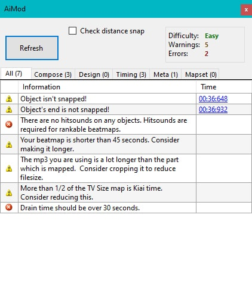

# AiMod

**AiMod** (рус. *аимод*) — инструмент для проверки [карт](/wiki/Beatmap), встроенный в [редактор](/wiki/Client/Beatmap_editor). Его можно запустить из верхнего меню, выбрав `Файл` > `Открыть AiMod`, или нажав сочетание [горячих клавиш](/wiki/Client/Keyboard_shortcuts) `Ctrl` + `Shift` + `A`.

Несмотря на то, что AiMod обнаруживает базовые ошибки в картах, он не может служить заменой [моддинга](/wiki/Modding) со стороны других игроков и мапперов. AiMod не оценивает качество карты и не обнаруживает сложные проблемы вроде посредственных [паттернов](/wiki/Beatmap/Pattern) или [тайминга](/wiki/Guides/How_to_time_songs). В ходе [маппинга](/wiki/Beatmapping) рекомендуется сначала исправить замечания AiMod, а уже потом искать [моддеров](/wiki/Modding/Modder) на свою карту.

Разработка AiMod отстаёт от стандартов, популярных среди мапперов или закреплённых в [критериях ранкинга](/wiki/Ranking_criteria), а потому некоторые его сообщения [содержат ошибки](#недостатки).

## Вкладки

- **All:** объединяет проблемы со всех вкладок.
- **Compose:** проблемы, связанные с растановкой объектов на игровом поле. Чтобы увидеть больше предупреждений, отметьте флажок `Check distance snap` (по умолчанию он снят, чтобы не вызывать лаги на картах с большим числом объектов).
- **Design:** проблемы, связанные с оформлением или интерфейсом игры: фон, сториборд и т.д.
- **Timing:** проблемы, связанные с расположением нот на временной шкале.
- **Meta:** проблемы, связанные с настройками сложности.
- **Mapset:** проблемы, относящиеся ко всей карте в целом.

## Сообщения

*Примечание: вместо фигурных скобок, например, `{0}`, в сообщениях от AiMod будут подставлены нужные слова или числа.*

### Примечания

#### All

| Сообщение | Пояснение | Как исправить | Примечания |
| :-- | :-- | :-- | :-- |
| No problems were found in this map! |  | В карте не найдено серьёзных проблем. Её можно [опубликовать](/wiki/Beatmapping/Beatmap_submission), чтобы другие люди могли её оценить и выявить недочёты. |  |

#### Meta

| Сообщение | Пояснение | Как исправить | Примечания |
| :-- | :-- | :-- | :-- |
| HP rate for Easy/Normal is suggested to be at least 4. |  | Откройте окно [Song Setup](/wiki/Client/Beatmap_editor/Song_setup), перейдите на вкладку `Difficulty` и поменяйте значение `HP Drain Rate` 4 или выше. |  Только для режима osu!mania |
| HP rate for Hard and up is suggested to be at least 7. |  | Откройте окно [Song Setup](/wiki/Client/Beatmap_editor/Song_setup), перейдите на вкладку `Difficulty` и поменяйте значение `HP Drain Rate` 7 или выше. |  Только для режима osu!mania |
| OD rate is suggested to be at least 5. |  | Откройте окно [Song Setup](/wiki/Client/Beatmap_editor/Song_setup), перейдите на вкладку `Difficulty` и поменяйте значение `Overall Difficulty` на 5 или выше. |  Только для режима osu!mania. Если низкое значение OD выбрано намеренно, это сообщение можно проигнорировать. |
| OD rate for maps with very few sliders is suggested to be at least 7. |  | Откройте окно [Song Setup](/wiki/Client/Beatmap_editor/Song_setup), перейдите на вкладку `Difficulty` и поменяйте значение `Overall Difficulty` на 7 или выше. |  Только для режима osu!mania. Если низкое значение OD выбрано намеренно, это сообщение можно проигнорировать. |
| OD rate for maps with very few sliders is suggested to be at least 8. |  | Откройте окно [Song Setup](/wiki/Client/Beatmap_editor/Song_setup), перейдите на вкладку `Difficulty` и поменяйте значение `Overall Difficulty` на 8 или выше. |  Только для режима osu!mania. Если низкое значение OD выбрано намеренно, это сообщение можно проигнорировать. |
| The Slider Velocity should be 1.40 or 1.60. | Базовая скорость слайдеров, используемая в карте, должна быть равна 1.40 или 1.60. Иные значения нарушают рекомендации [osu!taiko ranking criteria](/wiki/Ranking_criteria/osu!taiko) по оптимальному расстоянию между нотами. | Перейдите на вкладку Timing и выставите значение `Slider Velocity:` в 1.40 или 1.60. |  Только для режима osu!taiko |

### Ошибки

#### Compose

| Сообщение | Пояснение | Как исправить | Примечания |
| :-- | :-- | :-- | :-- |
| These two objects are less than 10 ms apart! | Два объекта расположены слишком близко друг к другу на временно́й шкале, из-за чего игроку приходится нажимать по ним почти одновременно. | Найдите эти два объекта и передвиньте или удалите один из них. |  |
| These two objects exist at the same point in time! | Два объекта расположены на временно́й шкале в одной и той же точке, из-за чего игроку приходится нажимать по ним одновременно. | Найдите эти два объекта и передвиньте или удалите один из них. |  |
| There are no hitsounds on any objects. Hitsounds are required for rankable beatmaps. |  | Расставьте на карте хитсаунды, используя свистки, хлопки и финиши. |  |
| This spinner appears onscreen later than objects which follow it. | Объекты, идущие после спиннера, появляются на экране, пока спиннер ещё активен. Причиной может быть низкий AR или слишком близкое расположение объектов к спиннеру на временно́й шкале. | Измените длину спиннера и/или уберите идущие за ним объекты. |  |
| This hold note is less than 10ms long! | Холд-нота слишком короткая, из-за чего карту невозможно пройти на SS. | Удлините холд-ноту или удалите её. |  Только для режима osu!mania |
| This object overlaps with another object. | Два объекта пересекаются в одной колонке в один и тот же момент времени, из-за чего карту невозможно пройти на SS. | Удалите один из пересекающихся объектов. |  Только для режима osu!mania |
| This object is stacked on top of another object. | Два объекта наложены друг на друга в одной колонке в один и тот же момент времени, из-за чего карту невозможно пройти на SS. | Найдите обычные или холд-ноты, которые пересекаются, и подвиньте или удалите одну из них. |  Только для режима osu!mania |
| More than 6 notes simultaneously is not allowed. | Один или несколько паттернов на карте требуют от игрока одновременного нажатия более чем 6 клавиш. В некоторых случаях это не рекомендуется [критериями ранкинга osu!mania](/wiki/Ranking_criteria/osu!mania), поскольку большинство клавиатур способны максимум на 6 одновременных нажатий из-за явления под названием [гостинг](https://nelson-miller.com/what-is-keyboard-ghosting-and-how-do-you-prevent-it/). | Проверьте карту и убедитесь, что в ней нигде не нужно нажимать больше 6 нот одновременно. |  Только для режима osu!mania |

#### Design

| Сообщение | Пояснение | Как исправить | Примечания |
| :-- | :-- | :-- | :-- |
| Your beatmap has no background image. |  | Подберите подходящее изображение и используйте его в качестве фона для сложности. | Видео не считается фоновым изображением, поскольку карту можно скачать и без видео. |
| File missing:{0} | В карте отсутствуют некоторые файлы, на которые она ссылается. | Восстановите недостающие файлы или убедитесь, что карта не пытается использовать несуществующие файлы. |  |

#### Timing

| Сообщение | Пояснение | Как исправить | Примечания |
| :-- | :-- | :-- | :-- |
| All timing sections have a volume below 5%. |  | Установите хотя бы в одной тайминг-секции громкость хитсаундов на уровне 5% или выше. |  |

#### Meta

| Сообщение | Пояснение | Как исправить | Примечания |
| :-- | :-- | :-- | :-- |
| Drain time should be over 30 seconds. | Длина карты от начала до конца без учёта перерывов меньше 30 секунд. | Завершите карту спиннером, если это подходит песне. Если же песня попросту слишком короткая, удлините файл `.mp3`, чтобы дотянуть до отметки в 30 секунд. | AiMod не учитывает спиннеры, которые могут продлевать игровое время за отметку в 30 секунд. |

### Предупреждения

#### Compose

| Сообщение | Пояснение | Как исправить | Примечания |
| :-- | :-- | :-- | :-- |
| This slider moves in an abnormal way. | Слайдер накладывается сам на себя, возвращаясь точно по тому же пути, по которому шёл (такие слайдеры называют [бураи-слайдерами](/wiki/Beatmapping/Mapping_techniques/Unrankable#burai-sliders)). | Проследите, чтобы слайдер не накладывался сам на себя. |  |
| Slider has an absurdly large amount of points! |  | Удалите часть контрольных точек слайдера. | Это предупреждение можно проигнорировать, если большое число контрольных точек добавлено специально — например, в сложных [слайдер-артах](http://osu.ppy.sh/community/forums/topics/689531). |
| This combo is very long. Consider splitting it up. |  | Разбейте длинное комбо на несколько более коротких. Желательно, чтобы в каждом комбо было не больше 15–18 объектов. | Особенно заметно на картах  osu!catch, где фрукты будут скапливаться на тарелке ловца, пока комбо не прервётся, из-за чего может ухудшаться обзор. Это предупреждение можно проигнорировать, если длинное комбо используется намеренно. |
| Object's end is offscreen! | Конец объекта (полностью или частично) не помещается на экране при соотношении сторон 4:3. | Удалите объект или передвиньте его конец. | AiMod не всегда правильно определяет верхнюю границу игрового поля, поэтому рекомендуется проверять, действительно ли конец объекта выходит за пределы экрана. |
| Object is offscreen! | Объект (полностью или частично) не помещается на экране при соотношении сторон 4:3. | Удалите или передвиньте объект. | AiMod не всегда правильно определяет верхнюю границу игрового поля, поэтому рекомендуется проверять, действительно ли объект выходит за пределы экрана. |
| This object is too close to the previous object. |  | Отодвиньте объект дальше от предыдущего. | Появляется только при включённой опции `Check distance snap`. |
| This object is too far from the previous object. |  | Придвиньте объект ближе к предыдущему. | Появляется только при включённой опции `Check distance snap`. |
| This spinner is too short. Auto must achieve at least 1000 bonus points on spinners. | Указанный спиннер слишком короткий и не может нормально играться. | Удлините спиннер. |  |
| Spinners must have a new combo. |  | Вручную добавьте спиннеру новое комбо. |  |
| <!-- Potential removal? Wasn't able to make an actual object (not including slider ends) go offscreen as editor forced it back in again -->Object isn't snapped! | Указанный объект не привязан к временно́й шкале. | Привяжите объект к нужному делению временно́й шкалы. Если перед этим вы меняли тайминг песни, возможно, потребуется заново привязать все объекты через `Timing` > `Resnap all notes`. | Это предупреждение можно проигнорировать, если объект намеренно привязан к [делению доли](/wiki/Client/Beatmap_editor/Beat_snap_divisor), которое не поддерживается редактором (например, 1/10). |
| Object's end is not snapped! | Конец указанного объекта не привязан к временно́й шкале. | Привяжите конец объекта к нужному делению временно́й шкалы. Если перед этим вы меняли тайминг песни, возможно, потребуется заново привязать все объекты через `Timing` > `Resnap all notes`. | Это предупреждение можно проигнорировать, если конец объекта намеренно привязан к [делению доли](/wiki/Client/Beatmap_editor/Beat_snap_divisor), которое не поддерживается редактором (например, 1/10). |

#### Design

| Сообщение | Пояснение | Как исправить | Примечания |
| :-- | :-- | :-- | :-- |
| Background image is larger than 2560x1440. |  | Уменьшите или замените фоновое изображение. |  |
| This map may need an epilepsy warning, as it contains frequently toggled storyboards. | Сториборд содержит быстро мерцающие объекты, которые могут спровоцировать приступ [эпилепсии](https://ru.wikipedia.org/wiki/Эпилепсия) у некоторых игроков. | Откройте окно [Song Setup](/wiki/Client/Beatmap_editor/Song_setup), перейдите на вкладку `Design` и включите опцию `Display epilepsy warning (storyboard has quick strobing)`. |  |
| <!-- Not sure how to test this one -->{0}'s dimensions must be {1}x{1} | Размер указанного элемента не соответствует ожидаемому. | Измените разрешение этого элемента до нужного. |  |
| Your video's dimensions must not exceed 1024x768 for the 4:3 format. |  | Уменьшите или замените фоновое видео. |  |
| Your video's dimensions must not exceed 1280x720 for the 16:9 format. |  | Уменьшите или замените фоновое видео. |  |

#### Timing

| Сообщение | Пояснение | Как исправить | Примечания |
| :-- | :-- | :-- | :-- |
| This beatmap is over 6 minutes long. Consider shortening it if it's not a marathon-style map. |  | Добавьте в карту больше перерывов или обрежьте аудиофайл. | Это предупреждение можно проигнорировать, если карта сделана такой намеренно. |
| Your beatmap is shorter than 45 seconds. Consider making it longer. |  | Замапайте побольше. | Это предупреждение можно проигнорировать, если карта сделана такой намеренно. |
| Audio bitrate is higher than 192 kbps. Consider recompressing to CBR 192 kbps or VBR ~1.0. | `.mp3`-файл карты имеет [битрейт](https://en.wikipedia.org/wiki/Bit_rate) выше 192 кбит/с, что запрещено [критериями ранкинга](/wiki/Ranking_criteria). | Перекодируйте файл так, чтобы его битрейт был между 128 и 192 кбит/с (рекомендуется 192 кбит/с). | Хотя это предупреждение есть в игре, AiMod никогда его не показывает из-за технических ограничений. |
| Audio bitrate is lower than 128 kbps. Consider finding a better quality source. | `.mp3`-файл карты имеет [битрейт](https://en.wikipedia.org/wiki/Bit_rate) ниже 128 кбит/с, что запрещено [критериями ранкинга](/wiki/Ranking_criteria). | Замените файл на другой, с более высоким битрейтом. | Хотя это предупреждение есть в игре, AiMod никогда его не показывает из-за технических ограничений. |
| Kiai time is toggled on for less than 15 seconds. |  | Продлите участок киаи так, чтобы он шёл дольше 15 секунд. | Это предупреждение можно проигнорировать, если киаи расставлен так намеренно. |
| The mp3 you are using is a lot longer than the part which is mapped. Consider cropping it to reduce filesize. |  | Продлите карту или обрежьте аудиофайл. |  |
| Kiai needs an end time point. |  | Добавьте новую зелёную тайминг-секцию, которая будет выключать киаи. |  |
| A preview point for this map is not set. Consider setting one from the Timing menu. |  | Настройте аудиопревью карты через `Timing` > `Set Current Position as Preview Point`. |  |
| Two timing points exist at the same time! |  | Удалите одну из конфликтующих тайминг-секций. |  |
| {0} out of {1} timing sections have a volume below 5%. |  | Установите громкость хитсаундов в тихих тайминг-секциях на уровне 5% или выше. |  |
| More than 1/3 of the map is Kiai time. Consider reducing this. |  | Сократите использование киаи на карте. | Это предупреждение можно проигнорировать, если киаи расставлен так намеренно. |
| More than 1/2 of the TV Size map is Kiai time. Consider reducing this. |  | Сократите использование киаи на карте. | Это предупреждение можно проигнорировать, если киаи расставлен так намеренно. |
| Kiai isn't snapped! | Начало киаи не привязано к временно́й шкале. | Поставьте начало киаи на нужное деление временно́й шкалы. |  |
| Kiai's end isn't snapped! | Конец указанного киаи не привязана к временно́й шкале. | Поставьте конец киаи на нужное деление временно́й шкалы. |  |
| Breaktime is not suggested for mania maps. |  | Замапайте участок, на котором находится перерыв. |  Только для режима osu!mania. Это предупреждение можно проигнорировать, если перерыв добавлен намеренно или если этот участок песни в принципе невозможно замапать. |
| <!-- Can't confirm -->Easy/Normal diff contains too many speed changes. | В сложности Easy/Normal слишком часто меняется скорость слайдеров, что не рекомендуется [критериями ранкинга](/wiki/Ranking_criteria). | Реже меняйте скорость слайдеров на этой сложности. |  |
| <!-- Can't confirm -->Kiai is toggled very frequently! |  | Включайте киаи не так часто. | Это явление также называется фонтанами или вспышками (англ. *kiai flashes*). Это предупреждение можно проигнорировать, если киаи расставлен так намеренно. |

#### Meta

| Сообщение | Пояснение | Как исправить | Примечания |
| :-- | :-- | :-- | :-- |
| [Stack leniency](/wiki/Beatmap/Stack_leniency) is larger than 0.9 or smaller than 0.3. | Значение `Stack Leniency` на вкладке `Advanced` окна [Song Setup](/wiki/Client/Beatmap_editor/Song_setup) меньше 3 или больше 9. | Установите значение `Stack Leniency` от 3 до 9. | Это предупреждение можно проигнорировать, если так сделано намеренно. |
| <!-- editor removes any unicode automatically, but this warning probably still exists -->Romanised artist contains unicode. | Поле `Romanised Artist` на вкладке `General` окна [Song Setup](/wiki/Client/Beatmap_editor/Song_setup) содержит [нестандартные символы Unicode](https://en.wikipedia.org/wiki/List_of_Unicode_characters). | Запишите имя исполнителя латиницей в поле `Romanised Artist`, пользуясь [правилами стандартизации метаданных](/wiki/Ranking_criteria/Metadata) из критериев ранкинга. |  |
| <!-- editor removes any unicode automatically, but this warning probably still exists -->Romanised title contains unicode. | Поле `Romanised Title` на вкладке `General` окна [Song Setup](/wiki/Client/Beatmap_editor/Song_setup) содержит [нестандартные символы Unicode](https://en.wikipedia.org/wiki/List_of_Unicode_characters). | Запишите название песни латиницей в поле `Romanised Title`, пользуясь [правилами стандартизации метаданных](/wiki/Ranking_criteria/Metadata) из критериев ранкинга. |  |
| Countdown is not allowed in mania mode. |  | Откройте окно [Song Setup](/wiki/Client/Beatmap_editor/Song_setup), перейдите на вкладку `Design` и снимите флажок `Enable countdown`. |  Только для режима osu!mania |
| Letterboxing is not allowed in mania mode. |  | Откройте окно [Song Setup](/wiki/Client/Beatmap_editor/Song_setup), перейдите на вкладку `Design` и снимите флажок `Letterbox during breaks`. |  Только для режима osu!mania |
| Countdown is not allowed in taiko mode. |  | Откройте окно [Song Setup](/wiki/Client/Beatmap_editor/Song_setup), перейдите на вкладку `Design` и снимите флажок `Enable countdown`. |  Только для режима osu!taiko. Хотя это предупреждение есть в игре, AiMod никогда его не показывает, поскольку osu!taiko не поддерживает обратный отсчёт. |
| Epilepsy warning is not allowed in taiko mode. |  | Откройте окно [Song Setup](/wiki/Client/Beatmap_editor/Song_setup), перейдите на вкладку `Design` и снимите флажок `Display epilepsy warning (storyboard has quick strobing)`. |  Только для режима osu!taiko. Это предупреждение основано на правиле, которое уже давно устарело. Его можно проигнорировать, поскольку нынешние [критерии ранкинга](/wiki/Ranking_criteria) требуют предупреждать об эпилепсии на картах с мигающим видео или сторибордами. |
| Letterboxing is not allowed in taiko mode. |  | Откройте окно [Song Setup](/wiki/Client/Beatmap_editor/Song_setup), перейдите на вкладку `Design` и снимите флажок `Letterbox during breaks`. |  Только для режима osu!taiko |

#### Mapset

| Сообщение | Пояснение | Как исправить | Примечания |
| :-- | :-- | :-- | :-- |
| Unicode artist conflicts with {0} diff. | Поле `Artist` на вкладке `General` окна [Song Setup](/wiki/Client/Beatmap_editor/Song_setup) различается между сложностями. | Убедитесь, что поле `Artist` одинаково на всех сложностях. |  |
| Artist conflicts with {0} diff. | Поле `Romanised Artist` на вкладке `General` окна [Song Setup](/wiki/Client/Beatmap_editor/Song_setup) различается между сложностями. | Убедитесь, что поле `Romanised Artist` одинаково на всех сложностях. |  |
| Unicode title conflicts with {0} diff. | Поле `Title` на вкладке `General` окна [Song Setup](/wiki/Client/Beatmap_editor/Song_setup) различается между сложностями. | Убедитесь, что поле `Title` одинаково на всех сложностях. |  |
| Title conflicts with {0} diff. | Поле `Romanised Title` на вкладке `General` окна [Song Setup](/wiki/Client/Beatmap_editor/Song_setup) различается между сложностями. | Убедитесь, что поле `Romanised Title` одинаково на всех сложностях. |  |
| Source conflicts with {0} diff. | Поле `Source` на вкладке `General` окна [Song Setup](/wiki/Client/Beatmap_editor/Song_setup) различается между сложностями. | Убедитесь, что поле `Source` одинаково на всех сложностях. |  |
| Tags conflict with {0} diff. | Поле `Tags` на вкладке `General` окна [Song Setup](/wiki/Client/Beatmap_editor/Song_setup) различается между сложностями. | Убедитесь, что поле `Tags` одинаково на всех сложностях. |  |
| Uninherited timing points conflict with {0} diff. | Красные тайминг-секции ([красные линии](/wiki/Client/Beatmap_editor/Timing#красные-тайминг-секции)) по-разному расставлены на разных сложностях. | Убедитесь, что все красные тайминг-секции расположены одинаково на всех сложностях. |  |
| Audio file conflicts with {0} diff. | Разные сложности используют разные файлы `.mp3`. | Убедитесь, что все сложности используют один и тот же файл `.mp3`. |  |
| Audio lead-in conflicts with {0} diff. | Разные сложности используют разное значение задержки перед началом аудио (audio lead-in). | Откройте каждую сложность по отдельности в «Блокноте» (через `File` > `Open .osu in Notepad`) и убедитесь, что значение `AudioLeadIn:` одинаково на всех сложностях. | Сейчас неактуально, поскольку значение audio lead-in больше нельзя задать вручную. |
| Countdown conflicts with {0} diff. | Разные сложности используют разное значение опции `Enable countdown` на вкладке `Design` окна [Song Setup](/wiki/Client/Beatmap_editor/Song_setup). | Убедитесь, что опция `Enable countdown` установлена одинаково на всех сложностях. |  |
| Letterbox in breaks conflicts with {0} diff. | Разные сложности используют разное значение опции `Letterbox during breaks` на вкладке `Design` окна [Song Setup](/wiki/Client/Beatmap_editor/Song_setup). | Убедитесь, что опция `Letterbox during breaks` установлена одинаково на всех сложностях. |  |
| Audio preview time conflicts with {0} diff. | Разные сложности используют разное аудиопревью. | Вручную настройте аудиопревью для каждой сложности через `Timing` > `Set Current Position as Preview Point`, чтобы она была в одном и том же месте. |  |
| Beatmap exceeds allowed upload size ({0}kb allowed) | Файл `.osz`, в который упаковывается карта перед выгрузкой, слишком большой. | Удалите из папки карты все неиспользуемые файлы и сожмите слишком большие ресурсы (изображения, видео, хитсаунды и т.д.). | Подробнее об ограничениях на публикацию карт в osu! см. [эту статью](/wiki/Beatmapping/Beatmap_submission#ограничения). |
| This mapset needs an easier difficulty. |  | Добавьте в карту более лёгкую сложность. | Это предупреждение основано на правиле, которое давно неактуально. Его можно проигнорировать, если карта соответствует [требованиям к подборке сложностей](/wiki/Ranking_criteria#карта) из критериев ранкинга. |
| This mapset needs at least 1 Easy/Normal diff. |  | Добавьте в карту сложность Easy/Normal. | Это предупреждение основано на правиле, которое давно неактуально. Его можно проигнорировать, если карта соответствует [требованиям к подборке сложностей](/wiki/Ranking_criteria#карта) из критериев ранкинга. |
| This mapset cannot have an Insane diff without a Hard diff. |  | Добавьте в карту сложность Hard. | Это предупреждение основано на правиле, которое давно неактуально. Его можно проигнорировать, если карта соответствует [требованиям к подборке сложностей](/wiki/Ranking_criteria#карта) из критериев ранкинга. |
| This mapset is missing diff: {0} |  | Добавьте в карту недостающую сложность. | Это предупреждение основано на правиле, которое давно неактуально. Его можно проигнорировать, если карта соответствует [требованиям к подборке сложностей](/wiki/Ranking_criteria#карта) из критериев ранкинга. |
| This mapset needs at least 2 standard diffs. |  | Добавьте в карту вторую сложность. |  Только для режима osu!. Это предупреждение основано на правиле, которое давно неактуально. Его можно проигнорировать, если карта соответствует [требованиям к подборке сложностей](/wiki/Ranking_criteria/osu!#правила) из критериев ранкинга. |
| This mapset needs at least 2 osu!taiko diffs. |  | Добавьте в карту вторую сложность. |  Только для режима osu!taiko. Это предупреждение основано на правиле, которое давно неактуально. Его можно проигнорировать, если карта соответствует [требованиям к подборке сложностей](/wiki/Ranking_criteria/osu!taiko#правила) из критериев ранкинга. |
| This mapset needs at least 2 osu!catch diffs. |  | Добавьте в карту вторую сложность. |  Только для режима osu!catch. Это предупреждение основано на правиле, которое давно неактуально. Его можно проигнорировать, если карта соответствует [требованиям к подборке сложностей](/wiki/Ranking_criteria/osu!catch#правила) из критериев ранкинга. |
| This mapset needs at least 2 osu!mania diffs. |  | Добавьте в карту вторую сложность. |  Только для режима osu!mania. Это предупреждение основано на правиле, которое давно неактуально. Его можно проигнорировать, если карта соответствует [требованиям к подборке сложностей](/wiki/Ranking_criteria/osu!mania#правила) из критериев ранкинга. |

## Недостатки

- **AiMod не способен обнаружить множество проблем**, которые перечислены в [критериях ранкинга](/wiki/Ranking_criteria), например, объекты с неправильной привязкой к шкале, запаздывающие хитсаунды, фон размером больше 2,5 МБ и так далее.
- **AiMod может предупреждать о том, что проблемой не является** — например, что в карту-[марафон](/wiki/Beatmap/Marathon) надо добавить ещё сложностей, или что [киаи](/wiki/Gameplay/Kiai_time) включён менее чем на 15 секунд.
- **Если включена опция `Check distance snap`, AiMod всё равно не проверяет пропорциональное расстояние между соседними комбо.**
- **Если в папке карты лежат несколько файлов MP3, AiMod будет считать, что они все являются песнями**, хотя MP3 может использоваться и для звуковых эффектов — например, аплодисментов.

Если вы хотите [ранкнуть](/wiki/Beatmap/Category#ranked) свою карты, то, помимо AiMod, рекомендуется пользоваться и другими программами — например, [Mapset Verifier](https://github.com/Naxesss/MapsetVerifier/releases) от ::{ flag=SE }:: [Naxess](https://osu.ppy.sh/users/8129817). Такие инструменты лучше соответствуют текущим критериям ранкинга и находят гораздо больше проблем, чем AiMod. Тем не менее, не игнорируйте AiMod целиком и полностью, поскольку иногда он всё-таки предупреждает о вещах, запрещённых критериями ранкинга.
