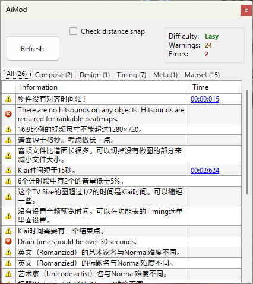

# AiMod

Aimod 是一个内置于[谱面编辑器](/wiki/Client/Beatmap_editor)中的工具，用于检测[谱面](/wiki/Beatmap)中的问题。你可以通过菜单选项 `文件` > `打开 AiMod` 或者按下 `Ctrl` + `Shift` + `A` [快捷键](/wiki/Client/Keyboard_shortcuts)来打开它。

尽管 AiMod 对检测谱面基本问题很有用，也不能代替真人进行的[摸图](/wiki/Modding)过程。AiMod 不能评估谱面质量，也不能指出复杂问题，比如拙劣的[排法](/wiki/Beatmap/Pattern)或[时间轴测定](/wiki/Guides/How_to_time_songs)问题。当[创建谱面](/wiki/Beatmapping)时，建议你先修复 AiMod 中的问题，然后向[摸图者](/wiki/Modding/Modder)求助。

AiMod 的开发进程往往滞后于摸图社区与[谱面上架标准 (RC)](/wiki/Ranking_criteria) 确立的标准，因此[其部分输出被认为是不正确的](#缺陷)。

## 标签页

- **全部 (All)：** 聚合其他标签页的项目。
- **作曲 (Compose)：** 这些一般是物件放置的问题。你可能需要选中“检查间距锁定”(Check distance snap)来显示警告项目（由于取决于谱面大小或长度，这些检查会导致操作卡顿）。
- **设计 (Design)：** 这些一般是界面问题的一部分，比如背景故事板等等。
- **时间轴测定 (Timing)：** 当出现这类问题时，请检查时间轴，因为可能有什么东西放得不对。
- **元数据 (Meta)：** 当出现这类问题时，请检查歌曲设置。
- **图集 (Mapset)：** 这类问题影响谱面整体。

## 消息

*注意：花括号里的数字（比如 `{0}`）是数字或词语的占位符。*

### 信息

#### 全部 (All)

| 消息 | 解释 | 解决方案 | 注意 |
| :-- | :-- | :-- | :-- |
| 恭喜！在这张图里面没有发现问题！ | *不言而喻* | 你的谱面准备好了！你可以[用 BSS 上传谱面](/wiki/Beatmapping/Beatmap_submission)，让摸图者找找其他错误与问题。 |  |

#### 元数据 (Meta)

| 消息 | 解释 | 解决方案 | 注意 |
| :-- | :-- | :-- | :-- |
| 建议 Easy/Normal 难度的 HP 值至少为 4。 | *不言而喻* | 打开[歌曲设置](/wiki/Client/Beatmap_editor/Song_setup)页，将难度 (Difficulty) 标签页下的 `HP Drain Rate` 值设为 4 及以上。 | 仅限  osu!mania 谱面 |
| 建议 Hard 及以上难度的 HP 值至少为 7。 | *不言而喻* | 打开歌曲设置页，将难度 (Difficulty) 标签页下的 `HP Drain Rate` 值设为 7 及以上。 | 仅限  osu!mania 谱面 |
| 建议 OD 值至少为 5。 | *不言而喻* | 打开歌曲设置页，将难度 (Difficulty) 标签页下的 `Overall Difficulty` 值设为 5 及以上。 | 仅限  osu!mania 谱面。如果有意使用较低的 OD 值，则可忽略此警告。 |
| 建议滑条极少的图 OD 值至少为 7。 | *不言而喻* | 打开歌曲设置页，将难度 (Difficulty) 标签页下的 `Overall Difficulty` 值设为 7 及以上。 | 仅限  osu!mania 谱面。如果有意使用较低的 OD 值，则可忽略此警告。 |
| <!-- 二者均会出现，不确定影响因素 -->建议滑条极少的图 OD 值至少为 8。 | *不言而喻* | 打开歌曲设置页，将难度 (Difficulty) 标签页下的 `Overall Difficulty` 值设为 8 及以上。 | 仅限  osu!mania 谱面。如果有意使用较低的 OD 值，则可忽略此警告。 |
| 滑条速度应该是 1.40 或 1.60。 | 此谱面的基本滑条速度值不是 1.40 或 1.60，违反了 [osu!taiko 谱面上架标准](/wiki/Ranking_criteria/osu!taiko)中关于音符间最佳距离的规定。 | 转到 Timing 标签页，将 `Slider Velocity:` 值设置为 1.40 或 1.60。 | 仅限  osu!taiko 谱面 |

### 错误

#### 作曲 (Compose)

| 消息 | 解释 | 解决方案 | 注意 |
| :-- | :-- | :-- | :-- |
| 两个物件时间间距低于 10ms！ | 两个物件间在时间轴上距离很近，需要玩家几乎同时点击这两个物件。 | 找到这两个物件，移动或删除它们。 |  |
| 两个物件出现在同一时间！ | 两个物件在时间轴上互相重叠，需要玩家同时点击这两个物件。 | 找到这两个物件，移动或删除其中一个。 |  |
| 物件没有打击音效。上架谱面需要打击音效。 | *不言而喻* | 使用哨音、击掌声、重音为谱面添加音效。 |  |
| 这个转盘和后面的物件重叠了。 | 转盘活跃时有物件出现。很低的 AR 值和/或将物件与转盘（在时间轴上）放得太近会导致此问题。 | 改变转盘长度，并且/或者删除下面的物件。 |  |
| 长条 (hold note) 按住的时间短于 10ms！ | 长条长度短得不合理。这会导致你的谱面不可能获得 SS。 | 增加长条长度，或者删除它。 | 仅限  osu!mania 谱面 |
| 和另一个物件有重叠。 | 同一列的两个物件在时间上相互重叠。这会导致你的谱面不可能获得 SS。 | 去除任一重叠的物件。 | 仅限  osu!mania 谱面 |
| 这个物件叠在另一个物件上。 | 指定的音符和/或长按音符互相重叠。这会导致你的谱面不可能获得 SS。 | 找到这样的音符或长按音符，修正或者删除它。 | 仅限  osu!mania 谱面 |
| 禁止同时存在超过 6 个物件。 | 谱面中的一种或多种排法需要玩家一次积极按下超过 6 个键。在一定情况下，这种做法被 [osu!mania 谱面上架标准](/wiki/Ranking_criteria/osu!mania)阻止，出于一种被熟知为[键盘冲突](https://nelson-miller.com/what-is-keyboard-ghosting-and-how-do-you-prevent-it/)的现象，大多数键盘允许同时按下最多 6 个键。 | 检查谱面，确保每列音符数都不超过 6 个。 | 仅限  osu!mania 谱面 |

#### 设计 (Design)

| 消息 | 解释 | 解决方案 | 注意 |
| :-- | :-- | :-- | :-- |
| 你的谱面没有背景图片。 | *不言而喻* | 找到恰当的图片用作此难度的背景。 | 由于用户无需下载视频，视频不算作背景图片。 |
| <!-- 未验证 -->找不到文件：{0}。 | 你的谱面缺失文件。 | 恢复缺失的文件，或者确保谱面未尝试使用不存在的文件。 |  |

#### 时间轴测定 (Timing)

| 消息 | 解释 | 解决方案 | 注意 |
| :-- | :-- | :-- | :-- |
| 所有 Timing 区间的音量都低于 5%。 | *不言而喻* | 将至少一个计时区间的打击音效音量设为 5% 及以上。 |  |

#### 元数据 (Meta)

| 消息 | 解释 | 解决方案 | 注意 |
| :-- | :-- | :-- | :-- |
| <!-- 未翻译 -->掉血时间应长于 30 秒。 | 谱面从头到尾（休息时段除外）的长度短于 30 秒。 | 如果歌曲支持，可以试试用转盘结束谱面。如果不能，那么歌曲可能太短了。在这种情况下，试试将歌曲时间延长到 30 秒。 | AiMod 不会检测长度超过 30 秒的转盘。 |

### 警告

#### 作曲 (Compose)

| 消息 | 解释 | 解决方案 | 注意 |
| :-- | :-- | :-- | :-- |
| <!-- 未验证 -->滑条路径不正常。 | 滑条的部分路径与自身重叠，也就是来回路径完全相同（也被称为[无赖滑条](/wiki/Beatmapping/Mapping_techniques/Unrankable#burai-sliders)）。 | 确保滑条的路径没有完全与自身重叠。 |  |
| 滑条点太多了！ | *不言而喻* | 从滑条中删除部分锚点。 | 如果有意使用大量锚点，或是出于滑条需要（比如复杂的[滑条艺术图](http://osu.ppy.sh/community/forums/topics/689531)），则可忽略此警告。 |
| Combo 很长，可以考虑断开。 | *不言而喻* | 找到这样的长串，把它分成多个串。建议串的最大长度在 15-18 个物件间。 | 在  osu!catch 专谱中最明显。只要串还没结束，水果会继续堆在小人的盘子上（因此会潜在影响可见性）。如果有意使用长串，则可忽略此警告。 |
| 物件尾部超出屏幕了！ | 物件末端不在 4:3 比例的屏幕上（不管完全不在，还是只有一部分）。 | 删除物件，或者移动物件尾部。 | AiMod 不总能正确检测游玩区域的上边界，因此一定要时不时确认物件末端是否确实超出屏幕。 |
| 物件超出屏幕了！ | 物件不在 4:3 比例的屏幕上（不管完全不在，还是只有一部分）。 | 删除或移动物件。 | AiMod 不总能正确检测游玩区域的上边界，因此一定要时不时确认物件末端是否确实超出屏幕。 |
| 物件离前一个物件的距离太近。 | *不言而喻* | 将物件移动到距离上个物件更远处。 | 只有启用 `Check distance snap` 时才会出现。 |
| 物件离前一个物件的距离太远。 | *不言而喻* | 将物件移动到距离上个物件更近处。 | 只有启用 `Check distance snap` 时才会出现。 |
| 这个转盘太短了。必须让 auto 君能转出 1000 分以上的加分。 | 指定的转盘太短，无法正常起作用。 | 增加转盘长度。 |  |
| 转盘必须设置新 combo。 | *不言而喻* | 为转盘手动添加新串。 |  |
| 物件没有对齐时间轴！ | 指定的物件没有对齐时间轴。 | 让物件与时间轴上预期位置对齐。如果你改过时间轴测定设置，你可能需要通过点击 `Timing` > `全部重新对齐`让所有物件重新对齐。 | 如果想要让物件与编辑器尚未支持的[时值](/wiki/Client/Beatmap_editor/Beat_snap_divisor)线（比如 1/10）对齐，则可忽略此警告。 |
| 物件结尾没有对齐时间轴！ | 指定物件的结尾没有对齐时间轴。 | 让物件与时间轴上预期位置对齐。如果你改过时间轴测定设置，你可能需要通过点击 `Timing` > `全部重新对齐`让所有物件重新对齐。 | 如果想要让物件与编辑器尚未支持的[时值](/wiki/Client/Beatmap_editor/Beat_snap_divisor)线（比如 1/10）对齐，则可忽略此警告。 |

#### 设计 (Design)

| 消息 | 解释 | 解决方案 | 注意 |
| :-- | :-- | :-- | :-- |
| 背景图片尺寸大于 2560x1440。 | *不言而喻* | 调整背景图片尺寸，或者换一张背景图片。 |  |
| 包含快速闪烁的故事板，可能需要设置闪光警告 (epilepsy warning)。 | 故事板元素变化过快，可能对罹患[光敏癫痫](https://en.wikipedia.org/wiki/Seizure)而不了解此事的玩家有害。 | 启用[歌曲设置 (Song setup) 窗口](/wiki/Client/Beatmap_editor/Song_setup)中设计 (Design) 标签页下的 `Display epilepsy warning (storyboard has quick strobing)` 选项。 |  |
| <!-- Not sure how to test this one -->{0} 的尺寸必须为 {1}x{1} 。 | 指定设计元素的尺寸与要求尺寸不一致。 | 将此元素的尺寸调节正确。 |  |
| 4:3 比例的视频尺寸不能超过 1024x768。 | *不言而喻* | 调整背景视频尺寸或将其替换。 |  |
| 16:9 比例的视频尺寸不能超过 1280x720。 | *不言而喻* | 调整背景视频尺寸或将其替换。 |  |

#### 时间轴测定 (Timing)

| 消息 | 解释 | 解决方案 | 注意 |
| :-- | :-- | :-- | :-- |
| 谱面超过 6 分钟。如果不打算做马拉松 (Marathon) 图，可以缩短一点。 | *不言而喻* | 在谱面中多加点休息时段，或者缩短歌曲。 | 如果有意编这么长，则可忽略此警告。 |
| 谱面短于 45 秒。考虑做长一点。 | *不言而喻* | 给歌曲的更长部分制图。 | 如果有意编这么长，则可忽略此警告。 |
| 音频文件比特率高于 192 kbps。考虑将其重新压缩为 CBR 192 kbps 或 VBR ~1.0 格式。 | 谱面的 `.mp3` 文件的[比特率](https://baike.baidu.com/item/%E6%AF%94%E7%89%B9%E7%8E%87/1022775)高于 192 kbps，超出了[谱面上架标准](/wiki/Ranking_criteria)的允许范围。 | 重新编码 `.mp3` 文件，使其比特率在 128 kbps 至 192 kbps 之间（推荐使用 192 kbps）。 | 尽管游戏中存在此警告，但出于技术限制， AiMod 不会显示此警告。 |
| 音频文件比特率低于 128kbps。考虑找一个质量更高的文件。 | 谱面的 `.mp3` 文件的[比特率](https://baike.baidu.com/item/%E6%AF%94%E7%89%B9%E7%8E%87/1022775)低于 128 kbps，未达到[谱面上架标准](/wiki/Ranking_criteria)的允许范围。 | 重新编码 `.mp3` 文件，使其比特率在 128 kbps 至 192 kbps 之间（推荐使用 192 kbps）。 | 尽管游戏中存在此警告，但出于技术限制， AiMod 不会显示此警告。 |
| Kiai 时间短于 15 秒。 | *不言而喻* | 将 Kiai 时间延长到 15 秒以上。 | 如果有意这样使用 Kiai 时间，则可忽略此警告。 |
| 音频文件比谱面长很多。可以切掉没有做图的部分来减小文件大小。 | *不言而喻* | 延长谱面，或者缩短歌曲。 |  |
| Kiai 时间需要有一个结束点。 | *不言而喻* | 添加新的继承计时点，作为 Kiai 时间的结束点使用。 |  |
| 没有设置音频预览时间。可以在功能表的 Timing 选单里面设置。 | *不言而喻* | 点击 `Timing` > `把当前位置设为预览点`来为谱面设置预览点。 |  |
| 同一时间有两个 Timing 点！ | *不言而喻* | 删除任一冲突的计时区间。 |  |
| {1} 个计时段中有 {0} 个的音量低于 5% 。 | *不言而喻* | 将音量过低计时区间的音效音量设置为 5% 及以上。 |  |
| 这个图超过 1/3 的时间是 Kiai 时间。可以缩短一些。 | *不言而喻* | 减少整张谱面中 Kiai 时间的使用。 | 如果有意这样使用 Kiai 时间，则可忽略此警告。 |
| 这个 TV Size 的图超过 1/2 的时间是 Kiai 时间。可以缩短一些。 | *不言而喻* | 减少整张谱面中 Kiai 时间的使用。 | 如果有意这样使用 Kiai 时间，则可忽略此警告。 |
| Kiai 时间没有对齐时间轴！ | 指定 Kiai 时间区段的起点没有与时间轴对齐。 | 使 Kiai 时间起点与时间轴上的预期位置正确对齐。 |  |
| Kiai 时间结尾没有对齐时间轴！ | 指定 Kiai 时间区段的结束点没有与时间轴对齐。 | 使 Kiai 时间结束点与时间轴上的预期位置正确对齐。 |  |
| osu!mania 图中不建议设置休息时间。 | *不言而喻* | 在休息时间段继续制图。 | 仅限  osu!mania 谱面。如果有意这样使用休息时间，或者歌曲的这部分没法制图，则可忽略此警告。 |
| <!-- 未验证 -->Easy/Normal 难度中的速度变化过多。 | Easy/Normal 难度含有大量的滑条速度变化，被[谱面上架标准](/wiki/Ranking_criteria)所阻止。 | 减少 Easy/Normal 难度中滑条速度改变次数 |  |
| <!-- 未验证 -->Kiai 状态切换过于频繁！ | *不言而喻* | 减少整张谱面中 Kiai 时间的使用次数。 | 这也被熟知为 *Kiai 闪*。如果有意这样使用 Kiai 时间，则可忽略此警告。 |

#### 元数据 (Meta)

| 消息 | 解释 | 解决方案 | 注意 |
| :-- | :-- | :-- | :-- |
| [堆叠判定值 (Stack leniency)](/wiki/Beatmap/Stack_leniency) 高于 0.9 或低于 0.3。 | [歌曲设置](/wiki/Client/Beatmap_editor/Song_setup)页面中高级 (Advanced) 标签页下的 `Stack Leniency` 滑块对应值小于 3 或大于 9。 | 将 `Stack Leniency` 值设定为 3 到 9 之间。 | 如果有意这样使用堆叠判定值，则可忽略此警告。 |
| 艺术家名（罗马拼音）包含非 ASCII 字符。 | 歌曲设置页面中常规 (General) 标签页下的 `Romanised Artist` 字段含有[非标准 Unicode 字符](https://baike.baidu.com/item/%E7%BB%9F%E4%B8%80%E7%A0%81)。 | 参照[谱面上架标准中的元数据标准化规则](/wiki/Ranking_criteria/Metadata)为 `Romanised Artist` 字段填写罗马音艺术家名。 |  |
| 标题名（罗马拼音）包含非 ASCII 字符。 | 歌曲设置页面中常规 (General) 标签页下的 `Romanised Title` 字段含有[非标准 Unicode 字符](https://baike.baidu.com/item/%E7%BB%9F%E4%B8%80%E7%A0%81)。 | 参照[谱面上架标准中的元数据标准化规则](/wiki/Ranking_criteria/Metadata)为 `Romanised Title` 字段填写罗马音标题名。 |  |
| osu!mania 模式不允许使用倒计时 (countdown)。 | *不言而喻* | 取消勾选歌曲设置页中设计 (Design) 标签页下的 `Enable countdown` 选项。 | 仅限  osu!mania 谱面 |
| osu!mania 模式不允许使用黑边 (letterbox)。 | *不言而喻* | 取消勾选歌曲设置页中设计 (Design) 标签页下的 `Letterbox during breaks` 选项。 | 仅限  osu!mania 谱面 |
| 太鼓模式不允许使用倒计时 (countdown)。 | *不言而喻* | 取消勾选歌曲设置页中设计 (Design) 标签页下的 `Enable countdown` 选项。 | 仅限  osu!taiko 谱面。尽管游戏中存在此警告， osu!taiko 也不支持倒计时，但 AiMod 不会显示此警告。 |
| 太鼓模式不允许设置闪光警告 (epilepsy warning)。 | *不言而喻* | 取消勾选歌曲设置页中设计 (Design) 标签页下的 `Display epilepsy warning (storyboard has quick strobing)` 选项。 | 仅限  osu!taiko 谱面。此警告基于一条已过时的谱面上架标准中的规则，现已被弃用。因此，由于当前的[谱面上架标准](/wiki/Ranking_criteria)要求带有快速闪烁视频或故事板的谱面必须带有闪光警告，可以忽略此警告。 |
| 太鼓模式不允许使用黑边 (letterbox)。 | *不言而喻* | 取消勾选歌曲设置页中设计 (Design) 标签页下的 `Letterbox during breaks` 选项。 | 仅限  osu!taiko 谱面 |

#### 图集 (Mapset)

| 消息 | 解释 | 解决方案 | 注意 |
| :-- | :-- | :-- | :-- |
| 艺术家 (Unicode artist) 名与 {0} 难度不同。 | [歌曲设置](/wiki/Client/Beatmap_editor/Song_setup)页面中常规 (General) 标签页下，各难度的 `Artist` 字段内容不一致。 | 确保不同难度的 `Artist` 字段内容一致。 |  |
| 英文 (Romanzied) 的艺术家名与 {0} 难度不同。 | [歌曲设置](/wiki/Client/Beatmap_editor/Song_setup)页面中常规 (General) 标签页下，各难度的 `Romanised Artist` 字段内容不一致。 | 确保不同难度的 `Romanised Artist` 字段内容一致。 |  |
| 标题 (Unicode title) 名与 {0} 难度不同。 | [歌曲设置](/wiki/Client/Beatmap_editor/Song_setup)页面中常规 (General) 标签页下，各难度的 `Title` 字段内容不一致。 | 确保不同难度的 `Title` 字段内容一致。 |  |
| 英文 (Romanized) 的标题名与 {0} 难度不同。 | [歌曲设置](/wiki/Client/Beatmap_editor/Song_setup)页面中常规 (General) 标签页下，各难度的 `Romanised Title` 字段内容不一致。 | 确保不同难度的 `Romanised Title` 字段内容一致。 |  |
| 来源 (Source) 名与 {0} 难度不同。 | [歌曲设置](/wiki/Client/Beatmap_editor/Song_setup)页面中常规 (General) 标签页下，各难度的 `Source` 字段内容不一致。 | 确保不同难度的 `Source` 字段内容一致。 |  |
| Tags 与 {0} 难度不同。 | [歌曲设置](/wiki/Client/Beatmap_editor/Song_setup)页面中常规 (General) 标签页下，各难度的 `Tags` 字段内容不一致。 | 确保不同难度的 `Tags` 字段内容一致。 |  |
| <!-- 未翻译 -->非继承计时点与 {0} 难度不同。 | 不同难度的非继承计时点（[红线](/wiki/Client/Beatmap_editor/Timing#非继承时间点（红线）)）不一致。 | 确保不同难度的所有非继承时间点位置一致。 |  |
| 音频文件与 {0} 难度不同。 | 谱面中不同难度使用的 .mp3 文件不一致。 | 确保所有难度使用相同的 .mp3 文件作为基础。 |  |
| 前奏长度与 {0} 难度不同。 | 不同难度的音频前奏长度不一致。 | 在记事本中分开打开所有难度文件（通过点击 `文件` > `在记事本中打开 .osu 文件`），然后确保所有难度的 `AudioLeadIn:` 值都一致。 | 由于音频前奏长度不再允许手动设置，此警告已被弃用。 |
| 倒计时设置与 {0} 难度不同。 | [歌曲设置](/wiki/Client/Beatmap_editor/Song_setup)页面中设计 (Design) 标签页下，各难度的 `Enable countdown` 设置不一致。 | 确保所有难度的 `Enable countdown` 设置一致。 |  |
| 暂停时间的黑边 (letterbox) 设置与 {0} 难度不同。 | [歌曲设置](/wiki/Client/Beatmap_editor/Song_setup)页面中设计 (Design) 标签页下，各难度的 `Letterbox during breaks` 设置不一致。 | 确保所有难度的 `Letterbox during breaks` 设置一致。 |  |
| 音频预览时间与 {0} 难度不同。 | 不同难度的音频预览时间不一致。 | 点击 `Timing` > `把当前位置设为预览点` 来手动设置各个难度的预览点，这样所有难度的预览点都在同一点。 |  |
| 谱面超出了上传大小限制（最多允许 {0}kb）。 | 压缩的 `.osz` 文件太大了。 | 从谱面文件夹中删除所有未使用的文件，压缩大小臃肿的资源文件（图片、视频、音效等等）。 | 若要了解更多关于 osu! 的上传限制的事情，参见[此文章](/wiki/Beatmapping/Beatmap_submission#限制)。 |
| <!-- 未翻译 -->此图集需要更低难度。 | *不言而喻* | 为此图集创建更简单的难度。 | 此警告基于一条已过时的谱面上架标准中的规则，现已被弃用。因此，只要谱面遵循当前的[谱面上架标准](/wiki/Ranking_criteria#谱面)，就可以忽略此警告。 |
| 图集中至少需要一个 Easy/Normal 难度。 | *不言而喻* | 为此图集创建 Easy/Normal 难度。 | 此警告基于一条已过时的谱面上架标准中的规则，现已被弃用。因此，只要谱面遵循当前的[谱面上架标准](/wiki/Ranking_criteria#谱面)，就可以忽略此警告。 |
| <!-- 未验证 -->此图集在没有 Hard 难度的情况下不可有 Insane 难度。 | *不言而喻* | 为此图集创建 Hard 难度。 | 此警告基于一条已过时的谱面上架标准中的规则，现已被弃用。因此，只要谱面遵循当前的[谱面上架标准](/wiki/Ranking_criteria#谱面)，就可以忽略此警告。 |
| <!-- 未验证 -->缺失图集难度：{0}。 | *不言而喻* | 创建缺失的难度来填补难度空缺。 | 此警告基于一条已过时的谱面上架标准中的规则，现已被弃用。因此，只要谱面遵循当前的[谱面上架标准](/wiki/Ranking_criteria#谱面)，就可以忽略此警告。 |
| 图集中至少需要两个 osu! 标准模式的难度。 | *不言而喻* | 为此图集再创建一个难度。 | 仅限 osu! 谱面。此警告基于一条已过时的谱面上架标准中的规则，现已被弃用。因此，只要谱面遵循当前的[谱面上架标准](/wiki/Ranking_criteria#谱面)，就可以忽略此警告。 |
| 图集中至少需要两个太鼓模式的难度。 | *不言而喻* | 为此图集再创建一个难度。 | 仅限  osu!taiko 谱面。此警告基于一条已过时的谱面上架标准中的规则，现已被弃用。因此，只要谱面遵循当前的[谱面上架标准](/wiki/Ranking_criteria#谱面)，就可以忽略此警告。 |
| 图集中至少需要两个 osu!catch 模式的难度。 | *不言而喻* | 为此图集再创建一个难度。 | 仅限 osu!catch 谱面。此警告基于一条已过时的谱面上架标准中的规则，现已被弃用。因此，只要谱面遵循当前的[谱面上架标准](/wiki/Ranking_criteria#谱面)，就可以忽略此警告。 |
| 图集中至少需要两个 osu!mania 模式的难度。 | *不言而喻* | 为此图集再创建一个难度。 | 仅限  osu!mania 谱面。此警告基于一条已过时的谱面上架标准中的规则，现已被弃用。因此，只要谱面遵循当前的[谱面上架标准](/wiki/Ranking_criteria#谱面)，就可以忽略此警告。 |

## 缺陷

- **AiMod 检测不出大量**[谱面上架标准 (RC)](/wiki/Ranking_criteria) 认为不可上架的问题，比如可能锁定不当的物件、有延迟的打击音效、文件大小大于 2.5MB 的背景等等。
- **AiMod 可能会警告你本不是问题的东西**，比如[马拉松](/wiki/Beatmap/Marathon)谱面需要两个标准难度， [kiai 时间](/wiki/Gameplay/Kiai_time)持续短于 15 秒。
- **启用 `Check distance snap` 选项的情况下，AiMod 并不会检查串与串之间的间距锁定情况。**
- **如果谱面文件夹中有多个 MP3 文件，AiMod 会警告你有多个歌曲文件**。然而，MP3 文件也可用于鼓掌之类的音效。

如果你想要让谱面[上架](/wiki/Beatmap/Category#ranked)，除 AiMod 以外，推荐你再使用其他程序，比如 ::{ flag=SE }:: [Naxess](https://osu.ppy.sh/users/8129817) 的 [Mapset Verifier](https://github.com/Naxesss/MapsetVerifier/releases)。这些程序能更加紧跟目前的谱面上架准则，能检测出的问题远多于 AiMod。但由于上架准则中的一些规则依赖 AiMod，也不要完全忽略它。
