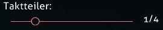
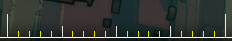
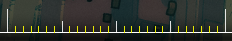
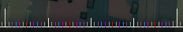
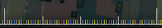

---
tags:
  - bsd
---

# Taktteiler

Der **Taktteiler** (auch *Beat Snap Divisor* genannt) ist eine Einstellung, die bestimmt, wie der Editor [Beats](/wiki/Music_theory/Beat) darstellt. Dieser Prozess nennt sich [Beat-Positionierung](/wiki/Beatmapping/Beat_snapping) (engl. **beat snapping**). Der Taktteiler befindet sich in der rechten oberen Ecke des Editors.

Durch den Taktteiler wird die Feinheit der [Hit-Objekte](/wiki/Gameplay/Hit_object) auf der [Zeitleiste](/wiki/Client/Beatmap_editor/Timelines) bestimmt. Der Teiler drückt in Form eines Bruchs aus, in wie viele Teile ein Beat aufgeteilt werden soll. Ein höherer Notenwert bedeutet, dass mehr Noten im selben Takt platziert werden können, und umgekehrt.

## Unterstützte Notenwerte

Der Beatmap-Editor unterstützt für den Taktteiler elf verschiedene Einstellungen im Bereich von 1/1 bis 1/16.

| Teiler | Farbe der Striche | Visualisierung |
| :-- | :-- | :-- |
| 1/1 | Weiß |  |
| 1/2 | Rot |  |
| 1/3 | Violett |  |
| 1/4 | Blau |  |
| 1/5 | Gelb |  |
| 1/6 | Violett |  |
| 1/7 | Gelb |  |
| 1/8 | Gelb |  |
| 1/9 | Gelb |  |
| 1/12 | Grau |  |
| 1/16 | Grau |  |

1/1 (ein ganzer Takt), 1/2 (ein halber Takt) und 1/4 (ein Vierteltakt) sind die am häufigsten verwendeten Notenwerte, da viele Songs mit Rhythmen höherer Intensität komponiert werden. Taktarten wie 1/3 (ein Tripeltakt) und 1/6 werden oft im Walzer verwendet, wobei ein Takt in 3 oder 6 gleiche Teile aufgeteilt wird.

Die anderen Einstellungen des Taktteilers sind ungewöhnlich und sollten mit Bedacht eingesetzt werden: Solange ein Song oder ein Abschnitt darin nicht speziell mit ungewöhnlichen Notenlängen komponiert wurde, sind seltene Taktarten wie 1/5 or 1/16 normalerweise ein Hinweis darauf, dass die Beatmap falsch [getimt](/wiki/Beatmapping/Timing) wurde. 1/16 wird jedoch üblicherweise für Buzz-Slider (kurze, sich viele Male wiederholende Slider) verwendet.
