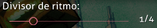

---
tags:
  - bsd
  - divisor de ritmo
---

# Divisor de ritmo

El **divisor de ritmo** es un ajuste que determina el comportamiento del editor al cuantificar los [pulsos](/wiki/Music_theory/Beat), en un proceso conocido como [ajuste de ritmo](/wiki/Beatmapping/Beat_snapping). Se puede encontrar en la parte superior derecha de la pantalla del editor.

El divisor de ritmo corresponde a la granularidad de los [objetos](/wiki/Gameplay/Hit_object) en la [línea de tiempo](/wiki/Client/Beatmap_editor/Timelines). El divisor se expresa como una fracción de en cuántas partes se debe dividir un pulso; un ajuste más denso para el divisor de ritmo permite colocar más notas en el mismo compás, y viceversa.

## Divisores soportados

El editor de beatmaps soporta once configuraciones diferentes del divisor de ritmo, que van desde 1/1 a 1/16.

| Divisor | Color de la marca | Visual |
| :-- | :-- | :-- |
| 1/1 | Blanco |  |
| 1/2 | Rojo |  |
| 1/3 | Púrpura |  |
| 1/4 | Azul |  |
| 1/5 | Amarillo |  |
| 1/6 | Púrpura |  |
| 1/7 | Amarillo |  |
| 1/8 | Amarillo |  |
| 1/9 | Amarillo |  |
| 1/12 | Gris |  |
| 1/16 | Gris |  |

1/1 (pulso completo), 1/2 (medio pulso) y 1/4 (un cuarto de un pulso) son los divisores más comunes debido a que la mayoría de las canciones se componen con ritmos más densos. Los divisores como 1/3 (tresillos) y 1/6 (tresillos dobles) se usan a menudo al mapear canciones de vals, donde un solo pulso se divide en tres o seis partes iguales.

El resto de los ajustes del divisor de ritmo son poco comunes y deben usarse con precaución: a menos que una canción o una sección de la misma esté compuesta específicamente usando longitudes de un pulso no estándar, un divisor poco común como 1/5 o 1/16 es típicamente un signo de un beatmap con una [temporización](/wiki/Beatmapping/Timing) incorrecta. Sin embargo, 1/16 en particular se usa normalmente para los buzz sliders.
