---
tags:
  - bsd
  - beat snap divisor
  - бсд
  - делитель временной шкалы
  - шаг временной шкалы
  - делитель
  - время
---

# Делитель доли

**Делитель доли** (англ. *beat snap divisor*, в русском интерфейсе редактора — *шаг временной шкалы*) — настройка, которая делит [музыкальные доли](/wiki/Music_theory/Beat) песни на равные части, чтобы к ним можно было [привязывать](/wiki/Beatmapping/Beat_snapping) игровые объекты. Найти её можно в правой верхней части экрана редактора.

От делителя зависит, насколько плотно [игровые объекты](/wiki/Gameplay/Hit_object) могут стоять на [временно́й шкале](/wiki/Client/Beatmap_editor/Timelines). Он записывается в виде дроби, знаменатель которой показывает, на сколько частей делится одна доля: чем больше это число, тем больше нот помещается в один и тот же промежуток времени, и наоборот.

## Доступные значения

Редактор карт поддерживает одиннадцать значений делителя доли — от 1/1 до 1/16.

| Делитель | Цвет тиков | Внешний вид |
| :-- | :-- | :-- |
| 1/1 | Белый | 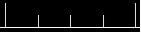 |
| 1/2 | Красный | 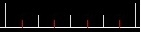 |
| 1/3 | Фиолетовый | 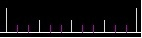 |
| 1/4 | Синий | 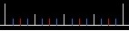 |
| 1/5 | Жёлтый | 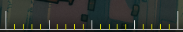 |
| 1/6 | Фиолетовый | 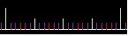 |
| 1/7 | Жёлтый | 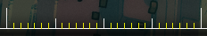 |
| 1/8 | Жёлтый | 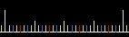 |
| 1/9 | Жёлтый | 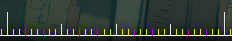 |
| 1/12 | Серый | 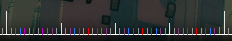 |
| 1/16 | Серый | 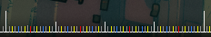 |

Чаще всего используются 1/1 (целая доля), 1/2 (половина доли) и 1/4 (четверть доли): ритм большинства песен строится именно на таких длительностях. Делители 1/3 (триплеты) и 1/6 (двойные триплеты) обычно нужны при маппинге песен в ритме вальса, где доля делится на три или шесть равных частей.

Остальные значения встречаются редко, и пользоваться ими нужно осторожно: если песня или её отдельный фрагмент не построены специально на нестандартных длительностях музыкальных нот, то редкий делитель вроде 1/5 или 1/16 обычно говорит о неправильном [тайминге](/wiki/Beatmapping/Timing) карты. Впрочем, у 1/16 есть и распространённое применение — базз-слайдеры (англ. *buzz sliders*).
