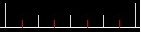
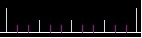
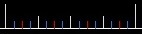
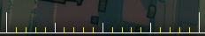
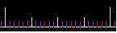
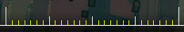
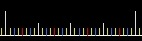
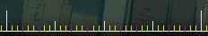
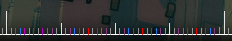
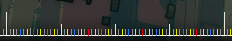

---
tags:
  - bsd
---

# ตัวแบ่งจังหวะ (Beat snap divisor)

**ตัวแบ่งจังหวะ (Beat snap divisor)** คือการตั้งค่าที่กำหนดพฤติกรรมของตัวแก้ไขในการจัดระเบียบ [จังหวะ (Beats)](/wiki/Music_theory/Beat) ในกระบวนการที่เรียกว่า [การวางโน้ตตามจังหวะ (Beat snapping)](/wiki/Beatmapping/Beat_snapping) คุณสามารถหาการตั้งค่านี้ได้ที่ส่วนขวาบนของหน้าจอตัวแก้ไข

ตัวแบ่งจังหวะจะสัมพันธ์กับความละเอียดของการวาง [Hit objects](/wiki/Gameplay/Hit_object) บน [ไทม์ไลน์ (Timeline)](/wiki/Client/Beatmap_editor/Timelines) ตัวแบ่งจะแสดงผลเป็นเศษส่วนซึ่งบอกว่าหนึ่งจังหวะจะถูกแบ่งออกเป็นกี่ส่วน การตั้งค่าตัวแบ่งจังหวะที่หนาแน่นขึ้นจะช่วยให้สามารถวางโน้ตได้มากขึ้นในช่วงเวลาเดียวกัน และในทางกลับกัน

## ตัวแบ่งที่รองรับ

ตัวแก้ไข Beatmap รองรับการตั้งค่าตัวแบ่งจังหวะ 11 รูปแบบ ตั้งแต่ 1/1 ไปจนถึง 1/16

| ตัวแบ่ง | สีของขีด | ภาพประกอบ |
| :-- | :-- | :-- |
| 1/1 | ขาว |  |
| 1/2 | แดง |  |
| 1/3 | ม่วง |  |
| 1/4 | ฟ้า |  |
| 1/5 | เหลือง |  |
| 1/6 | ม่วง |  |
| 1/7 | เหลือง |  |
| 1/8 | เหลือง |  |
| 1/9 | เหลือง |  |
| 1/12 | เทา |  |
| 1/16 | เทา |  |

1/1 (เต็มจังหวะ), 1/2 (ครึ่งจังหวะ) และ 1/4 (เสี้ยวจังหวะ) เป็นตัวแบ่งที่ถูกใช้งานมากที่สุด เนื่องจากเพลงส่วนใหญ่มักจะแต่งขึ้นด้วยจังหวะที่หนาแน่นในระดับนี้ ตัวแบ่งอย่าง 1/3 (Triplet) และ 1/6 (Double triplet) มักถูกใช้เมื่อทำแมพเพลงแนววอลซ์ (Waltz) ซึ่งหนึ่งจังหวะจะถูกแบ่งออกเป็น 3 หรือ 6 ส่วนเท่าๆ กัน

การตั้งค่าตัวแบ่งจังหวะที่เหลือนั้นพบได้ไม่บ่อยนักและควรใช้ด้วยความระมัดระวัง: นอกจากว่าเพลงหรือส่วนนั้นของเพลงจะถูกแต่งขึ้นด้วยความยาวจังหวะที่ไม่เป็นมาตรฐานจริงๆ การใช้ตัวแบ่งที่หายากอย่าง 1/5 หรือ 1/16 มักจะเป็นสัญญาณของการตั้ง [จังหวะ (Timing)](/wiki/Beatmapping/Timing) ที่ผิดพลาด อย่างไรก็ตาม ตัวแบ่ง 1/16 มักจะถูกนำมาใช้สำหรับการทำ Buzz sliders เป็นพิเศษ
