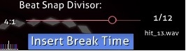

# Compose tab

**Compose** is the place where a [mapper](/wiki/Beatmapping) spent most of the time mapping out his/her design with respect to timeline after setting the BPM and timing sections. This is also the place where players can practice a ranked difficulty and inspect its design skin.

Due to different needs in mapping style (osu! is very flexible, allowing much room for creativity while osu!mania is restrained to selected key, demanding extreme precision to evoke the keysounds harmonically), osu!'s editor and osu!mania's editor are given their own features section. You can easily access osu!mania editor by setting your difficulty to osu!mania.

## Features (osu!)

*For a newbie guide, see: [Beatmapping](/wiki/Beatmapping)*

### Top-left (Hit objects timeline)

<!-- TODO find the article that links to this and possibly redirect to here instead (why is this shared?) -->

#### Hit object timeline

| Name | Description |
| :-- | :-- |
| `+`/`-` buttons | Increases/Decreases timeline zoom. |
| Double white vertical lines | Current timestamp with respect to the hit objects timeline. |
| Click on hit object | `Left click`: Select/Move hit object against timeline. `Right click`: Remove hit object. |

### Top-right (Beat Snap Divisor)

| Name | Description |
| :-- | :-- |
| [Beat Snap Divisor](/wiki/Client/Beatmap_editor/Beat_snap_divisor) | Limits where hit objects can be placed so that they always fall on the beat. Moving the slider to the right increases the granularity of the hit objects. |
| `Insert Break Time` | This button will start/stop [break](/wiki/Beatmap/Break) time in current timestamp. |
| x/y | The current mouse coordinate. |

Hold `Alt` to trigger **Distance Spacing**. The value can range from 0.1x to 6.0x.

### Centre-left (Selector)

#### Selector

| Buttons/Header (Keyboard shortcut) | Usage | Description |
| :-- | :-- | :-- |
| `Sampleset` | Auto, Normal, Soft, Drum | This ignores the timing section's sampleset setting, and add the selected one. |
| `Additions` | Auto, Normal, Soft, Drum | Additions hitsound means add Clap, Finish, and Whistle with the selected set. |
| `Select` (`1`) | `Left click`**/drag**: Select/Adjust the objects/sliderpoints location. `Right click`: Remove objects/sliderpoints. `Ctrl` + `Click`: Multiple selection. | Select and modify existing hit objects. |
| `Circle` (`2`) | `Left click`: Add object. | |
| `Slider` (`3`) | `Left/Right click`: Start/End slider. Add/Remove sliderpoints. **Double** `Left click`: New curve section. | |
| `Spinner` (`4`) | `Left/Right click`: Start/End spinner at current timestamp. | |

### Centre (Playfield)

**Visual representation of mapping based on current timestamp**. Map your design here and your design will appear exactly like you mapped during play.

### Centre-right (Hitsounds & Assist tools)

| Button (Keyboard shortcut) | Usage | Description |
| :-- | :-- | :-- |
| New Combo (`Q`) | `Right click`: Change current object to next combo colour. | Hit object combo. This is equivalent to a verse in song script. An acceptable range is about 5-20. |

#### Hitsounds

| Button (Keyboard shortcut) | Usage | Description |
| :-- | :-- | :-- |
| Whistle (`W`) | **(Select a hit object)** `Left click`: Use whistle sound on this object | Add a whistle sound addition to the selection. |
| Finish (`E`) | **(Select a hit object)** `Left click`: Use finish sound on this object | Add a finish (cymbal) sound addition to the selection. |
| Clap (`R`) | **(Select a hit object)** `Left click`: Use clap sound on this object | Add a clap sound addition to the selection. |

#### Assist tools

| Button (Keyboard shortcut) | Usage | Description |
| :-- | :-- | :-- |
| `Grid Snap` (`T`) | **Hold** `Shift`: Temporary toggle. **Hold** `Ctrl`: Temporary disable angle snapping. | Notes will be snapped to the grid by default. |
| `Distance Snap` (`Y`) | **Hold** `Alt`: Temporary toggle. Switch Beat Snap Divisor to Distance Snap. `Alt` **+** `Mousewheel`: Adjust Distance Snap multiplier. | Distance between consecutive objects will be snapped based on their rhythmical difference. Best use while the timeline is paused. |
| `Lock Notes` (`L`) | **(Select a hit object)** `Left click`: Lock this object. | Lock selected object to current position and timestamp. |

### Bottom (Song's timeline)

At **bottom-left**, it shows the **timestamp** in milliseconds (ms) and the **song duration** in percent. The percentage may be switched to "intro" or "outro" if there is storyboarding before or after the music.

At **bottom-centre**, it shows the **timeline with markings** and the **compulsory music player buttons**. The `Test` button to the right of the timeline will save your beatmap then allows you to play test it, starting at the current timestamp.

At **bottom-right**, you can adjust the **playback rate** by per quarter value.

#### Colour markers

| Colour | Description |
| :-- | :-- |
| Bright white long | Current test section. |
| Yellow long | Preview point. |
| Yellow up | Start of the [drain time](/wiki/Beatmap/Drain_time). |
| Green up | Inherited points. *See: [Timing tab](/wiki/Client/Beatmap_editor/Timing)* |
| Red up | Timing points. *See: [Timing tab](/wiki/Client/Beatmap_editor/Timing)* |
| Blue down | Bookmark. |

#### Colour Highlights

| Colour | Description |
| :-- | :-- |
| Grey | [Break](/wiki/Beatmap/Break) time |
| Orange | [Kiai time](/wiki/Gameplay/Kiai_time) |

#### Bookmarking command

| Shortcut | Description |
| :-- | :-- |
| `Ctrl` + `B` | Add bookmark at current location. |
| `Ctrl` + `Shift` + `B` | Remove bookmark at current location. |
| `Ctrl` + `Right arrow` | Next bookmark. |
| `Ctrl` + `Left arrow` | Previous bookmark. |

## Features (osu!mania)

For a simple guide, see: [Basics](https://osu.ppy.sh/community/forums/topics/118868) and [Mapping & Keysound](https://osu.ppy.sh/community/forums/topics/139139)

### Top-right (Beat Snap Divisor)

*Main article: [Beat Snap Divisor](/wiki/Client/Beatmap_editor/Beat_snap_divisor)*

**Time signature** (MM:B) from the timing section is added (15:3 = 15th measure 3rd beat) beside the adjustment bar for easier mapper's reference. It can go to negative value (e.g. -8:-3) if the first timing section is a *few seconds away* from the start of the beatmap's song file.

`Insert Break Time` button will start/stop [break](/wiki/Beatmap/Break) time in current timestamp. Beside the button is the **sound file name storyboarded to the selected note**, known as **keysound**. *Refer to the [Sampling](#sampling) section*.

### Centre-left (Selector)

#### Selector

| Buttons/Header (Keyboard shortcut) | Usage | Description |
| :-- | :-- | :-- |
| `Sampleset` | Auto, Normal, Soft, Drum | Change the sampleset ignoring the current one on timing section. |
| `Additions` | Auto, Normal, Soft, Drum | Same as above, but overrides the `Sampleset` setting. |
| `Select` (`1`) | `Left click`**/drag**: Move timestamp and location of a note. `Right click`: Remove note. `Ctrl` **+** `Left click`: Multiple selection. | Select and modify existing notes. |
| `Circle` (`2`) | `Left click`: Place note. `Right click`: Remove note. | Add note to current column based on mouse position. |
| `Hold` (`3`) | **Hold** `Left click`: Place hold note and adjust length. **Release on end**: Set hold end | Add hold note to current column based on mouse position. |

### Centre (Playfield)

#### Playfield boxes

| Name | Description |
| :-- | :-- |
| Left Box | Notes intensity (Timeline). |
| Centre | Actual playfield ([Beat Snap Divisor](/wiki/Client/Beatmap_editor/Beat_snap_divisor)). |

#### Colour notes

| Name | Description |
| :-- | :-- |
| Double white line | Measure |
| White line | Common time |
| Green line | You/[Judgement](/wiki/Gameplay/Judgement) line |
| Blue colour | Currently selected note |
| White/Pink/Yellow colour | Normal notes colour |

### Centre-right (Hitsounds & Assist tools)

| Button (Keyboard shortcut) | Usage | Description |
| :-- | :-- | :-- |
| New Combo (`Q`) | `Right click`: Change current note to next combo colour. | Note combo. This is equivalent to a verse in song script. An acceptable range is about 5-20. |

#### Hitsounds

| Button (Keyboard shortcut) | Usage | Description |
| :-- | :-- | :-- |
| Whistle (`W`) | **(Select a note)** `Left click`: Use whistle sound on this note | Add a whistle sound addition to the selection. |
| Finish (`E`) | **(Select a note)** `Left click`: Use finish sound on this note | Add a finish (cymbal) sound addition to the selection. |
| Clap (`R`) | **(Select a note)** `Left click`: Use clap sound on this note | Add a clap sound addition to the selection. |

#### Assist tools

| Button (Keyboard shortcut) | Usage | Description |
| :-- | :-- | :-- |
| `Grid Snap` (`T`) | **Hold** `Shift`: Temporary toggle. **Hold** `Ctrl`: Temporary disable angle snapping. | Notes will be snapped to the grid by default. |
| `Distance Snap` (`Y`) | **Hold** `Alt`: Temporary toggle. Switch Beat Snap Divisor to Distance Snap. `Alt` **+** `Mousewheel`: Adjust Distance Snap multiplier. | Distance between consecutive notes will be snapped based on their rhythmical difference. Best use while the timeline is paused. |
| `Lock Notes` (`L`) | **(Select a note)** `Left click`: Lock this note | Lock selected note to current position and timestamp. |

### Bottom (Song's timeline)

At **bottom-left**, it shows the **timestamp** in milliseconds (ms) and the **song duration** in percent. The percentage may be switched to "intro" or "outro" if there is storyboarding before or after the music.

At **bottom-centre**, it shows the **timeline with markings** and the **compulsory music player buttons**. The `Test` button to the right of the timeline will save your beatmap then allows you to play test it, starting at the current timestamp.

At **bottom-right**, you can adjust the **playback rate** by per quarter value.

#### Bookmarking command

| Shortcut | Description |
| :-- | :-- |
| `Ctrl` + `B` | Add bookmark at current location. |
| `Ctrl` + `Shift` + `B` | Remove bookmark at current location. |
| `Ctrl` + `Right arrow` | Next bookmark. |
| `Ctrl` + `Left arrow` | Previous bookmark. |

### Sampling

**Sampling** is the process of adding sound to the note. To begin, select the note and `Alt` **+** `Left click` on the selected note and a pop-up window will be shown with sound samples inside your beatmap folder.

#### Sample import

**Left-section** is the list of sound files you have in the beatmap's folder.

**Right-section** are settings for the selected sound file.

##### Basic

| Name | Description |
| :-- | :-- |
| `CustomSet` | **Ignores** selected custom hitsound in this editor, and applies the **default** hitsound set and volume without using timing point. *Notice: `Use basic sample` must be enabled in order to use this to be able to work as it's intended.* |
| `Volume` | How loud you want this sound file be. Use only integer values from 8 to 100. |
| `Use basic sample` | **Ignores** selected custom hitsound in this editor, and applies only the volume on selected notes. This means, no matter what the notes are about, this feature only changes the selected notes volume. |

##### Buttons

| Name | Description |
| :-- | :-- |
| `Play` | Play the selected sound file. |
| `Import` | Import the custom sound file from a subfolder inside the beatmap's folder. |
| `Delete` | Delete the custom sound file. |
| `Apply` | Apply this selected custom sound file to this note. |
| `Sample` | Put this selected custom sound file to the storyboard with respect to current timestamp. |
| `Sample list` | Storyboarded sound files. *Refer to [Sample event list](#sample-event-list) below* |
| `Reset` | Remove the sound file associated with the note. |
| `Cancel` | Closes the window. |

#### Sample event list

Click on `Sample list` will summon another window named `Sample event list`, which would be this. These storyboarded elements will go to the `.osu` file of the selected difficulty.

The coding is `MM:SS:XXX {Sound_file}@{Volume}`, where `MM:SS:XXX` is `Minutes:Seconds:Milliseconds` respectively. **Example**: `1:57:745 kick.wav@100%` means at 1min 57s 745ms, trigger the `kick.wav` file at 100% volume regardless of condition.
