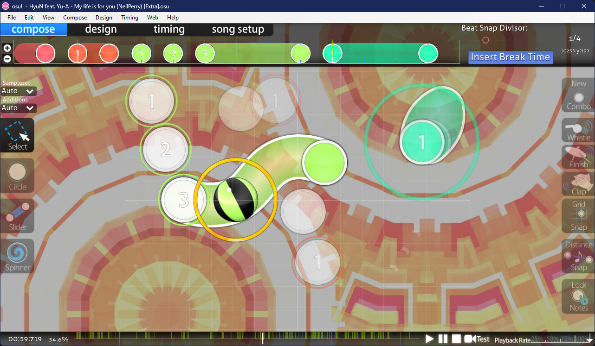
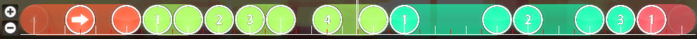
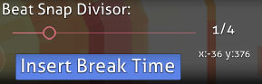
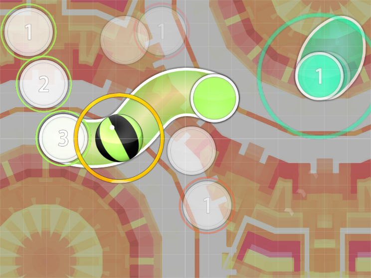
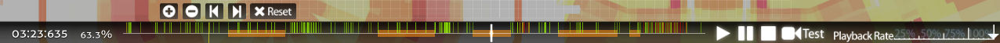
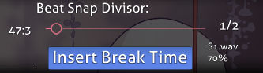
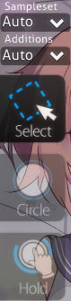
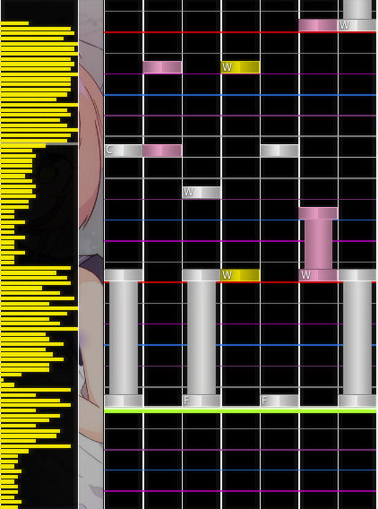
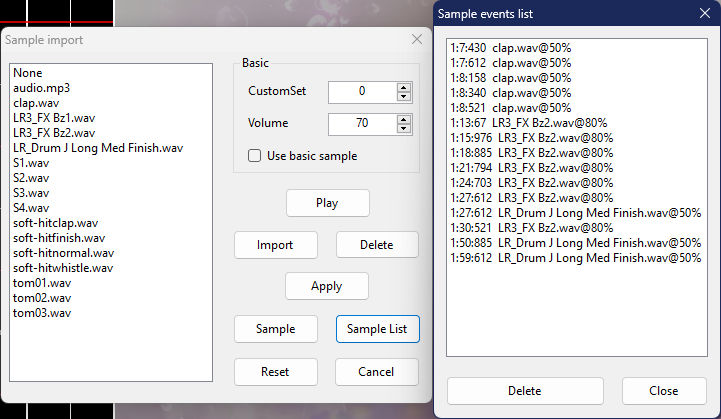
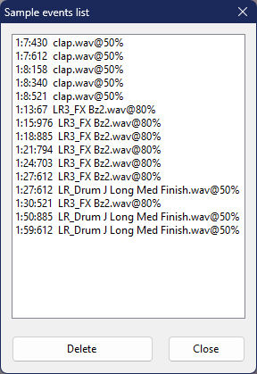

# Compose tab

::: Infobox

:::

::: Infobox

:::

The [beatmap editor](/wiki/Client/Beatmap_editor)'s **compose tab** is the place where [mappers](/wiki/Beatmapping) spend most of their time working on beatmaps after adjusting [timing](/wiki/Beatmapping/Timing) settings. [Hit object patterns](/wiki/Beatmap/Pattern), [hitsounds](/wiki/Beatmapping/Hitsound), and other aspects of beatmap design can be inspected in this tab.

The editor shares the same tools between osu!, osu!taiko, and osu!catch, while osu!mania has a specific compose tab layout more suitable for the game mode. It can be accessed by changing the difficulty's [allowed mode](/wiki/Client/Beatmap_editor/Song_setup#advanced) to `osu!mania`.

## Features

*For a general overview of the mapping process, see: [Beatmapping](/wiki/Beatmapping)*

### Hit object timeline

The timeline can be zoomed in and out with the `+`/`-` buttons to the left, or alternatively scrolling with the `Alt` key held. The two white lines in the middle indicate the current timestamp. Additionally, hit objects on the timeline can be selected and moved around with the left mouse button, or removed by right-clicking.

Click and drag a slidertail on the timeline right to create [repeat sliders](/wiki/Gameplay/Hit_object/Slider/Repeat_slider).

### Beat snap divisor

| Name | Description |
| :-- | :-- |
| [Beat snap divisor](/wiki/Client/Beatmap_editor/Beat_snap_divisor) | Limit the amount of timeline ticks that determine which subdivisions of a beat hit objects can be placed on. Moving the slider to the right increases the granularity of timeline ticks. |
| `Insert Break Time` | Add a [break](/wiki/Beatmap/Break) at the current timestamp. |
| x/y | Shows the position of a selected hit object on the playfield, or if nothing is selected, the position of the cursor. |

Hold `Alt` to switch the slider to [distance spacing](/wiki/Client/Beatmap_editor/Distance_snap) mode. The spacing multiplier can range from 0.1x to 6.0x.

### Left toolbar

| Button (keyboard shortcut) | Description |
| :-- | :-- |
| `Sampleset` | Override the [sampleset](/wiki/Beatmapping/Sampleset) of selected objects (including their hitnormals). Choosing `Auto` resets the sampleset to that of the active [timing point](/wiki/Client/Beatmap_editor/Timing#timing-points). |
| `Additions` | Override the sampleset of selected objects, affecting only their additional hitsounds (whistle, finish, and clap). Choosing `Auto` resets the sampleset to that of the active timing point. |
| `Select` (`1`) | `Left click` or `Left drag`: Select or move objects or control points. `Right click`: Remove objects or control points. `Ctrl` + `Left click`: Select multiple objects. `Ctrl` + `Left click` when selecting a slider: Add [control point](/wiki/Gameplay/Hit_object/Slider/Slider_anchor). |
| `Circle` (`2`) | `Left click`: Add a [hit circle](/wiki/Gameplay/Hit_object/Hit_circle) at the current timestamp. |
| `Slider` (`3`) | `Left`/`Right click`: Start or end a [slider](/wiki/Gameplay/Hit_object/Slider) at the current timestamp. `Left click` when placing a slider: Add a control point. |
| `Spinner` (`4`) | `Left`/`Right click`: Start or end a [spinner](/wiki/Gameplay/Hit_object/Spinner) at the current timestamp. |

### Playfield

### Right toolbar

| Button (keyboard shortcut) | Usage | Description |
| :-- | :-- | :-- |
| `New Combo` (`Q`) | `Left click` when selecting a hit object or `Right click` in hit object placement. | Start a new [combo](/wiki/Beatmapping/Combo) from the current object (roughly equivalent to a verse in song script). |

#### Hitsounds

| Button (keyboard shortcut) | Usage |
| :-- | :-- |
| `Whistle` (`W`) | `Left click`: Apply a whistle sound to selection. |
| `Finish` (`E`) | `Left click`: Apply a finish sound to selection. |
| `Clap` (`R`) | `Left click`: Apply a clap sound to selection. |

#### Assist tools

| Button (keyboard shortcut) | Usage | Description |
| :-- | :-- | :-- |
| `Grid Snap` (`T`) | Hold `Shift`: Temporary toggle. | Snap objects [to the grid](/wiki/Beatmapping/Grid_snapping) while moving. |
| `Distance Snap` (`Y`) | Hold `Alt`: Temporary toggle, switching the beat snap divisor tool to distance snap. `Alt` + `Mouse wheel`: Adjust the distance snap multiplier. | Calculate the [distance](/wiki/Client/Beatmap_editor/Distance_snap) between consecutive objects based on their temporal distance. Best to use while the timeline is paused. |
| `Lock Notes` (`L`) | `Left click`: toggle. | Lock all hit objects to their current positions and timestamps. |

### Song timeline

The current position in the song is shown on the bottom left in the format of `<minutes>:<seconds>:<milliseconds>`. When clicked, it opens a small pop-up window for copying or pasting [object timestamps](/wiki/Modding/Timestamp) for quick selection and navigation. Next to the timestamp is the song progress percentage, displaying `intro` or `outro` when outside the range of the music track due to [storyboard](/wiki/Storyboard) presence.

The central area contains the timeline with markings and music control buttons. When hovered, additional buttons for working with bookmarks appear. The `Test` button to the right of the timeline allows for [testing the beatmap](/wiki/Client/Beatmap_editor/Test_mode) from the current point in time.

On the bottom right, the playback rate can be set to 25%, 50%, 75%, or 100%.

#### Colour markers

| Colour | Description |
| :-- | :-- |
| White | Current timestamp |
| Yellow | Preview point |
| Green | [Inherited timing point](/wiki/Client/Beatmap_editor/Timing#inherited-timing-point) |
| Red | [Uninherited timing point](/wiki/Client/Beatmap_editor/Timing#uninherited-timing-point) |
| Blue | Bookmark |

#### Colour sections

| Colour | Description |
| :-- | :-- |
| Grey | [Break](/wiki/Beatmap/Break) |
| Orange | [Kiai time](/wiki/Gameplay/Kiai_time) |

#### Bookmark actions

| Shortcut | Description |
| :-- | :-- |
| `Ctrl` + `B` | Add a bookmark at the current location. |
| `Ctrl` + `Shift` + `B` | Remove the nearest bookmark (less than 2 seconds away). |
| `Ctrl` + `Right arrow` | Go to the next bookmark. |
| `Ctrl` + `Left arrow` | Go to the previous bookmark. |

## Features (osu!mania)

*For osu!mania mapping tutorials on the forum, see: [[Tutorial] osu!mania mapping, Basics](https://osu.ppy.sh/community/forums/topics/118868), [[Tutorial] osu!mania mapping, Keysounding](https://osu.ppy.sh/community/forums/topics/139139)*

The osu!mania-specific editor has some differences compared to the other game modes, which are covered in this section.

### Beat snap divisor

*Main article: [Beat snap divisor](/wiki/Client/Beatmap_editor/Beat_snap_divisor)*

In osu!mania, the beat snap divisor area also shows the name and volume level of the sound sample attached to a selected note. Such per-note samples called keysounds are applied using the [`Sample import`](#sample-import) dialogue.

### Left toolbar

| Button (keyboard shortcut) | Usage |
| :-- | :-- |
| `Sampleset` | Override the [sampleset](/wiki/Beatmapping/Sampleset) of selected objects (including their hitnormals). Choosing `Auto` resets the sampleset to that of the active [timing point](/wiki/Client/Beatmap_editor/Timing#timing-points). |
| `Additions` | Override the sampleset of selected objects, affecting only their additional hitsounds (whistle, finish, and clap). Choosing `Auto` resets the sampleset to that of the active timing point. |
| `Select` (`1`) | `Left click` or `Left drag`: Move timestamp and location of the note. `Right click`: Remove the note. `Ctrl` + `Left click`: Select multiple objects. |
| `Circle` (`2`) | `Left click`: Place a note. |
| `Hold` (`3`) | Hold `Left click`: Place a hold note and adjust its length. Release the click to end the note. |

### Playfield

#### Sections

| Name | Description |
| :-- | :-- |
| Left | Note density (Timeline) |
| Centre | The playfield, overlaid on top of [beat snap](/wiki/Client/Beatmap_editor/Beat_snap_divisor) lines |

#### Colours

*See also: [Beat snap divisor](/wiki/Client/Beatmap_editor/Beat_snap_divisor)*

| Line colour | Description |
| :-- | :-- |
| White (thick) | Full measure |
| White | A [beat](/wiki/Music_theory/Beat) |
| Green | Current timestamp / [judgement](/wiki/Gameplay/Judgement) line |

| Note colour | Description |
| :-- | :-- |
| Blue | Selected notes |
| White/pink/yellow | Unselected note colours |

### Sampling

**Sampling** is the process of adding sound samples to individual notes. To add a sample, click a note while holding `Alt` to open a pop-up window with a list of available sound samples.

#### Sample import

The left side of the sample import window lists all audio samples from the beatmap folder. They can be applied to selected objects using the settings on right side of the window.

##### Basic

| Name | Description |
| :-- | :-- |
| `CustomSet` | Apply default hitsound set and volume without using those of the current timing point, ignoring the left-side sample selection. *Note that for this action to work properly, `Use basic sample` must be enabled.* |
| `Volume` | How loud this sound file should be. Use only integer values from 8 to 100. |
| `Use basic sample` | Only apply volume or custom sampleset changes on selected notes. |

##### Buttons

| Name | Description |
| :-- | :-- |
| `Play` | Play selected sample. |
| `Import` | Add more samples to the beatmap folder from other locations. |
| `Delete` | Delete the audio file. |
| `Apply` | Apply selected sample to the selected note. |
| `Sample` | Add selected sample as a [storyboard audio event](/wiki/Storyboard/Scripting/Audio) at the current timestamp. |
| `Sample list` | Display [sound events in the storyboard](#sample-events-list). |
| `Reset` | Remove custom sample from the selected note. |
| `Cancel` | Close the window. |

#### Sample events list

*See also: [Storyboard audio samples](/wiki/Storyboard/Scripting/Audio)*

`Sample events list` is a window that shows sound events from the storyboard, which are stored in the difficulty's `.osu` or the beatmap's `.osb` file.
