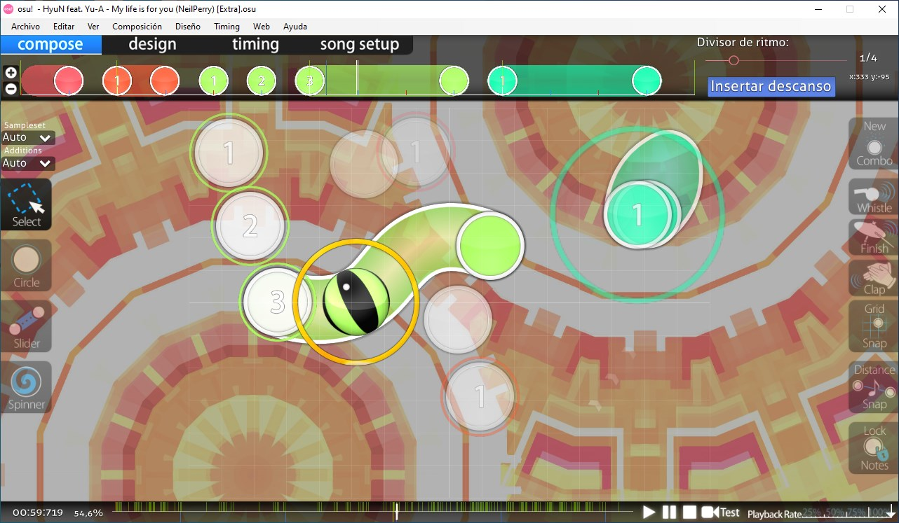
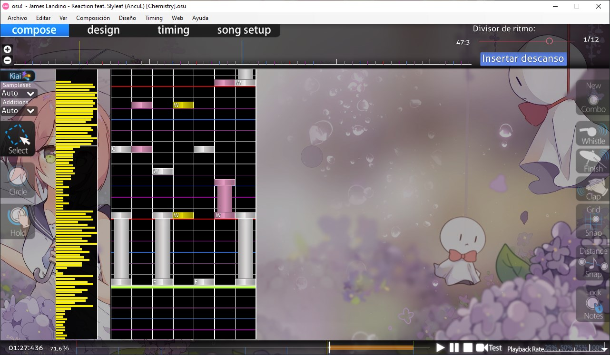
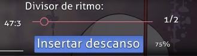

# Pestaña compose

::: Infobox

:::

::: Infobox

:::

La **pestaña compose** del [editor de beatmaps](/wiki/Client/Beatmap_editor) es el lugar donde los [mappers](/wiki/Beatmapping) pasan la mayor parte de su tiempo trabajando en beatmaps después de ajustar la [temporización](/wiki/Beatmapping/Timing). Los [patrones de los objetos](/wiki/Beatmap/Pattern), [hitsounds](/wiki/Beatmapping/Hitsound) y otros aspectos de diseño del beatmap se pueden inspeccionar en esta pestaña.

El editor comparte las mismas herramientas entre osu!, osu!taiko y osu!catch, mientras que osu!mania tiene un diseño de la pestaña compose específico más adecuado para ese modo de juego. Se puede acceder cambiando el [modo permitido](/wiki/Client/Beatmap_editor/Song_setup#avanzado) de la dificultad a `osu!mania`.

## Características

*Para una visión general del proceso de mapping, véase: [Beatmapping](/wiki/Beatmapping)*

### Línea de tiempo de los objetos

La línea de tiempo se puede acercar y alejar con los botones `+`/`-` de la izquierda o, alternativamente, desplazándote con la tecla `Alt` mantenida. Las dos líneas blancas en el centro indican la marca de tiempo actual. Además, los objetos en la línea de tiempo se pueden seleccionar y mover con el botón izquierdo del ratón, o eliminarlos haciendo clic con el botón derecho.

Haz clic y arrastra la cola de un slider a la derecha de la línea de tiempo para crear un [slider con repetidor](/wiki/Gameplay/Hit_object/Slider/Repeat_slider).

### Divisor de ritmo

| Nombre | Descripción |
| :-- | :-- |
| [Divisor de ritmo](/wiki/Client/Beatmap_editor/Beat_snap_divisor) | Limita la cantidad de marcas de la línea de tiempo que determinan en qué subdivisiones de un pulso se pueden colocar los objetos. Si se mueve el control deslizante hacia la derecha, aumenta la granularidad de las marcas de la línea de tiempo. |
| `Insertar descanso` | Añade un [descanso](/wiki/Beatmap/Break) en la marca de tiempo actual. |
| x/y | Muestra la posición de un objeto seleccionado en el campo de juego o, si no hay nada seleccionado, la posición del cursor. |

Mantén presionado `Alt` para cambiar el control deslizante al modo de [ajuste de distancia](/wiki/Client/Beatmap_editor/Distance_snap) de las notas. El multiplicador de distancia puede variar entre 0,1x y 6,0x.

### Barra de herramientas de la izquierda

| Botón (atajo de teclado) | Descripción |
| :-- | :-- |
| `Sampleset` | Reemplaza el [conjunto de muestras](/wiki/Beatmapping/Sampleset) de los objetos seleccionados (incluidos sus hitnormals). Elegir `Auto` restablecerá el conjunto de muestras al del [punto de tiempo](/wiki/Client/Beatmap_editor/Timing#puntos-de-tiempo) activo. |
| `Additions` | Reemplaza el conjunto de muestra de los objetos seleccionados, afectando solo sus hitsounds adicionales (whistle, finish y clap). Elegir `Auto` restablecerá el conjunto de muestras al del punto de tiempo activo. |
| `Select` (`1`) | `Clic izquierdo` o `Arrastrar hacia la izquierda`: Seleccionar o mover objetos o puntos de control. `Clic derecho`: Eliminar objetos o puntos de control. `Ctrl` + `Clic izquierdo`: Selecciona varios objetos. `Ctrl` + `Clic izquierdo` al seleccionar un slider: Añade un [punto de control](/wiki/Gameplay/Hit_object/Slider/Slider_anchor). |
| `Circle` (`2`) | `Clic izquierdo`: Añade un [círculo](/wiki/Gameplay/Hit_object/Hit_circle) en la marca de tiempo actual. |
| `Slider` (`3`) | `Clic izquierdo`/`derecho`: Inicia o finaliza un [slider](/wiki/Gameplay/Hit_object/Slider) en la marca de tiempo actual. `Clic izquierdo` al colocar un slider: Añade un punto de control. |
| `Spinner` (`4`) | `Clic izquierdo`/`derecho`: Inicia o finaliza un [spinner](/wiki/Gameplay/Hit_object/Spinner) en la marca de tiempo actual. |

### Campo de juego

### Barra de herramientas de la derecha

| Botón (atajo de teclado) | Uso | Descripción |
| :-- | :-- | :-- |
| `New Combo` (`Q`) | `Clic izquierdo` al seleccionar un objeto o `Clic derecho` en la ubicación del objeto. | Inicia un nuevo [combo](/wiki/Beatmapping/Combo) a partir del objeto actual (aproximadamente equivalente a un verso en el guion de una canción). |

#### Hitsounds

| Botón (atajo de teclado) | Uso |
| :-- | :-- |
| `Whistle` (`W`) | `Clic izquierdo`: Aplica un sonido de whistle a la selección. |
| `Finish` (`E`) | `Clic izquierdo`: Aplica un sonido de finish a la selección. |
| `Clap` (`R`) | `Clic izquierdo`: Aplica un sonido de clap a la selección. |

#### Herramientas de asistencia

| Botón (atajo de teclado) | Uso | Descripción |
| :-- | :-- | :-- |
| `Grid Snap` (`T`) | Mantener presionado `Mayús`: Se activa temporalmente. | Ancla los objetos [a la rejilla](/wiki/Beatmapping/Grid_snapping) mientras se mueven. |
| `Distance Snap` (`Y`) | Mantener presionado `Alt`: Se activa temporalmente, cambiando el divisor de ritmo a ajuste de distancia de las notas. `Alt` + `Rueda del ratón`: Ajusta el multiplicador del ajuste de distancia de las notas. | Calcula la [distancia](/wiki/Client/Beatmap_editor/Distance_snap) entre objetos consecutivos en función de su distancia temporal. Es mejor usarlo mientras la línea de tiempo está en pausa. |
| `Lock Notes` (`L`) | `Clic izquierdo`: alterna. | Bloquea todos los objetos en sus posiciones y marcas de tiempo actuales. |

### Línea de tiempo de la canción

La posición actual en la canción se muestra en la parte inferior izquierda en el formato `<minutos>:<segundos>:<milisegundos>`. Cuando se hace clic, se abre una pequeña ventana emergente para copiar o pegar las [marcas de tiempo de los objetos](/wiki/Modding/Timestamp) para una selección y navegación rápida. Junto a la marca de tiempo está el porcentaje de progreso de la canción, que muestra `intro` u `outro` cuando está fuera del rango de la pista musical debido a la presencia de un [storyboard](/wiki/Storyboard).

El área central contiene la línea de tiempo con marcas y botones para el control de la música. Cuando se coloca el cursor sobre ella, aparecen botones adicionales para trabajar con marcadores. El botón `Test` a la derecha de la línea de tiempo permite [probar el beatmap](/wiki/Client/Beatmap_editor/Test_mode) desde el punto actual en el tiempo.

En la parte inferior derecha, la velocidad de reproducción se puede configurar en 25 %, 50 %, 75 % o 100 %.

#### Color de los marcadores

| Color | Descripción |
| :-- | :-- |
| Blanco | Marca de tiempo actual |
| Amarillo | Punto de vista previa |
| Verde | [Punto de tiempo heredado](/wiki/Client/Beatmap_editor/Timing#puntos-de-tiempo-heredados) |
| Rojo | [Punto de tiempo no heredado](/wiki/Client/Beatmap_editor/Timing#puntos-de-tiempo-no-heredados) |
| Azul | Marcador |

#### Color de las secciones

| Color | Descripción |
| :-- | :-- |
| Gris | [Descanso](/wiki/Beatmap/Break) |
| Naranja | [Kiai time](/wiki/Gameplay/Kiai_time) |

#### Acciones de un marcador

| Atajo | Descripción |
| :-- | :-- |
| `Ctrl` + `B` | Añade un marcador en la ubicación actual. |
| `Ctrl` + `Mayús` + `B` | Elimina el marcador más cercano (a menos de 2 segundos de distancia). |
| `Ctrl` + `Flecha derecha` | Ir al siguiente marcador. |
| `Ctrl` + `Flecha izquierda` | Ir al marcador anterior. |

## Características (osu!mania)

*Para tutoriales de mapping de osu!mania en el foro, véase: [[Tutorial] osu!mania mapping, Basics](https://osu.ppy.sh/community/forums/topics/118868), [[Tutorial] osu!mania mapping, Keysounding](https://osu.ppy.sh/community/forums/topics/139139)*

El editor específico de osu!mania tiene algunas diferencias en comparación con otros modos de juego, que se tratan en esta sección.

### Divisor de ritmo

*Artículo principal: [Divisor de ritmo](/wiki/Client/Beatmap_editor/Beat_snap_divisor)*

En osu!mania, el área del divisor de ritmo también muestra el nombre y el nivel de volumen de la muestra de sonido adjunta a una nota seleccionada. Estas muestras por nota llamadas keysounds se aplican mediante el cuadro de diálogo [`Sample import`](#importación-de-muestras).

### Barra de herramientas de la izquierda

| Botón (atajo de teclado) | Uso |
| :-- | :-- |
| `Sampleset` | Reemplaza el [conjunto de muestras](/wiki/Beatmapping/Sampleset) de los objetos seleccionados (incluidos sus hitnormals). Elegir `Auto` restablecerá el conjunto de muestras al del [punto de tiempo](/wiki/Client/Beatmap_editor/Timing#puntos-de-tiempo) activo. |
| `Additions` | Reemplaza el conjunto de muestra de los objetos seleccionados, afectando solo sus hitsounds adicionales (whistle, finish y clap). Elegir `Auto` restablecerá el conjunto de muestras al del punto de tiempo activo. |
| `Select` (`1`) | `Clic izquierdo` o `Arrastrar hacia la izquierda`: Mueve la marca de tiempo y ubicación de la nota. `Clic derecho`: Elimina la nota. `Ctrl` + `Clic izquierdo`: Selecciona varios objetos. |
| `Circle` (`2`) | `Clic izquierdo`: Coloca una nota. |
| `Hold` (`3`) | Mantener presionado `Clic izquierdo`: Coloca una nota larga y ajusta su longitud. Suelta el clic para finalizar la nota. |

### Campo de juego

#### Secciones

| Nombre | Descripción |
| :-- | :-- |
| Izquierda | Densidad de las notas (línea de tiempo) |
| Centro | El campo de juego, superpuesto sobre las líneas del [divisor de ritmo](/wiki/Client/Beatmap_editor/Beat_snap_divisor) |

#### Colores

*Véase también: [Divisor de ritmo](/wiki/Client/Beatmap_editor/Beat_snap_divisor)*

| Color de la línea | Descripción |
| :-- | :-- |
| Blanco (grueso) | Un compás completo |
| Blanco | Un [pulso](/wiki/Music_theory/Beat) |
| Verde | Marca de tiempo actual/línea de [juicio](/wiki/Gameplay/Judgement) |

| Color de la nota | Descripción |
| :-- | :-- |
| Azul | Notas seleccionadas |
| Blanco/rosa/amarillo | Colores de las notas no seleccionadas |

### Muestreo

El **muestreo** es el proceso de añadir muestras de sonido a notas individuales. Para añadir una muestra, haz clic en una nota mientras mantienes presionada la tecla `Alt` para abrir una ventana emergente con una lista de muestras de sonido disponibles.

#### Importación de muestras

El lado izquierdo de la ventana de importación de muestras enumera todas las muestras de audio de la carpeta del beatmap. Se pueden aplicar a los objetos seleccionados usando la configuración en el lado derecho de la ventana.

##### Básico

| Nombre | Descripción |
| :-- | :-- |
| `CustomSet` | Aplica el conjunto de hitsounds y el volumen predeterminado sin usar los del punto de tiempo actual, ignorando la selección de muestra del lado izquierdo. *Ten en cuenta que para que esta acción funcione correctamente, debe estar habilitado `Use basic sample`.* |
| `Volume` | El volumen que debe tener este archivo de sonido. Usa solo valores enteros del 8 al 100. |
| `Use basic sample` | Aplica los cambios de volumen o de conjuntos de muestras personalizados solo a las notas seleccionadas. |

##### Botones

| Nombre | Descripción |
| :-- | :-- |
| `Play` | Reproduce la muestra seleccionada. |
| `Import` | Añade más muestras a la carpeta del beatmap desde otras ubicaciones. |
| `Delete` | Elimina el archivo de audio. |
| `Apply` | Aplica la muestra seleccionada a la nota seleccionada. |
| `Sample` | Añade la muestra seleccionada como un [evento de audio del storyboard](/wiki/Storyboard/Scripting/Audio) en la marca de tiempo actual. |
| `Sample list` | Muestra los [eventos de sonido en el storyboard](#lista-de-eventos-de-las-muestras). |
| `Reset` | Elimina la muestra personalizada de la nota seleccionada. |
| `Cancel` | Cierra la ventana. |

#### Lista de eventos de las muestras

*Véase también: [Muestras de audio de los storyboards](/wiki/Storyboard/Scripting/Audio)*

`Sample events list` es una ventana que muestra los eventos de sonido de los storyboards, que se almacenan en el archivo `.osu` de la dificultad o en el archivo `.osb` del beatmap.
