# แถบ Compose (การประกอบ)

::: Infobox
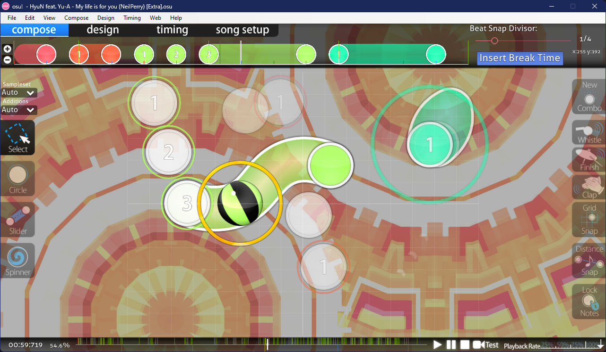
:::

::: Infobox
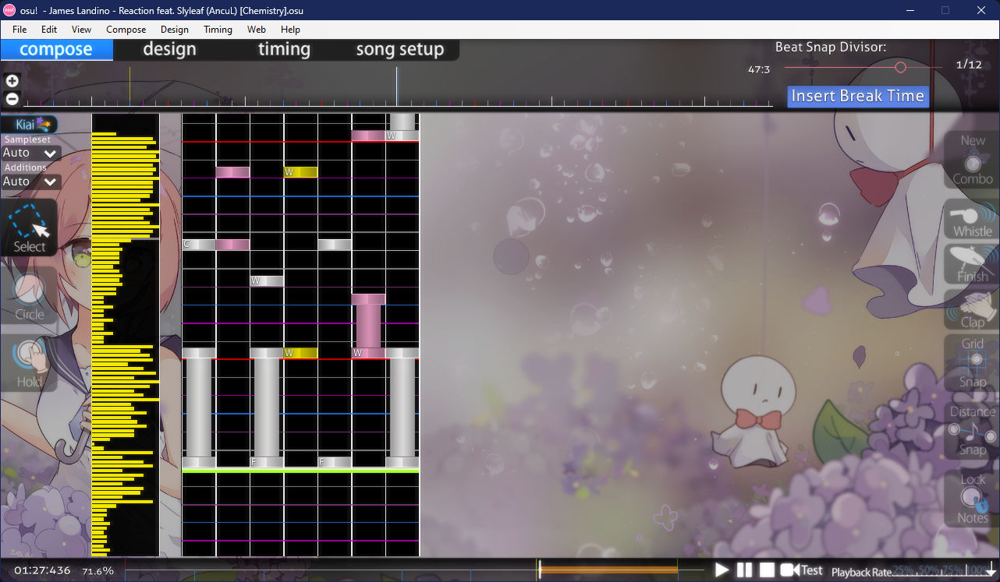
:::

แถบ **Compose** (การประกอบ) ใน [ตัวแก้ไข Beatmap (Beatmap editor)](/wiki/Client/Beatmap_editor) คือส่วนที่ [Mapper](/wiki/Beatmapping) ใช้เวลาส่วนใหญ่ในการทำงานหลังจากตั้งค่า [จังหวะ (Timing)](/wiki/Beatmapping/Timing) เรียบร้อยแล้ว ในแถบนี้คุณสามารถตรวจสอบ [รูปแบบของวัตถุ (Hit object patterns)](/wiki/Beatmap/Pattern), [Hitsounds](/wiki/Beatmapping/Hitsound) และแง่มุมอื่นๆ ในการออกแบบ Beatmap ได้

ตัวแก้ไขจะใช้เครื่องมือชุดเดียวกันสำหรับโหมด osu!, osu!taiko และ osu!catch ในขณะที่โหมด osu!mania จะมีหน้าตาของแถบ Compose ที่แตกต่างออกไปเพื่อให้เหมาะสมกับรูปแบบการเล่น ซึ่งสามารถเข้าถึงได้โดยการเปลี่ยน [โหมดที่รองรับ (Allowed mode)](/wiki/Client/Beatmap_editor/Song_setup#advanced) ให้เป็น `osu!mania` ในการตั้งค่าเพลง

## คุณสมบัติ (Features)

*สำหรับภาพรวมของกระบวนการสร้างแมพ ดูที่: [การสร้าง Beatmap (Beatmapping)](/wiki/Beatmapping)*

### ไทม์ไลน์ของ Hit object

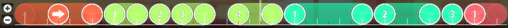

คุณสามารถขยายหรือย่อไทม์ไลน์ได้ด้วยปุ่ม `+`/`-` ทางด้านซ้าย หรือใช้การหมุนล้อเมาส์พร้อมกับกดปุ่ม `Alt` ค้างไว้ เส้นสีขาวสองเส้นตรงกลางระบุตำแหน่งเวลาปัจจุบัน นอกจากนี้ คุณยังสามารถเลือกและย้าย Hit objects บนไทม์ไลน์ได้ด้วยปุ่มเมาส์ซ้าย หรือลบออกด้วยการคลิกขวา

คลิกและลากส่วนหางของ Slider บนไทม์ไลน์ไปทางขวาเพื่อสร้าง [Slider วกกลับ (Repeat sliders)](/wiki/Gameplay/Hit_object/Slider/Repeat_slider)

### ตัวแบ่งจังหวะ (Beat snap divisor)

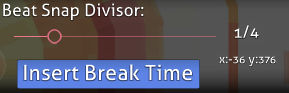

| ชื่อ | คำอธิบาย |
| :-- | :-- |
| [Beat snap divisor](/wiki/Client/Beatmap_editor/Beat_snap_divisor) | กำหนดความละเอียดของขีดบนไทม์ไลน์ว่า Hit objects จะสามารถวางลงในตำแหน่งใดของจังหวะได้บ้าง การเลื่อนแถบไปทางขวาจะเพิ่มความละเอียดของขีดบนไทม์ไลน์ |
| `Insert Break Time` | เพิ่ม [ช่วงพัก (Break)](/wiki/Beatmap/Break) ณ ตำแหน่งเวลาปัจจุบัน |
| x/y | แสดงพิกัดตำแหน่งของ Hit object ที่เลือกในสนามเล่น หรือหากไม่ได้เลือกอะไร จะแสดงพิกัดตำแหน่งของเคอร์เซอร์ |

กดปุ่ม `Alt` ค้างไว้เพื่อเปลี่ยนแถบเลื่อนเป็นโหมด [ระยะห่าง (Distance spacing)](/wiki/Client/Beatmap_editor/Distance_snap) โดยตัวคูณระยะห่างสามารถปรับได้ตั้งแต่ 0.1x ถึง 6.0x

### แถบเครื่องมือด้านซ้าย (Left toolbar)

| ปุ่ม (ปุ่มลัด) | คำอธิบาย |
| :-- | :-- |
| `Sampleset` | กำหนดชุดเสียง [Sampleset](/wiki/Beatmapping/Sampleset) ให้กับวัตถุที่เลือก (รวมถึงเสียง hitnormal) การเลือก `Auto` จะเป็นการใช้ชุดเสียงตาม [จุดจังหวะ (Timing point)](/wiki/Client/Beatmap_editor/Timing#timing-points) ที่ครอบคลุมอยู่ |
| `Additions` | กำหนดชุดเสียงส่วนเสริมให้กับวัตถุที่เลือก ซึ่งจะมีผลเฉพาะเสียง whistle, finish และ clap เท่านั้น การเลือก `Auto` จะคืนค่าตามจุดจังหวะปัจจุบัน |
| `Select` (`1`) | `คลิกซ้าย` หรือ `ลากเมาส์ซ้าย`: เลือกหรือย้ายวัตถุและจุดควบคุม `คลิกขวา`: ลบวัตถุหรือจุดควบคุม `Ctrl` + `คลิกซ้าย`: เลือกหลายวัตถุพร้อมกัน `Ctrl` + `คลิกซ้าย` ขณะเลือก Slider: เพิ่ม [จุดควบคุม (Control point)](/wiki/Gameplay/Hit_object/Slider/Slider_anchor) |
| `Circle` (`2`) | `คลิกซ้าย`: เพิ่ม [วงกลม (Hit circle)](/wiki/Gameplay/Hit_object/Hit_circle) ณ ตำแหน่งเวลาปัจจุบัน |
| `Slider` (`3`) | `คลิกซ้าย`/`ขวา`: เริ่มหรือจบ [Slider](/wiki/Gameplay/Hit_object/Slider) ณ ตำแหน่งเวลาปัจจุบัน `คลิกซ้าย` ขณะวาง Slider: เพิ่มจุดควบคุม |
| `Spinner` (`4`) | `คลิกซ้าย`/`ขวา`: เริ่มหรือจบ [Spinner](/wiki/Gameplay/Hit_object/Spinner) ณ ตำแหน่งเวลาปัจจุบัน |

### สนามเล่น (Playfield)

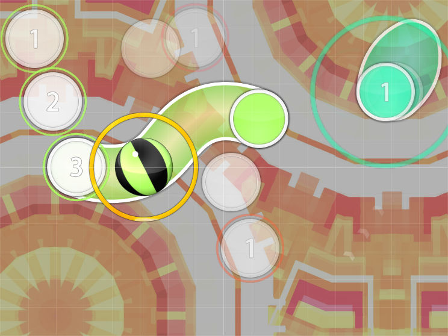

### แถบเครื่องมือด้านขวา (Right toolbar)

| ปุ่ม (ปุ่มลัด) | การใช้งาน | คำอธิบาย |
| :-- | :-- | :-- |
| `New Combo` (`Q`) | `คลิกซ้าย` ขณะเลือกวัตถุ หรือ `คลิกขวา` ขณะวางวัตถุ | เริ่ม [คอมโบ (Combo)](/wiki/Beatmapping/Combo) ชุดใหม่จากวัตถุปัจจุบัน (เปรียบเสมือนการขึ้นท่อนใหม่ของเพลง) |

#### Hitsounds

| ปุ่ม (ปุ่มลัด) | การใช้งาน |
| :-- | :-- |
| `Whistle` (`W`) | `คลิกซ้าย`: ใส่เสียงนกหวีดให้กับวัตถุที่เลือก |
| `Finish` (`E`) | `คลิกซ้าย`: ใส่เสียงจบ/ฉาบให้กับวัตถุที่เลือก |
| `Clap` (`R`) | `คลิกซ้าย`: ใส่เสียงปรบมือให้กับวัตถุที่เลือก |

#### เครื่องมือช่วยวาง (Assist tools)

| ปุ่ม (ปุ่มลัด) | การใช้งาน | คำอธิบาย |
| :-- | :-- | :-- |
| `Grid Snap` (`T`) | กด `Shift` ค้างไว้: เปิดปิดชั่วคราว | Snap วัตถุให้ [ตรงตามตาราง (Grid)](/wiki/Beatmapping/Grid_snapping) ในขณะที่ย้ายตำแหน่ง |
| `Distance Snap` (`Y`) | กด `Alt` ค้างไว้: เปิดปิดชั่วคราว พร้อมเปลี่ยนแถบเลื่อนเป็น Distance snap `Alt` + `ล้อเมาส์`: ปรับตัวคูณระยะห่าง | คำนวณ [ระยะห่าง](/wiki/Client/Beatmap_editor/Distance_snap) ระหว่างวัตถุที่วางต่อกันโดยอิงตามเวลา แนะนำให้ใช้ในขณะที่หยุดเล่นเพลง |
| `Lock Notes` (`L`) | `คลิกซ้าย`: เปิด/ปิด | ล็อกทุกวัตถุให้อยู่ในตำแหน่งและเวลาปัจจุบันเพื่อป้องกันการขยับโดยไม่ตั้งใจ |

### ไทม์ไลน์เพลง (Song timeline)

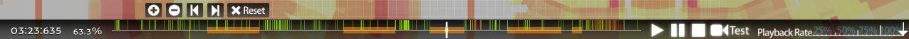

ตำแหน่งปัจจุบันในเพลงจะแสดงที่มุมซ้ายล่างในรูปแบบ `<นาที>:<วินาที>:<มิลลิวินาที>` เมื่อคลิกจะเปิดหน้าต่างเล็กๆ สำหรับคัดลอกหรือวาง [เวลาของวัตถุ (Timestamp)](/wiki/Modding/Timestamp) เพื่อการเลือกและนำทางที่รวดเร็ว ถัดจากตัวเลขเวลาคือเปอร์เซ็นต์ความคืบหน้าของเพลง โดยจะแสดงคำว่า `intro` หรือ `outro` เมื่ออยู่นอกช่วงของไฟล์เสียงเพลงเนื่องจากมี [Storyboard](/wiki/Storyboard)

ส่วนกลางประกอบด้วยไทม์ไลน์พร้อมขีดระบุและปุ่มควบคุมเพลง เมื่อวางเมาส์เหนือส่วนนี้จะมีปุ่มเพิ่มเติมสำหรับการจัดการ Bookmark ปุ่ม `Test` ทางด้านขวาของไทม์ไลน์ใช้สำหรับ [ทดสอบการเล่น Beatmap](/wiki/Client/Beatmap_editor/Test_mode) จากจุดเวลาปัจจุบัน

ที่มุมขวาล่าง คุณสามารถเลือกความเร็วในการเล่นได้ที่ 25%, 50%, 75% หรือ 100%

#### ขีดสัญลักษณ์สี (Colour markers)

| สี | คำอธิบาย |
| :-- | :-- |
| ขาว | ตำแหน่งเวลาปัจจุบัน |
| เหลือง | จุดฟังเพลงตัวอย่าง (Preview point) |
| เขียว | [Inherited timing point](/wiki/Client/Beatmap_editor/Timing#inherited-timing-point) (ขีดสีเขียว) |
| แดง | [Uninherited timing point](/wiki/Client/Beatmap_editor/Timing#uninherited-timing-point) (ขีดสีแดง) |
| ฟ้า | Bookmark |

#### ช่วงสี (Colour sections)

| สี | คำอธิบาย |
| :-- | :-- |
| เทา | [ช่วงพัก (Break)](/wiki/Beatmap/Break) |
| ส้ม | [Kiai time](/wiki/Gameplay/Kiai_time) |

#### การจัดการ Bookmark

| ปุ่มลัด | คำอธิบาย |
| :-- | :-- |
| `Ctrl` + `B` | เพิ่ม Bookmark ณ ตำแหน่งปัจจุบัน |
| `Ctrl` + `Shift` + `B` | ลบ Bookmark ที่ใกล้ที่สุด (ในระยะไม่เกิน 2 วินาที) |
| `Ctrl` + `ลูกศรขวา` | ไปยัง Bookmark ถัดไป |
| `Ctrl` + `ลูกศรซ้าย` | ไปยัง Bookmark ก่อนหน้า |

## คุณสมบัติเฉพาะ (osu!mania)

*สำหรับบทช่วยสอนการทำแมพ mania ในฟอรัม ดูได้ที่: [[Tutorial] osu!mania mapping, Basics](https://osu.ppy.sh/community/forums/topics/118868), [[Tutorial] osu!mania mapping, Keysounding](https://osu.ppy.sh/community/forums/topics/139139)*

ตัวแก้ไขเฉพาะของโหมด osu!mania มีความแตกต่างจากโหมดอื่นๆ ดังนี้:

### ตัวแบ่งจังหวะ (Beat snap divisor)

*บทความหลัก: [ตัวแบ่งจังหวะ (Beat snap divisor)](/wiki/Client/Beatmap_editor/Beat_snap_divisor)*

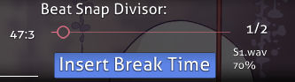

ในโหมด osu!mania ส่วนของตัวแบ่งจังหวะจะแสดงชื่อไฟล์เสียงและระดับความดังของเสียง Sample ที่ผูกไว้กับโน้ตที่เลือกด้วย ซึ่งการใส่เสียงเฉพาะโน้ตแบบนี้เรียกว่า Keysounding โดยทำผ่านหน้าต่าง [`Sample import`](#การนำเข้าเสียง-sample-import)

### แถบเครื่องมือด้านซ้าย (Left toolbar)

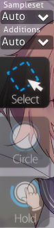

| ปุ่ม (ปุ่มลัด) | การใช้งาน |
| :-- | :-- |
| `Sampleset` | กำหนดชุดเสียงให้กับวัตถุที่เลือก การเลือก `Auto` จะคืนค่าตามจุดจังหวะปัจจุบัน |
| `Additions` | กำหนดชุดเสียงส่วนเสริมให้กับวัตถุที่เลือก (whistle, finish, clap) |
| `Select` (`1`) | `คลิกซ้าย` หรือ `ลากเมาส์ซ้าย`: ย้ายเวลาและตำแหน่งแถวของโน้ต `คลิกขวา`: ลบโน้ต `Ctrl` + `คลิกซ้าย`: เลือกหลายโน้ตพร้อมกัน |
| `Circle` (`2`) | `คลิกซ้าย`: วางโน้ต |
| `Hold` (`3`) | `คลิกซ้ายค้างไว้`: วางโน้ตยาวและปรับความยาว ปล่อยเมาส์เพื่อจบโน้ต |

### สนามเล่น (Playfield)

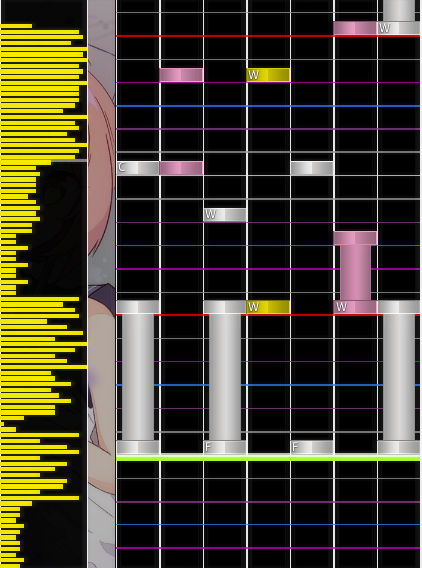

#### ส่วนต่างๆ

| ชื่อ | คำอธิบาย |
| :-- | :-- |
| ฝั่งซ้าย | ความหนาแน่นของโน้ต (Timeline) |
| ตรงกลาง | สนามเล่น ซึ่งวางทับอยู่บนเส้น [ตัวแบ่งจังหวะ](/wiki/Client/Beatmap_editor/Beat_snap_divisor) |

#### สีสัน

*ดูเพิ่มเติม: [ตัวแบ่งจังหวะ (Beat snap divisor)](/wiki/Client/Beatmap_editor/Beat_snap_divisor)*

| สีของเส้น | คำอธิบาย |
| :-- | :-- |
| ขาว (เส้นหนา) | เส้นเริ่มห้องดนตรี |
| ขาว | [จังหวะ (Beat)](/wiki/Music_theory/Beat) |
| เขียว | ตำแหน่งเวลาปัจจุบัน / เส้นตัดสิน (Judgement line) |

| สีของโน้ต | คำอธิบาย |
| :-- | :-- |
| ฟ้า | โน้ตที่ถูกเลือกอยู่ |
| ขาว/ชมพู/เหลือง | สีของโน้ตปกติที่ไม่ได้ถูกเลือก |

### Sampling (การใส่เสียงตัวอย่าง)

**Sampling** คือกระบวนการเพิ่มเสียง Sample ให้กับแต่ละโน้ตแยกกัน ในการเพิ่มเสียง ให้คลิกที่โน้ตในขณะที่กด `Alt` ค้างไว้ เพื่อเปิดหน้าต่างรายการเสียง Sample ที่มีให้เลือก

#### การนำเข้าเสียง (Sample import)

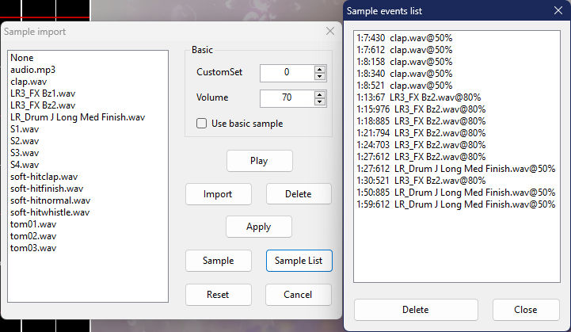

ฝั่งซ้ายของหน้าต่างนี้จะแสดงรายการเสียง Sample ทั้งหมดที่มีอยู่ในโฟลเดอร์ของ Beatmap คุณสามารถนำเสียงเหล่านี้ไปใช้กับโน้ตที่เลือกได้ผ่านการตั้งค่าทางฝั่งขวา

##### พื้นฐาน (Basic)

| ชื่อ | คำอธิบาย |
| :-- | :-- |
| `CustomSet` | ใช้ชุดเสียง Hitsound และความดังเริ่มต้นโดยไม่สนจุดจังหวะปัจจุบัน และไม่สนการเลือกเสียงฝั่งซ้าย *ทั้งนี้ต้องเปิดใช้งาน `Use basic sample` ด้วยฟังก์ชันนี้จึงจะทำงาน* |
| `Volume` | ระดับความดังของเสียง (ค่าตัวเลข 8 ถึง 100) |
| `Use basic sample` | ใช้เฉพาะการเปลี่ยนความดังหรือชุดเสียงเริ่มต้นกับโน้ตที่เลือกเท่านั้น |

##### ปุ่มคำสั่ง

| ชื่อ | คำอธิบาย |
| :-- | :-- |
| `Play` | ฟังเสียง Sample ที่เลือก |
| `Import` | นำเข้าเสียงเพิ่มเติมจากตำแหน่งอื่นเข้ามาในโฟลเดอร์ของ Beatmap |
| `Delete` | ลบไฟล์เสียงออกจากโฟลเดอร์ |
| `Apply` | ใส่เสียงที่เลือกให้กับโน้ตที่เลือกอยู่ |
| `Sample` | เพิ่มเสียงที่เลือกในรูปแบบ [Storyboard audio event](/wiki/Storyboard/Scripting/Audio) ณ ตำแหน่งเวลาปัจจุบัน |
| `Sample list` | แสดง [รายการเสียงใน Storyboard](#รายการเสียงใน-storyboard-sample-events-list) |
| `Reset` | ลบเสียง Sample ที่กำหนดไว้ออกจากโน้ตที่เลือก |
| `Cancel` | ปิดหน้าต่าง |

#### รายการเสียงใน Storyboard (Sample events list)

*ดูเพิ่มเติม: [Storyboard audio samples](/wiki/Storyboard/Scripting/Audio)*

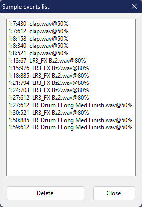

`Sample events list` คือหน้าต่างที่แสดงรายการเหตุการณ์เสียงจาก Storyboard ซึ่งข้อมูลเหล่านี้จะถูกเก็บไว้ในไฟล์ `.osu` ของระดับความยาก หรือไฟล์ `.osb` ของชุดแมพ
