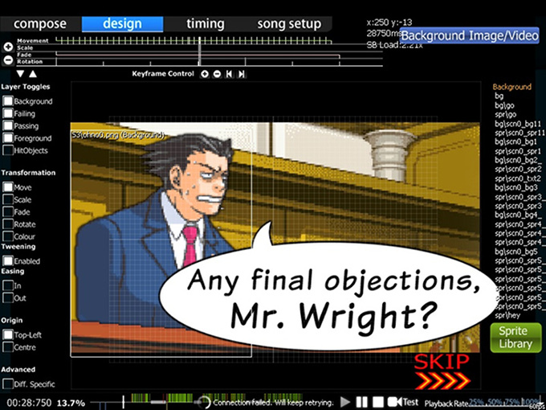
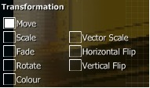

# Design tab

The **Storyboard Editor** is a section of the in-game [Beatmap Editor](/wiki/Client/Beatmap_editor), under the Design tab, which enables simple [Storyboarding](/wiki/Storyboard). It is a good introduction to the fundamental concept before the more advanced [Storyboard Scripting](/wiki/Storyboard/Scripting).

It would be favourable to do crash courses out of every commands using random images at least once before attempting some serious storyboarding. It would help you memorise and understand the usage better.

## Getting Started

1. Place all your storyboard elements/pictures into your map's song folder and create a subfolder named "SB" for them.
2. Access your map through the editor and go to the "Design" screen.
3. Find the correct tick on the timeline above where you want your storyboard element to appear, then click on "Sprite Library" and select your picture. Make sure your element doesn't surpass 800x600 px. That is the maximum threshold.
4. Now select the command of what you want your element to do (Move, Scale, Fade, Rotate or Colour) and press the "+" at "Keyframe Control" to place a point for the command at the current time you are on. "-" on "Keyframe Control" removes the point again, and the arrows buttons let you jump between more points in the same command for the same SB element.
5. Now find the timing point at which you want the command to end (at a later time) so you will have 2 points for it and the corresponding colour line between those points. Green for Move, red for Scale, pink for Fade, yellow for Rotate, and light pink for Colour.
6. At the command points you can change the factors of the function by holding your left mouse button and moving your cursor up (increasing factor) or down (decreasing factor)
7. Repeat Step 3-6 for other elements. To remove, use `Delete` or Edit -> Delete from top menu.

**Note:** If you have a sharp eye, up-tick means start of a transformation, and down-tick means end of a transformation. A full tick on a coloured transformation line means a switch in transformation (e.g. move up -> move down).

## Features

(Starting from top-down left-right order)

### Top-Left (Transformation Timeline)

**Shows the timeline for transformations of the selected object.**

#### Timeline

| Name | Description |
| :-- | :-- |
| `+`/`-` buttons at left | Increase/Decrease timeline zoom |
| `Up`/`Down` arrow buttons left-below | Scroll up/down the transformation timeline (to see Move/Colour timeline). |
| Centre | Transformation Timeline for the selected SB object. |

#### Keyframe Control

This will be used for **adding anchor points (Start/End points).** It works pretty much the same way as bookmarks. The buttons are just under the timeline.

| Name | Description |
| :-- | :-- |
| `+`/`-` buttons | Add/Delete anchor points for the selected transformation. |
| `Left`/`Right` arrow buttons | Jump backward/forward to nearest anchor point of selected transformation. |

If there is a transformation, that transformation is lighted with it's colour and will have two separated half-lines that determines the duration. Full white line determines the transformation switching points (e.g. going up -> going down).

### Top-Right (Readings)

Shows the **readings** and a **toggle to add a background image/video.** The toggle is self-explanatory.

For the readings, **x/y** are your *own* mouse coordinates on the beatmap and will change frantically as you move your mouse. **{number}ms** is the timestamp in milliseconds. **SB Load** is the amount of processing power required to play the storyboard *alone* only. Generally, keep the SB load as low as possible (1.00~2.00) during playtime and let it roll during break time/intro/outro.

### Centre-left (Utilities)

#### Layer Toggles

These will **disable/enable layers from being shown.** If you do not want to see the passing scene (that is always on top of the fail scene in editor), turn "Passing" off and enjoy the fail scene. This is useful when you want to see commands for different objects but something is in the way.

All the toggles are as shown below:-

- Background
- Failing
- Passing
- Foreground
- HitObjects (automatically disabled)

**Note:** HitObjects > Foreground > Passing/Failing > Background where ">" blocks that layer. Also, any new objects (not from "Compose") introduced are set to "Foreground" by default. To transfer, drag and drop to the desired layer's tab.

#### Transformation (timeframe-based)

These are the commands used for your object. Five of the commands have been put in; Move, Scale, Fade, Rotate and Colour. To use the Loop and Parameters, you will need to do some Storyboard Scripting to utilise them.

To use them:-

1. Click on the Storyboard element
2. Select your transformation (MSFRC)
3. Set timeline for the transformation (Use Keyframe Control's "+")
4. Set the effect usage (move up or down your mouse to trigger)
5. Rinse and Repeat.

##### Transformation effects (timeframe-based)

| Command | Usage |
| :-- | :-- |
| Move | Translation \[where to go (e.g., move up)\]. |
| Scale | Proportional enlargement (a square is still a square). |
| Fade | Fade in/out. (darken vs brighten) |
| Rotate | Rotate a certain number of "Radians" (not degrees). |
| Colour | Force colouring to the sprite. Can change colour gradually using different colour as end-point. "Permanent effect". Basic explanation. |

##### Additional effects (hover over left bar)

| Command | Usage |
| :-- | :-- |
| Vector Scale | Irregular enlargement (a square becomes a rectangle). |
| Horizontal/Vertical Flip | Reflection at x-axis/y-axis respectively |

##### Extra commands

| Command | Usage |
| :-- | :-- |
| Tweening | You have two Keyframes (ie Start/End), do you want to animate between them? If so, turn on Tweening. If not, then turn it off. |
| Easing In/Out | Start slow/fast then fast/slow near end point. Useful with Fade In. |
| Origin | Point of origin. "Top-Left" corner or "Centre" of image |
| Diff. Specific | Save all the SB into this difficulty's `.osu` file instead of the `.osb` file. (Refer note below) |

**Note:**

- Colour: "Permanent effect" - The colour you set will still be in effect even after it's timeline is over. This is quite useful for transparent image.
- `.osb`: "Design" base (BG, Video, SB) for each difficulty of the beatmap to follow.
- `.osu`: Difficulty-specific file. Holds *a lot* of information.

### Centre (Storyboard of the beatmap)

This is the **visual representation of the storyboard and changes based on both timeline and layer toggles.** Place your objects here and make the storyboard.

### Centre-right (Objects)

**List of SB objects in their respective layers**. To add the SB objects, click on "Sprite Library". To allocate the new sprite (SB object), just drag-and-drop to the respective layer. New sprites are in "Foreground" layer by default. Clicking on the sprite name will show and forwarded to the location and timeframe of the sprite. Duplicates use the same name as the original sprite. To remove, use `Delete` or Edit -> Delete from top menu.

**Note:** HitObjects > Foreground > Passing/Failing > Background where ">" blocks that layer.

#### Sprite Library

Click the "Browse..." button to search for sprite to use. You can duplicate the sprite by clicking on it's thumbnail at Sprite Library window.

### Bottom (Play Timeline)

Plays the beatmap. Outro storyboarding requires storyboard scripting. Playback Speed slows down the song by % against original speed. You should be familiar with this if you had did some mapping before at Compose.

## Limitations

- No sound effect support, this is not a big problem as sound effects can distract players, especially if they are near [hit objects](/wiki/Gameplay/Hit_object). Use of sound effects should be done by advanced mappers only and with the guidance of a BAT.
- No [loop](/wiki/Storyboard/Scripting/Compound_Commands) or [trigger](/wiki/Storyboard/Scripting/Compound_Commands) support.
- No [Move-X](/wiki/Storyboard/Scripting/Commands)/[Move-Y](/wiki/Storyboard/Scripting/Commands) commands.
- Sprite coordinate is *always* 320,240. You will need to use Move command once to set the location (endpoint not required).
  - If you are *also* doing [Storyboard Scripting](/wiki/Storyboard/Scripting), you will need to *read an extra line* per object done in Design tab.

## Source

- [m980's basic explanation](https://osu.ppy.sh/community/forums/posts/67660)
- [Kite's Basic Manual Storyboarding Guide](https://osu.ppy.sh/community/forums/topics/46111)
