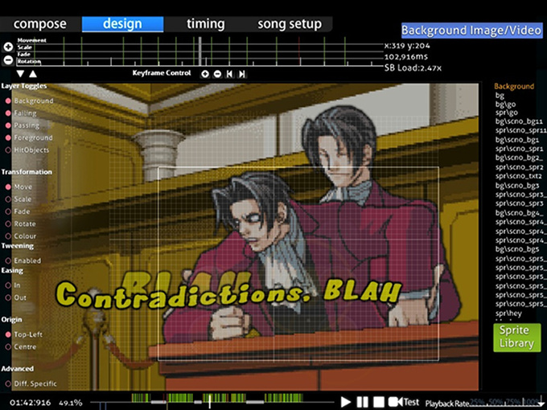
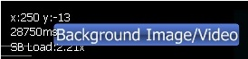
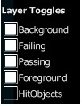
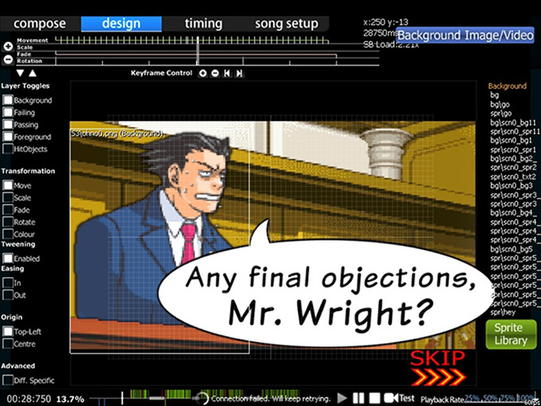
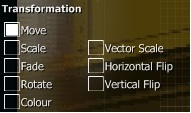
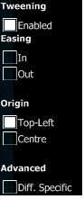
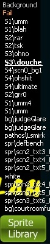
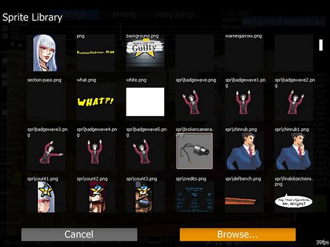

# แถบ Design (การออกแบบ)

**Storyboard Editor** คือส่วนหนึ่งของ [ตัวแก้ไข Beatmap (Beatmap Editor)](/wiki/Client/Beatmap_editor) ภายใต้แถบ Design ซึ่งช่วยให้คุณสร้าง [Storyboard](/wiki/Storyboard) แบบง่ายๆ ได้ ถือเป็นการเริ่มต้นที่ดีในการทำความเข้าใจแนวคิดพื้นฐานก่อนที่จะก้าวไปสู่ [การเขียนสคริปต์ Storyboard (Storyboard Scripting)](/wiki/Storyboard/Scripting) ขั้นสูง

ขอแนะนำให้ลองทดสอบใช้คำสั่งต่างๆ กับรูปภาพสุ่มๆ อย่างน้อยหนึ่งครั้งก่อนที่จะเริ่มทำ Storyboard จริงจัง เพื่อช่วยให้คุณจดจำและเข้าใจวิธีการใช้งานได้ดียิ่งขึ้น

## การเริ่มต้นใช้งาน

1. นำองค์ประกอบหรือรูปภาพ Storyboard ทั้งหมดไปใส่ไว้ในโฟลเดอร์ของเพลงนั้นๆ และแนะนำให้สร้างโฟลเดอร์ย่อยชื่อ "SB" เพื่อความเป็นระเบียบ
2. เปิดแมพของคุณผ่านตัวแก้ไขและไปที่หน้าจอ "Design"
3. หาตำแหน่งเวลาบนไทม์ไลน์ที่คุณต้องการให้รูปภาพปรากฏ จากนั้นคลิกที่ "Sprite Library" และเลือกรูปภาพของคุณ ตรวจสอบให้แน่ใจว่ารูปภาพมีขนาดไม่เกิน 800x600 px ซึ่งเป็นขีดจำกัดสูงสุด
4. เลือกคำสั่งที่คุณต้องการให้วัตถุทำ (Move, Scale, Fade, Rotate หรือ Colour) และกดปุ่ม "+" ที่ส่วน "Keyframe Control" เพื่อวางจุดเริ่มต้นของคำสั่ง ณ เวลานั้น ปุ่ม "-" จะใช้สำหรับลบจุดออก และปุ่มลูกศรจะช่วยให้คุณกระโดดไปมาระหว่างจุดต่างๆ ของคำสั่งเดียวกันได้
5. หาตำแหน่งเวลาที่คุณต้องการให้คำสั่งสิ้นสุด (เวลาที่มาทีหลัง) เพื่อสร้างจุดที่สองขึ้นมา ระบบจะแสดงเส้นสีเชื่อมต่อระหว่างจุดทั้งสอง สีเขียวสำหรับ Move, สีแดงสำหรับ Scale, สีชมพูสำหรับ Fade, สีเหลืองสำหรับ Rotate และสีชมพูอ่อนสำหรับ Colour
6. ที่จุดคำสั่ง คุณสามารถปรับค่าต่างๆ ได้โดยการคลิกเมาส์ซ้ายค้างไว้แล้วเลื่อนเคอร์เซอร์ขึ้น (เพิ่มค่า) หรือลง (ลดค่า)
7. ทำซ้ำขั้นตอนที่ 3-6 สำหรับวัตถุอื่นๆ หากต้องการลบวัตถุ ให้ใช้ปุ่ม `Delete` หรือไปที่เมนู Edit -> Delete

**หมายเหตุ:** หากคุณสังเกตดีๆ ขีดที่ชี้ขึ้นหมายถึงจุดเริ่มต้นของการเปลี่ยนแปลง (Transformation) และขีดที่ชี้ลงหมายถึงจุดสิ้นสุด ส่วนขีดสีขาวเต็มเส้นบนเส้นสีหมายถึงจุดที่มีการสลับทิศทางหรือค่าของการเปลี่ยนแปลง (เช่น ย้ายขึ้น -> ย้ายลง)

## คุณสมบัติ (Features)

(เรียงจากบนลงล่าง และซ้ายไปขวา)

### มุมซ้ายบน (Transformation Timeline)

**แสดงไทม์ไลน์การเปลี่ยนแปลงของวัตถุที่เลือกอยู่**

#### Timeline

| ชื่อ | คำอธิบาย |
| :-- | :-- |
| ปุ่ม `+`/`-` ทางซ้าย | ขยาย/ย่อ ไทม์ไลน์ |
| ปุ่มลูกศร `ขึ้น`/`ลง` | เลื่อนดูไทม์ไลน์การเปลี่ยนแปลงส่วนอื่นๆ (เช่น เพื่อดูแถบ Move หรือ Colour) |
| ตรงกลาง | ไทม์ไลน์การเปลี่ยนแปลงสำหรับวัตถุที่เลือกอยู่ |

#### Keyframe Control

ใช้สำหรับ **เพิ่มจุดยึด (จุดเริ่ม/จุดจบ)** ทำงานคล้ายกับ Bookmark ปุ่มเหล่านี้อยู่ใต้ไทม์ไลน์พอดี

| ชื่อ | คำอธิบาย |
| :-- | :-- |
| ปุ่ม `+`/`-` | เพิ่ม/ลบ จุดยึดสำหรับการเปลี่ยนแปลงที่เลือกอยู่ |
| ปุ่มลูกศร `ซ้าย`/`ขวา` | กระโดดไปยังจุดยึดก่อนหน้าหรือถัดไปของการเปลี่ยนแปลงนั้น |

หากมีการตั้งค่าการเปลี่ยนแปลง แถบนั้นจะสว่างขึ้นตามสีของคำสั่งและมีเส้นครึ่งบรรทัดระบุระยะเวลา เส้นสีขาวเต็มจะบอกจุดที่มีการเปลี่ยนค่า (เช่น เปลี่ยนจากเคลื่อนที่ขึ้นเป็นเคลื่อนที่ลง)

### มุมขวาบน (Readings)

แสดง **ข้อมูลสถิติ** และ **ปุ่มเปิดปิดสำหรับเพิ่มภาพพื้นหลัง/วิดีโอ**

ในส่วนของสถิติ **x/y** คือพิกัดเมาส์ของคุณบนแมพ ซึ่งจะเปลี่ยนไปตามการขยับเมาส์ **{ตัวเลข}ms** คือตำแหน่งเวลาในหน่วยมิลลิวินาที **SB Load** คือปริมาณการประมวลผลที่ใช้สำหรับเล่น Storyboard เพียงอย่างเดียว โดยทั่วไปควรพยายามรักษาค่า SB Load ให้ต่ำที่สุด (1.00~2.00) ในช่วงเวลาเล่น และค่อยปล่อยให้สูงได้ในช่วงพักหรือช่วงนำเข้า/จบเพลง

### กลางซ้าย (Utilities)

#### Layer Toggles (การเปิดปิดเลเยอร์)

ใช้สำหรับ **ปิดหรือเปิดการแสดงผลของเลเยอร์ต่างๆ** หากคุณไม่อยากเห็นฉากตอนเล่นผ่าน (ซึ่งมักจะบังฉากตอนเล่นพลาดในตัวแก้ไข) ให้ปิด "Passing" ออก เลเยอร์ที่มีให้เลือก ได้แก่:

- Background (พื้นหลัง)
- Failing (ตอนเล่นพลาด)
- Passing (ตอนเล่นผ่าน)
- Foreground (ฉากหน้า)
- HitObjects (จะถูกปิดอัตโนมัติเมื่ออยู่ในหน้านี้)

**หมายเหตุ:** ลำดับการทับซ้อนคือ HitObjects > Foreground > Passing/Failing > Background โดยเลเยอร์ทางซ้ายจะบังเลเยอร์ทางขวา วัตถุใหม่ที่เพิ่มเข้ามาจะถูกจัดอยู่ใน "Foreground" โดยค่าเริ่มต้น คุณสามารถย้ายได้โดยการลากและวางในแถบเลเยอร์ที่ต้องการ

#### Transformation (การเปลี่ยนแปลงตามเวลา)

คือคำสั่งที่ใช้กับวัตถุของคุณ มี 5 คำสั่งหลัก ได้แก่ Move, Scale, Fade, Rotate และ Colour ส่วนการใช้ Loop และ Parameters คุณจำเป็นต้องใช้การเขียนสคริปต์ Storyboard ช่วย

วิธีการใช้งาน:

1. คลิกที่วัตถุ Storyboard
2. เลือกคำสั่งที่ต้องการ (M S F R C)
3. กำหนดช่วงเวลาในไทม์ไลน์ (ใช้ปุ่ม "+" ใน Keyframe Control)
4. กำหนดค่าของเอฟเฟกต์ (เลื่อนเมาส์ขึ้นหรือลงเพื่อปรับค่า)
5. ทำซ้ำตามต้องการ

##### คำสั่งการเปลี่ยนแปลง (Transformation effects)

| คำสั่ง | การใช้งาน |
| :-- | :-- |
| Move | การเคลื่อนที่ (เช่น ย้ายจากจุดหนึ่งไปอีกจุดหนึ่ง) |
| Scale | การย่อขยายขนาดตามสัดส่วน (รักษารูปทรงเดิมไว้) |
| Fade | การจางเข้า/ออก (ปรับความโปร่งใส) |
| Rotate | การหมุน ตามหน่วย "Radians" (ไม่ใช่แบบองศา) |
| Colour | บังคับเปลี่ยนสีของภาพ สามารถค่อยๆ เปลี่ยนสีได้โดยกำหนดสีที่ต่างกันที่จุดจบ เป็นเอฟเฟกต์แบบถาวร |

##### เอฟเฟกต์เพิ่มเติม (เมื่อวางเมาส์เหนือแถบซ้าย)

| คำสั่ง | การใช้งาน |
| :-- | :-- |
| Vector Scale | การย่อขยายแบบไม่คงสัดส่วน (เช่น เปลี่ยนสี่เหลี่ยมจัตุรัสเป็นผืนผ้า) |
| Horizontal/Vertical Flip | การกลับด้านในแนวนอนหรือแนวตั้ง |

##### คำสั่งพิเศษ (Extra commands)

| คำสั่ง | การใช้งาน |
| :-- | :-- |
| Tweening | เมื่อมีจุดเริ่มและจุดจบ คุณต้องการให้มีการเคลื่อนไหวต่อเนื่องระหว่างจุดหรือไม่ (ถ้าใช่ให้เปิดไว้) |
| Easing In/Out | เริ่มเคลื่อนที่ช้าแล้วเร็วขึ้น หรือเริ่มเร็วแล้วช้าลงตอนใกล้จบ มีประโยชน์มากกับการทำ Fade In |
| Origin | จุดศูนย์กลางของภาพ เลือกได้ระหว่าง "Top-Left" (มุมซ้ายบน) หรือ "Centre" (กลางภาพ) |
| Diff. Specific | บันทึกข้อมูล Storyboard ทั้งหมดลงในไฟล์ `.osu` ของความยากนี้แทนที่จะเป็นไฟล์ `.osb` รวมของทั้งชุดแมพ |

**หมายเหตุ:**

- Colour: เป็นเอฟเฟกต์แบบถาวร สีที่คุณตั้งไว้จะยังคงอยู่แม้ช่วงเวลาในไทม์ไลน์จะจบลงแล้ว มีประโยชน์มากสำหรับภาพที่มีความโปร่งใส
- `.osb`: ไฟล์พื้นฐานสำหรับ Design (พื้นหลัง, วิดีโอ, Storyboard) ที่ทุกความยากในชุดแมพนั้นจะใช้ร่วมกัน
- `.osu`: ไฟล์เฉพาะของแต่ละความยาก เก็บข้อมูลที่ละเอียดอ่อนของความยากนั้นๆ

### ตรงกลาง (Storyboard of the beatmap)

คือ **การแสดงผลภาพของ Storyboard** ซึ่งจะเปลี่ยนแปลงตามเวลาในไทม์ไลน์และการเปิดปิดเลเยอร์ คุณสามารถวางวัตถุและจัดทำ Storyboard ได้ที่นี่

### กลางขวา (Objects)

**รายการวัตถุ Storyboard ในแต่ละเลเยอร์** ในการเพิ่มวัตถุให้คลิก "Sprite Library" เมื่อได้ภาพมาแล้วสามารถลากและวางเพื่อย้ายเลเยอร์ได้ การคลิกที่ชื่อภาพจะนำคุณไปยังตำแหน่งและเวลาที่ภาพนั้นปรากฏ หากมีภาพซ้ำจะใช้ชื่อเดียวกัน หากต้องการลบให้ใช้ปุ่ม `Delete`

#### Sprite Library

คลิกปุ่ม "Browse..." เพื่อหารูปภาพที่จะใช้ คุณสามารถทำภาพซ้ำได้โดยการคลิกที่รูปภาพขนาดเล็กในหน้าต่าง Sprite Library

### ด้านล่าง (Play Timeline)

ใช้สำหรับเล่น Beatmap เพื่อดูผลลัพธ์ การทำ Storyboard ในช่วงจบเพลง (Outro) จำเป็นต้องใช้การเขียนสคริปต์ช่วย Playback Speed ใช้สำหรับลดความเร็วเพลงเป็นเปอร์เซ็นต์เพื่อให้ตรวจสอบงานได้ละเอียดขึ้น

## ข้อจำกัด

- ไม่รองรับการใส่เอฟเฟกต์เสียง ซึ่งไม่ใช่ปัญหาใหญ่นักเพราะเสียงอาจรบกวนผู้เล่นได้ การใช้เสียงใน Storyboard ควรทำโดย Mapper ขั้นสูงภายใต้การแนะนำของทีมงานเท่านั้น
- ไม่รองรับคำสั่ง [Loop](/wiki/Storyboard/Scripting/Compound_Commands) หรือ [Trigger](/wiki/Storyboard/Scripting/Compound_Commands)
- ไม่รองรับคำสั่ง [Move-X](/wiki/Storyboard/Scripting/Commands) หรือ [Move-Y](/wiki/Storyboard/Scripting/Commands) แยกกัน
- พิกัดเริ่มต้นของภาพจะเป็น 320,240 เสมอ คุณต้องใช้คำสั่ง Move เพื่อกำหนดตำแหน่งที่ต้องการ (ไม่จำเป็นต้องกำหนดจุดจบหากต้องการให้อยู่นิ่งๆ)
  - หากคุณใช้วิธีการเขียนสคริปต์ควบคู่ไปด้วย คุณจะต้องอ่านโค้ดเพิ่มขึ้นหนึ่งบรรทัดต่อวัตถุที่สร้างในแถบ Design

## แหล่งที่มา

- [คำอธิบายพื้นฐานโดย m980](https://osu.ppy.sh/community/forums/posts/67660)
- [คู่มือการทำ Storyboard ด้วยตนเองโดย Kite](https://osu.ppy.sh/community/forums/topics/46111)
