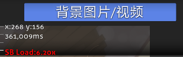
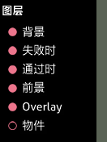
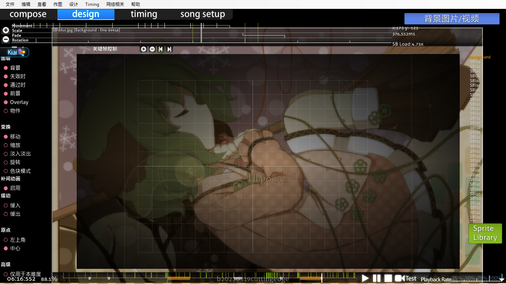
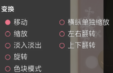

# 设计 (Design) 标签页

 标签页")

**故事板编辑器**是游戏内[谱面编辑器](/wiki/Client/Beatmap_editor)的一部分，位于设计 (Design) 标签页下，可以用来简单[制作故事板](/wiki/Storyboard)。在更高级的[利用脚本制作故事板](/wiki/Storyboard/Scripting)之前，这个编辑器可以很好地介绍故事板的基本概念。

在尝试认真制作故事板之前，推荐先随便找张图片，至少速成地学学每条命令。这样会帮助你更好地记忆并理解它们的用法。

## 入门

1. 把故事板的所有元素/图片放到谱面文件夹中，并为之创建一个名为 “SB” 的子文件夹。
2. 通过谱面编辑器打开谱面，转到 “Design” 标签页。
3. 在上方的时间线上找到想要故事板元素出现的时间点，然后点击 “Sprite Library”，选择图片。确保所选元素大小未超过最大尺寸 800x600 像素。
4. 现在选择想要元素执行的命令（移动，缩放，淡入淡出，旋转或色块模式），点击“关键帧控制”的 “+” 在当前时间放置对应此命令的点，点击 “-” 可以移除点，点击箭头按钮可以在同一故事板元素相同命令的关键帧间跳转。
5. 现在找到想要结束命令的时间点（在某一段时间后），这样这条命令就有两个点，这两点间用对应颜色的线连接。绿色表示移动，红色表示缩放，粉色表示淡入淡出，黄色表示旋转，浅粉色表示色块模式。
6. 可以在命令点处按住鼠标左键，上移或下移光标来改变功能的系数。上移光标增大系数，下移则减小系数。
7. 对其他元素重复第 3~6 步。使用 `Delete` 键或顶部菜单的编辑 -> 删除来删除元素。

**注意：** 如果你仔细观察，则会发现，上半边标记线代表变换开始，下半边标记线代表变换结束。变换线上的整条标记线代表变换方式的改变（比如，上移 -> 下移）。

## 功能

（顺序从上到下、从左到右）

### 左上方 （变换时间线）

**显示所选对象变换的时间线。**

#### 时间线

| 名称 | 描述 |
| :-- | :-- |
| 左侧的 `+`/`-` 按钮 | 放大/缩小时间线。 |
| 左下方的 `上`/`下` 箭头按钮 | 向上/向下滚动变换时间线（以看到移动/颜色时间线）。 |
| 中央 | 所选故事板对象的变换时间线。 |

#### 关键帧控制

可以使用此功能来**添加锚点（起点/终点）**，作用与书签很类似。按钮就在时间线下方。

| 名称 | 描述 |
| :-- | :-- |
| `+`/`-` 按钮 | 对所选的变换添加/删除锚点。 |
| `左`/`右` 箭头按钮 | 向后/前跳转到所选变换中最近的锚点。 |

如果设置了变换，对应变换会以其颜色变亮，显示决定持续时间的两条半线。一整条白线决定了变换的改变点（比如，上移 -> 下移）。

### 右上方 （相关数值）

显示**相关数值**与一个**添加背景图片/视频的开关**。这个开关的功能一目了然。

在显示的数值中，**x/y** 是你*自己*鼠标在谱面上的坐标，会随鼠标移动而疯狂改变。**{数字}ms** 是以毫秒为单位显示的时间戳。**SB Load** 是*单独*显示故事板所需的处理能力。一般来讲，请让故事板负载在游玩期间越低越好 (1.00~2.00)，也可以让它在休息时间/开头/结尾处转一转。

### 中央左侧 （实用工具）

#### 图层开关

这些开关会**显示/隐藏图层**。如果你不想看到通过时的场景（在编辑器中，总在失败时场景上方），可以关闭“通过时”开关，享受失败时场景。如果你想看看不同对象的命令但又有其他对象遮挡，则此功能很有用。

所有开关如下：-

- 背景
- 失败时
- 通过时
- 前景
- 物件（默认禁用）

**注意：** “>” 表示图层遮挡顺序：物件 > 前景 > 通过时/失败时 > 背景。除此之外，任何导入的新对象（不是 “Compose” 中的）默认设置为“前景”。可以把对象拖放到目标图层的标签页下来改变。

#### 变换 （基于时间帧）

这些是用于故事板对象的命令。目前引入了其中五个：移动，缩放，淡入淡出，旋转和色块模式。你需要编写故事板脚本来使用循环和参数命令。

若要使用它们：-

1. 点击故事板元素。
2. 选择变换 (移动/缩放/淡入淡出/旋转/变色)。
3. 为所选变换设置时间线（使用关键帧控制中的 “+”）。
4. 设置效果用法（上下移动鼠标以触发）。
5. 重复进行上述步骤。

##### 变换效果 （基于时间帧）

| 命令 | 用法 |
| :-- | :-- |
| 移动 | 翻译\[到哪里去（比如上移）\]。 |
| 缩放 | 成比例缩放（正方形仍然是正方形）。 |
| 淡入淡出 | 淡入/淡出。（变暗对变亮） |
| 旋转 | 旋转一定的“弧度”（不是角度）。 |
| 色块模式 | 强制为精灵图上色。可以通过在终点使用与起点不同的颜色，来逐步改变元素的颜色，“永久效果”。这是基本解释。 |

##### 附加效果 （悬停在左侧栏上）

| 命令 | 用法 |
| :-- | :-- |
| 横纵单独缩放 | 非常规缩放（正方形变成矩形）。 |
| 左右/上下翻转 | 分别沿 X 轴 / Y 轴对称。 |

##### 附加命令

| 命令 | 用法 |
| :-- | :-- |
| 补间动画 | 你有两个关键帧（即起点/终点）。你想在这两帧之间使用动画吗？如果想，就打开此选项。否则关闭它。 |
| 缓入/缓出 | 较慢/快开始，较快/慢结束。与淡入效果结合很有用。 |
| 原点 | 设置原点位置。可以是图片的“左上角”或“中心”。 |
| 仅用于本难度 | 将整个故事板保存到此难度的 `.osu` 文件而不是 `.osb` 文件中。（参见下方的注意事项） |

**注意：**

- 色块模式： “永久效果”——在时间线结束后，设置的颜色依然有效。对透明图片很有用。
- `.osb`： 谱面中每个难度遵循的“设计”基础（背景图片，视频，故事板）。
- `.osu`： 特定难度的文件。保存*大量*信息。

### 中央 （谱面故事板）

这是**故事板和基于时间线与图层开关的改变的视觉表现。** 在这里放置故事板对象、制作故事板。

### 中央右侧 （对象）

**分别显示不同图层下故事板对象的列表。**点击 “Sprite Library” 来添加故事板元素。可以将新精灵图（故事板对象）拖放到对应图层以分配之。新精灵图默认位于“前景”图层。点击精灵名会显示并跳转到精灵图的位置及时间帧。复制的精灵图使用的名称与原精灵图相同。使用 `Delete` 键或顶部菜单的编辑 -> 删除来删除精灵图。

**注意** “>” 表示图层遮挡顺序：物件 > 前景 > 通过时/失败时 > 背景。

#### 精灵图库 (Sprite Library)

点击 "Browse..." 按钮来搜索要使用的精灵图。你可以在精灵图库窗口中点击缩略图来复制精灵图。

### 底部 （游玩时间线）

播放谱面。需要使用脚本来编写结尾部分的故事板。重放速度 (Playback speed) 以与原速相比一定的百分比降低谱面播放速度。如果你在编曲 (Compose) 标签页中放了些物件，应该会对这很熟悉。

## 限制

- 不支持音效。由于音效（尤其是邻近[打击物件](/wiki/Gameplay/Hit_object)的音效）会分散玩家注意力，这并不是大问题。进阶谱师应该在 BAT 的指导下使用音效。
- 不支持[循环](/wiki/Storyboard/Scripting/Compound_Commands)与[触发](/wiki/Storyboard/Scripting/Compound_Commands)。
- 没有[沿 X 轴移动](/wiki/Storyboard/Scripting/Commands)/[沿 Y 轴移动](/wiki/Storyboard/Scripting/Commands)命令。
- 精灵坐标*总*是 320,240。你需要使用一次移动命令来设置其位置（不需要终点）。
  - 如果你*也*在[利用脚本制作故事板](/wiki/Storyboard/Scripting)，设计 (Design) 标签页中的每个对象就需要*多读一行*。

## 来源

- [m980's basic explanation](https://osu.ppy.sh/community/forums/posts/67660)
- [Kite's Basic Manual Storyboarding Guide](https://osu.ppy.sh/community/forums/topics/46111)
