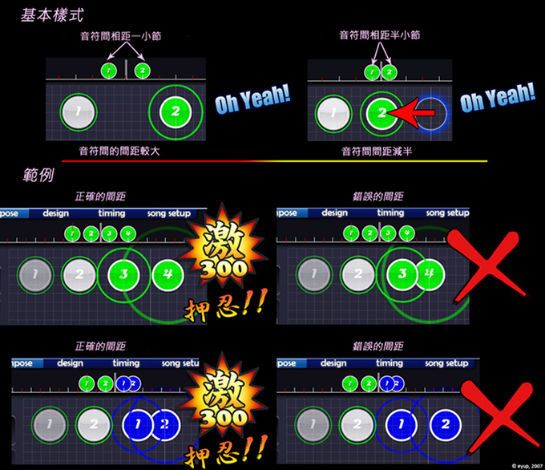

# 間距鎖定

應用 Distance Snap 工具是確保地圖中間距沒有錯誤的最簡單方法，它在編輯器的右下方。物件間的距離基數可以通過滑鼠滾輪加以調整。這個小工具可以讓在時間線上距離近的節拍在地圖上也相應離的近，反之亦然。這對使用直覺來判斷很有幫助，當然也很好的幫助解決了物件間的間距問題。如果你整首歌都使用了 Distance Snap 工具，那麼你在間距方面就已經畢業了!

當 Distance Snap 工具開啟的時候，每個物件只能排在以上一個物件為圓心的一個圓周上。半徑取決於距離上一個物件過去了多長的時間。距離/時間變數可以在編輯器中改變以便讓這個圓周更大或者更小。當經過一些時候，這個工具會自動關閉。
